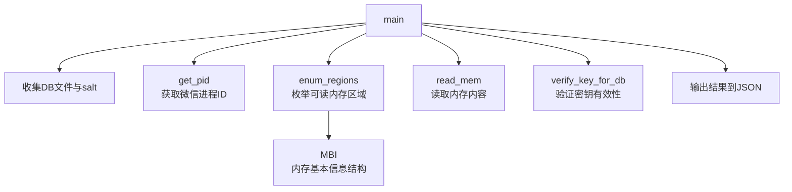

# find_all_keys 模块技术深度解析

## 1. 问题与目标

微信 4.0 版本对本地数据库采用了 SQLCipher 4 加密标准，每个数据库都有独立的 salt 和加密密钥。传统解密方法需要先通过高迭代次数（256,000次）的 PBKDF2 算法派生密钥，这不仅耗时还可能无法保证成功率。`find_all_keys` 模块的核心创新在于利用了 WCDB（微信的 SQLCipher 封装）会在进程内存中缓存派生密钥这一特性，直接从运行中的微信进程内存空间提取这些密钥，从而实现快速、可靠的解密。

## 2. 核心架构与设计

### 2.1 模块结构



### 2.2 核心组件解析

#### MBI 类（Memory Basic Information）
```python
class MBI(ctypes.Structure):
    _fields_ = [
        ("BaseAddress", ctypes.c_uint64), ("AllocationBase", ctypes.c_uint64),
        ("AllocationProtect", wt.DWORD), ("_pad1", wt.DWORD),
        ("RegionSize", ctypes.c_uint64), ("State", wt.DWORD),
        ("Protect", wt.DWORD), ("Type", wt.DWORD), ("_pad2", wt.DWORD),
    ]
```
这个类是 Windows API `VirtualQueryEx` 返回的内存区域信息结构的精确映射。它使用 `ctypes` 直接与操作系统交互，提供了进程内存空间的元数据：基地址、区域大小、保护属性、状态等。这是内存扫描的基础数据结构。

#### 内存枚举机制 `enum_regions(h)`
这个函数实现了进程虚拟地址空间的完整遍历：
- 从地址 0 开始，一直到 64位系统的理论上限 `0x7FFFFFFFFFFF`
- 使用 `VirtualQueryEx` 逐个查询内存区域信息
- 筛选条件：已提交（`MEM_COMMIT`）、可读保护属性、大小在合理范围（0 < size < 500MB）
- 返回所有符合条件的内存区域列表

#### 密钥验证 `verify_key_for_db(enc_key, db_page1)`
这是整个模块的"正确性保障"组件。它利用 SQLCipher 4 的 HMAC 验证机制：
1. 从数据库第一页提取 salt、IV、加密数据和存储的 HMAC
2. 用 salt 异或 `0x3a` 生成 mac salt
3. PBKDF2 派生 MAC 密钥（2 次迭代，相比完整派生的 256,000 次可忽略不计）
4. 计算加密数据的 HMAC-SHA512 并与存储值比较

这种验证方法既快速（微秒级）又极其可靠（密码学级别的安全性）。

## 3. 工作流程与数据流

### 3.1 完整执行流程

1. **收集阶段**：遍历配置的数据库目录，收集所有 `.db` 文件，读取每个文件的第一页，提取出 salt 并建立 `salt -> 数据库文件` 的映射关系。
2. **进程定位**：通过 `tasklist` 命令找到内存占用最大的 `Weixin.exe` 进程。
3. **内存扫描**：打开进程句柄，枚举所有可读内存区域，逐个读取内容并搜索正则表达式 `b"x'([0-9a-fA-F]{64,192})'"` 匹配的十六进制字符串。
4. **密钥验证**：
   - 优先处理 96 位十六进制格式（32字节 enc_key + 16字节 salt）
   - 其次处理仅 64 位 enc_key 的情况，需要逐个数据库尝试验证
   - 最后处理超过 96 位的异常格式，取前 64 位作为 enc_key，后 32 位作为 salt
5. **交叉验证**：对于未匹配到的 salt，尝试用已找到的密钥进行交叉验证（利用 WCDB 可能对同一密码派生相同密钥的特性）。
6. **结果输出**：将所有找到的密钥保存到 JSON 文件。

## 4. 设计决策与权衡

### 4.1 正则表达式匹配策略
选择 `x'([0-9a-fA-F]{64,192})'` 这个正则表达式是经过深思熟虑的：
- `x'...'` 是 WCDB 缓存密钥的独特格式前缀
- `{64,192}` 限定了匹配长度，避免无意义的匹配
- 这种匹配方式简单高效，在大内存扫描时性能良好

### 4.2 多种密钥格式处理
代码处理了三种不同的密钥格式：
1. 标准格式（96 hex）：enc_key + salt
2. 仅 enc_key（64 hex）：需要逐个尝试验证
3. 超长格式：取前 64 和后 32

这种设计体现了鲁棒性优先的原则，宁可多尝试一些可能性，也不要错过潜在的有效密钥。

### 4.3 安全与性能的平衡
- **验证速度**：使用 HMAC 验证而非完整解密，速度提升了几个数量级
- **验证可靠性**：HMAC-SHA512 提供了密码学级别的正确性保证
- **内存扫描效率**：只扫描已提交且可读的内存区域，避免无效扫描

## 5. 关键技术细节

### 5.1 Windows API 交互
模块大量使用 `ctypes` 直接调用 Windows 内核 API：
- `OpenProcess`：打开目标进程
- `VirtualQueryEx`：查询内存区域信息
- `ReadProcessMemory`：读取进程内存

这种直接与操作系统交互的方式是内存操作类工具的典型模式。

### 5.2 内存保护与筛选
通过检查 `Protect` 属性并匹配 `READABLE` 集合（0x02, 0x04, 0x08, 0x10, 0x20, 0x40, 0x80），确保只读取可读的内存区域，避免因访问违规导致的错误。

## 6. 使用与注意事项

### 6.1 前置条件
- Windows 操作系统
- Python 3.10+
- 微信 4.0 正在运行
- 管理员权限（读取进程内存需要）

### 6.2 常见问题与陷阱
1. **权限不足**：必须以管理员身份运行，否则无法打开进程或读取内存
2. **微信版本**：只适用于微信 4.0 版本，其他版本的内存格式可能不同
3. **密钥缓存时机**：如果微信刚启动不久，某些数据库的密钥可能尚未被缓存到内存中
4. **多个微信进程**：代码会选择内存占用最大的 `Weixin.exe`，这通常是主进程，但在特殊情况下可能需要调整

## 7. 与其他模块的关系

`find_all_keys` 是整个项目的**基础模块**：
- 它生成的 `all_keys.json` 是 decrypt_db、monitor、monitor_web 和 mcp_server 等模块正常工作的前提
- 这些下游模块都依赖于 `config.py` 加载的配置，特别是 `keys_file` 指定的密钥文件

## 8. 总结

`find_all_keys` 模块展示了一个精巧的"旁路攻击"思路：与其暴力破解或通过高成本的密钥派生，不如直接利用程序自身在内存中缓存的秘密。这种方法既高效又可靠，是整个微信数据库解密工具链的基石。它的设计体现了对目标系统内部工作机制的深刻理解，以及在可靠性和性能之间的精心权衡。
