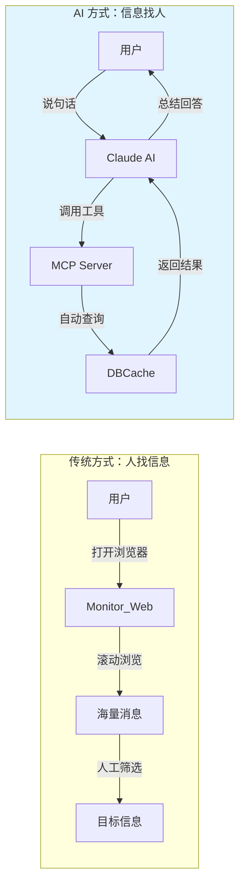
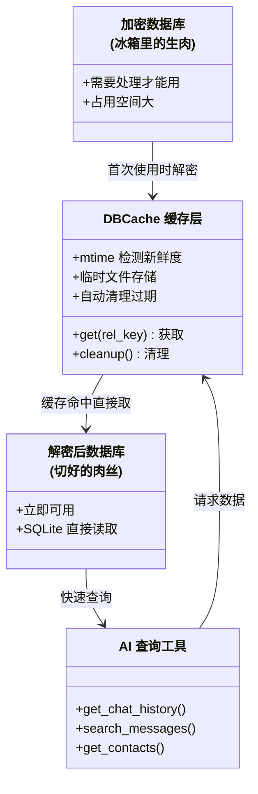
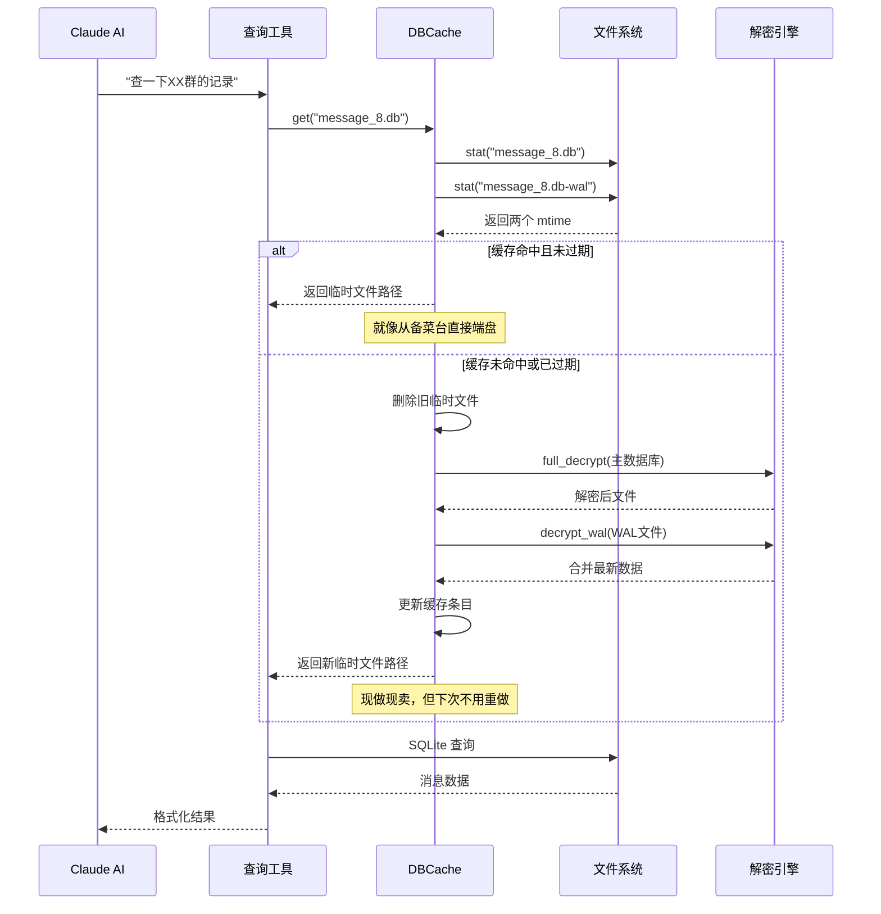
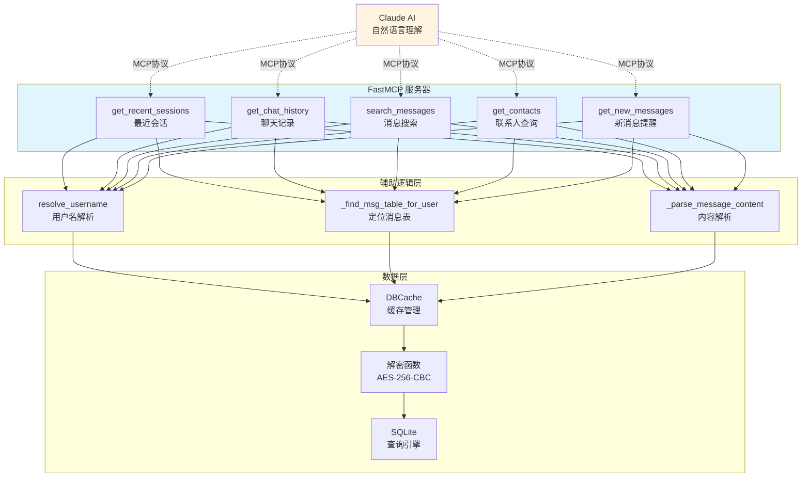
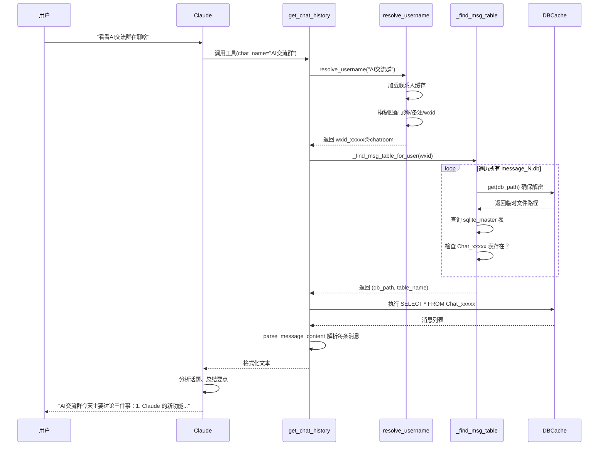
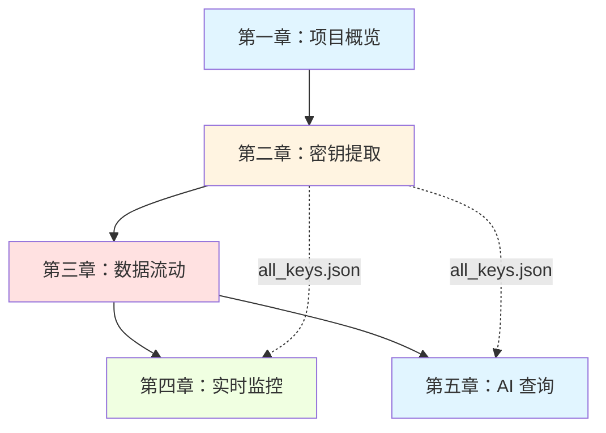

# 第五章：用自然语言查询微信——MCP 让 AI 成为你的聊天记录助手

还记得第四章里那个实时监控消息的网页看板吗？它很棒，但有一个局限：**你只能被动地盯着屏幕看**。如果你想问"上周张三在群里说了什么关于项目的事"，或者"帮我找找谁提到过'周末聚餐'"，传统的浏览方式就力不从心了。

这一章，我们要给系统装上**会思考的脑袋**——通过 MCP（Model Context Protocol）协议，让 Claude 这样的 AI 助手直接读懂你的微信数据，用自然语言完成复杂查询。

---

## 从"人找信息"到"信息找人"

想象你有一栋巨大的图书馆（你的微信聊天记录），里面有几百万本书（消息）。传统的做法是：

- **decrypt_db**：把书从加密箱子里拿出来，摆到书架上（批量解密）
- **monitor_web**：派个图书管理员坐在门口，新书到了就喊一嗓子（实时推送）

但它们都需要**你自己走进去翻找**。而 `mcp_server` 模块做的是另一件事：训练一只**聪明的寻回犬**（AI 助手），你只需说"找那本关于红色封面的书"，它就叼着结果跑回来。



这就是 MCP 的魔力：它把微信数据包装成 AI 能调用的**工具函数**，让自然语言成为查询接口。

---

## DBCache：智能缓存，告别重复劳动

在让 AI 干活之前，我们先解决一个工程难题：**解密太慢了**。

想象你每次查字典都要先把整本字典从保险箱里取出来、解锁、翻开——哪怕你只是想知道"apple"怎么拼。第一次还能忍，第二次、第三次呢？

微信数据库正是如此：一个群聊数据库可能几百 MB，AES-256-CBC 逐页解密需要数秒。如果 AI 对话中连续查询三次同一群聊，难道要解密三次？

`DBCache` 就是来解决这个问题的。你可以把它想象成**厨房里的备菜台**：



### mtime：判断"食材"是否新鲜的秘诀

DBCache 的核心机制是**文件修改时间检测**（mtime）。这就像检查牛奶盒上的生产日期：

```python
# DBCache 的内部逻辑（简化版）
def get(self, rel_key):
    db_mtime = os.path.getmtime(加密数据库)
    wal_mtime = os.path.getmtime(WAL文件)
    
    if rel_key in self._cache:
        cached_db_mtime, cached_wal_mtime, tmp_path = self._cache[rel_key]
        
        # 两道工序的新鲜度检查
        if (db_mtime == cached_db_mtime and 
            wal_mtime == cached_wal_mtime and
            os.path.exists(tmp_path)):
            return tmp_path  # 缓存有效，直接上菜！
    
    # 缓存失效，重新"备菜"
    return self._decrypt_and_cache(rel_key, db_mtime, wal_mtime)
```

为什么连 WAL 文件也要检查？回忆第三章的内容：WAL（Write-Ahead Log）是 SQLite 的"草稿纸"，最新消息先写在这里。如果只检查主数据库，你会错过刚收到的几条消息——就像只看了正式菜单，没看今日特供黑板。



### 临时文件的"自清洁"设计

备菜台用久了会堆满残渣，DBCache 也面临同样问题：临时文件可能堆积。解决方案是 Python 的 `atexit` 钩子——就像给厨房装了个**下班自动清扫机器人**：

```python
import atexit

def cleanup(self):
    """程序退出时自动清理所有临时文件"""
    for _, _, tmp_path in self._cache.values():
        try:
            os.remove(tmp_path)
        except OSError:
            pass  # 已经被删了就忽略

atexit.register(_cache.cleanup)  # 注册"下班清扫"
```

这样即使程序异常退出，操作系统通常也会回收临时文件；正常退出则保证干干净净。

---

## FastMCP：把微信变成 AI 的工具箱

现在缓存准备好了，如何让 AI 调用它？这就需要 **FastMCP**——一个把 Python 函数暴露给 AI 的轻量级框架。

Think of it as **USB 转接头**：你的微信数据是各种形状的插头（不同的查询需求），Claude 是标准 USB 接口，FastMCP 就是把它们连起来的转换器。



### 工具一：get_recent_sessions —— 你的"未读消息概览"

这是打开微信时第一眼看到的东西：聊天列表，按时间倒序排列，带最后一条消息预览。

```python
@mcp.tool()
def get_recent_sessions(limit: int = 20) -> str:
    """
    获取微信最近会话列表，包含最新消息摘要、未读数、时间等。
    用于了解最近有哪些人/群在聊天。
    """
```

想象一下，你对 Claude 说："看看微信最近谁找我了"。Claude 会：

1. **理解意图** → 需要调用 `get_recent_sessions`
2. **执行工具** → 遍历多个 message_N.db 的 Session 表
3. **整合结果** → 按时间排序，提取未读数、消息预览
4. **自然语言回答** → "有 5 个未读会话：工作群有 23 条消息，妈妈在问你周末回不回家..."

```mermaid
flowchart TD
    A[用户提问<br/>"最近谁找我了"] --> B[Claude 解析意图]
    B --> C{匹配工具}
    C -->|get_recent_sessions| D[执行查询]
    
    D --> E[连接 MicroMsg.db<br/>获取联系人映射]
    D --> F[遍历 message_*.db<br/>读取 Session 表]
    
    E --> G[整合数据]
    F --> G
    
    G --> H[格式化输出]
    H --> I[自然语言回复<br/>"工作群 23 条未读..."]
    
    style A fill:#fff4e1
    style I fill:#e1f5ff
```

### 工具二：get_chat_history —— 深入特定对话

知道哪个群活跃后，你想细看具体内容。这时需要**用户名解析**的魔法：

```
用户说："看看'AI交流群'在聊啥"

↓ Claude 内部处理

resolve_username("AI交流群") 
  → 模糊匹配 → 找到 "wxid_xxxx@chatroom"
  → 确认是群聊
  
_find_msg_table_for_user("wxid_xxxx@chatroom")
  → 遍历 message_0.db 到 message_15.db
  → 检查每个库的 Chat_xxxx 表是否存在
  → 返回 ("message_8.db", "Chat_12345678")
  
DBCache.get("message_8.db")
  → 确保解密缓存可用
  
SQLite 查询 Chat_12345678 表
  → 按时间倒序取 50 条
  
格式化返回给 Claude
```

这个过程就像**先查电话簿找号码，再拨号通话**：`resolve_username` 是查号台，`_find_msg_table_for_user` 是确定对方在哪个线路，最后才建立连接。



### 工具三：search_messages —— 全文检索的威力

这是最强大的工具之一：**跨所有聊天记录的关键词搜索**。

想象你要找三个月前某人说过的某个链接，但忘了在哪个群。传统方式是逐个群翻历史——噩梦。而 `search_messages` 会：

1. 遍历所有 `message_N.db` 文件
2. 在每个数据库的 `MSG` 表中搜索 `content LIKE '%keyword%'`
3. 关联联系人信息，显示群名/私聊对象
4. 按时间排序返回

```mermaid
graph TD
    A[search_messages<br/>keyword="claude"] --> B[遍历所有 message_N.db]
    
    B --> C1[message_0.db]
    B --> C2[message_1.db]
    B --> Cn[message_15.db]
    
    C1 --> D1[MSG 表全文搜索]
    C2 --> D2[MSG 表全文搜索]
    Cn --> Dn[MSG 表全文搜索]
    
    D1 --> E[合并结果]
    D2 --> E
    Dn --> E
    
    E --> F[关联联系人信息]
    F --> G[格式化输出]
    
    style A fill:#e1f5ff
    style G fill:#fff4e1
```

⚠️ **性能提示**：这是计算密集型操作。如果搜"的"这种常见字，可能扫描数百万条记录。实际使用中建议配合合理的 `limit` 参数，就像告诉寻回犬"找最近的 20 个就行，别翻遍整座山"。

---

## 真实对话示例：AI 如何串联多个工具

单看工具说明不够直观。让我们追踪一次**真实的 AI 对话流程**，看 Claude 如何像经验丰富的秘书一样，自主组合工具完成任务。

```
用户：帮我分析一下"技术交流群"这周的情况

Claude 思考：
→ 需要获取该群的历史消息
→ 可能需要先看最近会话确认群名准确性
→ 获取足够样本后进行分析统计

步骤 1：确认群存在并获取记录
─────────────────────────────
调用 get_chat_history(chat_name="技术交流群", limit=200)

返回：200 条消息，时间跨度 7 天

步骤 2：（自动）分析数据
─────────────────────────────
Claude 内部处理：
- 按日期分组统计每日消息量
- 提取高频关键词（AI、Python、报错、求助）
- 识别活跃用户（发言次数排名）
- 归纳话题类别

步骤 3：生成结构化报告
─────────────────────────────
无需额外工具调用，直接输出：

## 技术交流群本周分析

### 📊 活跃度趋势
周一 ████████ 45 条
周二 ██████████████ 82 条  ← 峰值（某开源工具发布）
周三 ██████ 38 条
周四 ██████████ 56 条
周五 ███████ 42 条

### 🔥 热门话题
| 话题 | 提及次数 | 关键讨论点 |
|:---|:---|:---|
| MCP 协议 | 23 | 如何给本地服务添加 AI 接口 |
| Python 异步 | 18 | asyncio 踩坑与最佳实践 |
| 微信机器人 | 15 | 封号风险与替代方案 |

### 👥 本周 KOL
1. @老张（28 条）- 主要分享技术文章
2. @小李（19 条）- 解答问题较多
3. @Alice（15 条）- 提出有价值的问题

### 💡 值得关注
- 周二关于 MCP 的讨论产生了 3 个可运行的代码示例
- 有人分享了尚未公开的 API 文档（建议备份）
```

```mermaid
flowchart LR
    subgraph 用户层["用户层"]
        A[自然语言请求<br/>"分析技术交流群"]
    end
    
    subgraph AI决策层["Claude 决策层"]
        B[意图识别<br/>需要历史数据+分析]
        C[工具选择<br/>get_chat_history]
        D[结果整合<br/>统计分析+可视化]
    end
    
    subgraph 工具执行层["MCP 工具层"]
        E[get_chat_history]
        F[DBCache 缓存]
        G[SQLite 查询]
    end
    
    subgraph 数据层["微信数据层"]
        H[加密数据库]
    end
    
    A --> B
    B --> C
    C --> E
    E --> F
    F -->|需要时解密| H
    F --> G
    G --> E
    E --> D
    D -->|自然语言报告| A
    
    style AI决策层 fill:#e1f5ff
    style 用户层 fill:#fff4e1
```

注意整个过程中**用户只发了一句话**，其余都是 Claude 自主规划、调用工具、整合结果。这就是 MCP 的价值：**把复杂的数据操作封装成简单的意图表达**。

---

## 配置与启动：让 Claude 接上你的微信

理论讲完，来看实际操作。你需要做三件事：

### 第一步：准备密钥配置文件

确保 `find_all_keys.py` 已经运行过，生成了 `all_keys.json`。这是整个系统的"钥匙串"。

### 第二步：创建 config.json

```json
{
  "db_dir": "D:\\WeChat Files\\wxid_xxxxxx",
  "keys_file": "all_keys.json",
  "decrypted_dir": "./decrypted"
}
```

- `db_dir`：你的微信数据目录（通常在 `WeChat Files` 下）
- `keys_file`：密钥文件路径
- `decrypted_dir`：可选，预解密目录（如果不常用实时功能）

### 第三步：注册到 Claude Code

```bash
# 安装依赖
pip install mcp pycryptodome

# 注册 MCP 服务器
claude mcp add wechat -- python C:\path\to\mcp_server.py

# 验证连接
claude
> 测试一下微信连接
```

```mermaid
flowchart TD
    A[准备阶段] --> B[运行 find_all_keys.py<br/>生成 all_keys.json]
    B --> C[创建 config.json<br/>配置路径]
    C --> D[注册 MCP 服务器<br/>claude mcp add]
    
    D --> E[使用阶段]
    E --> F[启动 Claude Code]
    F --> G[自然语言对话<br/>"看看微信最近消息"]
    G --> H[MCP 协议通信]
    H --> I[mcp_server.py 执行]
    I --> J[返回结果给 Claude]
    J --> K[Claude 生成回答]
    
    style A fill:#ffe1e1
    style E fill:#e1f5ff
    style K fill:#fff4e1
```

---

## 设计权衡：为什么选择这些方案？

`mcp_server` 的几个关键设计决策值得深思：

| 决策 | 选择 | 放弃的方案 | 理由 |
|:---|:---|:---|:---|
| **缓存粒度** | 整个数据库文件 | 单表缓存或行级缓存 | 微信查询通常涉及全表扫描，文件级最均衡 |
| **缓存键** | 相对路径 + mtime | 内容哈希或固定 TTL | mtime 简单可靠，毫秒级检测成本 |
| **临时文件 vs 内存数据库** | 磁盘临时文件 | `:memory:` SQLite | 复用 SQLite 文件缓存，多次查询更快 |
| **联系人缓存** | 全局变量，永久有效 | 随数据库缓存过期 | 联系人变化极少，简化实现 |
| **并发模型** | 单线程（默认） | 多线程锁或异步 | Python GIL 限制，当前场景足够 |

特别是**临时文件 vs 内存数据库**的选择：虽然内存看起来更快，但 SQLite 的 `:memory:` 模式每次连接都是独立的。如果你查询"技术交流群"的历史，然后想再看"家庭群"，又要重新解密加载。而临时文件让 SQLite 自己的页缓存发挥作用，第二次查询同一数据库几乎是瞬时的——就像备好的菜放在台面上，随时可取。

---

## 回顾与展望

至此，五章内容完整覆盖了 `wechat-decrypt` 的全貌：



| 章节 | 核心能力 | 类比 |
|:---|:---|:---|
| 第一章 | 理解问题与架构 | 地图与指南针 |
| 第二章 | 内存扫描取密钥 | 开锁匠的技巧 |
| 第三章 | 解密与数据流转 | 物流运输系统 |
| 第四章 | 实时监控推送 | 电视台直播 |
| **第五章** | **AI 自然语言查询** | **私人智能助理** |

`mcp_server` 的独特价值在于：**它把前三章构建的基础设施，转化为普通人都能使用的自然语言接口**。你不需要懂 SQL、不需要知道数据库在哪、甚至不需要记得准确的群名——就像跟真人助理说话一样，描述你的需求，剩下的交给 AI。

未来可以探索的方向：
- **语义搜索**：不只是关键词匹配，而是理解消息含义（需要向量数据库）
- **跨会话关联**："找出所有提到'合同'的上下文，无论哪个群"
- **主动提醒**：结合 monitor_web 的实时能力，让 AI 在特定条件触发时主动汇报

但现在，你已经拥有了一套完整的、从加密数据到 AI 助手的个人微信数据分析系统。去试试吧，对你的 Claude 说：**"帮我看看微信"**——魔法就此开始。