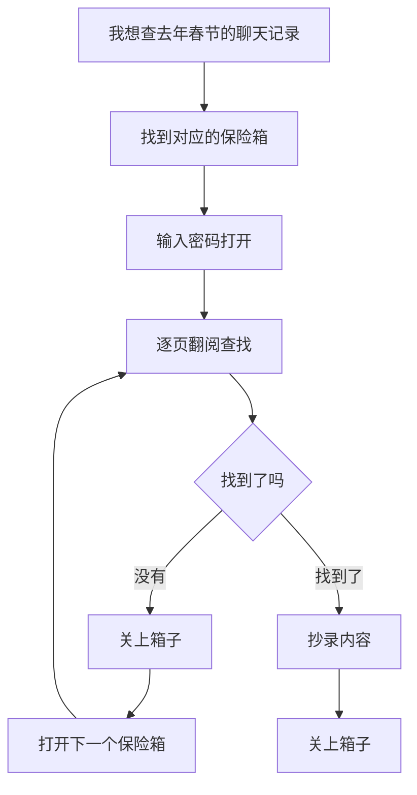
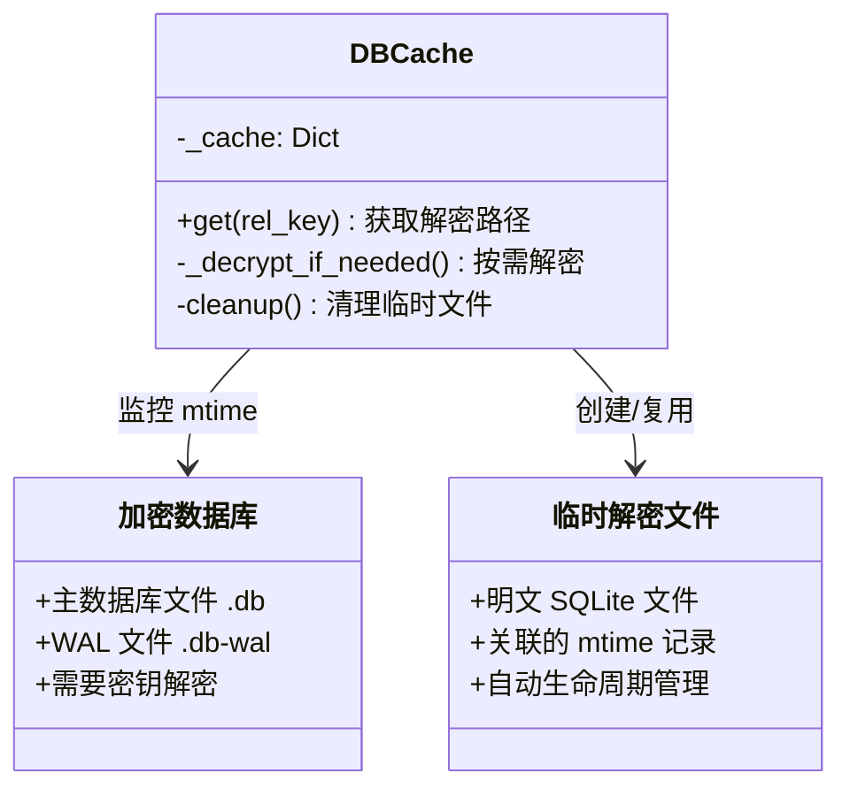
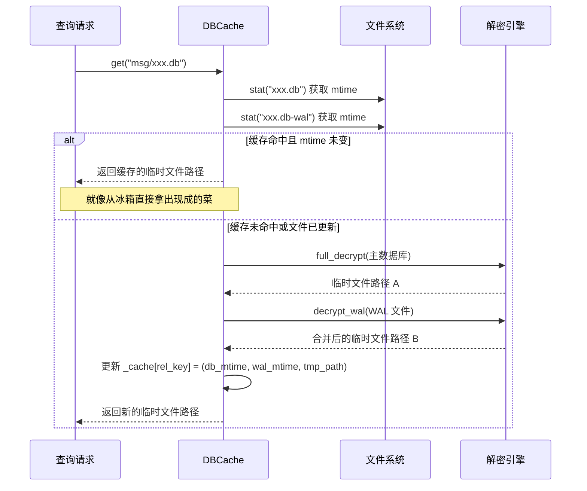
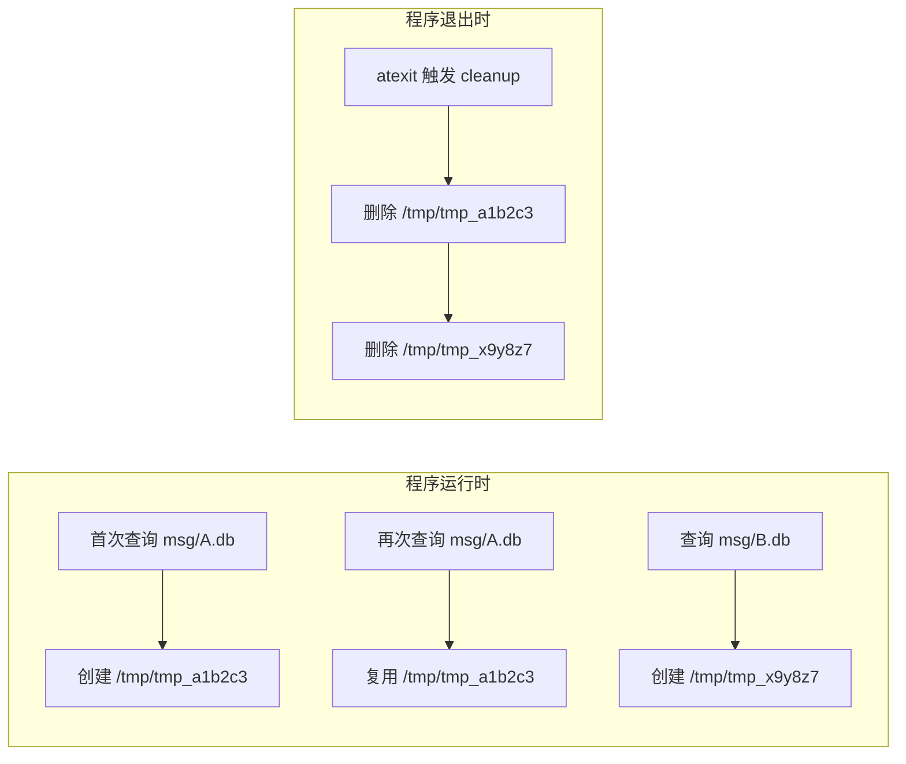
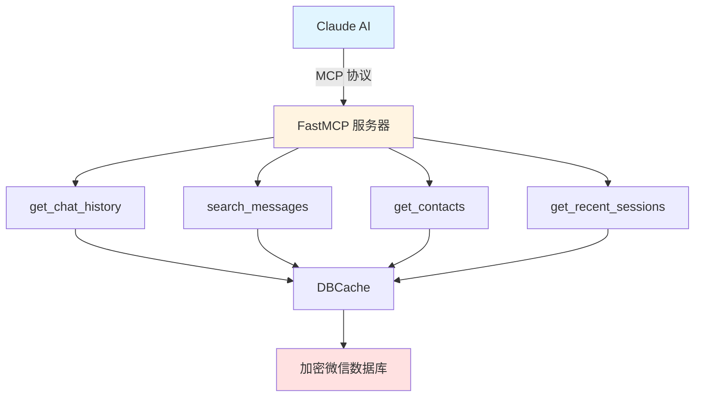
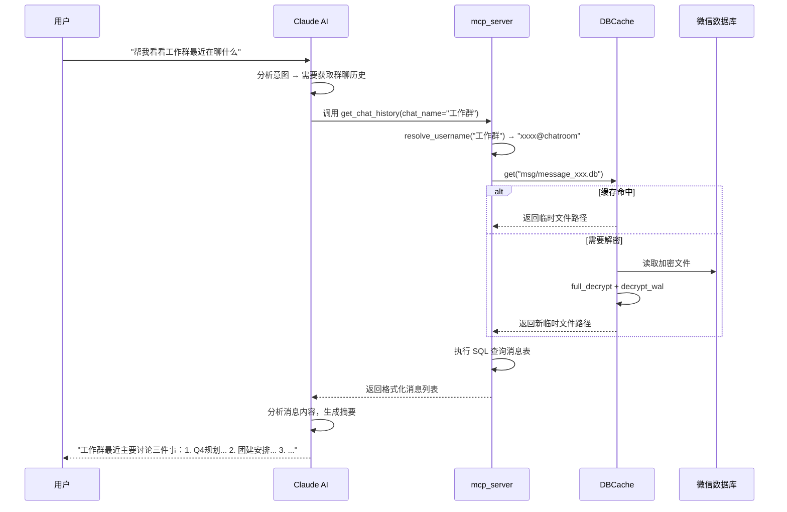
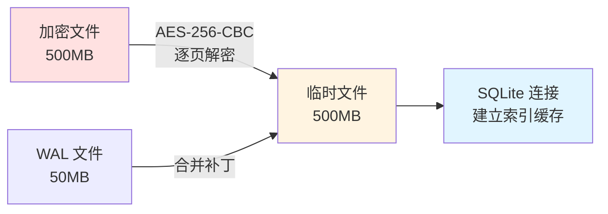
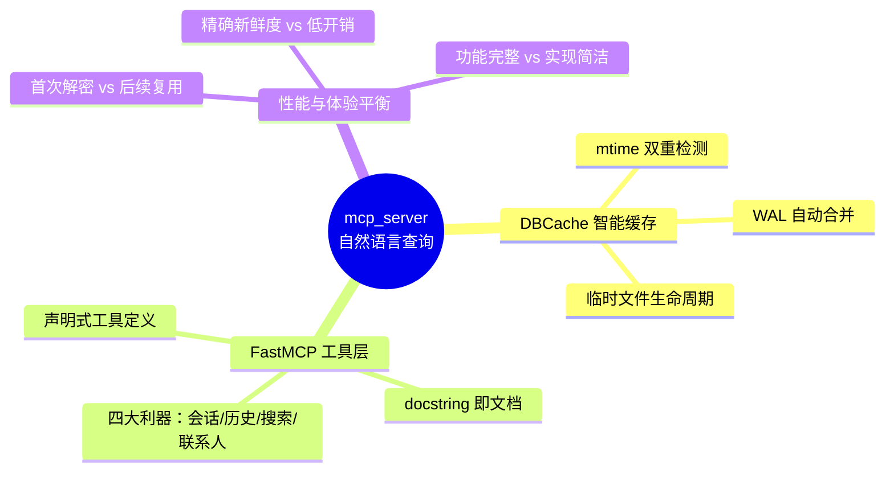

# 第五章：用自然语言查询微信数据 —— mcp_server 模块详解

> 学习目标：理解 DBCache 缓存策略如何像"智能冰箱"一样管理解密数据，以及 FastMCP 如何让 Claude AI 像调用手机 App 一样自然地操作你的微信数据库。

---

## 5.1 从"翻箱倒柜"到"随问随答"

想象你有一个巨大的档案室，里面存放着过去十年的日记本，但每本都被锁在保险箱里。传统的查询方式是这样的：



每次查询都要重复"开锁-翻阅-关锁"的完整流程，效率极低。而且如果你几分钟后又想查另一条记录，刚才那个箱子已经锁上了，你得重新开一遍。

**mcp_server 解决的就是这个问题。** 它把你的微信数据库变成了一位随时待命的私人助理——你只需要用自然语言提问，比如"帮我看看上周三张三说了什么"，系统就会自动定位、解密、提取、格式化，把答案呈现在你面前。

这背后的核心是两样东西：**DBCache 智能缓存**（让解密结果可以被复用）和 **FastMCP 工具接口**（让 AI 能听懂人话并执行操作）。

---

## 5.2 DBCache：会看"生产日期"的智能冰箱

### 5.2.1 为什么需要缓存？

微信的数据库文件通常有几百 MB 甚至几 GB。每次查询都完整解密一次，就像为了喝一杯牛奶而宰杀一头牛——荒谬且浪费。

更麻烦的是，微信使用 SQLite 的 **WAL（Write-Ahead Logging）机制**。你可以把 WAL 想象成超市的"临时补货区"：主货架（数据库文件）是固定的，新到的商品先放在补货区， periodically 再合并到主货架。这意味着**只看主数据库会得到过期数据**，必须同时处理 WAL 文件才能获得最新状态。



### 5.2.2 mtime 检测：比闹钟更可靠的"新鲜度判断"

DBCache 的核心逻辑非常简单：**比较文件的"最后修改时间"（mtime）**。

想象你家里的冰箱贴了一张便利贴，记录着每样食材的放入日期。当你想拿牛奶时，先看便利贴上的日期是否和牛奶盒上的生产日期一致。如果一致，直接喝；如果不一致（说明有人换过一盒新的），就扔掉旧的、打开新的。



代码层面的实现非常精炼：

```python
class DBCache:
    def __init__(self):
        self._cache = {}  # rel_key -> (db_mtime, wal_mtime, tmp_path)
    
    def get(self, rel_key):
        # 1. 获取当前文件的 mtime
        db_mtime = os.path.getmtime(db_path)
        wal_mtime = os.path.getmtime(wal_path) if exists else 0
        
        # 2. 检查缓存是否有效
        cached = self._cache.get(rel_key)
        if cached and cached[0] == db_mtime and cached[1] == wal_mtime:
            return cached[2]  # 缓存命中！
        
        # 3. 缓存失效，执行解密
        # ... 解密流程 ...
        self._cache[rel_key] = (db_mtime, wal_mtime, new_tmp_path)
        return new_tmp_path
```

### 5.2.3 临时文件的生命周期管理

解密后的文件存在哪里？会不会堆积如山撑爆硬盘？

DBCache 使用 Python 的 `tempfile.mkstemp()` 创建临时文件，这就像酒店客房的"一次性房卡"——系统知道每个文件是谁创建的、什么时候该清理。更妙的是，通过 `atexit.register(_cache.cleanup)`，程序退出时会自动"退房"，删除所有临时文件。



这种设计有个小陷阱：如果程序被强制终止（比如 `kill -9`），就像客人没办手续直接跑路，临时文件会留在原地。长期运行的生产环境需要注意磁盘监控。

---

## 5.3 FastMCP：让 AI 拥有"工具箱"

### 5.3.1 什么是 MCP？

**MCP（Model Context Protocol）** 是 Anthropic 推出的开放协议，你可以把它理解为 AI 世界的"USB 接口标准"。就像你的键盘、鼠标、U盘都能插到同一个 USB 口上，任何支持 MCP 的 AI 助手都能调用遵循 MCP 规范的工具。

**FastMCP** 则是这个协议的 Python 实现，类似于 Flask 之于 HTTP——让你用几行代码就能搭建一个 MCP 服务。



### 5.3.2 工具的定义与注册

在 mcp_server 中，定义一个 MCP 工具就像写一个普通的 Python 函数，只是加上 `@mcp.tool()` 装饰器：

```python
from fastmcp import FastMCP

mcp = FastMCP("wechat")

@mcp.tool()
def get_chat_history(chat_name: str, limit: int = 50) -> str:
    """
    获取指定聊天的消息历史
    
    Args:
        chat_name: 聊天名称、备注名或群名
        limit: 返回的最大消息数量
    """
    # 1. 将"张三"解析为 wxid_xxxxxxxx
    username = resolve_username(chat_name)
    
    # 2. 找到对应的数据库文件
    db_rel_key = _find_msg_table_for_user(username)
    
    # 3. 通过 DBCache 获取解密后的数据库路径
    decrypted_path = _cache.get(db_rel_key)
    
    # 4. 执行 SQL 查询
    messages = query_messages(decrypted_path, username, limit)
    
    # 5. 格式化为人类可读的文本
    return format_messages(messages)
```

注意 docstring 的重要性——**这就是 AI 理解这个工具的"说明书"**。当用户说"帮我看看和张三的聊天记录"时，Claude 会阅读这些描述，判断应该调用 `get_chat_history`，并传入 `chat_name="张三"`。

### 5.3.3 四大核心工具

| 工具名 | 作用 | 使用场景 |
|:---|:---|:---|
| `get_recent_sessions` | 列出最近的聊天会话 | "最近谁找我了？" |
| `get_chat_history` | 获取特定聊天的完整记录 | "我和张三上周聊了什么？" |
| `search_messages` | 全文搜索所有聊天记录 | "搜一下谁提到过'项目延期'" |
| `get_contacts` | 查询联系人信息 | "找一下姓李的同事" |



---

## 5.4 实战：一次完整的对话流程

让我们跟踪一个真实的交互场景，看看各组件如何协作：

### 场景：用户想了解某个技术群的讨论

**用户输入**：`> 帮我看看AI交流群昨天有没有聊Claude`

**Step 1: 意图识别**
Claude 分析这句话，确定需要：
- 找到名为"AI交流群"的聊天
- 获取其消息历史
- 筛选包含"Claude"的内容

**Step 2: 工具选择与调用**
Claude 选择 `get_chat_history`，参数：`chat_name="AI交流群"`

**Step 3: 用户名解析**
```python
resolve_username("AI交流群") 
# 内部逻辑：遍历联系人缓存，匹配昵称/备注
# 返回： "1234567890@chatroom"
```

**Step 4: 数据库定位**
```python
_find_msg_table_for_user("1234567890@chatroom")
# 返回： "msg/MultiMessage_1234.db"
```

**Step 5: 缓存检查与解密**
```python
_cache.get("msg/MultiMessage_1234.db")
# 检查：该文件的 mtime 是否与缓存记录一致？
# 假设：昨晚有新消息，WAL 文件已更新 → 缓存失效
# 执行：full_decrypt() + decrypt_wal() → 新的临时文件
```

**Step 6: 数据查询**
```sql
SELECT * FROM MSG 
WHERE StrTalker = '1234567890@chatroom' 
AND CreateTime > datetime('now', '-1 day')
ORDER BY CreateTime DESC
```

**Step 7: 结果过滤与格式化**
在 Python 层扫描消息内容，找出包含"Claude"或相关讨论的条目，格式化为：

```
[昨天 14:32] 张三: Claude 3.5 Sonnet 的代码能力真的强
[昨天 15:10] 李四: 但是上下文长度还是不如 GPT-4
[昨天 16:45] 王五: 我测试了 Claude 的新功能...
```

**Step 8: 智能总结**
Claude 基于原始消息，生成最终回答：

> AI交流群昨天确实讨论了 Claude，主要集中在三个方面：
> 1. **代码能力**：张三分享了用 Claude 写 Python 脚本的经历
> 2. **上下文长度**：李四对比了 Claude 与 GPT-4 的长文本处理能力
> 3. **新功能测试**：王五提到了某个刚发布的 beta 特性
>
> 整体氛围比较技术向，没有涉及具体的使用价格或订阅问题。

---

## 5.5 设计权衡：为什么选择这条路？

### 5.5.1 临时文件 vs 内存数据库

| 方案 | 优点 | 缺点 |
|:---|:---|:---|
| **临时文件（选中）** | 复用 SQLite 的文件缓存；多次查询同一数据库无需重复解密；内存占用低 | 磁盘 I/O 开销；需要管理文件生命周期 |
| 内存数据库 | 速度极快；无残留文件风险 | 每次查询都需重新解密；大数据库会撑爆内存 |

**决策理由**：微信数据库可能很大（数 GB），但查询模式通常是"一段时间内反复查同一个库"。临时文件让 SQLite 自己管理页面缓存，反而更高效。

### 5.5.2 mtime 检测 vs 固定过期时间

| 方案 | 优点 | 缺点 |
|:---|:---|:---|
| **mtime 检测（选中）** | 精确反映文件变化；无不必要的重新解密 | 依赖系统时间准确性；touch 操作会导致误刷新 |
| 固定 TTL（如5分钟） | 实现简单 | 可能使用过期的 WAL 数据；或过早重新解密 |

**决策理由**：微信的数据库更新频率不确定，可能几分钟一条消息，也可能几小时没动静。mtime 是文件系统提供的"免费信号"，精准且零开销。

### 5.5.3 全局联系人缓存 vs 随数据库刷新

联系人数据（`contact.db`）被设计为**永久缓存**，只在服务启动时加载一次。

```python
_CONTACTS_CACHE = None  # 全局变量

def _load_contacts():
    global _CONTACTS_CACHE
    if _CONTACTS_CACHE is not None:
        return _CONTACTS_CACHE  # 直接返回，不再查询
    
    # 首次加载，解密 contact.db 并缓存
    _CONTACTS_CACHE = {...}
    return _CONTACTS_CACHE
```

**权衡**：联系人变动不频繁，但每次查询都需要将"张三"映射为"wxid_xxx"。永久缓存避免了重复的联系人数据库解密，代价是新增联系人需要重启服务才能识别。

---

## 5.6 性能调优建议

### 5.6.1 首次查询慢？这是正常的

第一次访问某个数据库时，必须完成完整的解密流程：



这个过程可能需要几秒到几十秒，取决于数据库大小和磁盘速度。但后续查询同一数据库几乎是瞬时的——这就是缓存的价值。

### 5.6.2 搜索全部消息的代价

`search_messages` 工具会**遍历所有消息数据库文件**：

```python
for db_file in all_message_dbs:
    decrypted = _cache.get(db_file)  # 可能触发解密
    results.extend(query_keyword(decrypted, keyword))
```

如果用户有几十个聊天数据库，且都是首次访问，这个操作会非常慢。建议：
- 使用合理的 `limit` 参数
- 优先尝试 `get_chat_history` 定位到特定聊天后再搜索

### 5.6.3 并发注意事项

当前实现**没有考虑线程安全**。如果多个请求同时到达，可能：
- 重复解密同一个数据库（浪费资源）
- 临时文件竞争（极端情况下）

在生产环境部署时，建议：
- 使用单线程模式，或
- 在 DBCache 层添加简单的互斥锁

---

## 5.7 本章小结



**mcp_server 模块的本质，是在"安全地访问加密数据"和"高效地响应查询"之间架起一座桥。** 

DBCache 像一位精明的管家，记住每样东西的位置和新鲜程度，避免重复劳动；FastMCP 像一位翻译官，把人类的自然语言转化为精确的数据库操作。两者结合，让你的微信数据终于能被 AI 理解和运用——不是通过破解或绕过安全机制，而是通过巧妙地利用系统已有的设计（内存中的派生密钥、SQLite 的 WAL 机制、文件系统的 mtime），在尊重边界的前提下实现目标。

这正是 wechat-decrypt 项目的工程哲学：**理解系统的运作方式，找到优雅的杠杆点，用最小的侵入性获得最大的效用。**

---

## 下一步

至此，你已经完整了解了 wechat-decrypt 的三个核心模块：

| 章节 | 模块 | 核心技能 |
|:---|:---|:---|
| 第二章 | find_all_keys | 内存扫描与密钥提取 |
| 第四章 | monitor_web | 实时数据流与 SSE 推送 |
| 第五章 | mcp_server | 智能缓存与 AI 工具接口 |

建议你现在：
1. **动手实践**：配置 config.json，启动 mcp_server，用 Claude Code 实际查询自己的微信数据
2. **深入源码**：阅读 `mcp_server.py` 中的 `_parse_message_content` 等辅助函数，了解消息格式的解析细节
3. **扩展功能**：尝试添加新的 MCP 工具，比如按时间范围筛选消息、统计聊天活跃度等

感谢阅读这份指南。愿你的数据探索之旅顺利！🔓