# 第三章：解密后的数据如何在系统中流动

在前两章中，我们学会了如何找到钥匙（密钥提取）和打开保险箱（数据库解密）。现在我们要回答一个更深层的问题：**打开保险箱后，里面的宝藏是如何被不同工具使用的？**

想象一下，你开了一家神秘的图书馆——所有书籍都被锁在加密的玻璃柜里。你已经有了万能钥匙，但读者们需要不同的服务：有人想坐在大厅里实时看到新书上架（实时监控），有人想打电话问图书管理员"帮我找关于猫的书"（AI查询）。这两种服务背后，共享的是同一套"开锁-取书"的基础设施。

这就是本章的核心：**理解 `wechat-decrypt` 如何构建一个统一的解密层，让实时监控和AI查询两种截然不同的应用场景都能高效工作**。

---

## 3.1 系统全景：三条河流汇入同一片湖泊

让我们先用一张大图看清整个系统的血脉：

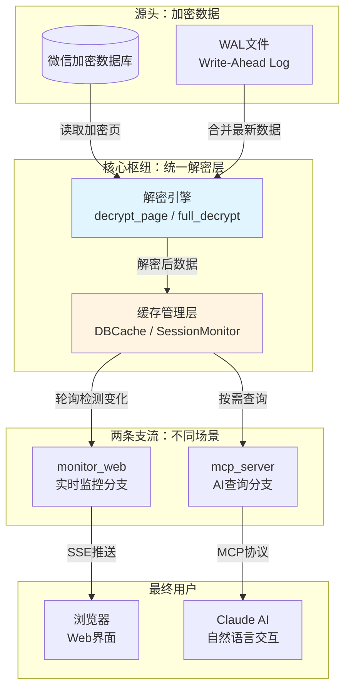

**这张图告诉我们什么？**

想象长江和黄河——它们发源于不同的山脉（加密数据库 vs WAL文件），但在某个高原汇聚成一片湖泊（统一解密层），然后再分流到下游的灌溉系统和城市供水（实时监控 vs AI查询）。无论水最终流向哪里，**净化处理（解密）只在湖泊中做一次**。

这是 `wechat-decrypt` 架构最精妙的地方：`monitor_web` 和 `mcp_server` 看似做着完全不同的事情，但它们站在同一个肩膀上——共享的解密引擎和相似的缓存哲学。

---

## 3.2 解密引擎：系统的"心脏"

在深入两条支流之前，我们必须先理解这个共享的"心脏"是如何工作的。

### 3.2.1 从加密页到明文：一页纸的旅程

微信数据库的加密单位是"页"（Page），每页固定4096字节——就像一本精装书，每页都有相同的尺寸，但内容被密码锁住了。

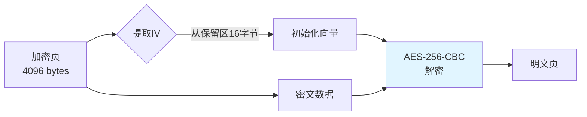

**用日常语言解释这个过程：**

想象你收到一封密信，信封上贴着一个便利贴写着"用红色墨水解码"。这个便利贴就是 **IV（初始化向量）**——它告诉解密算法如何"调色"才能正确还原内容。微信把IV藏在每页的"保留区"（Reserve Area），就像便利贴贴在信封背面。

`decrypt_page` 函数的工作就是：找到这张便利贴 → 用正确的密钥（我们在第二章从内存中提取的）→ 按照AES-256-CBC的规则解开这页内容。

> 💡 **技术细节**：第一页有特殊处理——SQLite文件需要一个标准的文件头（`SQLite format 3\0`），所以解密后还要"贴上"这个标签，让数据库工具能识别它。

### 3.2.2 全量解密 vs WAL合并：两种取水方式

现在我们知道如何解开一页，但一本"书"有成千上万页，而且微信还在不断写新内容（通过WAL机制）。系统提供了两种"批量取水"的方式：

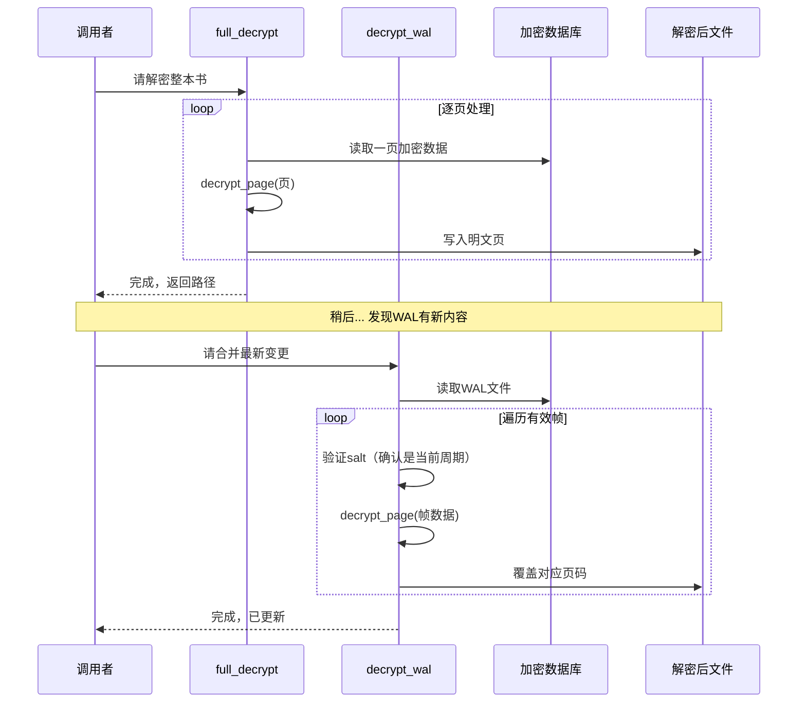

**这个设计的智慧在哪里？**

想象你在抄写一篇会不断更新的公告板：
- `full_decrypt` 就像**把整个公告板临摹下来**——虽然费点时间，但你能得到完整、一致的快照
- `decrypt_wal` 就像**只抄新增便利贴**——快速、增量，但需要知道哪些便利贴是新的

微信的WAL文件是一个环形缓冲区（ring buffer），旧的记录会被覆盖。这就是为什么 `decrypt_wal` 要检查 **salt值**——它就像便利贴上的日期戳，帮你区分"这是今天的更新"还是"上周遗留下来的废纸"。

---

## 3.3 缓存层：两位管家，同一种哲学

现在进入本章的核心：**两个应用模块如何使用这些基础设施**。它们像两位性格不同的管家，管理着同一个仓库的货物。

### 3.3.1 mcp_server 的 DBCache："按需取货，记好账本"

`mcp_server` 面对的是**不可预测的查询模式**——Claude可能突然问"昨天和张三聊了什么"，也可能五分钟后才问下一个问题。它的缓存策略就像一位精明的仓库管理员：

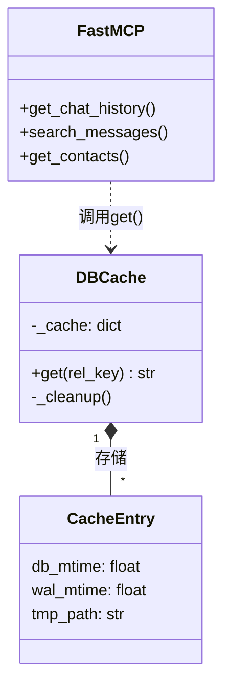

**DBCache 的工作流程：**

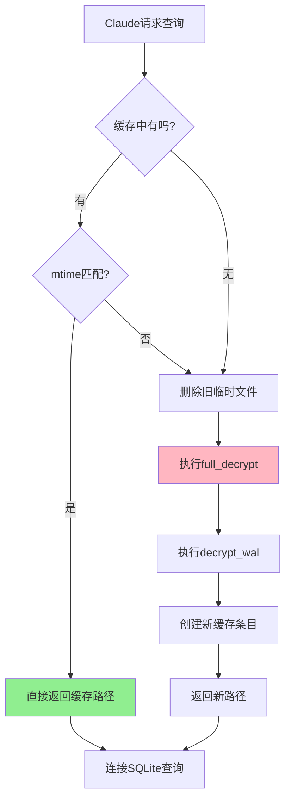

**用图书馆类比：**

DBCache 是一位**按需服务的图书管理员**。当有人借书时，她先查账本（`_cache`字典）：这本书有没有复印本？复印本是不是最新的（对比mtime）？如果一切OK，直接把复印件递过去；如果发现原书被修改过（mtime变了），就扔掉旧复印件，重新复印一份。

> 🔑 **关键洞察**：`mtime`（文件修改时间）是这里的核心信号。就像图书馆给每本书贴上"最后整理日期"，DBCache通过比较数据库文件和WAL文件的mtime，判断缓存是否失效。这比定时过期更智能——只有真的发生变化时才重新解密。

### 3.3.2 monitor_web 的 SessionMonitor："守株待兔，实时广播"

`monitor_web` 面对的是**可预测的高频需求**——它知道用户想要"实时看到新消息"，于是采用完全不同的策略：

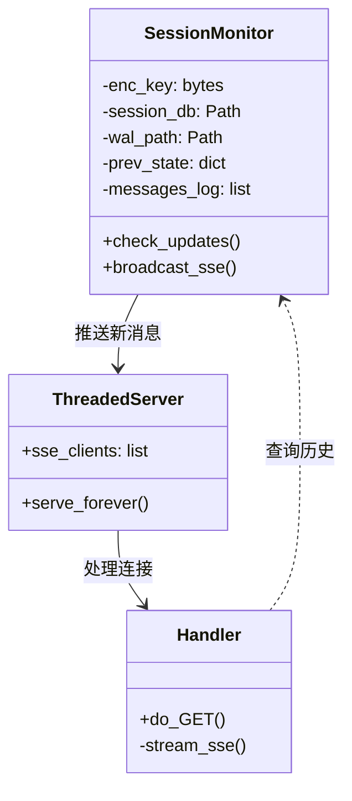

**SessionMonitor 的"侦探工作流程"：**

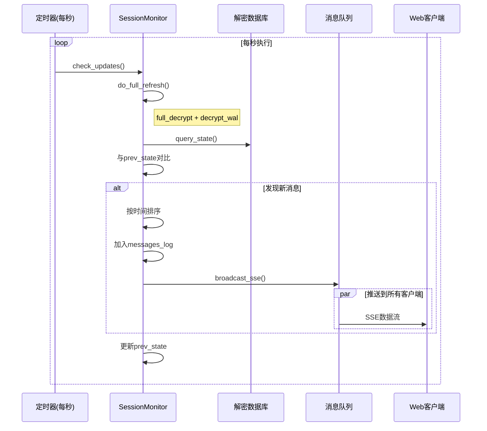

**这两位管家的区别：**

| 维度 | DBCache (mcp_server) | SessionMonitor (monitor_web) |
|:---|:---|:---|
| **触发方式** | 被动响应（查询时才动作） | 主动轮询（定时检查） |
| **缓存内容** | 解密后的数据库文件路径 | 会话状态快照 + 消息日志 |
| **一致性模型** | 强一致（每次查询检查mtime） | 最终一致（每秒同步一次） |
| **资源占用** | 低（按需解密，用完即走） | 较高（持续维护状态） |
| **适用场景** | 间歇性查询 | 实时监控 |

> 🎯 **设计智慧**：两种策略都是"全量解密"基础上的优化。DBCache避免重复解密同一数据库；SessionMonitor避免重复查询同一状态。它们针对不同的访问模式，做出了最适合的权衡。

---

## 3.4 数据流动的完整旅程：四个典型场景

让我们跟随数据，走完四条完整的旅程。

### 场景一：首次启动监控界面

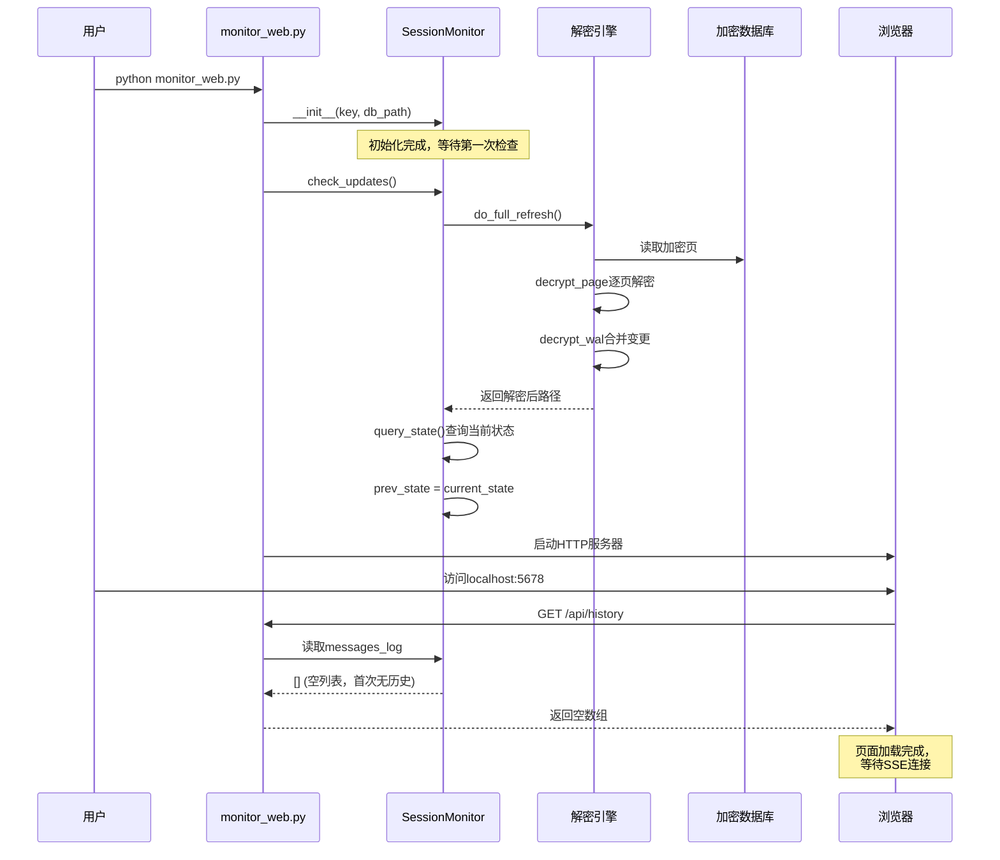

**发生了什么？** 这就像新开业的餐厅——厨师（解密引擎）准备好食材，服务员（SessionMonitor）站好岗位，但还没有顾客点单（新消息），所以展示柜是空的。

### 场景二：收到新消息，实时推送

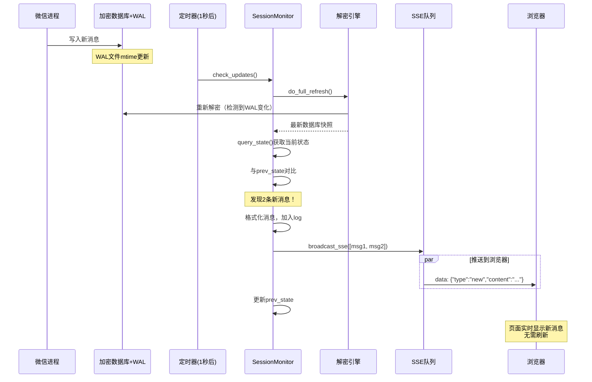

**关键体验**：用户在浏览器里看到消息"弹"出来，就像看直播弹幕一样流畅。背后是每秒一次的"全盘扫描"——听起来很笨，但因为数据库通常只有几MB到几十MB，实际延迟控制在100ms左右。

### 场景三：Claude首次查询聊天记录

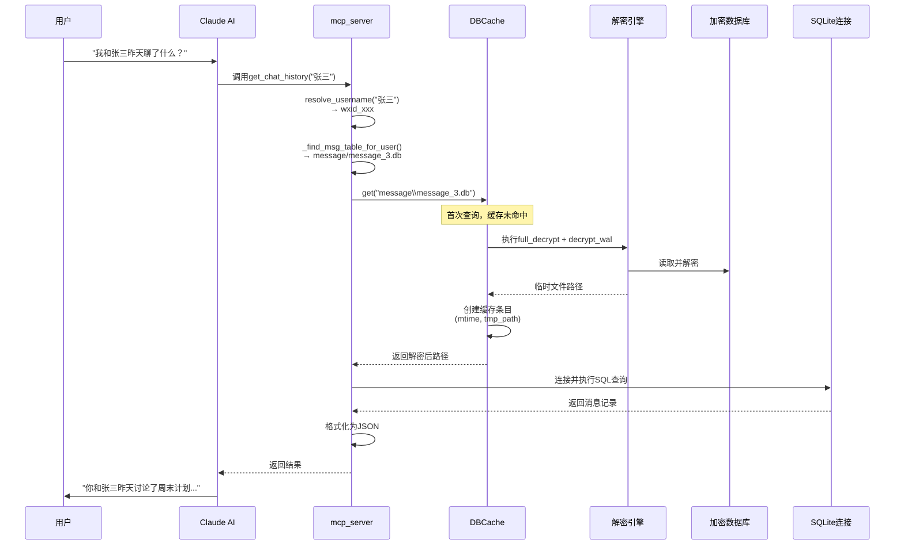

**性能特点**：首次查询较慢（需要完整解密），但如果用户接着问"再往前翻一些"，第二次查询会**瞬间返回**——因为DBCache发现mtime没变，直接复用临时文件。

### 场景四：查询期间数据库更新

```mermaid
sequenceDiagram
    participant WeChat as 微信进程
    participant DB as 加密数据库
    participant User as 用户
    participant Claude as Claude AI
    participant MCP as mcp_server
    participant DC as DBCache
    
    Note over DB: 已有缓存<br/>mtime=1000
    
    User->>Claude: "搜索所有关于'项目'的消息"
    
    Claude->>MCP: search_messages("项目")
    MCP->>DC: get(...) 多个数据库
    
    DC->>DB: 检查mtime
    DB-->>DC: mtime=1000 ✓ 未变
    
    Note over DC: 缓存命中，快速返回
    
    DC-->>MCP: 返回缓存路径
    MCP->>MCP: 执行搜索...
    
    === 与此同时 ===
    
    WeChat->>DB: 新消息写入
    Note over DB: mtime更新为1050
    
    === 用户继续对话 ===
    
    User->>Claude: "刚才搜的结果里，最新的那条是谁发的？"
    
    Claude->>MCP: 再次查询
    
    MCP->>DC: get(...)
    DC->>DB: 检查mtime
    DB-->>DC: mtime=1050 ≠ 1000 ✗ 已变！
    
    DC->>DC: 删除旧临时文件
    DC->>DC: 重新执行full_decrypt
    
    Note over DC: 保证数据新鲜度
    
    DC-->>MCP: 返回新解密路径
```

**一致性保证**：DBCache的mtime检查确保了"你不会读到过期的数据"。这就像快递柜——你输入取件码时，系统会检查包裹是不是最新的那个，如果不是就重新投递。

---

## 3.5 共享基础设施，差异化优化

通过上面的旅程，我们可以总结 `wechat-decrypt` 的架构精髓：

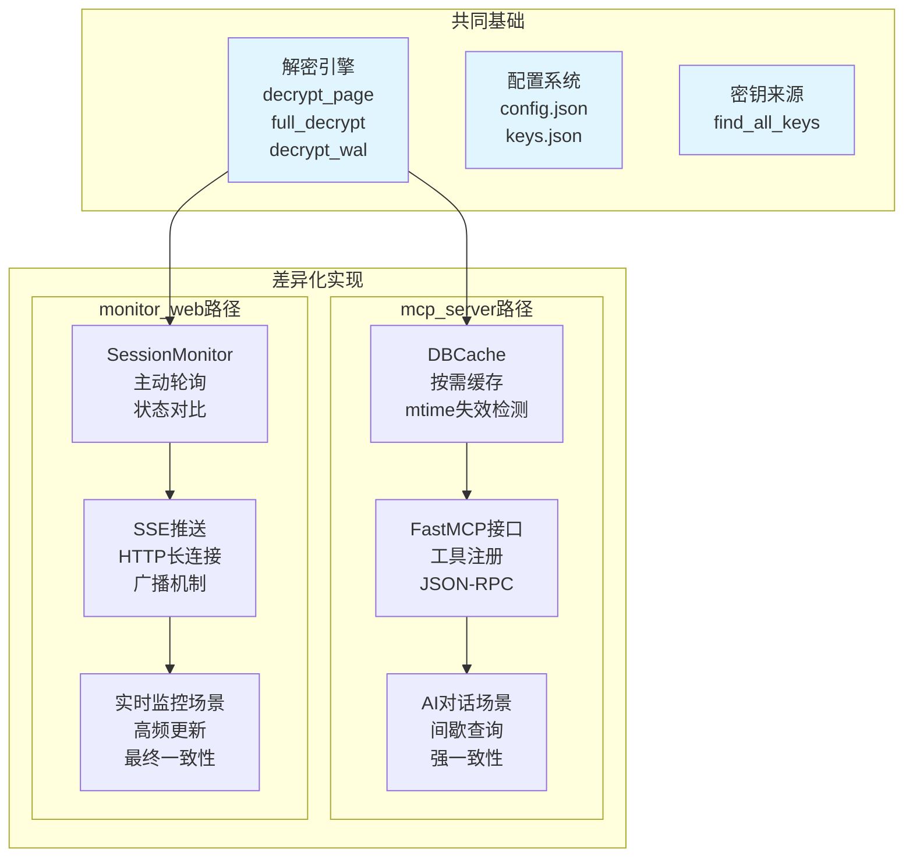

**这个架构借鉴了哪些知名项目？**

| wechat-decrypt组件 | 类似项目中的对应概念 | 核心相似点 |
|:---|:---|:---|
| 解密引擎 | OpenSSL的EVP接口 | 底层加密原语的封装 |
| DBCache | Redis的过期策略 / HTTP缓存 | 基于元数据的失效检测 |
| SessionMonitor | React的useEffect轮询 | 主动检测依赖变化 |
| SSE推送 | Socket.io的命名空间广播 | 多客户端实时推送 |
| FastMCP工具 | OpenAPI/Swagger端点 | 声明式接口暴露 |

---

## 3.6 常见误区与调试技巧

### ❌ 误区一："两个模块不能同时运行，会冲突"

**真相**：它们可以完美共存！因为都遵循"只读解密"原则——从不修改原始加密数据库，只是各自创建独立的临时解密文件。

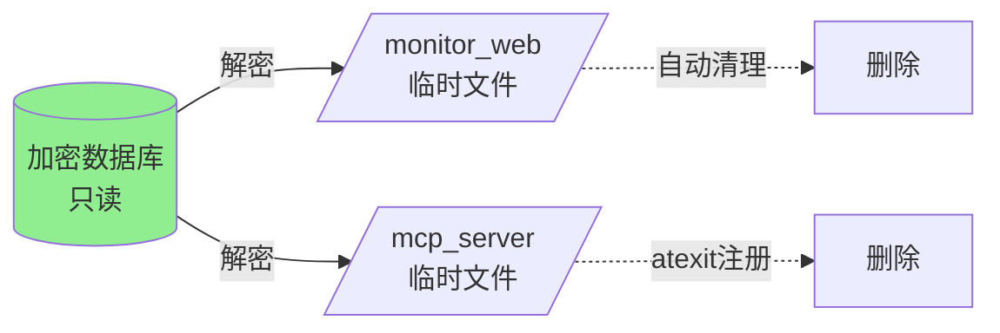

### ❌ 误区二："缓存意味着可能读到旧数据"

**真相**：两个模块都有严格的新鲜度保证：
- `mcp_server`：每次查询检查mtime，变化立即重新解密
- `monitor_web`：每秒全量刷新，最多1秒延迟

### ✅ 调试技巧：观察数据流动

在 `monitor_web` 控制台，你会看到这样的输出：

```
[perf] decrypt=1523 pages in 73ms
[updates] found 2 new messages
[sse] broadcast to 3 clients
```

这告诉你：**解密花了73毫秒 → 发现2条新消息 → 推送给3个浏览器标签页**。如果解密时间突然变长，说明数据库长大了，可能需要关注性能。

在 `mcp_server`，可以通过日志级别观察缓存命中率：

```
DEBUG:mcp_server:Cache miss for message\message_3.db, decrypting...
DEBUG:mcp_server:Cache hit for contact\contact.db
```

---

## 3.7 本章小结

想象你正在设计一座城市的供水系统：
- **水源**（加密数据库）是固定的，但被锁住了
- **水厂**（解密引擎）有标准的净化流程
- **两位调度员**（DBCache和SessionMonitor）用不同的策略管理配送
  - 一位是"预约制"（按需查询，精确记录）
  - 一位是"循环广播"（定时巡检，实时推送）

无论居民是用水泡茶（AI查询）还是浇花（实时监控），他们喝到的都是经过同样标准净化的水。**这就是 `wechat-decrypt` 的设计美学——共享复杂的基础设施，为不同的用户场景提供最优的体验**。

在下一章，我们将深入 `monitor_web` 的内部，看看这位"实时广播员"是如何做到每秒刷新而不崩溃的。