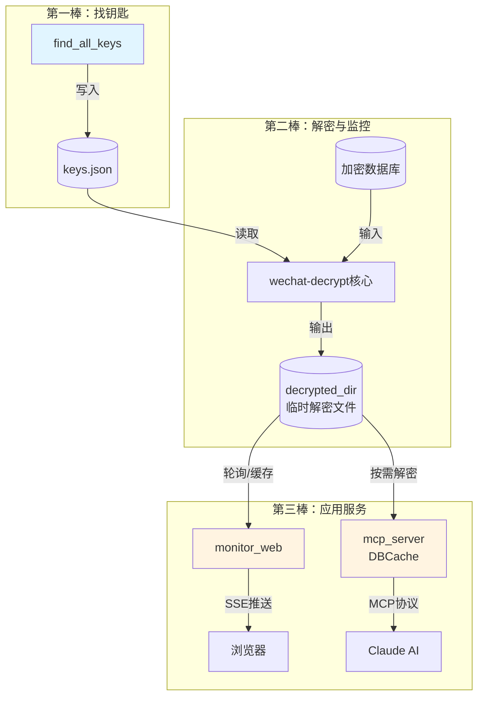
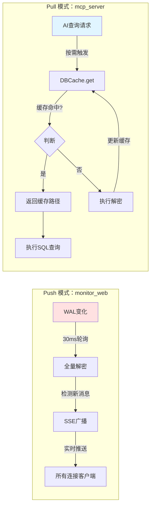
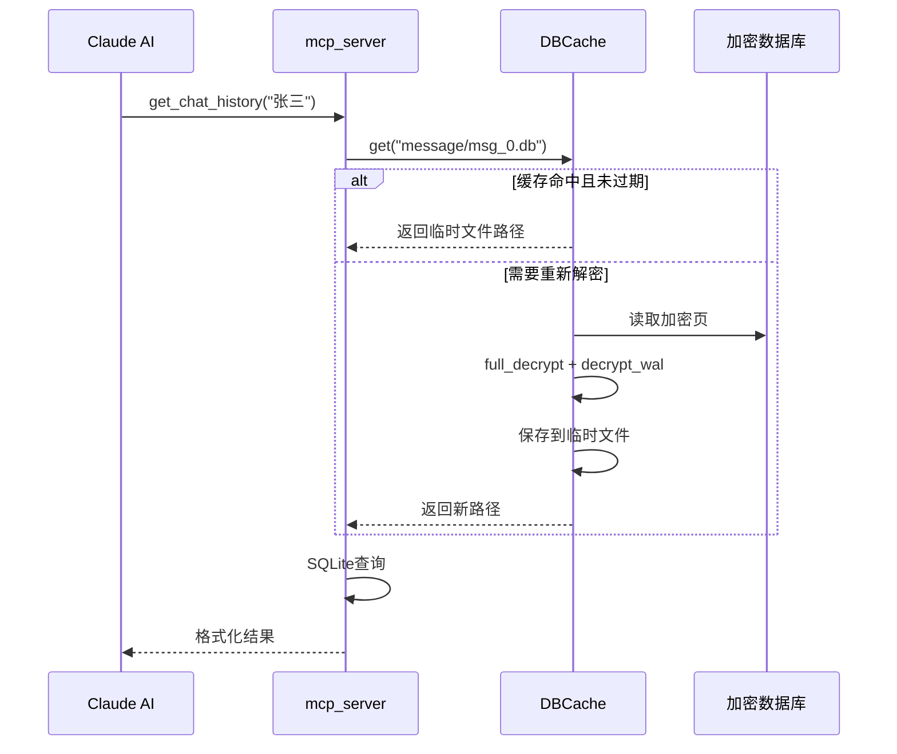
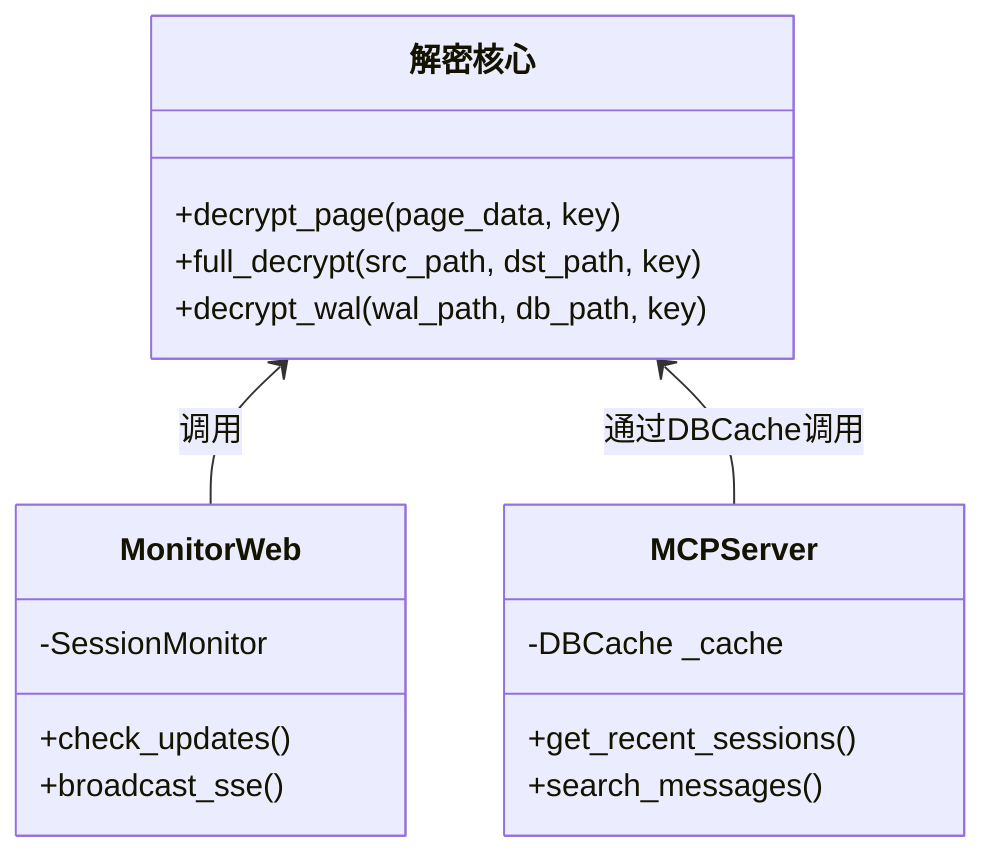
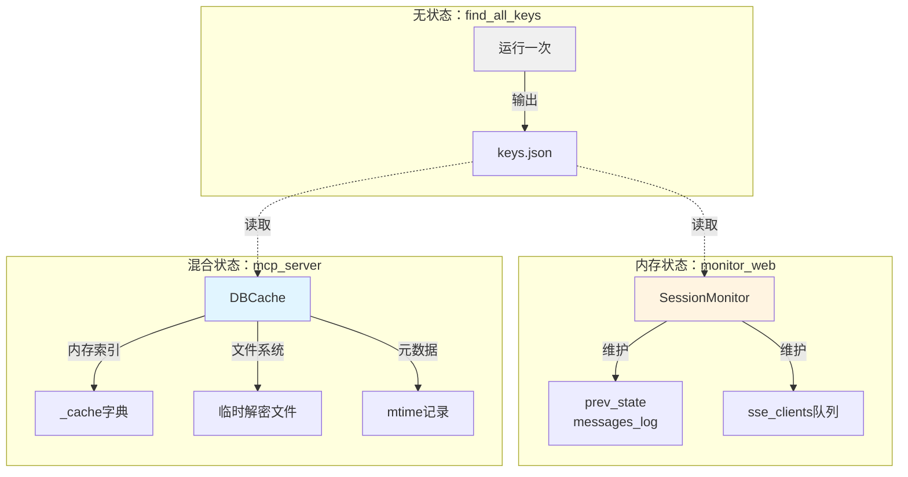
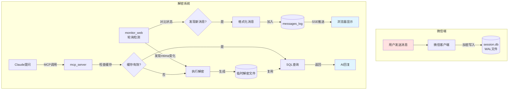

# 第三章：解密后的数据如何在系统中流动

在前两章中，我们学会了如何找到钥匙（密钥提取）和打开保险箱（数据库解密）。现在，让我们跟随数据的脚步，看看一条加密的消息是如何变成你屏幕上实时滚动的文字，或是 Claude AI 口中回答的。

想象整个系统就像一座**智能图书馆**：微信是不断送来新书（消息）的出版社，我们的工具是图书管理员——负责解码、分类、上架，最后让读者（Web 界面或 AI）能够随时查阅。

---

## 3.1 三座桥梁：模块如何协作

`wechat-decrypt` 的三个主要模块不是孤立工作的。它们像接力赛跑的选手，通过**文件系统**这个共享跑道传递接力棒。



**图注**：数据流动的三个阶段——密钥持久化、解密引擎共享、双轨应用服务

### 协作的关键：配置文件的"中央车站"

所有模块都从一个 `config.json` 获取信息，就像火车站的时刻表：

```json
{
    "db_dir": "D:\\WeChat\\Files\\...",
    "keys_file": "all_keys.json",
    "decrypted_dir": "decrypted"
}
```

这保证了三个模块对"去哪里找数据""用什么钥匙"有共同的理解，避免了各自为政的混乱。

---

## 3.2 两条高速公路：Monitor vs MCP 的不同哲学

两个应用层模块代表了两种截然不同的数据消费模式。理解它们的差异，是掌握系统设计的关键。



**图注**：Push 模式像新闻联播定时播放，Pull 模式像视频点播按需加载

### Monitor_Web：推土机式的实时流

`monitor_web` 的工作节奏可以用一句话概括：**"我不管你要不要，变了我就推给你"**。

想象一位敬业的门房大爷：
- 每 30 毫秒瞅一眼信箱（WAL 文件的 mtime）
- 发现新信件，立刻拆开全部重抄一遍（全量解密）
- 然后对着大喇叭广播给所有住户（SSE 推送）

这种设计牺牲了效率（每次都全量解密），换取了极致的简单和可靠。对于实时聊天场景，100ms 的总延迟完全可接受。

### MCP_Server：精打细算的按需服务

`mcp_server` 则是一位精明的档案管理员：
- 只在有人询问时才去翻找资料（按需解密）
- 把常用的档案复印件留在手边（DBCache 缓存）
- 通过检查档案袋上的日期标签（mtime）判断是否过期



**图注**：一次典型的 MCP 查询流程，缓存机制避免重复解密

---

## 3.3 解密引擎：被共享的"心脏"

两个应用模块看似不同，却共享同一颗心脏——底层的解密函数。这是软件工程中**DRY 原则**（Don't Repeat Yourself）的典型实践。



**图注**：解密核心作为共享基础设施，被上层模块以不同方式调用

### 为什么全量解密是合理的选择？

你可能疑惑：每次变化都解密整个数据库，不是很浪费吗？

想象你在玩一幅巨大的拼图（SQLite 数据库）：
- 每块拼图背面都有独立的密码锁（每页独立的 IV）
- 预写日志（WAL）是一张草稿纸，上面记着最新改动
- 但草稿纸是**环形便签本**，旧记录会被新记录覆盖

增量追踪"哪些页变了"就像在旋转的便签本上记笔记——极易出错。而全量解密相当于**"把保险箱里的东西全部倒出来整理一遍"**，虽然听起来笨，但对于几 MB 到几十 MB 的微信数据库，现代 CPU 只需几十毫秒。

---

## 3.4 状态管理：谁记住什么？

分布式系统的难点在于状态同步。我们的三个模块通过精心设计的职责分离，避免了复杂的协调问题。



**图注**：三种状态管理模式——一次性任务、纯内存状态、内存+文件系统混合

### 关键洞察：_mtime 作为分布式时钟_

`mcp_server` 的巧妙之处在于用**文件修改时间**作为隐式的版本号。不需要复杂的消息队列或数据库，只需要问操作系统："这个文件上次是什么时候改的？"

这就像古代驿站用蜡封上的火漆印判断信件是否被拆过——简单、可靠、无需额外基础设施。

---

## 3.5 从比特到体验：完整的数据之旅

让我们跟随一条具体的消息，走完它的全程：



**图注**：一条消息的完整生命周期，从发送到两种消费方式

### 时序的艺术

注意两个模块的时间感知差异：
- `monitor_web` **主动窥探**未来——它预测变化会发生，所以持续轮询
- `mcp_server` **被动响应**现在——它只在被询问时才检查世界的状态

这种差异决定了它们的适用场景：实时通知 vs 按需查询。

---

## 3.6 设计权衡：没有银弹

每个技术选择都是权衡。理解这些权衡，能帮助你根据需求调整系统。

| 维度 | monitor_web | mcp_server |
|:---|:---|:---|
| **延迟** | ~100ms（主动推送） | 首次较慢，后续极快 |
| **资源占用** | 持续 CPU（轮询+解密） | 按需计算，内存换速度 |
| **一致性** | 强一致（总是最新） | 最终一致（依赖缓存过期） |
| **扩展性** | 单服务器，多客户端 | 无状态，理论上可水平扩展 |
| **复杂度** | 简单直接 | 需要管理缓存生命周期 |

### 如果我要修改系统...

基于以上理解，这里有一些自然的扩展方向：

1. **降低 monitor_web 的功耗**：将轮询间隔改为自适应——检测到活动后提高频率，空闲时降低
2. **增强 mcp_server 的实时性**：添加 WebSocket 通知通道，让 AI 也能收到新消息提醒
3. **统一缓存层**：将 DBCache 提取为独立服务，供多个 MCP 实例共享

---

## 本章小结

数据在 `wechat-decrypt` 中的流动，遵循一个清晰的分层模式：

```
密钥提取 → 解密引擎 ← 应用服务（推拉两种模式）
     ↓         ↑            ↓
  配置文件   共享函数      文件系统+mtime
```

关键记忆点：
- **文件系统是唯一的真相来源**——模块间不直接通信，通过磁盘文件协调
- **mtime 是穷人的版本控制**——无需复杂协议，修改时间足以判断新鲜度
- **全量解密是可接受的浪费**——正确性优先于效率，CPU 很快，人脑调试很慢

在下一章，我们将深入 `monitor_web` 的内部，看看那个 30 毫秒的轮询循环是如何构建的，以及 SSE 推送背后的并发魔法。