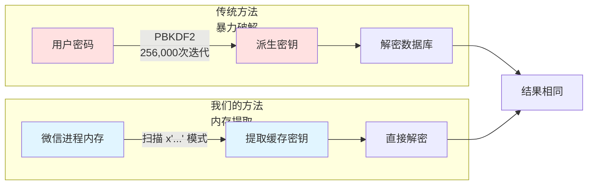
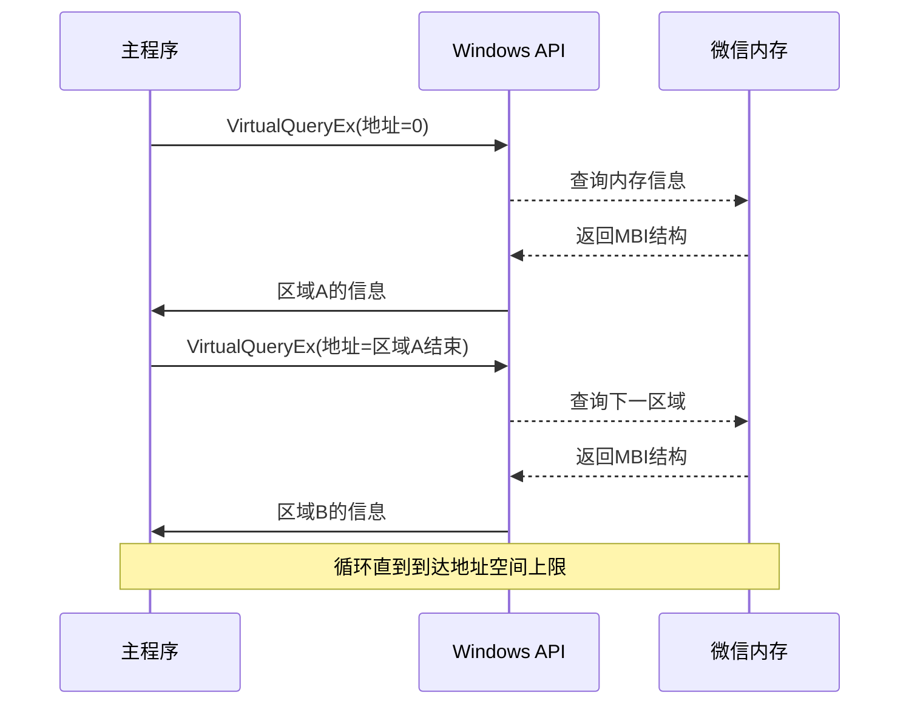
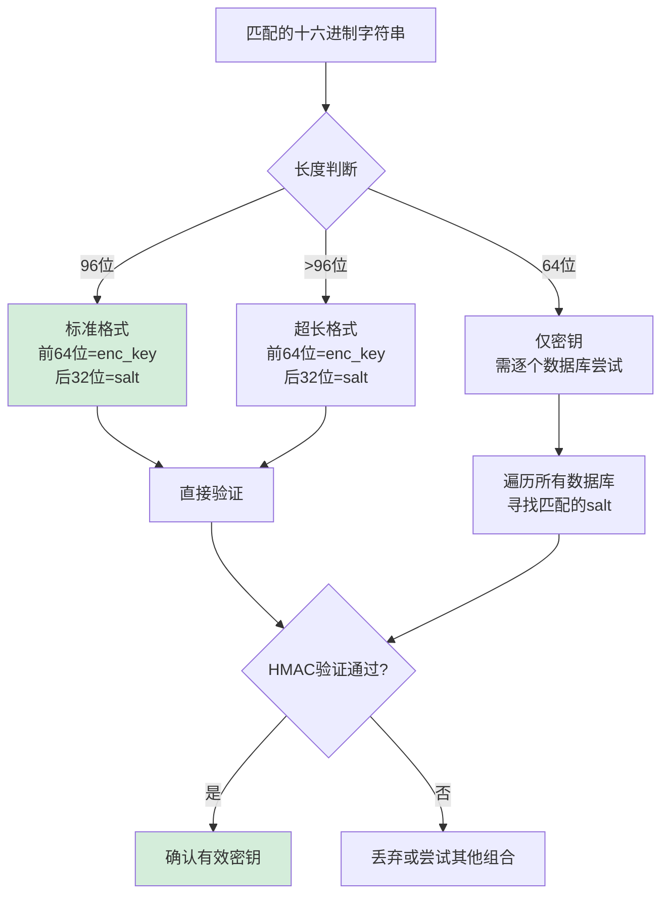
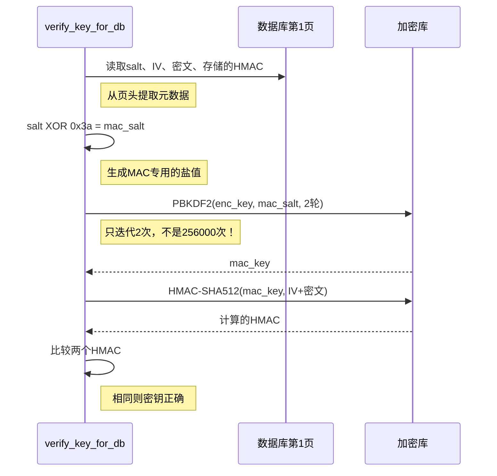
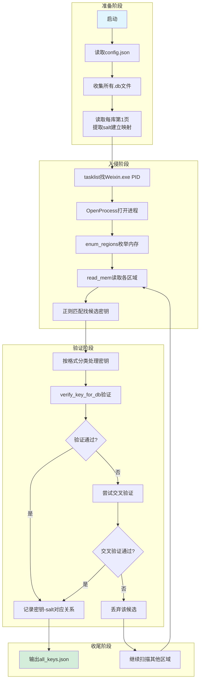

# 第二章：How to Steal the Keys from Memory

## 2.1 为什么我们需要"偷"密钥？

想象你有一个保险箱，里面存着珍贵的聊天记录。微信就是这个保险箱的制造商——他们用了最坚固的锁（AES-256加密），而且钥匙的打造过程极其繁琐：需要把原始密码在火上锻造25万6千次（PBKDF2算法），才能出一把能开锁的钥匙。

传统的破解思路是："我慢慢打造一把钥匙"。但这太慢了——打造一把钥匙可能要几分钟，而你有几十个数据库需要解锁。

`find_all_keys`模块的思路完全不同：**既然微信自己已经打造了钥匙，而且正拿在手里（存在内存里），我们为什么不直接"借"过来用呢？**

这就像你想进一个房间，与其自己配钥匙，不如趁主人开门的时候，瞥一眼他手里的钥匙长什么样。



**流程说明**：左边是"笨办法"——从密码硬算密钥，耗时耗力；右边是我们的"聪明办法"——直接从微信内存里找到已经算好的密钥，一步到位。

---

## 2.2 微信的密钥藏在哪里？

要理解怎么找密钥，先得知道微信怎么存密钥。

微信用了一个叫**WCDB**的数据库引擎（你可以把它想象成SQLCipher的"微信定制版"）。WCDB有个特点：**它很懒，或者说很聪明**——每次打开数据库时，它会花大力气算出密钥，然后把密钥存在内存里，下次直接用，不再重复计算。

这些缓存在内存里的密钥，格式非常规律：`x'后面跟着64到192个十六进制字符'`。就像这样：

```
x'a3f7b2d8e9c1...（共64或96位十六进制）'
```

这个`x'...'`格式是WCDB特有的标记，就像每个员工工牌上都有公司logo一样。我们的任务就是：**在微信进程的内存海洋里，找到所有带这个"logo"的字符串**。

```mermaid
graph TD
    A[微信进程内存] --> B[枚举可读内存区域]
    B --> C[读取内存内容]
    C --> D[正则匹配 x'[hex]{64,192}']
    D --> E{是否匹配?}
    E -->|是| F[提取候选密钥]
    E -->|否| G[继续扫描]
    F --> H[验证密钥有效性]
    H --> I{验证通过?}
    I -->|是| J[保存到 keys.json]
    I -->|否| G
    G --> B
    
    style A fill:#e1f5ff
    style J fill:#d4edda
```

**流程说明**：这是一个循环挖掘的过程——先划定搜索范围（可读内存），然后一块块翻找（读取内存），看到像钥匙的就拿出来比对（正则匹配），最后试开一下保险箱确认真假（验证有效性）。

---

## 2.3 内存扫描的技术细节

### 2.3.1 如何"进入"微信的内存空间？

Windows系统有一套API专门用来操作进程内存，就像物业有万能钥匙可以进任何房间一样。我们用三个核心函数：

| 函数 | 作用 | 日常类比 |
|:---|:---|:---|
| `OpenProcess` | 获取进入某个进程的"许可证" | 向物业申请进某户人家的许可 |
| `VirtualQueryEx` | 查看内存区域的"房产证信息" | 查这户人家的房间布局和用途 |
| `ReadProcessMemory` | 实际读取内存内容 | 进门翻箱倒柜找东西 |

这里有个关键概念叫**MBI（Memory Basic Information，内存基本信息）**。你可以把它想象成每个内存区域的"身份证"，上面记录着：
- **BaseAddress**：这块内存从哪开始（门牌号）
- **RegionSize**：有多大（房间面积）
- **Protect**：保护属性（能不能进、能不能看）
- **State**：状态（是不是正在使用）

```mermaid
classDiagram
    class MBI {
        +uint64 BaseAddress
        +uint64 AllocationBase
        +DWORD AllocationProtect
        +uint64 RegionSize
        +DWORD State
        +DWORD Protect
        +DWORD Type
    }
    
    class "内存区域筛选条件" {
        +State == MEM_COMMIT ✓
        +Protect 属于 READABLE ✓
        +0 < Size < 500MB ✓
    }
    
    MBI --> "内存区域筛选条件" : 被检查
```

**类图说明**：MBI是Windows系统返回的内存信息结构，我们通过检查它的State（是否已提交）、Protect（是否可读）、RegionSize（大小是否合理）来决定要不要扫描这块区域。

### 2.3.2 遍历内存：从0到"天涯海角"

64位Windows系统的理论寻址空间非常大，上限是`0x7FFFFFFFFFFF`（约128TB）。但我们不会真的全部扫一遍——很多区域是空的或者不可读的。

`enum_regions`函数的工作方式很像**扫地机器人**：
1. 从地址0开始
2. 用`VirtualQueryEx`查询当前位置是什么区域
3. 记录区域信息，跳到下一个区域
4. 重复直到走遍整个地址空间



**时序图说明**：这是一个典型的"探路"过程——问系统"这里是什么"，系统回答后，再问"下一个是什么"，直到走完所有地方。

### 2.3.3 大海捞针：正则匹配

找到可读内存区域后，我们要读取其中的内容，然后用正则表达式搜索密钥模式。

正则表达式`b"x'([0-9a-fA-F]{64,192})'"`的含义：
- `b"..."`：二进制字符串（内存里是字节）
- `x'`：WCDB密钥的固定前缀，就像文件头的魔数
- `[0-9a-fA-F]{64,192}`：64到192个十六进制字符
- `'`：闭合单引号

这个长度范围很有讲究：
- **64位**：只有加密密钥（32字节的enc_key）
- **96位**：密钥+盐值（32字节enc_key + 16字节salt）
- **更长**：可能是多个密钥连在一起，我们取前64位和后32位分别作为密钥和盐值



**流程说明**：找到候选密钥后，根据长度分三种情况处理。最省心的是96位标准格式，密钥和盐值一目了然；64位的比较麻烦，得像试钥匙一样挨个试；超长的就按固定规则截取。

---

## 2.4 验证：防止拿到假钥匙

找到看起来像密钥的字符串还不够——万一是个巧合呢？我们需要**验证**。

### 2.4.1 为什么不用完整解密来验证？

想象一下验证钥匙真假：你可以把保险箱里的东西全拿出来看一遍（完整解密），也可以只看看锁芯转没转动（HMAC验证）。显然后者快得多。

微信用的SQLCipher 4有个特性：每页数据都带有一个**HMAC-SHA512校验码**，就像快递包裹上的防伪标签。我们可以用这个标签快速验证密钥是否正确，而不用解密整页数据。

### 2.4.2 HMAC验证的具体步骤



**时序图说明**：验证过程就像核对快递单号——先从包裹上读取单号（提取存储的HMAC），然后用同样的算法算一遍（重新计算HMAC），对比两者是否一致。关键是这里的PBKDF2只用2轮迭代，比正常的256000轮快了十万倍。

---

## 2.5 完整工作流程

把所有步骤串起来，`find_all_keys`的执行流程是这样的：



**流程说明**：整个过程分为四幕戏——先摸清目标家底（哪些数据库、各自的salt是什么），然后潜入现场（打开微信进程、扫描内存），接着鉴别真伪（验证找到的密钥），最后收工交卷（输出JSON文件）。

---

## 2.6 输出：keys.json 里有什么？

成功运行后，你会得到一个`all_keys.json`文件，内容大概长这样：

```json
{
  "contact\\contact.db": {
    "enc_key": "a3f7b2d8e9c1...",
    "salt": "4d8e9f2a..."
  },
  "message_0\\message_0.db": {
    "enc_key": "b8c5d1e7f3a9...",
    "salt": "7e2b4c8d..."
  }
}
```

这个文件是整个工具链的**通行证**：
- `wechat-decrypt`用它解密数据库
- `monitor_web`用它实时监控消息
- `mcp_server`用它响应AI查询

没有它，后续所有模块都无法工作。所以第一章说过：`find_all_keys`是整个项目的**基石模块**。

---

## 2.7 动手实践

### 前置条件检查清单

| 项目 | 要求 | 如果不满足会怎样 |
|:---|:---|:---|
| 操作系统 | Windows | 代码用了Windows API，其他系统不兼容 |
| Python版本 | 3.10+ | 类型注解语法可能不支持 |
| 微信状态 | 必须正在运行 | 内存里没有缓存的密钥 |
| 运行权限 | 管理员 | 无法读取其他进程内存 |
| 微信版本 | 4.0 | 其他版本的内存格式可能不同 |

### 运行命令

```bash
# 确保config.json配置正确
python -m find_all_keys
```

如果一切顺利，你会看到类似这样的输出：

```
[+] Found WeChat PID: 12345
[+] Scanning memory regions...
[+] Found 42 candidate keys
[+] Verified: contact\contact.db -> enc_key: a3f7...
[+] Verified: message_0\message_0.db -> enc_key: b8c5...
[+] Saved 15 keys to all_keys.json
```

### 常见问题排查

**问题：Permission denied**
- 原因：没有用管理员权限运行
- 解决：右键 → "以管理员身份运行"

**问题：No WeChat process found**
- 原因：微信没开，或者进程名不对
- 解决：确认微信已启动，检查任务管理器里的进程名是否是`Weixin.exe`

**问题：Found 0 keys**
- 原因1：微信刚启动，还没打开过数据库
- 解决：等一会儿，或者手动点开几个聊天窗口
- 原因2：微信版本不兼容
- 解决：确认是微信4.0版本

---

## 2.8 设计哲学：为什么这样做？

回顾`find_all_keys`的设计，有几个值得学习的思路：

| 设计决策 | 替代方案 | 我们的选择 | 理由 |
|:---|:---|:---|:---|
| 从内存提取 | 暴力破解PBKDF2 | 内存提取 | 快几个数量级，用户体验好 |
| 正则匹配 | 解析WCDB数据结构 | 简单正则 | 鲁棒性强，不依赖具体版本 |
| HMAC验证 | 完整解密验证 | HMAC验证 | 微秒级 vs 秒级，差距巨大 |
| 多种格式处理 | 只支持标准格式 | 三种格式都支持 | 宁可多试，不可漏掉 |

这就像解谜游戏里的**捷径设计**——与其按照出题人的思路硬解，不如观察系统行为，找到更优雅的通关方式。

---

## 2.9 小结

本章我们学习了：
- **为什么**要从内存提取密钥（绕过25万次迭代的PBKDF2）
- **怎么找**到密钥（扫描`x'...'`模式的内存区域）
- **怎么确认**是真密钥（HMAC快速验证）
- **怎么用**这个结果（生成`all_keys.json`供后续模块使用）

下一章，我们将跟随这些密钥的旅程，看看解密后的数据如何在系统中流动，最终到达你的浏览器和AI助手。