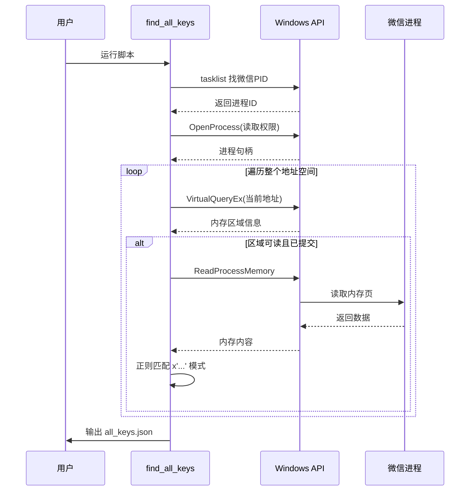
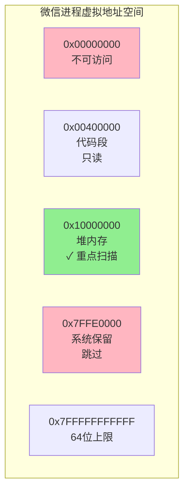
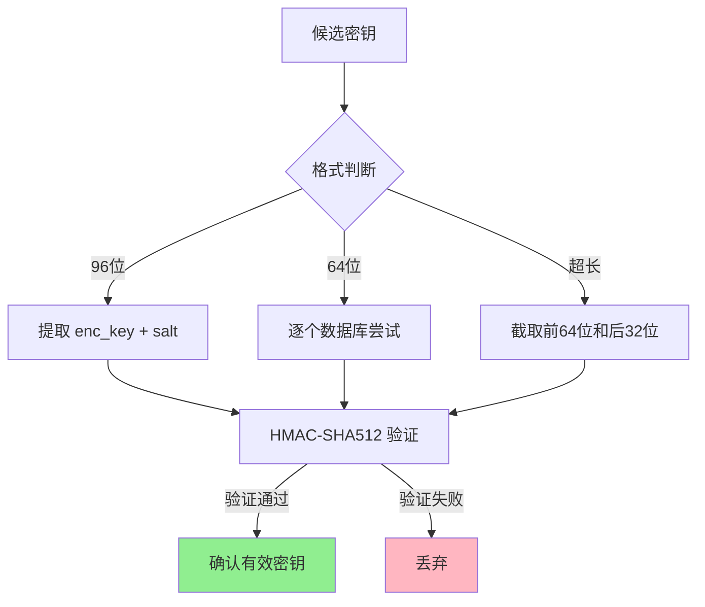
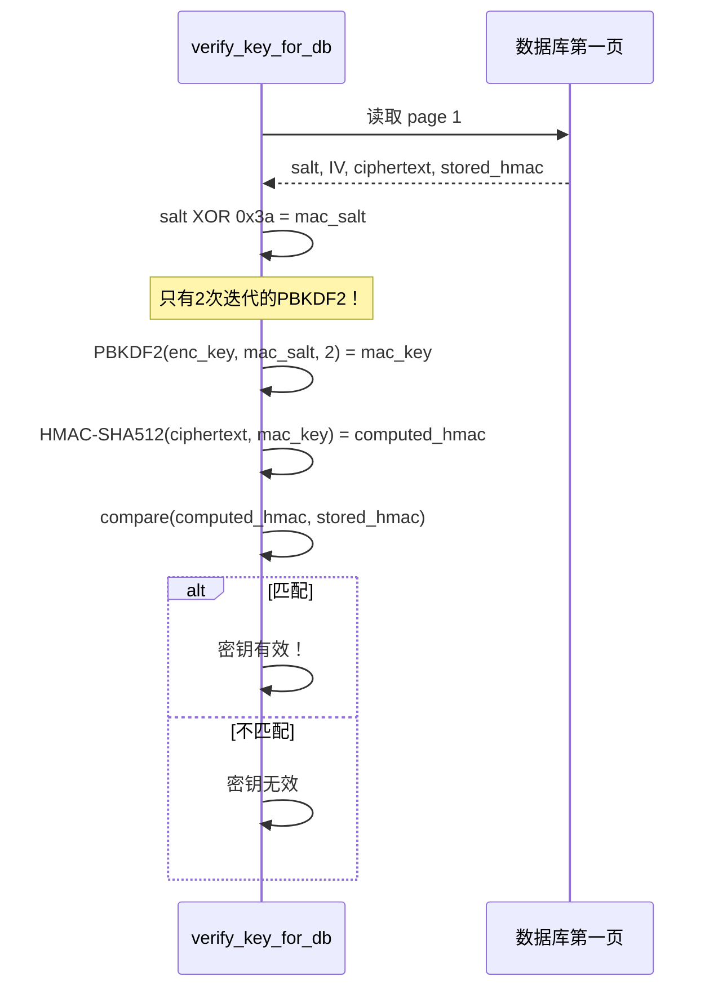

# 第二章：如何从内存中"偷"取密钥

想象一下，你面前有一个保险箱，里面装着微信的所有聊天记录。这个保险箱用的是军用级别的加密——AES-256，而且钥匙是通过一种叫 PBKDF2 的算法生成的，需要迭代 256,000 次才能算出来。如果你用普通电脑暴力破解这把钥匙，可能需要几百年。

但如果我们换个思路呢？如果保险箱的主人——也就是正在运行的微信程序——已经把钥匙放在桌上（内存里）了呢？

这就是 `find_all_keys` 模块的核心思想：**与其硬撬保险箱，不如直接拿走主人随手放在桌上的钥匙**。

## 为什么传统方法行不通？

在深入技术细节之前，让我们先理解微信的数据库加密有多"变态"。


想象你有一把万能钥匙胚子（密码），但要让它能打开特定的门，你需要把它放进一台机器里磨 256,000 次——每次打磨都会改变钥匙的形状。最后，你还要往钥匙上撒一把特殊的盐（salt），才能得到真正能开锁的钥匙。

这个过程设计得如此复杂，就是为了防止有人偷走你的数据库文件后能快速破解。即使是最快的显卡，每秒也只能尝试几千次派生，想要试完所有可能性几乎是不可能的。

## 微信的"疏忽"：WCDB 的密钥缓存

但微信团队自己也需要快速访问这些数据。他们不可能每次查询聊天记录都重新计算 256,000 次 PBKDF2——那会让微信卡成 PPT。

于是他们做了一个合理的工程妥协：**在内存中缓存已经派生好的密钥**。

微信使用的数据库引擎叫 WCDB（WeChat DataBase），它是 SQLCipher 的一个封装。当微信第一次打开某个数据库时，WCDB 会完成完整的密钥派生过程，然后把结果以特定格式缓存在内存中：

```
x'1234567890abcdef...'  ← 96位十六进制字符串
```

这串字符就像一张贴在显示器边缘的便利贴，上面写着："数据库 X 的钥匙是……"

我们的任务，就是找到这张便利贴。

## 内存扫描：在数十亿字节中寻找线索

现在想象一下：微信进程的内存空间就像一个巨大的图书馆，有几十亿本书（字节）。我们要找的便利贴就夹在某本书的某页里，但我们不知道具体位置。



### 第一步：定位目标

首先，我们需要找到微信的主进程。电脑上可能同时运行着多个 `Weixin.exe`（比如小程序、视频号等子进程），我们选择**内存占用最大的那个**——这通常是主进程，就像在一群人中找块头最大的那个一样简单直接。

### 第二步：绘制地图

拿到进程 ID 后，我们需要了解这个"图书馆"的布局。Windows 提供一个叫 `VirtualQueryEx` 的 API，可以告诉我们：
- 这块内存从哪个地址开始（书架编号）
- 有多大（多少本书）
- 能不能读（是否对外开放）
- 是什么状态（是否真的存放了东西）



我们只关心那些**已提交（MEM_COMMIT）**且**可读**的区域——这些地方才真正存放着数据。空书架和禁入区域我们直接跳过。

### 第三步：逐页翻阅

对于每个可读区域，我们使用 `ReadProcessMemory` 把内容读出来，然后用一个精心设计的正则表达式搜索：

```python
pattern = rb"x'([0-9a-fA-F]{64,192})'"
```

这个模式是什么意思呢？
- `x'` 是 WCDB 存储十六进制数据的独特前缀，就像便利贴上的公司 Logo
- `[0-9a-fA-F]` 表示十六进制字符（0-9, a-f, A-F）
- `{64,192}` 限定长度在 64 到 192 个字符之间

为什么是 64 到 192？因为我们实际发现了三种不同的存储格式：

| 格式 | 长度 | 含义 |
|:---|:---|:---|
| 标准格式 | 96 | 32字节 enc_key + 16字节 salt |
| 仅密钥 | 64 | 只有 32字节 enc_key |
| 超长格式 | >96 | 包含额外元数据 |

这就像便利贴有时写得详细，有时写得简略，但都有那个标志性的 Logo。

## 验证：如何确定找到的真的是钥匙？

假设你在图书馆里找到了一张写着 `x'1234...'` 的纸条，你怎么知道这是数据库的钥匙，而不是某个用户的聊天内容恰好匹配了这个模式？

这就是 `verify_key_for_db` 函数的工作——它是一把**试金石**。



### 密码学的巧妙验证

SQLCipher 4 的设计给了我们一个捷径。每个加密数据库的第一页都包含：
- **Salt**：16字节的随机数，用于派生密钥
- **IV**：初始化向量，用于 AES 加密
- **加密数据**：实际的密文
- **HMAC**：消息认证码，用于完整性校验

正常情况下，要验证一个密钥是否正确，你需要：
1. 用 salt 和密钥通过 PBKDF2 派生 MAC 密钥（256,000 次迭代！）
2. 计算 HMAC-SHA512
3. 与存储的值比较

但我们发现，SQLCipher 的 HMAC 验证只需要 **2 次迭代**就能派生出足够的密钥材料！这是因为 HMAC 密钥不需要像加密密钥那样强的熵。

于是我们的验证流程变成了：



整个过程在微秒级完成，既快速又可靠——这是密码学级别的安全性保证，不是简单的猜测。

## 处理特殊情况：交叉验证的艺术

有时候，我们会遇到一些"顽固"的数据库——它们的 salt 没有直接出现在找到的密钥字符串里。这时候就需要一点推理能力了。

WCDB 有一个特性：**如果多个数据库使用相同的密码，它们会派生出相同的 enc_key**。这在微信中很常见，因为所有数据库通常都用同一个主密码保护。

所以当我们遇到未匹配的 salt 时，会尝试用已找到的其他密钥去验证它。这就像你有一串钥匙，虽然不知道哪把对应哪个锁，但可以一把一把试——而我们的"试"是微秒级的密码学验证，不是真的去开锁。

## 最终产出：all_keys.json

经过完整的扫描和验证流程，我们得到一个整洁的 JSON 文件：

```json
{
  "contact.db": {
    "enc_key": "a1b2c3d4...",
    "salt": "e5f6g7h8..."
  },
  "message_0.db": {
    "enc_key": "i9j0k1l2...",
    "salt": "m3n4o5p6..."
  }
}
```

这个文件是整个 `wechat-decrypt` 工具链的基石。后续的实时监控、AI 查询等功能，都依赖这些从内存中提取的密钥。

## 安全与伦理的边界

读到这里，你可能会有一个担忧：这种技术会不会被滥用？

重要的是理解几个关键点：

1. **需要管理员权限**：读取其他进程的内存需要系统最高权限，这不是普通病毒能做到的
2. **需要微信正在运行**：钥匙只在微信运行时存在于内存中，关机或退出后就消失了
3. **只能解密自己的数据**：你只能读取自己电脑上、自己账号的微信数据

这就像你能打开自己家的保险箱，但不能因此说开锁技术是邪恶的。技术的价值在于使用者如何运用它。

## 动手实践

如果你想亲自体验这个过程，确保满足以下条件：

- Windows 系统（目前只支持 Windows 版微信）
- Python 3.10+
- **以管理员身份运行** PowerShell 或 CMD
- 微信 4.0 正在运行

然后执行：

```bash
python -m wechat_decrypt.find_all_keys
```

你会看到扫描进度和找到的密钥数量。最终生成的 `all_keys.json` 就可以用于后续的数据解密了。

## 小结

在这一章中，我们学习了：

- **PBKDF2 的高成本**：为什么暴力破解不可行
- **WCDB 的密钥缓存**：微信为了性能而在内存中留下的"破绽"
- **内存扫描技术**：如何在数十亿字节中找到特定的模式
- **密码学验证**：用 HMAC 快速确认密钥的正确性

下一章，我们将看看这些密钥如何被用来构建实时监控系统——让新消息像直播一样推送到你的浏览器。