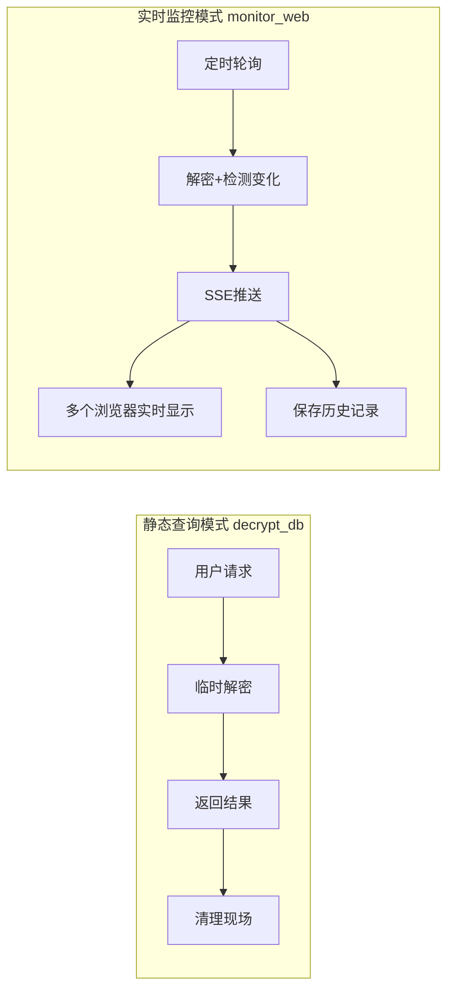
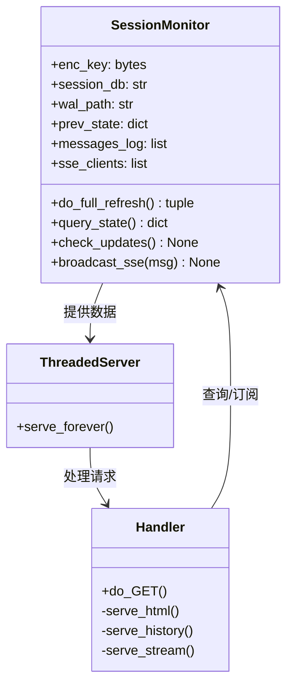
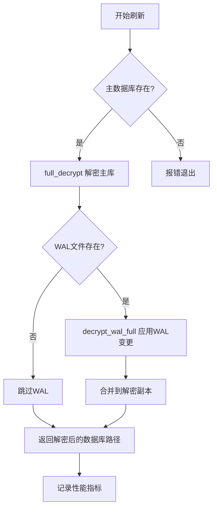
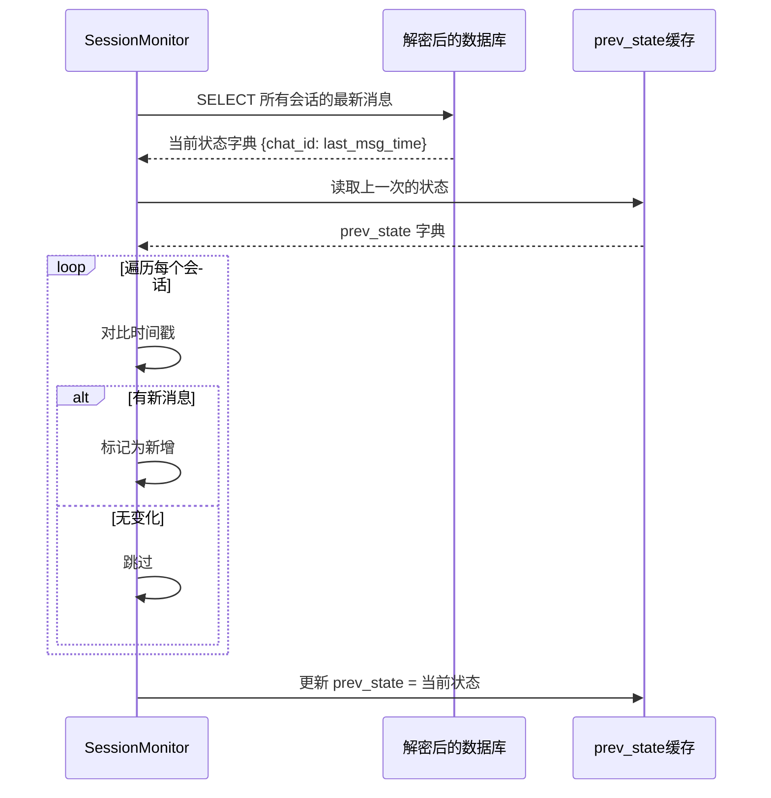
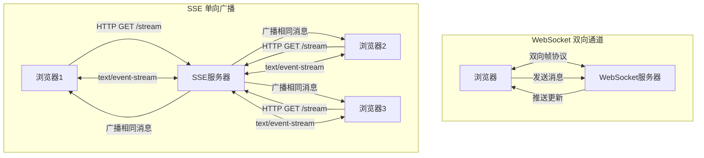
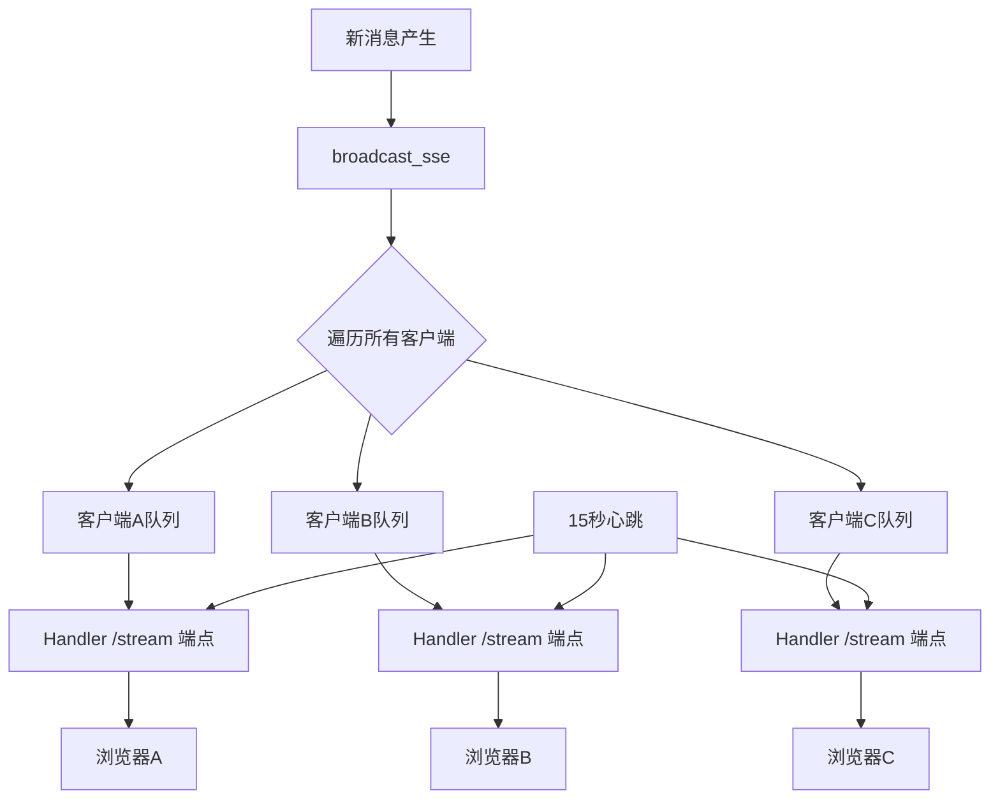
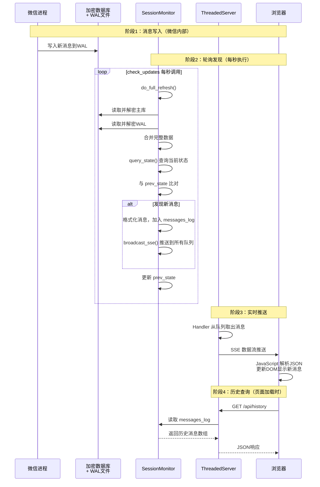
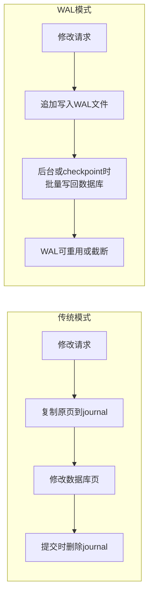
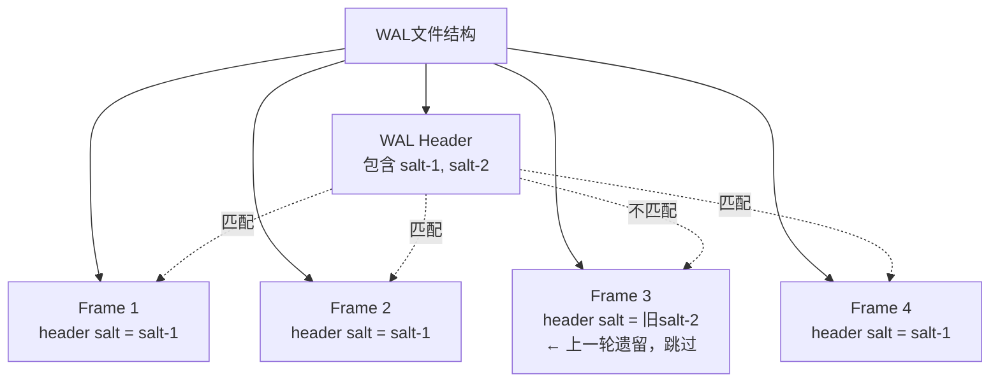

# 第四章：用 Monitor_Web 搭建实时消息看板

> **本章目标**：深入理解"解密-监控-推送"循环——SessionMonitor 如何通过 WAL 轮询发现新消息，并通过 Server-Sent Events 将消息实时推送到浏览器。

---

## 4.1 从静态查询到实时监控：为什么需要 Monitor_Web？

想象你正在经营一家餐厅。前三章我们学会的是"翻账本"——每次想看营业数据，都得去保险柜取出厚厚的账簿，一页页翻阅。但真实的生意场景需要的是**实时监控大屏**：新订单一出现，屏幕上立刻弹出提示；后厨出餐了，前台马上能看到状态更新。

微信消息监控也是如此。`decrypt_db` 模块像一位"档案管理员"，每次你需要查询时，它才去解密数据库、返回结果。而 `monitor_web` 则像一位**24小时值守的接线员**：
- 每隔几秒就检查一次"保险箱"（加密数据库）
- 发现新消息后立刻通过广播系统通知所有"分机"（浏览器客户端）
- 同时维护一份完整的通话记录，供新来的接线员查阅



这种模式的转变，核心解决三个问题：

| 问题 | 静态查询的痛点 | 实时监控的方案 |
|:---|:---|:---|
| **时效性** | 手动触发，延迟不可控 | 秒级轮询，自动发现 |
| **并发性** | 单次查询，结果不共享 | SSE广播，多客户端同步 |
| **连续性** | 无状态，每次从头查 | 维护消息日志，支持历史回溯 |

---

## 4.2 核心角色：SessionMonitor —— 密码破译员兼侦探

想象 `SessionMonitor` 是一位身兼数职的专家：

**作为密码破译员**，他持有万能钥匙，能打开加密的微信数据库保险箱。但他不只是开门——他还要把保险箱里的"草稿纸"（WAL文件）也整理进来，因为最新的消息可能还写在草稿纸上，没正式归档。

**作为侦探**，他有一双过目不忘的眼睛。每次打开保险箱，他都会快速扫描所有会话的状态，与记忆中的上一次的"快照"仔细比对，找出任何细微的变化——一条新消息、一个未读标记的变动。

**作为广播站调度员**，一旦发现新情况，他立即通过专用频道（SSE）向所有订阅者发出通报。同时，他还会把这条消息抄录进档案室（`messages_log`），方便后来的人查阅历史。



### 4.2.1 解密流程：打开保险箱的全套动作

`SessionMonitor.do_full_refresh()` 方法执行一套标准化的"开箱流程"：



你可以把这个过程想象成**整理办公桌**：
1. **拿出正式文件柜**（解密主数据库）：这是已经归档的所有资料
2. **检查临时便签区**（读取WAL文件）：看看有没有还没归档的新内容
3. **整合完整视图**（合并主库+WAL）：确保看到的数据是最新的全貌

> **为什么是"全量解密"而非"增量更新"？**
> 
> 想象你要确认办公室里有没有新文件。一种方法是记住每个抽屉上次的样子，只检查变动的部分——这很高效，但需要极其复杂的记忆和管理。另一种方法是每次把整个办公室的照片拍下来对比——虽然多花点时间，但绝不会漏掉任何东西。
> 
> `monitor_web` 选择了后者。SQLite 的 WAL 机制相当复杂，尝试做增量解密容易引入难以排查的 bug。对于消息监控场景，数据库通常不会太大，全量解密的性能开销完全可以接受。

### 4.2.2 变更检测：侦探的"找不同"游戏

解密完成后，`query_state()` 方法会从数据库中提取当前所有会话的状态，然后与 `prev_state`（上一次的状态快照）进行比对。



这个比对过程就像玩"找不同"游戏：两张几乎一样的图片，侦探要快速找出哪里多了个小人、哪里变了颜色。在代码中，这体现为对每条会话的 `last_msg_time` 和 `unread_count` 的精确比较。

---

## 4.3 实时推送：SSE —— 比 WebSocket 更简单的"单向广播"

现在我们已经发现了新消息，如何告诉浏览器？这里 `monitor_web` 做了一个关键的技术选择：**Server-Sent Events (SSE)**，而非更常见的 WebSocket。

### 4.3.1 SSE vs WebSocket：选对工具很重要

想象你要设计一个小区的通知系统：

| 方案 | 工作原理 | 适用场景 |
|:---|:---|:---|
| **WebSocket** | 双向对讲机，双方随时说话 | 聊天室、游戏、协同编辑 |
| **SSE** | 小区广播喇叭，物业单向播报 | 股价推送、新闻直播、消息通知 |

微信消息监控是典型的**单向推送**场景：服务器有新消息就告诉浏览器，浏览器不需要向服务器发送实时指令。SSE 在这种场景下有三个明显优势：

1. **实现简单**：基于普通 HTTP，不需要复杂的握手协议
2. **自动重连**：浏览器原生支持断线重连，代码里不用操心
3. **穿透性好**：大多数防火墙和代理都对标准 HTTP 友好



### 4.3.2 SSE 的实现机制：每个客户端一个专属信箱

`monitor_web` 的 SSE 实现采用了**"每个客户端一个队列"**的设计：



你可以把这想象成**酒店的前台留言系统**：
- 每位住客（浏览器）入住时，前台为他准备一个专属信箱（`queue.Queue`）
- 有紧急通知时（新消息），前台把同样的纸条复印多份，分别投入每个信箱
- 住客可以随时来前台查看自己的信箱，取走所有留言
- 如果住客长时间没来（15秒），前台会塞一张" heartbeat "纸条进去，确保他知道连接还活着

这种设计的精妙之处在于**隔离性**：如果某个浏览器网络卡顿、处理缓慢，只会积压它自己的队列，不会影响其他客户端接收消息。

### 4.3.3 代码层面的 SSE 协议

SSE 的消息格式非常简单，是纯文本的：

```
data: {"time": "16:26", "chat": "交流群", "sender": "张三", "content": "大家好"}

data: {"time": "16:27", "chat": "工作群", "sender": "李四", "content": "收到"}

event: heartbeat
data: 

```

每行以 `data:` 开头，一条消息以两个换行符结束。`monitor_web` 的 `Handler.serve_stream()` 方法就是负责把这些格式化后的 JSON 字符串源源不断地写给浏览器：

```python
# 简化的核心逻辑
def serve_stream(self):
    # 1. 注册新客户端：创建一个专属队列
    q = queue.Queue()
    with sse_lock:
        sse_clients.append(q)
    
    try:
        while True:
            # 2. 等待消息或超时（15秒）
            try:
                msg = q.get(timeout=15)
                self.wfile.write(f"data: {msg}\n\n".encode())
            except queue.Empty:
                # 3. 超时发送心跳，保持连接
                self.wfile.write(b"event: heartbeat\ndata: \n\n")
    finally:
        # 4. 客户端断开，清理资源
        with sse_lock:
            sse_clients.remove(q)
```

---

## 4.4 完整数据流：从加密数据库到浏览器屏幕

让我们把整个过程串起来，看看一条新消息是如何穿越重重障碍，最终出现在你的浏览器上的：



这个过程有几个关键的时间节点值得注意：

| 阶段 | 典型耗时 | 说明 |
|:---|:---|:---|
| 数据库解密 | 50-200ms | 取决于数据库大小 |
| WAL 应用 | 10-50ms | 通常很小 |
| 状态查询与比对 | 5-20ms | 纯内存操作 |
| SSE 推送 | <1ms | 仅入队操作 |
| 网络传输 | 10-100ms | 取决于网络状况 |

总延迟通常在 **100-500ms** 之间，对于消息监控场景已经足够实时。

---

## 4.5 WAL 机制深度解析：为什么需要"草稿纸"？

前面多次提到 WAL（Write-Ahead Logging），这是 SQLite 保证数据安全的核心机制，也是 `monitor_web` 必须正确处理的关键细节。

### 4.5.1 WAL 的工作方式：先写日志，再归档

想象你是一个严谨的会计师：

**传统方式（回滚日志模式）**：每次修改账本前，先把整页复印一份锁进抽屉。如果改错了，拿出来复原。这种方式安全，但每次都要复印整页，很慢。

**WAL 方式（预写日志模式）**：你有一本专门的"草稿本"。所有新交易先记在草稿本上，等积攒到一定数量或闲下来时，再一次性誊写到正式账本。这样正式账本很少被翻动，性能更好。



### 4.5.2 WAL 的"盐值"机制：识别有效数据

WAL 文件有一个重要特性：**它是循环使用的**。当写满一定大小后，SQLite 会从头开始覆盖旧数据。这就带来一个问题：`monitor_web` 怎么知道哪些帧是新数据，哪些是上一轮遗留的垃圾？

答案是 **salt（盐值）**。WAL 文件的头部有一个随机生成的 salt，每个有效的数据帧也会携带这个 salt。只有匹配的帧才是当前周期的有效数据。



`decrypt_wal_full()` 函数的核心逻辑就是：**只解密那些帧头 salt 与 WAL 头部 salt 匹配的帧**，其余的全部忽略。这确保了即使 WAL 文件中混杂着旧数据，也不会污染我们的解密结果。

---

## 4.6 动手实践：启动你自己的消息看板

理论讲完，我们来看看实际怎么用。启动 `monitor_web` 只需要三步：

### 步骤1：准备密钥和配置

确保你已经运行过 `find_all_keys.py`，生成了 `all_keys.json`。然后创建 `config.json`：

```json
{
    "keys_file": "all_keys.json",
    "wx_dir": "C:\\Users\\你的用户名\\Documents\\WeChat Files\\wxid_xxx"
}
```

### 步骤2：编写启动脚本

```python
# run_monitor.py
import time
import threading
from config import Config
from monitor_web import SessionMonitor, ThreadedServer, Handler

# 加载配置
cfg = Config("config.json")

# 获取第一个找到的密钥（实际使用时应匹配对应数据库）
enc_key = cfg.keys[0]["key"]

# 会话数据库路径
session_db = cfg.session_path  # 通常是 Msg/session.db

# 联系人名称映射（可选，用于美化显示）
contact_names = {}  # 可以从 contact.db 加载

# 创建监控器
monitor = SessionMonitor(
    enc_key=enc_key,
    session_db=session_db,
    contact_names=contact_names
)

# 启动 Web 服务器
server = ThreadedServer(('0.0.0.0', 8080), Handler)
server_thread = threading.Thread(target=server.serve_forever)
server_thread.daemon = True
server_thread.start()

print("🚀 监控服务已启动，访问 http://localhost:8080")

# 主循环：每秒检查一次更新
while True:
    monitor.check_updates()
    time.sleep(1)
```

### 步骤3：打开浏览器查看

运行 `python run_monitor.py`，然后用浏览器访问 `http://localhost:8080`。你会看到一个简洁的实时消息面板：

```
┌─────────────────────────────────────────┐
│  💬 WeChat 消息监控                      │
├─────────────────────────────────────────┤
│ [实时消息流]                             │
│                                         │
│ 16:26:34 [交流群] 张三: 大家晚上好！      ✨
│ 16:26:45 [工作群] 李四: 收到，明天处理     ✨
│ 16:25:12 [家庭群] 妈妈: (图片)            │
│ ...                                     │
│                                         │
│ [连接状态: ● 实时]                       │
└─────────────────────────────────────────┘
```

带 ✨ 的是刚刚收到的新消息，它们会通过 SSE 实时弹出，同时伴有轻微的动画效果。

---

## 4.7 设计权衡与优化空间

`monitor_web` 的实现做了几个务实的取舍，了解这些有助于你在特定场景下做出调整：

### 4.7.1 全量解密 vs 增量解密

| 方案 | 优点 | 缺点 | 适用场景 |
|:---|:---|:---|:---|
| **当前：全量解密** | 代码简单可靠，无状态依赖 | 大数据库时性能下降 | 普通用户，数据库 < 1GB |
| **优化：增量解密** | 性能提升10-100倍 | 实现复杂，需跟踪页版本 | 超大群组，高频监控 |

如果你的数据库非常大（数GB），可以考虑在 `do_full_refresh()` 中加入智能判断：只有当文件修改时间变化超过阈值时才执行全量解密，否则仅检查 WAL。

### 4.7.2 轮询间隔的调整

当前默认每秒检查一次，这是一个**保守且通用**的设置：

```python
# 当前设置
time.sleep(1)  # 每秒检查

# 可选调整
time.sleep(0.5)  # 更实时，CPU占用稍高
time.sleep(5)    # 更省电，延迟增加
```

建议根据实际场景测试：打开浏览器的开发者工具，观察 Network 面板的 `/stream` 连接，同时对比微信 PC 版的实际消息到达时间。

### 4.7.3 消息日志的持久化

当前的 `messages_log` 只保存在内存中，程序重启就会丢失。如果需要长期保留历史，可以简单扩展：

```python
# 在 check_updates() 中加入
with open("message_history.jsonl", "a", encoding="utf-8") as f:
    for msg in new_messages:
        f.write(json.dumps(msg, ensure_ascii=False) + "\n")
```

或者接入真正的数据库（如 SQLite 或 PostgreSQL），支持更复杂的查询和分析。

---

## 4.8 小结：从"翻账本"到"直播台"

本章我们深入探索了 `monitor_web` 模块的"解密-监控-推送"循环：

| 组件 | 角色类比 | 核心职责 |
|:---|:---|:---|
| `SessionMonitor` | 密码破译员 + 侦探 + 广播站 | 解密数据库、检测变化、推送消息 |
| `ThreadedServer` | 电话交换台 | 处理多路并发连接 |
| `Handler` | 接线员 | 响应 HTTP 请求，维护 SSE 流 |
| SSE 机制 | 单向广播喇叭 | 服务器→浏览器的实时推送 |
| WAL 处理 | 草稿本整理 | 捕获尚未归档的最新消息 |

这个架构的价值在于**将复杂性封装在底层**：使用者只需几行代码就能搭建一个功能完整的实时消息看板，而不必关心 SQLCipher 的加密细节、SQLite 的 WAL 机制、或是 HTTP 流的协议规范。

在下一章，我们将把目光转向 AI 集成——如何让 Claude 等大语言模型直接"读懂"你的微信数据，用自然语言查询替代繁琐的 SQL 操作。