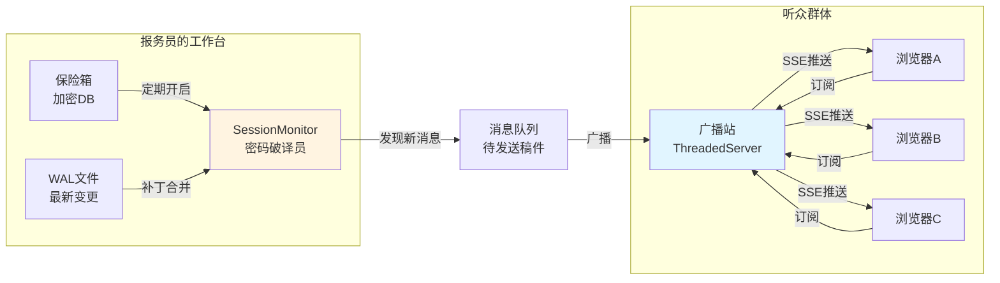
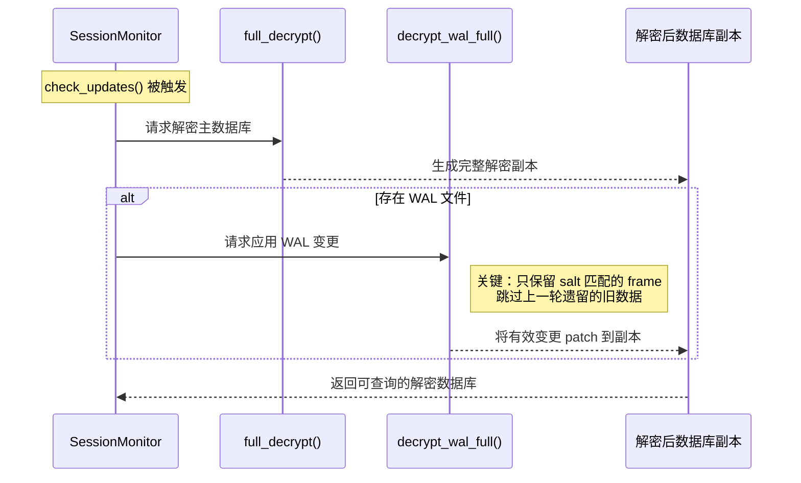
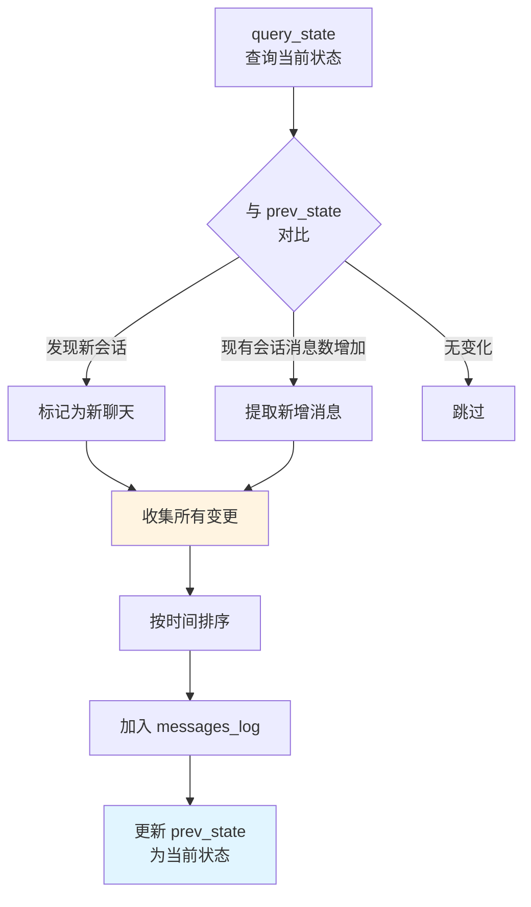
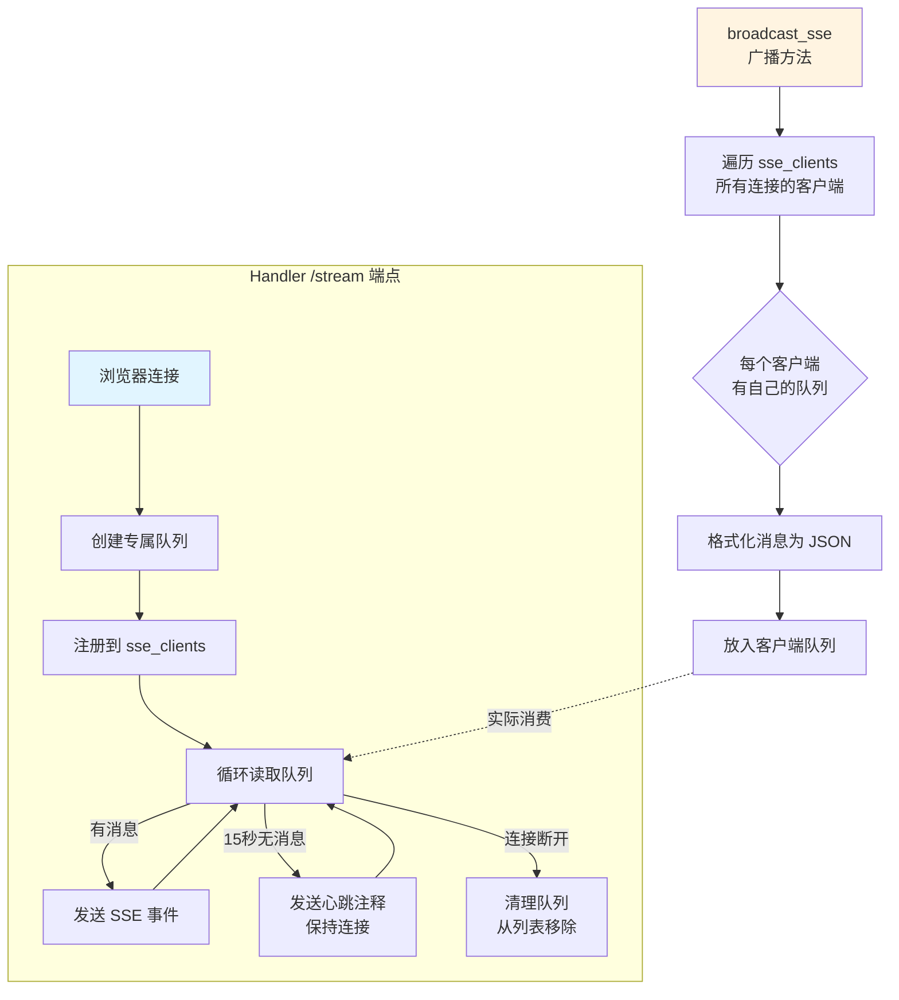
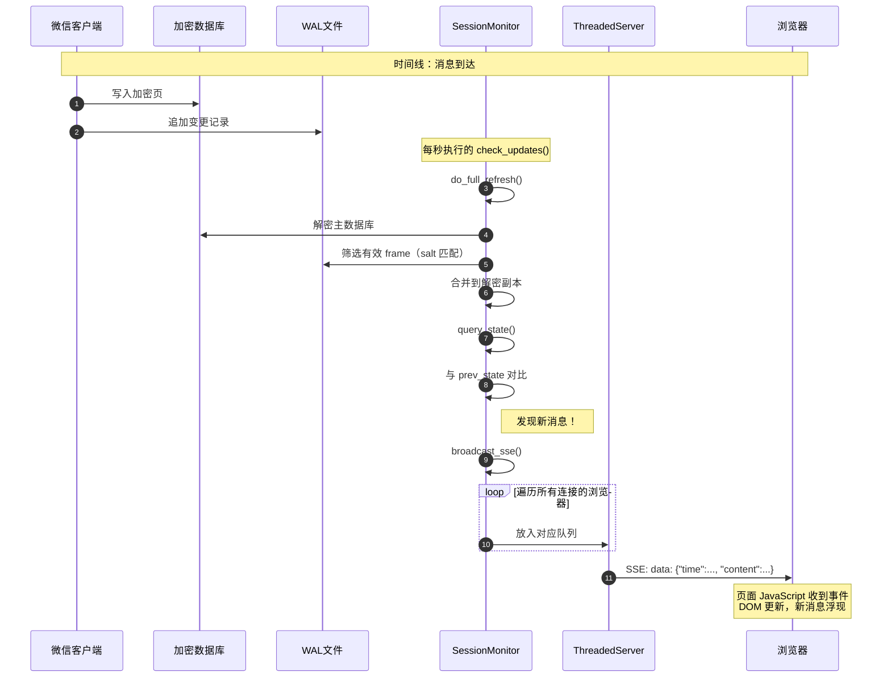

# 第四章：用 monitor_web 搭建实时聊天流

## 本章目标

想象你正在看一场直播足球赛——画面不是等整场比赛录完才给你，而是进球发生的瞬间，画面就推送到你眼前。`monitor_web` 做的就是这件事：它让你的浏览器成为微信聊天的"直播观众"，新消息一到，屏幕立刻刷新，无需手动刷新页面。

我们将深入探索**"解密-监控-推送"循环**：数据库文件如何被持续解密、变化如何被检测、以及 SSE（Server-Sent Events）如何将实时更新送达浏览器。

---

## 4.1 核心心理模型：一位永不疲倦的电报员

想象 `monitor_web` 是一位驻扎在电报局的资深报务员：

- **他的保险箱**：加密的微信数据库，每隔几秒就要打开检查
- **他的放大镜**：对比前后两次看到的会话状态，找出新增内容
- **他的广播站**：一旦发现新消息，立刻通过电波（SSE）发送给所有订阅的听众
- **他的档案室**：维护一份消息日志，让新来的听众也能了解历史

这位报务员的工作节奏是固定的——无论有没有新消息，他都会按时检查保险箱。这种"轮询"方式虽然看起来不够"智能"，但胜在简单可靠，不会因为某个环节卡住而漏掉重要信息。



---

## 4.2 解密-监控-推送循环详解

整个系统的核心是一个永不停歇的三步循环，就像心脏的跳动一样规律。让我们拆开每一步，看看血液（数据）如何在系统中流动。

### 第一步：解密——打开保险箱的全套动作

每次循环开始，`SessionMonitor` 都要执行一次"开箱检查"。这个过程比你想象的更复杂，因为微信的数据库采用了**WAL（Write-Ahead Logging）机制**。

你可以把 WAL 想象成餐厅的"临时订单板"：服务员先写在板上，不忙的时候再抄进正式账本。如果只看账本，你会错过刚点的菜；但如果只看订单板，又会漏掉之前的记录。所以必须两者结合——先看账本，再把板上有效的订单补进去。



**技术细节揭秘**：WAL 文件是预分配固定大小的（4MB），就像一个写满一页撕一页的循环便签本。如何判断哪些内容是"这一轮的"？答案是 **salt 值**——WAL 头部有一个 salt，每个 frame 头部也有 salt，只有两者匹配，才是当前有效的数据。这就像每张便签纸上的日期戳，日期对不上的就是旧记录。

### 第二步：监控——找不同游戏

现在保险箱打开了，报务员要做的就是玩一场"找不同"游戏。他拿出上次的"快照"（`prev_state`），与当前的会话状态逐条对比。



这里有个精妙的设计：**全量对比，而非增量追踪**。为什么不直接监听"哪条消息变了"？因为 SQLite 的加密是按页进行的，追踪单个记录的变更需要维护复杂的状态机。相比之下，把整个表读出来比一比，代码简单十倍，而且几乎不会出错——对于几 MB 到几十 MB 的会话数据库，现代 CPU 处理起来绰绰有余。

### 第三步：推送——_SSE 广播的艺术

发现新消息后，就要通知所有在线的浏览器了。这里选用的是 **SSE（Server-Sent Events）**，而不是更常见的 WebSocket。

想象你在听广播电台：电台单向向你播放节目，你不需要对着收音机说话。SSE 就是这种"广播电台模式"——服务器有消息就推，客户端专心接收就行。WebSocket 则像电话通话，双向交流，但对于"看直播聊天"这个场景，我们根本不需要观众往电视台打电话。



**心跳机制的智慧**：SSE 连接可能被网络中间设备（如路由器、代理服务器）认为"太久没活动"而切断。每 15 秒发送一个空的心跳包（以冒号开头的注释行），就像定期咳嗽一声告诉队友"我还活着"，既不影响业务逻辑，又能维持连接。

---

## 4.3 架构全景：组件如何协作

现在让我们把镜头拉远，看看整个系统的建筑结构。这就像一个微型的新闻编辑部，各部门分工明确，通过标准流程协作。

```mermaid
classDiagram
    class SessionMonitor {
        +enc_key: bytes
        +session_db: str
        +wal_path: str
        +prev_state: dict
        +messages_log: list
        +sse_clients: list
        +messages_lock: Lock
        +__init__(key, db, contacts)
        +do_full_refresh() (解密+WAL补丁)
        +check_updates() (主循环)
        +query_state() (查询会话)
        +broadcast_sse(msg) (广播)
    }
    
    class ThreadedServer {
        +daemon_threads = True
        +serve_forever()
    }
    
    class Handler {
        +do_GET()
        +serve_static() /, /index.html
        +api_history() /api/history
        +stream_sse() /stream
    }
    
    class "HTTP Server 基类" as HTTPServer
    
    ThreadedServer --|> HTTPServer : 继承
    ThreadedServer ..> Handler : 使用处理请求
    Handler ..> SessionMonitor : 访问共享状态
    
    note for SessionMonitor "核心状态容器<br/>线程安全的关键"
    note for ThreadedServer "多线程并发支持<br/>每个连接一个线程"
    note for Handler "请求路由与协议实现<br/>SSE 长连接管理"
```

### 线程安全：锁的艺术

多线程编程就像多人共用一间厨房——如果不协调好，有人会拿到半生不熟的食材，有人会把菜炒糊。`monitor_web` 有两把关键的"锁"：

| 锁名称 | 保护的对象 | 使用场景 |
|:---|:---|:---|
| `messages_lock` | `messages_log` 列表 | 写入新消息、读取历史记录 |
| `sse_clients` 操作时的隐式锁 | `sse_clients` 列表 | 注册新客户端、移除断开客户端、广播时遍历 |

**关键原则**：持有锁的时间越短越好。比如在 `check_updates()` 中，先准备好所有新消息，一次性获取锁写入，而不是每条消息都抢锁——这就像一次性买齐食材，而不是做一道菜跑一趟超市。

---

## 4.4 数据旅程：一条消息的诞生

让我们追踪一条新微信消息的完整旅程，从它进入数据库，到你的浏览器屏幕上闪烁出现。



**性能指标参考**（典型场景）：
- 解密主数据库（1000 页）：~50ms
- WAL 补丁（10 个有效 frame）：~10ms
- 状态查询与对比：~5ms
- 总延迟（从微信写入到浏览器显示）：约 100-200ms

对于人类感知来说，这几乎是瞬时的——你刚听到微信的提示音，浏览器上已经出现了新消息。

---

## 4.5 设计权衡：为什么选择"笨办法"

`monitor_web` 做了一些看似"不够优雅"的选择，但每一个都是经过深思熟虑的工程决策。

### 权衡一：全量解密 vs 增量解密

| 方案 | 优点 | 缺点 | monitor_web 的选择 |
|:---|:---|:---|:---|
| 增量解密 | 性能最优，只处理变化的页 | 实现极复杂，WAL 环形缓冲区难以追踪 | ❌ |
| 全量解密 | 代码简单，可靠性高 | 每次都有固定开销 | ✅ |

**类比**：就像整理房间，你可以选择每天只收拾用过的东西（增量），或者每天把整个房间快速扫一遍（全量）。对于不太大的房间，后者反而更快——不用动脑子决定"哪些该收"。

### 权衡二：轮询 vs 事件驱动

| 方案 | 优点 | 缺点 | monitor_web 的选择 |
|:---|:---|:---|:---|
| inotify/fsevents 文件系统事件 | 即时响应，零延迟 | SQLite WAL 写入模式复杂，事件不可靠 | ❌ |
| mtime 轮询（30ms-1s） | 跨平台、实现简单、行为可预测 | 有最大一个轮询周期的延迟 | ✅（1秒间隔）|

**类比**：等人来敲门（事件驱动）vs 每隔几秒看一眼门外（轮询）。前者理论上更快，但如果门铃坏了你就永远不知道有人来过。后者虽然慢半拍，但绝不会漏掉。

### 权衡三：SSE vs WebSocket

| 方案 | 优点 | 缺点 | monitor_web 的选择 |
|:---|:---|:---|:---|
| WebSocket | 双向通信，协议灵活 | 需要握手和帧管理，实现复杂 | ❌ |
| SSE | 单向推送足够，浏览器原生支持，自动重连 | 仅支持服务器→客户端 | ✅ |

**类比**：WebSocket 是对讲机，SSE 是广播电台。既然观众只需要听不需要说，为什么要发对讲机呢？

---

## 4.6 实战：启动你的实时聊天监控

理论讲完，动手实践。以下是启动 `monitor_web` 的完整流程：

### 前置条件
1. 已完成第二章的密钥提取（`all_keys.json` 存在且有效）
2. 微信正在运行（确保 WAL 文件有写入权限）

### 启动步骤

```python
import threading
import time
from monitor_web import SessionMonitor, ThreadedServer, Handler

# 1. 初始化监控核心
monitor = SessionMonitor(
    enc_key=b'your_32_byte_key_here',  # 从 all_keys.json 获取
    session_db=r"D:\xwechat_files\...\session\session.db",
    contact_names={"wxid_xxx": "张三", "wxid_yyy": "李四"}  # 美化显示名
)

# 2. 注入监控实例到 Handler（共享状态）
Handler.monitor = monitor

# 3. 启动多线程 HTTP 服务器
server = ThreadedServer(('0.0.0.0', 5678), Handler)
server_thread = threading.Thread(target=server.serve_forever)
server_thread.daemon = True  # 主程序退出时自动终止
server_thread.start()

print(f"🚀 实时监控已启动: http://localhost:5678")

# 4. 启动解密-监控-推送循环
while True:
    try:
        monitor.check_updates()  # 单次完整的"开箱检查"
    except Exception as e:
        print(f"检查失败: {e}")  # 容错：单次错误不中断循环
    time.sleep(1)  # 每秒检查一次
```

### 浏览器体验

打开 `http://localhost:5678`，你会看到一个极简的实时聊天界面：

- **历史区域**：加载 `/api/history` 返回的最近消息
- **实时流**：建立 SSE 连接到 `/stream`，新消息自动追加
- **自动重连**：网络波动时，SSE 会自动恢复连接

---

## 4.7 扩展与定制

`monitor_web` 的设计预留了多个扩展点，你可以根据需求改造：

### 自定义消息格式化

修改 `check_updates()` 中的消息构造部分，比如添加表情包解析、链接预览等：

```python
# 原代码
msg_data = {
    "time": timestamp,
    "chat": chat_name,
    "sender": sender,
    "content": content,
    "type": msg_type
}

# 扩展：添加内容增强
if msg_type == 3:  # 图片消息
    msg_data["thumbnail"] = extract_thumbnail(content)
elif msg_type == 34:  # 语音消息
    msg_data["duration"] = parse_voice_duration(content)
```

### 添加消息过滤

在 `broadcast_sse()` 中加入条件判断，只推送特定类型的消息：

```python
def broadcast_sse(self, msg):
    # 新增：过滤规则
    if msg.get("type") == 10000:  # 系统提示（如"对方撤回了一条消息"）
        return  # 不广播
    if self.is_muted_chat(msg["chat"]):
        return  # 免打扰的群聊
    
    # 原有广播逻辑...
```

### 持久化存储

当前 `messages_log` 仅存于内存，重启即丢失。可以扩展为写入 SQLite 或发送到消息队列：

```python
# 在 __init__ 中初始化
self.persistent_db = sqlite3.connect("message_archive.db")

# 在 check_updates 中保存
with self.messages_lock:
    self.messages_log.extend(new_messages)
    # 新增：持久化
    self.save_to_persistent_db(new_messages)
```

---

## 4.8 常见问题排查

| 现象 | 可能原因 | 解决方案 |
|:---|:---|:---|
| 页面能打开但没有实时更新 | `check_updates()` 未在后台运行 | 确认 while 循环正常执行，无异常吞掉 |
| 历史消息为空 | `messages_log` 尚未积累数据 | 等待新消息进入，或检查数据库路径 |
| SSE 连接频繁断开 | 网络中间设备超时过短 | 缩短心跳间隔（默认15秒） |
| 解密耗时过长（>500ms） | 数据库过大或磁盘慢 | 考虑升级 SSD，或接受更高延迟 |
| 消息顺序错乱 | 多线程竞争导致 | 检查 `messages_lock` 是否正确使用 |

---

## 本章小结

`monitor_web` 是一个**用简单手段解决复杂问题**的典范。它没有追求理论上的最优解，而是在工程约束下选择了最可靠的实现路径：

- **全量解密**保证了正确性，牺牲的性能在可接受范围
- **轮询检测**保证了跨平台兼容性，秒级延迟对人类感知无碍  
- **SSE 推送**在满足单向实时需求的同时，将复杂度降到最低

理解这些设计背后的权衡，比记住具体 API 更有价值——当你面对自己的工程问题时，也会知道何时该选"聪明的算法"，何时该选"笨但可靠的方案"。

下一章，我们将进入 `mcp_server` 的世界，看看如何让 Claude AI 成为你的微信数据助手，用自然语言查询聊天记录——那是另一种截然不同的交互范式。