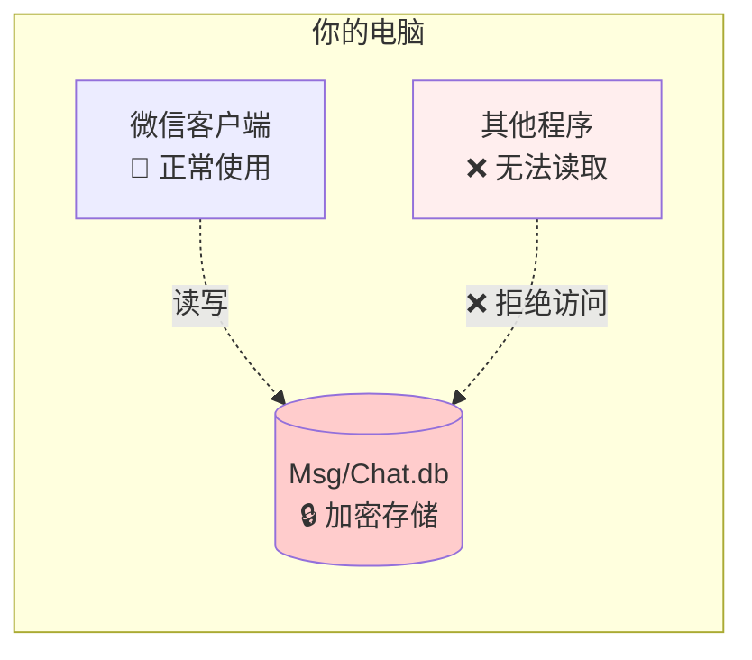
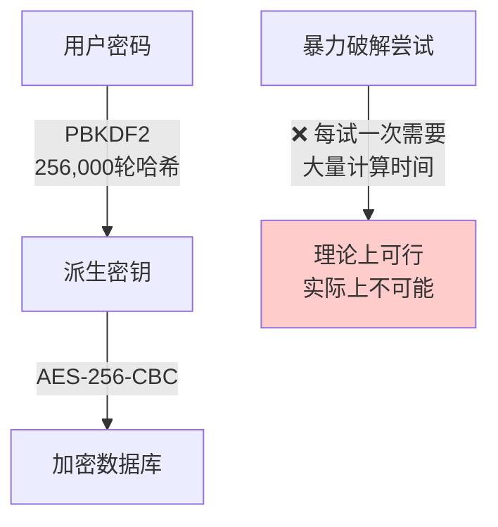
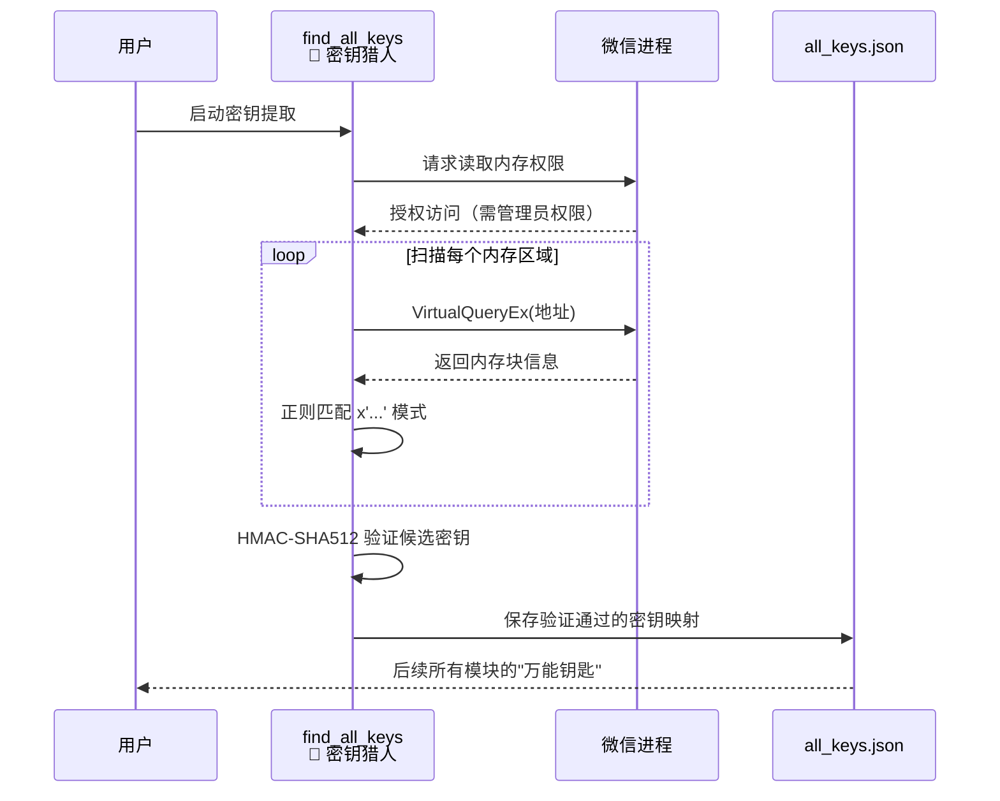
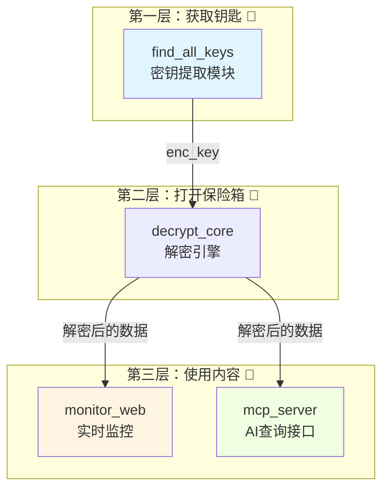
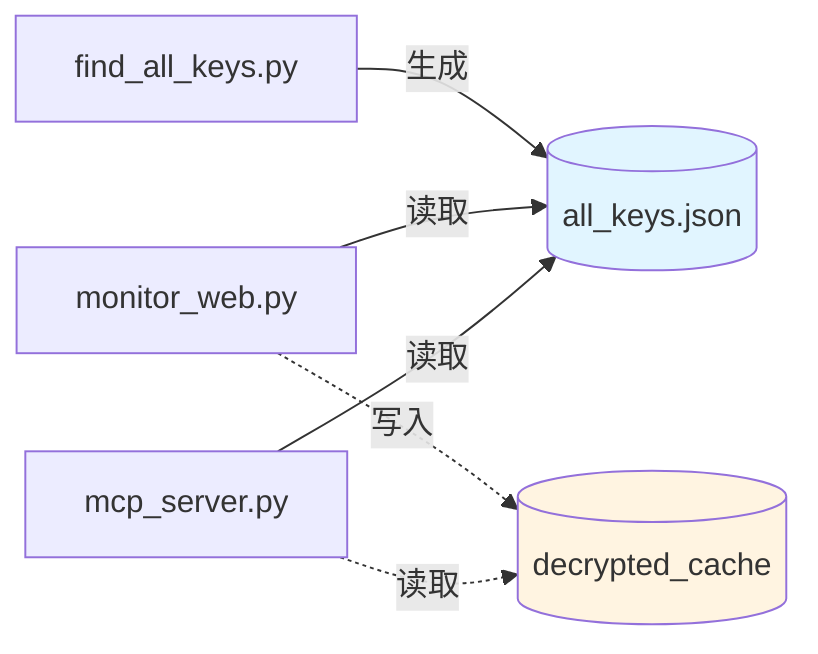

# 第一章：wechat-decrypt 是什么？它为什么存在？

## 保险箱里的秘密

想象你有一个巨大的保险箱，里面存着过去十年的所有聊天记录——和家人的温馨对话、工作群的重要通知、朋友间的深夜吐槽。这个保险箱就放在你的电脑上，你每天都能看到它，但**打不开**。

这就是微信本地数据库的现状。

微信把聊天记录存在你电脑的一个文件夹里，文件后缀是 `.db`，看起来像是普通的 SQLite 数据库。但如果你尝试用任何数据库工具打开它，只会看到乱码。因为这些文件被**加密**了，就像上了锁的保险箱。

*图：微信能自由读写，其他程序被拒之门外*

---

## 为什么微信要加密？为什么我们又想解密？

**加密的原因很简单**：保护隐私。如果你的电脑被恶意软件入侵，或者你修电脑时被人拷贝了数据文件，至少聊天记录不会直接暴露。

**但我们有正当的解密需求**：
- 你想**搜索**三年前的某条工作消息，微信自带的搜索太慢或搜不到
- 你想**备份**聊天记录到其他地方，防止手机丢失
- 你想让 **AI 助手**帮你整理聊天中的待办事项
- 你想**实时监控**某个群的消息并做自动化处理

这些需求都是针对**你自己的数据**，而且是在**你自己的电脑上**。这就像你想给自家的保险箱换个锁，或者装个报警器——完全合理。

---

## 暴力破解？行不通的

面对加密，最直观的想法是："我能猜出密码吗？"

微信使用的是 **SQLCipher** 加密方案，密钥不是简单的"123456"，而是通过 **PBKDF2** 算法生成的。你可以把这个过程想象成：

> 把一滴墨水滴入大海，然后搅拌 256,000 次。现在让你根据最终海水的颜色，反推出最初那滴墨水的成分。

这在数学上是**不可行**的。即使动用超级计算机，破解一个密钥也需要数百年。

*图：正向加密很快，逆向破解极慢——这是现代密码学的设计目标*

---

## 旁路攻击：借用微信自己的钥匙

既然硬闯不行，那就换个思路。

想象一下：保险箱的主人（微信）每次开锁后，会不会随手把钥匙放在旁边的抽屉里？如果我们能找到那个抽屉，不就能**借来用一下**了吗？

这正是 `wechat-decrypt` 的核心洞察。**WCDB**（微信的数据库引擎）在运行时会把解密用的密钥**缓存在内存中**。我们的工具不需要破解密码，只需要：

1. 找到运行中的微信进程
2. 扫描它的内存空间
3. 识别出"长得像密钥"的数据模式
4. 验证找到的密钥是否真的能解密数据库

这就像是一个**开锁匠**，不去撬锁，而是观察主人把备用钥匙藏在了哪里。

*图：密钥提取流程——从微信内存中"借用"缓存的密钥*

---

## 三大模块：分工协作的工具箱

拿到钥匙之后，我们要解决三个不同层面的问题。`wechat-decrypt` 设计了三个独立的模块，就像一套**专业工具箱**里的三把核心工具：

*图：三层架构——从密钥到应用的数据流向*

### 模块一：find_all_keys（密钥猎人）

**类比**：像 **Shazam 听歌识曲** 一样，在嘈杂的内存环境中精准识别出密钥。

这个模块直接与 Windows 内核打交道，枚举微信进程的每一块可读内存，用精心设计的正则表达式匹配 WCDB 的密钥缓存格式。最后通过轻量级的 **HMAC-SHA512** 验证，确保找到的密钥确实能解开对应的数据库。

输出是一份 JSON 格式的密钥映射表，成为整个系统的"基础设施"。

### 模块二：解密引擎（隐形的中间层）

**类比**：像 **浏览器的渲染引擎**，把原始数据转换成上层应用能理解的格式。

虽然不是一个独立的可执行模块，但 `full_decrypt`、`decrypt_page`、`decrypt_wal_full` 等函数构成了核心的解密能力。它们处理 AES-256-CBC 解密、WAL（预写日志）文件合并等复杂逻辑，对上层屏蔽了加密的细节。

### 模块三：monitor_web（实时监控）

**类比**：像 **股票行情软件**，持续刷新并推送最新变化。

这个模块解决的是"我想实时看到新消息"的需求。它定期执行**解密-比对-推送**的循环：
- 全量解密数据库（包括 WAL 中的最新变更）
- 对比前后状态，找出新增的消息
- 通过 **SSE（Server-Sent Events）** 推送到浏览器

设计上故意选择了简单可靠的**轮询**（每30ms检查文件修改时间），而非复杂的文件系统事件监听，这是工程上的务实权衡。

### 模块四：mcp_server（AI 查询接口）

**类比**：像 **数据库的 ORM 框架**，把底层 SQL 转换成高级语言的自然表达。

这个模块让 **Claude** 等大语言模型能直接查询你的微信数据。它基于 **MCP（Model Context Protocol）** 协议，暴露 `get_chat_history`、`search_messages` 等工具函数。

核心创新是 **DBCache** 类：通过检测文件修改时间智能管理解密缓存，避免重复计算，同时自动合并 WAL 文件保证数据最新。你可以直接用自然语言问 AI："上周三张三发给我的文件链接是什么？"，而不需要自己写 SQL。

---

## 设计哲学：解耦与组合

这三个模块的关系，很像 **React 生态**中的状态管理：

| wechat-decrypt | React 生态 | 作用 |
|:---|:---|:---|
| `find_all_keys` | `createStore` | 一次性初始化，提供基础能力 |
| `decrypt_core` | `useReducer` | 核心转换逻辑，被多个组件复用 |
| `monitor_web` | `useEffect` + WebSocket | 实时订阅和推送 |
| `mcp_server` | React Query / SWR | 按需查询，智能缓存 |

模块之间**不直接调用**，而是通过**配置文件**和**文件系统**松耦合：
- `all_keys.json` 是 `find_all_keys` 的输出，其他模块的输入
- 解密后的数据库文件是共享的状态载体
- 每个模块可以独立运行、独立升级

*图：模块间通过文件松耦合，各自独立演进*

---

## 为什么不用更简单的方法？

你可能会问：市面上不是有"微信聊天记录导出工具"吗？为什么不能直接用那些？

大多数现有方案的问题是：
- **依赖旧版本微信**：利用历史漏洞，随时可能失效
- **需要登录网页版微信**：功能受限，且网页版已逐步关闭
- **闭源商业软件**：不清楚对你的数据做了什么，有隐私风险

`wechat-decrypt` 选择了一条**更透明、更可持续**的路：
- 利用的是 WCDB 的**设计特性**（内存缓存密钥），而非漏洞
- 完全**开源**，每一行代码都可审计
- **本地运行**，数据不出你的电脑
- **模块化设计**，可以根据需求灵活组合

这就像是自己学会开锁技术，而不是把保险箱钥匙交给陌生人。

---

## 本章小结

| 概念 | 日常类比 | 技术要点 |
|:---|:---|:---|
| 加密数据库 | 上锁的保险箱 | SQLCipher + AES-256-CBC |
| PBKDF2 | 搅拌256,000次的墨水 | 暴力破解不可行 |
| 内存密钥提取 | 借用主人藏的备用钥匙 | 旁路攻击，非破解 |
| 实时监控 | 股票行情推送 | SSE + 轮询检测 |
| AI 查询接口 | 自然语言转 SQL | MCP 协议 + DBCache |

在下一章，我们将深入探索 `find_all_keys` 的具体实现——这把"万能钥匙"是如何从微信的内存中被精准定位出来的。