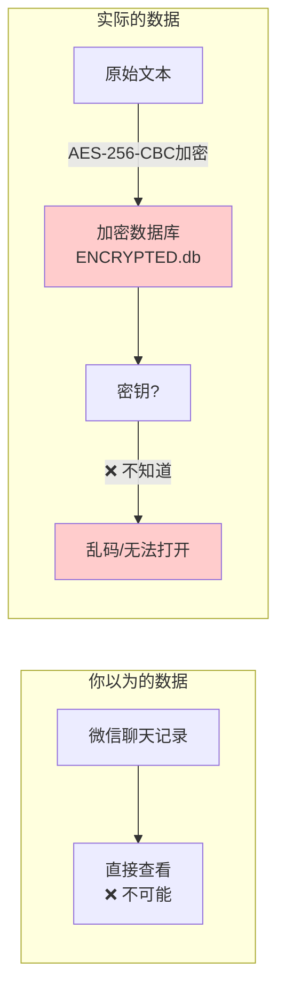
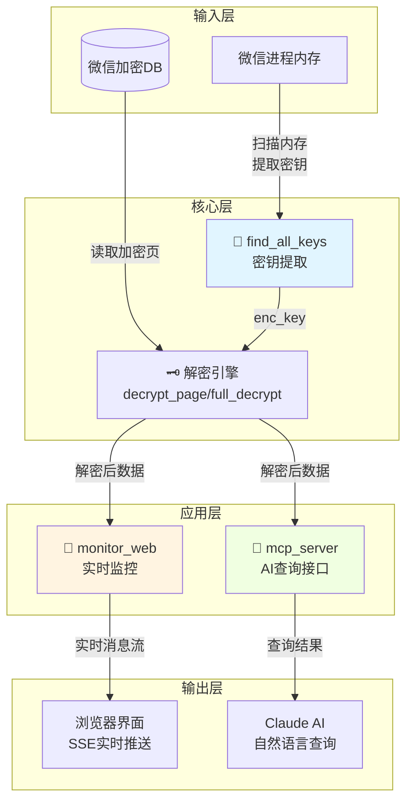
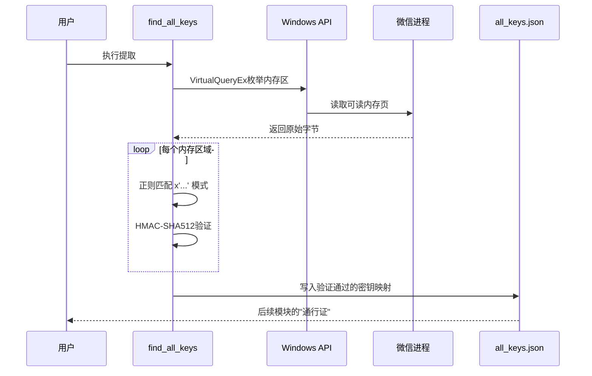
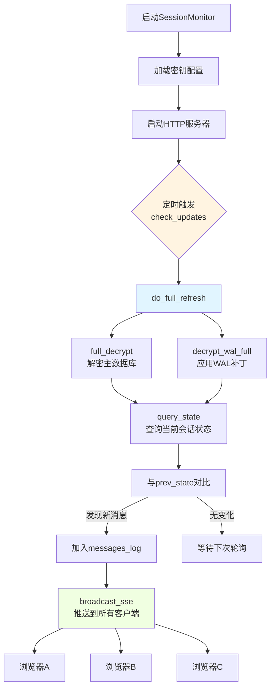
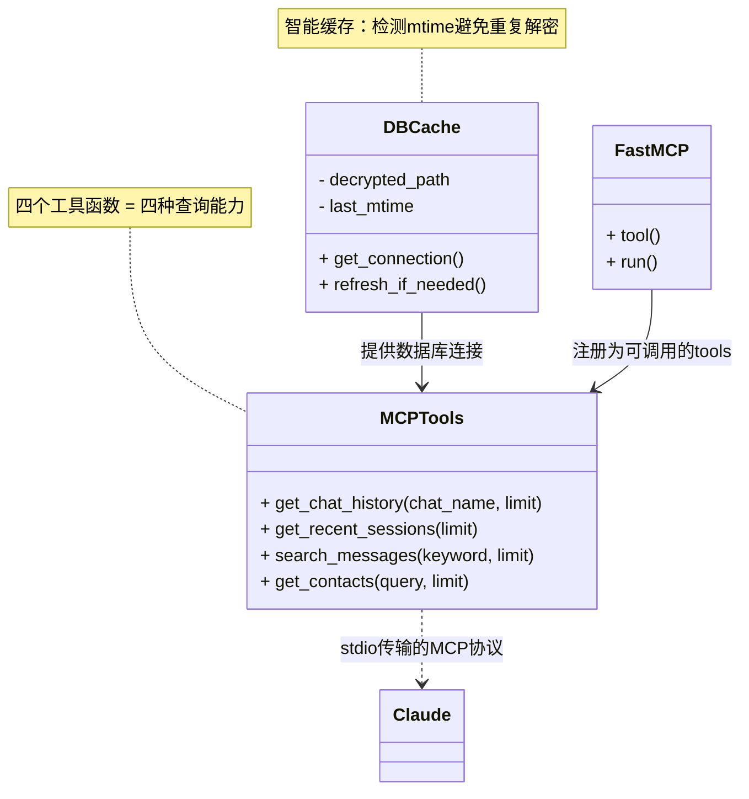
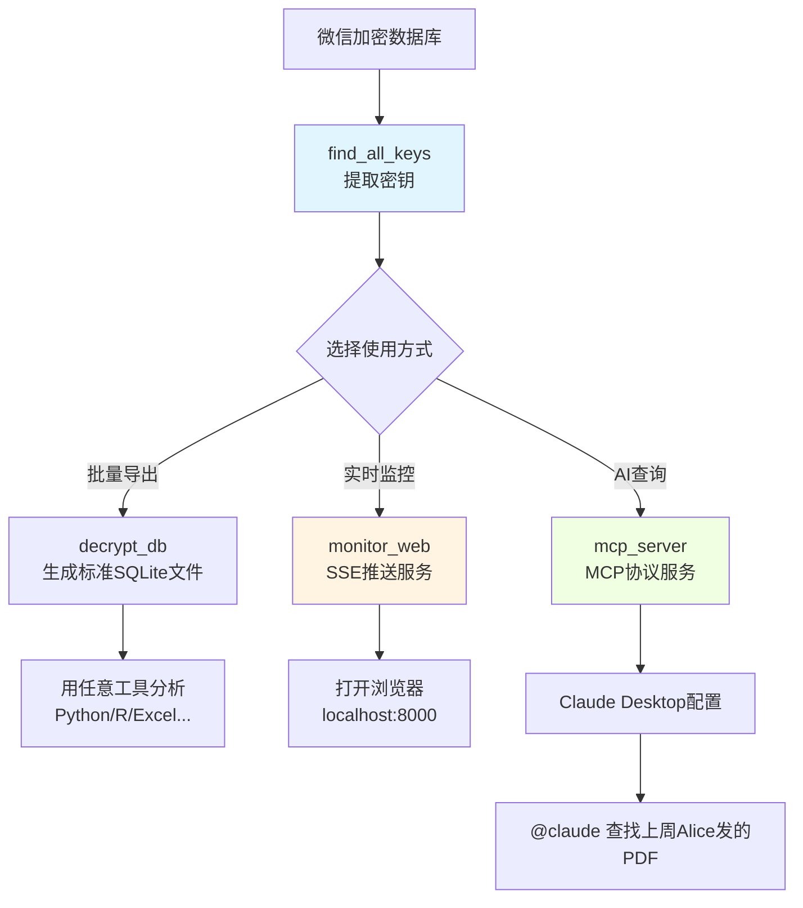

# 第一章：What Is WeChat-Decrypt and Why Does It Exist?

## 你的微信聊天记录，被锁在保险箱里

想象一下这个场景：你每天在微信里收发成百上千条消息——工作沟通、家庭群聊、朋友八卦。这些记录明明存在你的电脑硬盘上，却像被锁进了一个**看不见的保险箱**。你能看到微信App里的内容，但直接打开数据库文件？全是乱码。

这就是微信的本地存储机制：**AES-256加密的数据库**。你的聊天记录以加密形式保存在 `.db` 文件中，没有密钥就无法读取。

**为什么微信要这么做？** 保护隐私当然是好事。但对于**数据的主人——你自己**，这也造成了困扰：
- 想批量导出聊天记录做备份？困难
- 想用AI分析自己的聊天模式？没门
- 想在浏览器里实时监控新消息？更不可能

这就是 `wechat-decrypt` 存在的理由：**帮数据合法所有者重新获得访问权**。

---

## 开箱工具三件套：核心架构

`wechat-decrypt` 不是单一工具，而是**三个模块组成的流水线**。想象你要从保险箱里取东西，需要三步：

| 步骤 | 现实类比 | 对应模块 |
|:---|:---|:---|
| 1. 找到钥匙 | 开锁匠从保安室"借"钥匙 | `find_all_keys` |
| 2. 打开箱子 | 用钥匙解密，取出内容 | `decrypt_db`（核心逻辑）|
| 3. 使用内容 | 实时展示 / AI查询 | `monitor_web` + `mcp_server` |

### 数据流向解读

这张图展示了完整的"从加密到可用"之旅：

1. **左上角**：微信进程内存中缓存着加密密钥（WCDB的设计特性）
2. **左中**：`find_all_keys` 扮演"密钥猎人"，把密钥提取成JSON文件
3. **中间**：解密引擎用AES-256-CBC算法，将乱码还原成标准SQLite数据库
4. **右上分支**：`monitor_web` 持续监控变化，通过SSE推送到浏览器——就像股票行情软件实时刷新
5. **右下分支**：`mcp_server` 把数据库包装成AI工具，让Claude能听懂"帮我找上周三Alice发的文件"

---

## 关键设计决策：为什么这样设计？

理解一个项目，不仅要知道它**做了什么**，更要理解**为什么这样做**。这里有三个核心抉择：

### 决策一：从内存"借"钥匙，而非暴力破解

**问题**：256位AES密钥，暴力破解需要多久？答案是：**宇宙热寂之前都算不完**。

微信使用的SQLCipher标准配置是256,000次PBKDF2迭代派生密钥。这就像保险箱的密码锁有100万个档位，而且每试一次要等1秒钟——理论上安全，实际上也防住了合法用户。

**解决方案**：不破解，**借用**。

WCDB（微信的数据库引擎）为了性能，会在内存中缓存已经算好的派生密钥。`find_all_keys` 就像一个熟悉安保系统的开锁匠——它不撬锁，而是通过Windows API读取微信进程的内存空间，用正则表达式 `x'([0-9a-fA-F]{64,192})'` 定位密钥格式，再用HMAC验证真伪。

**权衡**：
- ✅ 秒级完成，无需密码
- ❌ 需要管理员权限，微信必须正在运行

这就像React的`useEffect`依赖数组——你利用系统已有的状态，而不是重新计算。

---

### 决策二：全量解密 + 轮询，而非增量更新

**问题**：如何知道数据库有新消息？

直觉可能是"监听文件变化"或"只读新增部分"。但微信的数据库用了**WAL（Write-Ahead Logging）机制**——这是一个环形缓冲区，新数据覆盖旧位置，文件大小永远固定为4MB。

**解决方案**：简单可靠的"笨办法"。

`monitor_web` 每30毫秒检查一次文件的`mtime`（修改时间）。有变化？那就**完整解密整个数据库**，对比前后状态找出差异，推送新消息。

**为什么全量解密反而更快？**
- 现代CPU有AES-NI指令集，每秒能解密数百MB
- 微信的会话数据库通常只有几MB到几十MB
- 全量实现简单，不会遗漏任何边界情况

这就像Express.js的路由处理——每个请求独立处理，不维护复杂状态，代码清晰可预测。

---

### 决策三：SSE而非WebSocket，MCP而非自定义API

**实时监控用SSE**：消息推送是单向的（服务器→客户端），Server-Sent Events比WebSocket轻量得多。不需要握手协议，浏览器原生支持自动重连，代码量少一半。

**AI集成用MCP**：Model Context Protocol是Anthropic推动的标准协议。`mcp_server` 暴露的是标准工具函数（`get_chat_history`、`search_messages`等），Claude可以像调用计算器一样调用你的微信数据。

这里的`DBCache`设计特别巧妙——它缓存解密后的数据库，但用`mtime`检测原文件是否变化。没变？直接用缓存。变了？自动刷新。这就像React的`useMemo`，但用于文件系统。

---

## 三个模块，三种使用场景

| 你想做什么 | 需要的模块 | 类比 |
|:---|:---|:---|
| 一次性导出所有聊天记录 | `find_all_keys` + `decrypt_db` | 用钥匙打开保险箱，复印内容 |
| 在浏览器里实时看新消息 | 上述 + `monitor_web` | 给保险箱装个透明窗口 |
| 让AI帮你搜索"上周谁提到了项目 deadline" | 上述 + `mcp_server` | 给保险箱配个智能秘书 |

---

## 本章小结

`wechat-decrypt` 解决的是一个**所有权悖论**：数据存在你的硬盘上，你却无法直接访问。它的解决方案是三层流水线：

1. **`find_all_keys`** —— 密钥猎人，从微信内存中提取加密密钥
2. **解密引擎** —— 用AES-256-CBC将乱码还原为标准数据库
3. **`monitor_web` + `mcp_server`** —— 两种消费方式，实时推送或AI查询

关键的设计智慧在于**利用系统已有状态**（内存中的缓存密钥）和**接受合理的简单性**（全量解密+轮询），而非追求理论最优但工程复杂的方案。

下一章，我们将深入最神秘的部分：**`find_all_keys` 如何从数十GB的进程内存中，精准定位那32字节的密钥？**