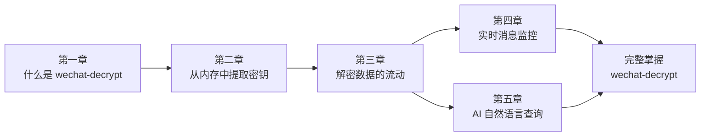

# wechat-decrypt 入门指南

欢迎来到 **wechat-decrypt** 的世界！如果你曾经好奇如何安全地访问自己的微信聊天记录、想要构建基于聊天数据的自动化工具，或者对逆向工程与数据解密技术感兴趣，这份指南就是为你准备的。无需深厚的密码学背景——我们会从最基础的概念开始，逐步带你理解整个系统的工作原理。

通过本指南，你将学会如何从运行中的微信进程提取加密密钥、理解解密后的数据如何在系统中流转、搭建实时消息监控服务，以及如何让 AI 用自然语言查询你的微信数据。无论你是开发者、隐私研究者，还是单纯的技术爱好者，完成这五章后，你都能独立部署和扩展这个强大的工具链。

---

## 章节导航

### [第一章：什么是 wechat-decrypt，它为何存在？](guide-beginners-guide-what-and-why.md)
了解核心问题所在——微信数据库的加密机制，以及「密钥提取 + 实时监控 + AI 查询」三大模块如何协同解决这一难题。

### [第二章：如何从内存中窃取密钥](guide-beginners-guide-finding-keys.md)
学习绕过缓慢 PBKDF2 计算的内存扫描技术，直接从运行中的微信进程里提取缓存的加密密钥。

### [第三章：解密数据如何在系统中流转](guide-beginners-guide-data-flow.md)
追踪从加密数据库 → 解密缓存 → 可用 API 的完整旅程，理解实时监控与 MCP 查询接口如何共享同一套解密基础设施。

### [第四章：用 monitor_web 构建实时聊天流](guide-beginners-guide-real-time-monitoring.md)
深入「解密-监控-推送」循环：WAL 文件的处理机制、变更检测原理，以及 SSE 如何向浏览器实时投递更新。

### [第五章：通过 mcp_server 用自然语言查询微信数据](guide-beginners-guide-ai-integration.md)
探索 DBCache 优化策略，以及 FastMCP 如何将微信数据封装为 Claude AI 可调用的工具，实现对话式查询。