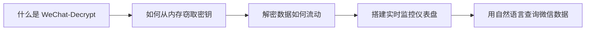

# WeChat-Decrypt 入门指南

欢迎来到 **WeChat-Decrypt** 的完整学习之旅。本指南专为对微信数据解密、实时消息监控和 AI 集成感兴趣的开发者设计——无论你是想理解加密数据库的工作原理，还是希望构建自己的微信数据分析工具，这里都有你需要的知识。

通过本指南，你将掌握从内存中提取加密密钥的技术、理解解密数据的完整流转路径、搭建实时消息监控仪表盘，以及使用自然语言与微信数据进行交互。无需深厚的密码学背景，我们会一步步带你深入这个 fascinating 的系统架构。

---

## 章节导航

### [第一章：什么是 WeChat-Decrypt，它为何存在？](guide-beginners-guide-what-and-why.md)
了解核心问题（微信加密数据库）以及三模块架构如何解决它：密钥提取、实时监控和 AI 驱动查询。

### [第二章：如何从内存中窃取密钥](guide-beginners-guide-finding-keys.md)
学习绕过缓慢 PBKDF2 的内存扫描技术，直接从运行中的微信进程提取缓存的加密密钥。

### [第三章：解密数据如何在系统中流动](guide-beginners-guide-data-flow.md)
追踪从加密数据库 → 解密缓存 → Web 界面和 AI 工具的完整旅程，理解模块间如何通过文件和共享状态通信。

### [第四章：用 Monitor_Web 搭建实时仪表盘](guide-beginners-guide-real-time-monitoring.md)
深入"解密-监控-推送"循环：SessionMonitor 如何通过 WAL 轮询检测新消息，并通过 Server-Sent Events 流式传输到浏览器。

### [第五章：通过 MCP 用自然语言查询微信](guide-beginners-guide-ai-integration.md)
探索 DBCache 如何实现快速重复查询，以及 FastMCP 如何将微信数据暴露为工具，让 Claude AI 以编程方式搜索对话。