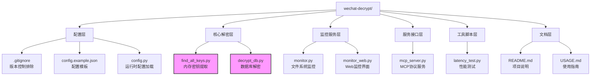
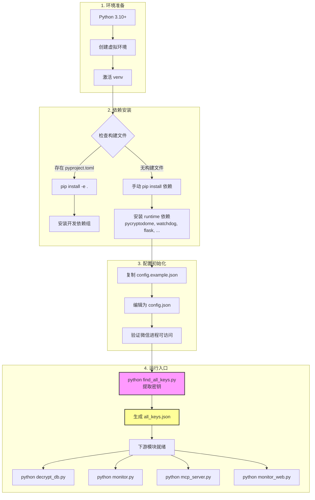
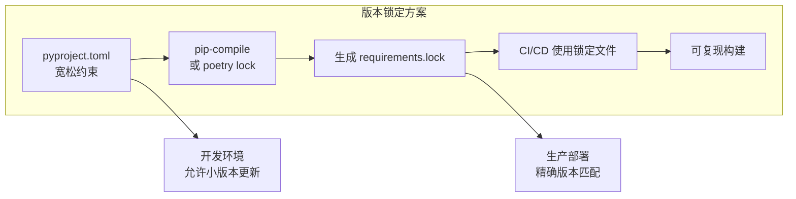
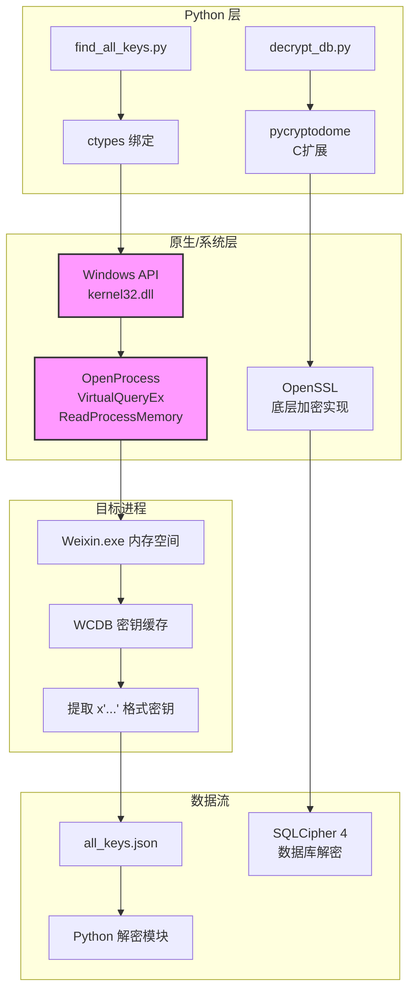
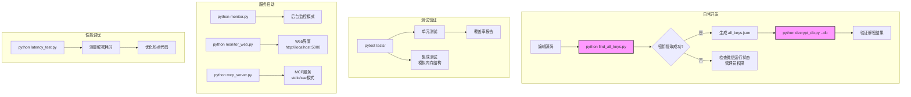
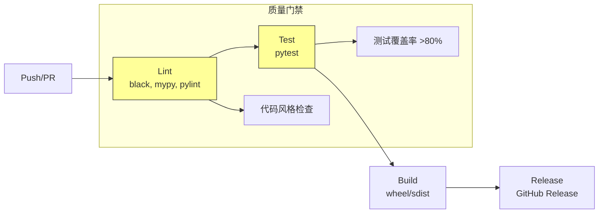
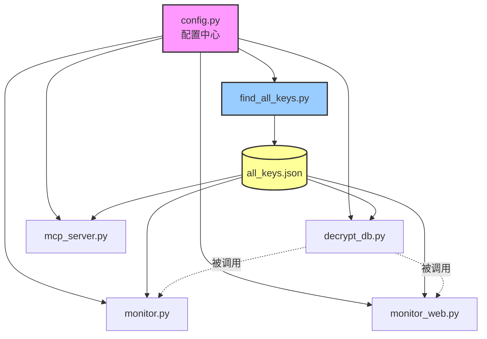

# wechat-decrypt 构建与代码组织分析

> 目标读者：希望理解项目构建方式、源码树结构及依赖管理的开发者

---

## 1. 项目目录结构

本项目采用**扁平化脚本结构**，所有核心模块直接置于根目录，便于独立执行和快速开发。



### 目录职责说明

| 层级 | 文件/目录 | 职责 |
|:---|:---|:---|
| **配置层** | `config.py` + `config.example.json` | 集中管理路径、密钥文件位置等运行时配置 |
| **核心解密层** | `find_all_keys.py`, `decrypt_db.py` | 密钥提取与数据库解密的核心能力 |
| **监控服务层** | `monitor.py`, `monitor_web.py` | 实时监听微信数据库变化并自动解密 |
| **服务接口层** | `mcp_server.py` | 对外提供标准化服务接口（MCP协议） |
| **工具脚本层** | `latency_test.py` | 性能基准测试 |

> **设计特点**：无嵌套包结构，每个 `.py` 文件均为可独立执行的入口点，适合工具型项目。

---

## 2. 构建 / 编译流水线

本项目为**纯 Python 解释型项目**，无需传统编译步骤。其"构建"流程实质是**环境准备 → 依赖安装 → 入口配置**的过程。



### 关键构建产物

| 产物 | 生成方式 | 用途 |
|:---|:---|:---|
| `all_keys.json` | `find_all_keys.py` 运行时生成 | 下游所有模块的必需输入 |
| `config.json` | 开发者手动配置 | 运行时参数（路径、端口等） |
| 解密后的 `.db` 文件 | `decrypt_db.py` / `monitor.py` | 最终可用数据 |

---

## 3. 依赖管理

### 3.1 依赖声明现状

**当前状态**：项目未配置标准 Python 构建文件（无 `pyproject.toml` / `setup.py` / `requirements.txt`），依赖处于**隐式管理**状态。

```mermaid
graph TD
    subgraph CURRENT["当前状态：隐式依赖"]
        A[源码 import 语句] --> B[人工识别依赖]
        B --> C[手动 pip install]
        C --> D[本地环境生效]
    end

    subgraph RECOMMENDED["推荐改进：显式管理"]
        E[创建 pyproject.toml] --> F[声明依赖组]
        F --> G1[prod: pycryptodome,<br/>watchdog, flask, waitress]
        F --> G2[dev: pytest, black,<br/>mypy, pylint]
        F --> G3[test: pytest-cov,<br/>pytest-asyncio]
        G1 --> H[pip install -e ".[dev,test]"]
    end

    style CURRENT fill:#fee,stroke:#933
    style RECOMMENDED fill:#efe,stroke:#393
```

### 3.2 推断的运行时依赖

通过分析源码 `import` 语句，识别出以下依赖：

| 模块 | 依赖包 | 用途 |
|:---|:---|:---|
| `find_all_keys.py` | `ctypes` (内置), `re` (内置) | Windows API 调用、内存扫描 |
| `decrypt_db.py` | `pycryptodome` | SQLCipher 4 解密 (PBKDF2, AES-256-CBC, HMAC-SHA512) |
| `monitor.py` | `watchdog` | 文件系统事件监控 |
| `monitor_web.py` | `flask`, `waitress` | Web 服务与 WSGI 服务器 |
| `mcp_server.py` | `asyncio` (内置), `json` (内置) | MCP 协议实现 |
| `latency_test.py` | `time`, `statistics` (内置) | 性能测量 |

### 3.3 推荐的 pyproject.toml 配置

```toml
[project]
name = "wechat-decrypt"
version = "0.1.0"
requires-python = ">=3.10"
dependencies = [
    "pycryptodome>=3.19.0",
    "watchdog>=3.0.0",
    "flask>=2.3.0",
    "waitress>=2.1.0",
]

[project.optional-dependencies]
dev = [
    "pytest>=7.4.0",
    "black>=23.0.0",
    "mypy>=1.5.0",
    "pylint>=2.17.0",
]
test = [
    "pytest-cov>=4.1.0",
    "pytest-asyncio>=0.21.0",
]

[project.scripts]
wechat-find-keys = "find_all_keys:main"
wechat-decrypt = "decrypt_db:main"
wechat-monitor = "monitor:main"
wechat-mcp-server = "mcp_server:main"

[tool.setuptools]
py-modules = [
    "config",
    "find_all_keys",
    "decrypt_db",
    "monitor",
    "monitor_web",
    "mcp_server",
    "latency_test",
]
```

### 3.4 版本锁定策略



---

## 4. 多语言协作

本项目以 **Python 为主语言**，但涉及关键的**跨语言交互场景**：



### 4.1 Python ↔ Windows API（核心机制）

`find_all_keys` 模块通过 `ctypes` 直接调用 Windows 内核 API，这是项目的核心技术点：

| Python 组件 | 对应 Windows API | 功能 |
|:---|:---|:---|
| `MBI` 结构体 | `MEMORY_BASIC_INFORMATION` | 内存区域元数据 |
| `enum_regions()` | `VirtualQueryEx` | 枚举进程虚拟地址空间 |
| `read_mem()` | `ReadProcessMemory` | 读取目标进程内存内容 |
| `get_pid()` | `tasklist` + `subprocess` | 定位微信进程 |

### 4.2 Python ↔ C 加密库

`pycryptodome` 作为 C 扩展模块，提供高性能密码学操作：

- `Crypto.Protocol.KDF.PBKDF2` — 密钥派生
- `Crypto.Cipher.AES` — AES-256-CBC 解密
- `Crypto.Hash.HMAC` — HMAC-SHA512 验证

---

## 5. 开发工作流

### 5.1 环境初始化命令

```bash
# 1. 克隆仓库
git clone <repo-url>
cd wechat-decrypt

# 2. 创建虚拟环境（推荐）
python -m venv .venv

# Windows
.venv\Scripts\activate

# macOS/Linux
source .venv/bin/activate

# 3. 安装依赖（当前：手动模式）
pip install pycryptodome watchdog flask waitress

# 3'. 若已配置 pyproject.toml（推荐未来采用）
pip install -e ".[dev,test]"
```

### 5.2 核心开发命令



### 5.3 常用命令速查

| 场景 | 命令 | 说明 |
|:---|:---|:---|
| **首次密钥提取** | `python find_all_keys.py` | 需管理员权限，微信正在运行 |
| **单次解密** | `python decrypt_db.py --db "C:\...\MicroMsg.db"` | 解密指定数据库 |
| **启动监控** | `python monitor.py` | 后台监听文件变化自动解密 |
| **启动 Web 服务** | `python monitor_web.py` | 浏览器访问监控界面 |
| **启动 MCP 服务** | `python mcp_server.py` | 提供标准化 API 接口 |
| **性能测试** | `python latency_test.py` | 测量各环节耗时 |

### 5.4 调试与故障排查

```bash
# 验证 Python 路径和版本
python -c "import sys; print(sys.executable, sys.version)"

# 检查依赖安装
python -c "import Crypto, watchdog, flask; print('OK')"

# 模块直接运行测试（利用 __main__ 块）
python -m find_all_keys  # 若已配置为包

# 详细日志输出（建议添加 logging 配置）
python find_all_keys.py --verbose  # 需实现参数解析
```

### 5.5 推荐的 CI/CD 流水线



---

## 附录：模块依赖关系图



> **关键洞察**：`find_all_keys.py` 是整个工具链的**前置瓶颈**——所有下游模块均依赖其生成的 `all_keys.json`。该模块的成功执行需要**运行时环境配合**（微信进程+管理员权限），这是构建系统无法预置的，需在部署文档中明确说明。