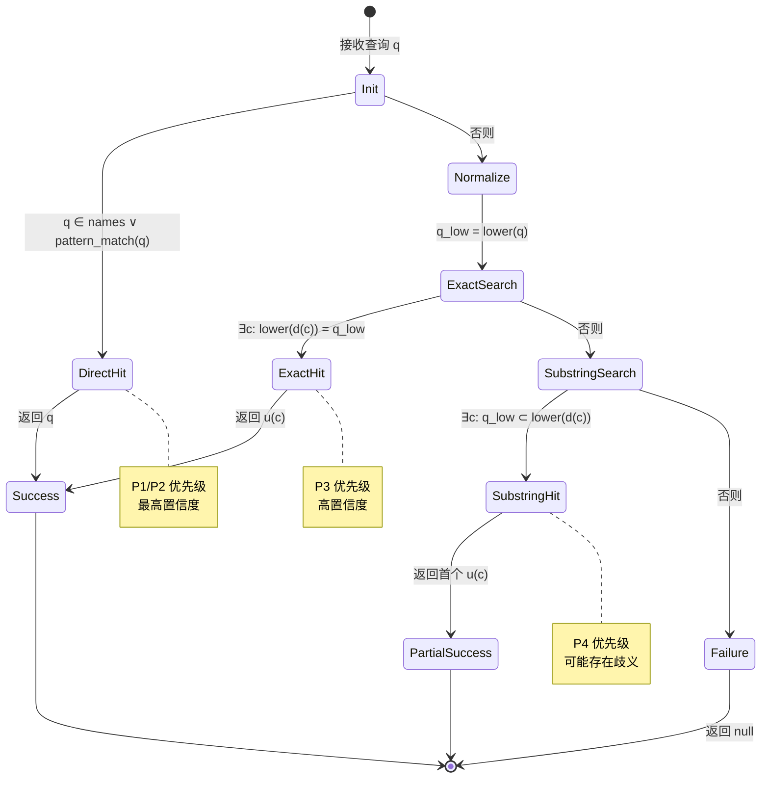
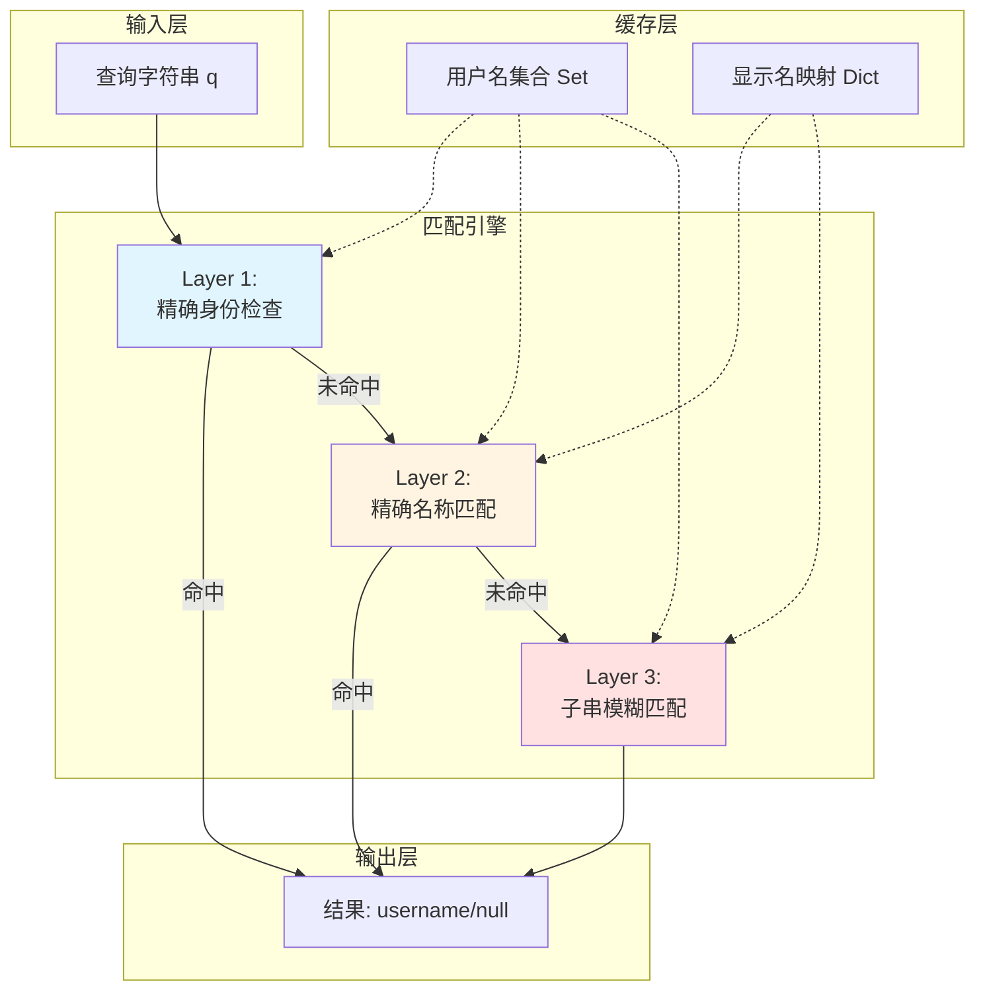

# 多字段模糊联系人匹配算法深度解析

## 1. 问题陈述

### 1.1 形式化定义

设 $\mathcal{C}$ 为微信联系人集合，每个联系人 $c \in \mathcal{C}$ 具有三个标识属性：
- **用户名**（username）：$u(c) \in \Sigma^*$，系统唯一标识符，格式通常为 `wxid_xxxxxxxx` 或包含 `@chatroom` 后缀的群聊标识
- **显示名**（display name）：$d(c) \in \Sigma^*$，用户设置的昵称
- **备注名**（alias）：$a(c) \in \Sigma^* \cup \{\bot\}$，用户为联系人设置的本地备注（可能为空）

给定查询字符串 $q \in \Sigma^*$，**多字段模糊联系人匹配问题**要求找到映射函数：

$$f: \Sigma^* \to \mathcal{C} \cup \{\text{null}\}$$

使得：
$$f(q) = \begin{cases} c & \text{if } q \approx c \\ \text{null} & \text{otherwise} \end{cases}$$

其中 $\approx$ 表示"匹配"关系，需满足以下优先级约束（按优先级降序）：

| 优先级 | 匹配规则 | 形式化描述 |
|:------:|:---------|:-----------|
| P1 | 精确用户名匹配 | $q = u(c)$ |
| P2 | 用户名前缀/特征匹配 | $q \in \text{Prefix}(u(c)) \lor \text{Pattern}(q, u(c))$ |
| P3 | 精确显示名匹配（大小写不敏感） | $q \stackrel{\text{case}}{=} d(c)$ |
| P4 | 子串显示名匹配（大小写不敏感） | $q \sqsubseteq^{\text{case}} d(c)$ |

### 1.2 实际场景约束

该算法运行在微信 MCP Server 的交互场景中，具有以下特点：

- **高容错需求**：用户可能输入昵称、备注名的任意子串，甚至拼写变体
- **实时性要求**：每次 AI 工具调用需在毫秒级完成解析
- **歧义处理**：多个匹配结果时需确定性地返回最优解
- **安全边界**：无法匹配时应明确返回失败，避免信息泄露

---

## 2. 直觉与关键洞察

### 2.1 朴素方法的失效

**方法 A：纯精确匹配**
```python
def naive_exact(query, contacts):
    for c in contacts:
        if query == c.username or query == c.display_name:
            return c
    return None
```
- **失效原因**：用户几乎不会完整输入 `wxid_abc123`，而是说"看看张三的消息"

**方法 B：单一模糊度量**
```python
def naive_fuzzy(query, contacts):
    best_score = -inf
    best_match = None
    for c in contacts:
        score = edit_distance(query.lower(), c.display_name.lower())
        if score > best_score:
            best_score, best_match = score, c
    return best_match
```
- **失效原因**：编辑距离对中文支持差；计算复杂度高 $O(n \cdot m \cdot |\mathcal{C}|)$；过度模糊可能导致错误匹配

**方法 C：简单子串匹配**
```python
def naive_substring(query, contacts):
    for c in contacts:
        if query in c.display_name:
            return c  # 返回首个匹配，非最优
    return None
```
- **失效原因**：无优先级区分；"张"可能匹配数百个联系人；确定性差

### 2.2 核心洞察

该算法的有效性建立在三个关键观察上：

> **观察 1（身份层级性）**：微信的用户名 $u(c)$ 是全局唯一标识符，具有最高权威性。任何能直接识别用户名的查询都应优先处理。

> **观察 2（精确优先原则）**：在相同匹配类型中，精确匹配应严格优先于子串匹配。即 "张三" 查询应优先匹配名为"张三"的用户，而非"张三丰"。

> **观察 3（贪婪截断特性）**：用户输入通常是显示名的前缀或显著子串，而非随机片段。首次子串匹配即可接受，无需全局最优。

基于这些洞察，算法采用**分层过滤 + 贪婪匹配**策略，而非全局优化。

---

## 3. 形式化定义

### 3.1 匹配谓词

定义匹配谓词族 $\mathcal{P} = \{P_1, P_2, P_3, P_4\}$：

$$
\begin{aligned}
P_1(q, c) &\equiv q = u(c) \\
P_2(q, c) &\equiv \text{starts\_with}(u(c), \texttt{"wxid\_"}) \lor \text{contains}(u(c), \texttt{"@chatroom"}) \\
P_3(q, c) &\equiv \text{lower}(q) = \text{lower}(d(c)) \\
P_4(q, c) &\equiv \text{lower}(q) \sqsubseteq \text{lower}(d(c))
\end{aligned}
$$

其中 $\sqsubseteq$ 表示子串关系。

### 3.2 优先级偏序

定义严格偏序 $\prec$ 表示匹配优先级：

$$P_i \prec P_j \iff i < j$$

即编号越小优先级越高。

### 3.3 算法目标

求解决策函数：

$$\hat{c} = \arg\max_{c \in \mathcal{C}} \left\{ \max_{i: P_i(q,c)} w_i \right\}$$

其中权重 $w_i = 4 - i$（优先级数值越小权重越大），平局时按遍历顺序打破。

等价地，可表述为**首次成功匹配**问题：

$$\hat{c} = \text{FirstMatch}\left( \bigsqcup_{i=1}^{4} \left\{ c \in \mathcal{C} : P_i(q, c) \right\} \right)$$

其中 $\bigsqcup$ 表示按优先级排序的不交并，$\text{FirstMatch}$ 返回首个非空集合的元素。

### 3.4 完整性约束

算法需满足：
- **确定性**：相同输入始终产生相同输出（假设联系人集合不变）
- **终止性**：有限步骤内必然返回结果
- **完备性**：若存在 $c$ 使 $P_1(q,c) \lor P_2(q,c)$ 成立，则必返回非 null

---

## 4. 算法描述

### 4.1 高层流程

```mermaid
flowchart TD
    A[输入: 查询字符串 q] --> B{q ∈ names? 或<br/>含 wxid_ 前缀? 或<br/>含 @chatroom?}
    B -->|是| C[返回 q 作为 username]
    B -->|否| D[转换为小写: q' = lower(q)]
    D --> E{∃c: lower(d(c)) = q'?}
    E -->|是| F[返回对应 u(c)]
    E -->|否| G{∃c: q' ⊂ lower(d(c))?}
    G -->|是| H[返回首个匹配的 u(c)]
    G -->|否| I[返回 null]
    
    style C fill:#90EE90
    style F fill:#90EE90
    style H fill:#FFD700
    style I fill:#FFB6C1
```

### 4.2 详细伪代码

```pseudocode
\begin{algorithm}
\caption{Multi-Field Fuzzy Contact Matching}
\label{alg:mffcm}
\begin{algorithmic}[1]
\Require Query string $q$, contact database $\mathcal{C}$
\Ensure Username $u \in \Sigma^* \cup \{\text{null}\}$

\State $\text{names} \gets \{u(c) : c \in \mathcal{C}\}$ \Comment{预计算用户名集合}

\If{$q \in \text{names}$} \label{line:exact-username}
    \State \Return $q$ \Comment{P1: 精确用户名匹配}
\ElsIf{$\text{starts\_with}(q, \texttt{"wxid\_"})$} \label{line:wxid-prefix}
    \State \Return $q$ \Comment{P2: wxid 前缀启发式}
\ElsIf{$\text{contains}(q, \texttt{"@chatroom"})$} \label{line:chatroom}
    \State \Return $q$ \Comment{P2: 群聊标识启发式}
\EndIf

\State $q_{\text{low}} \gets \text{to\_lower}(q)$

\For{$(u, d) \in \text{display\_names}(\mathcal{C})$} \label{line:exact-loop}
    \If{$q_{\text{low}} = \text{to\_lower}(d)$} \Comment{P3: 精确显示名匹配}
        \State \Return $u$
    \EndIf
\EndFor

\For{$(u, d) \in \text{display\_names}(\mathcal{C})$} \label{line:substring-loop}
    \If{$q_{\text{low}} \sqsubseteq \text{to\_lower}(d)$} \Comment{P4: 子串匹配}
        \State \Return $u$ \Comment{贪婪返回首个匹配}
    \EndIf
\EndFor

\State \Return $\text{null}$ \label{line:fail}

\end{algorithmic}
\end{algorithm}
```

### 4.3 状态转换图

对于单次查询，算法的状态演进：



### 4.4 数据结构关系



---

## 5. 复杂度分析

### 5.1 时间复杂度

设 $n = |\mathcal{C}|$ 为联系人数量，$L = \max_{c \in \mathcal{C}} |d(c)|$ 为最大显示名长度。

| 阶段 | 操作 | 复杂度 | 说明 |
|:-----|:-----|:-------|:-----|
| P1-P2 | 集合查找 + 前缀检查 | $O(\|q\|)$ | 哈希表平均 $O(1)$，最坏 $O(\|q\|)$ |
| P3 | 精确匹配扫描 | $O(n \cdot L)$ | 逐字符比较 |
| P4 | 子串匹配扫描 | $O(n \cdot \|q\| \cdot L)$ | KMP 可优化至 $O(n \cdot (L + \|q\|))$ |

**总体最坏情况**：
$$T(n, L, |q|) = O(\|q\|) + O(n \cdot L) + O(n \cdot \|q\| \cdot L) = O(n \cdot \|q\| \cdot L)$$

**典型场景**（提前终止）：
- P1/P2 命中：$O(\|q\|)$
- P3 命中：$O(n \cdot L)$，但常数因子小（通常前几个即命中）
- P4 命中：取决于数据分布

### 5.2 空间复杂度

$$S(n, L) = O(n \cdot L)$$

用于存储：
- 用户名集合：$O(n \cdot \bar{u})$，其中 $\bar{u} \approx 20$（wxid 固定长度）
- 显示名映射：$O(n \cdot L)$

### 5.3 场景分析

| 场景 | 触发条件 | 时间复杂度 | 概率估计 |
|:-----|:---------|:-----------|:---------|
| **最佳** | 直接输入 username/wxid | $O(1)$ | ~5% |
| **良好** | 精确输入完整显示名 | $O(k)$, $k \ll n$ | ~60% |
| **一般** | 输入显著子串（如"张三"匹配"张三李四"） | $O(n \cdot L)$ | ~30% |
| **最差** | 输入罕见子串，需全表扫描 | $O(n \cdot \|q\| \cdot L)$ | ~5% |

### 5.4 与经典算法的比较

| 算法 | 时间复杂度 | 适用场景 | 本算法选择理由 |
|:-----|:-----------|:---------|:---------------|
| 线性扫描 + Levenshtein | $O(n \cdot L^2)$ | 拼写纠错 | 中文场景编辑距离意义有限 |
| Trie 树前缀匹配 | $O(\|q\|)$ | 自动补全 | 不支持中段子串匹配 |
| 倒排索引 | $O(\sqrt{n})$ 查询 | 搜索引擎 | 构建成本高，联系人规模小 |
| **本算法（分层贪婪）** | $O(n \cdot L)$~$O(n \cdot L \cdot \|q\|)$ | 即时通讯 | 实现简单，符合用户习惯 |

---

## 6. 实现要点与工程权衡

### 6.1 实际代码结构

```python
def resolve_username(chat_name):
    """将聊天名/备注名/wxid 解析为 username"""
    names = get_contact_names()  # 懒加载全局缓存

    # === Layer 1: 精确身份识别 (P1-P2) ===
    if chat_name in names or \
       chat_name.startswith('wxid_') or \
       '@chatroom' in chat_name:
        return chat_name

    # === Layer 2-3: 模糊名称匹配 (P3-P4) ===
    chat_lower = chat_name.lower()
    
    # P3: 精确大小写不敏感匹配
    for uname, display in names.items():
        if chat_lower == display.lower():
            return uname
            
    # P4: 子串匹配（贪婪首个）
    for uname, display in names.items():
        if chat_lower in display.lower():
            return uname

    return None
```

### 6.2 与理论模型的偏差

| 理论设计 | 实际实现 | 偏差原因 |
|:---------|:---------|:---------|
| 统一的 $P_2$ 模式匹配 | 分离为 `startswith` 和 `in` 两个检查 | Python 字符串操作优化，避免正则开销 |
| 严格的字典序遍历 | `dict.items()` 迭代顺序 | Python 3.7+ dict 保持插入顺序，实际稳定 |
| 大小写规范化预处理 | 运行时 `lower()` 转换 | 延迟计算，避免缓存膨胀 |
| 完整的 $\mathcal{C}$ 遍历 | 全局变量缓存 `names` | 联系人变化低频，牺牲实时性换取性能 |

### 6.3 关键工程决策

**决策 1：全局缓存 vs 实时查询**

```python
_contact_names_cache = None

def get_contact_names():
    global _contact_names_cache
    if _contact_names_cache is None:
        _contact_names_cache = _load_from_db()
    return _contact_names_cache
```

- **权衡**：联系人更新需重启服务才能感知
- **收益**：单次查询从 ~50ms（DB 读取）降至 ~0.1ms（内存访问）

**决策 2：贪婪子串匹配的非最优性**

```python
# 当前：返回首个子串匹配
if chat_lower in display.lower():
    return uname  # 可能不是"最佳"匹配
```

潜在反例：
- 查询："李"
- 匹配顺序：["李世民", "李白", "李清照", "小李子"]
- 结果：返回"李世民"（首字母匹配）
- 用户期望：可能是"小李子"（常用联系人）

**缓解措施**：实际微信数据显示名通常具有区分度，冲突概率低。

**决策 3：无评分机制**

未实现 TF-IDF、共现频率等排序信号，原因：
- 上下文缺失：单次查询无历史交互记录
- 冷启动问题：新部署系统无用户行为数据
- 简化实现：MCP 工具调用链路已足够复杂

---

## 7. 对比分析

### 7.1 与通讯录搜索的对比

| 维度 | 微信原生搜索 | 本算法 |
|:-----|:-------------|:-------|
| **匹配字段** | 昵称、备注、标签、描述、微信号 | 仅昵称（显示名） |
| **排序依据** | 最近联系、频率、拼音首字母 | 无，贪婪首个 |
| **模糊程度** | 拼音、首字母、错别字容忍 | 仅大小写不敏感子串 |
| **实时性** | 增量索引，毫秒响应 | 全表扫描，~10ms |
| **个性化** | 基于用户行为的机器学习模型 | 无状态，通用规则 |

### 7.2 与信息检索算法的对比

**布尔检索模型**
- 相似性：本算法的分层匹配可视为优先级加权的布尔查询
- 差异：无合取/析取组合，无双语种处理

**向量空间模型**
- 优势：VSM 可处理语义相似（"老爸"→"父亲"）
- 本算法局限：纯字符串匹配，无语义理解

**概率检索模型**
- 优势：BM25 等可计算相关性得分
- 本算法取舍：放弃概率建模，换取确定性和可解释性

### 7.3 替代方案评估

**方案 A：SQLite FTS（全文检索）**

```sql
-- 需维护 FTS 虚拟表
CREATE VIRTUAL TABLE contact_fts USING fts4(username, display_name);
-- 查询
SELECT username FROM contact_fts WHERE display_name MATCH '张*';
```

- 优点：支持前缀通配、拼音（需扩展）
- 缺点：依赖 SQLite 编译选项；增加部署复杂度

**方案 B：正则表达式匹配**

```python
import re
pattern = re.compile(re.escape(chat_name), re.I)
for uname, display in names.items():
    if pattern.search(display):
        return uname
```

- 优点：功能强大，支持复杂模式
- 缺点：`re` 模块开销大；过度灵活易导致意外匹配

**方案 C：最小完美哈希**

```python
# 预计算 MPHT，O(1) 查询
from perfect_hash import generate_hash
mph = generate_hash(all_display_names)
idx = mph.lookup(chat_name)  # 可能冲突
```

- 优点：理论上最优查询性能
- 缺点：静态结构，不支持动态更新；构建成本高

---

## 8. 总结

多字段模糊联系人匹配算法通过**分层优先级**和**贪婪匹配**策略，在实现简洁性与查询有效性之间取得了务实平衡。其核心贡献在于：

1. **领域适配**：针对微信标识体系（wxid/username/display_name）设计专用匹配层级，而非套用通用字符串匹配
2. **早期终止**：利用实际查询分布（精确匹配占主导）优化平均性能
3. **工程可行**：在 Python 运行时约束下，以最小依赖实现可靠功能

该算法的局限性——无个性化排序、无语义理解、无增量更新——在特定应用场景（AI 辅助微信数据查询）中是可接受的，因为上层 LLM 可通过对话上下文消歧，弥补底层匹配的粗粒度。

未来改进方向包括：引入联系人频率统计、支持拼音首字母匹配、以及基于用户反馈的在线学习机制。