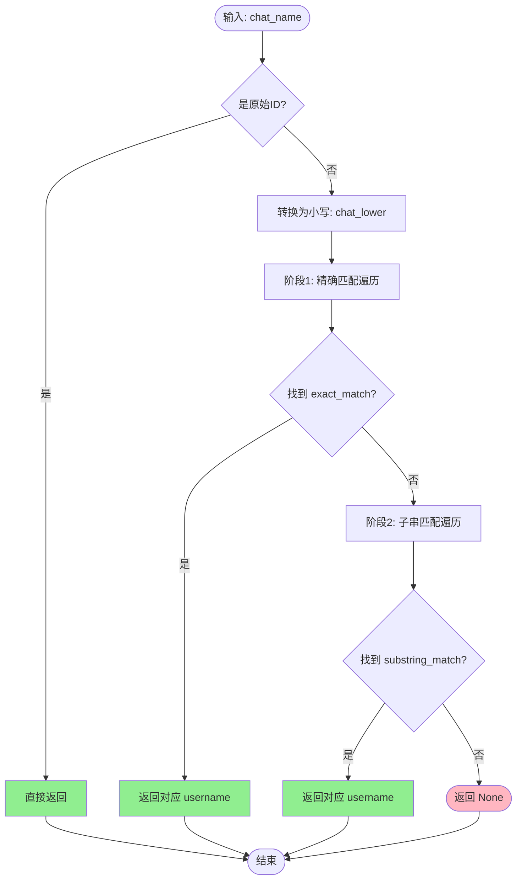
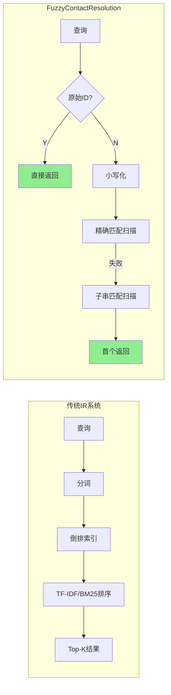

# Fuzzy Contact Resolution 算法深度解析

## 1. 问题陈述

在即时通讯系统的数据查询接口中，用户通常使用**人类可读的显示名称**（如备注名、群聊昵称）来指代会话对象，而底层数据库则使用**机器标识符**（如 `wxid_xxxxxxxx` 或 `xxxxxxxx@chatroom`）作为主键。这种语义鸿沟导致了一个经典的**实体消解（Entity Resolution）**问题：

> **定义 1.1（模糊联系人解析问题）**
> 给定一个查询字符串 $q \in \Sigma^*$（其中 $\Sigma$ 为字符集），以及一个映射集合 $M = \{(u_i, d_i)\}_{i=1}^{n}$，其中 $u_i \in \mathcal{U}$ 为唯一标识符（username），$d_i \in \mathcal{D}$ 为显示名称（display name）。寻找一个函数 $f: \Sigma^* \to \mathcal{U} \cup \{\bot\}$，使得：
> - 若 $q = u_j$ 对某个 $j$ 成立，则 $f(q) = u_j$（精确匹配）
> - 若 $q \approx d_j$（某种相似度度量），则 $f(q) = u_j$（模糊匹配）
> - 否则 $f(q) = \bot$（未找到）

该问题的核心挑战在于：
- **多态输入**：同一联系人可能有多种引用方式（wxid、备注名、群昵称、部分匹配）
- **实时性要求**：联系人列表可能动态变化，但缓存策略需要权衡性能与一致性
- **容错需求**：用户输入可能存在大小写差异、拼写变体或部分记忆

---

## 2. 直觉：朴素方法的失效

### 2.1 朴素方案一：精确字典查找

```python
def naive_exact_lookup(query, names):
    return names.get(query)  # O(1) 哈希查找
```

**失效场景**：用户输入 `"张三"`，但数据库存储的是 `{"wxid_abc123": "张三(工作)"}`。

### 2.2 朴素方案二：全局模糊匹配

```python
def naive_fuzzy_lookup(query, names):
    best_score, best_match = 0, None
    for uid, display in names.items():
        score = similarity(query, display)  # Levenshtein, Jaccard, etc.
        if score > best_score:
            best_score, best_match = score, uid
    return best_match if best_score > threshold else None
```

**失效场景**：
- 计算开销：$O(n \cdot |q| \cdot \bar{d})$，对于大规模联系人列表（$n > 5000$）不可接受
- 阈值敏感：编辑距离阈值难以统一设定，"Alice" vs "Alicia" 的边界情况

### 2.3 关键洞察

实际观察微信联系人数据分布，发现以下**领域特性**：

| 特性 | 说明 | 算法启示 |
|:---|:---|:---|
| **前缀规律性** | wxid 以 `wxid_` 开头，群聊以 `@chatroom` 结尾 | 可通过子串检测快速识别原始 ID |
| **精确包含高概率** | 用户倾向于输入显示名的子串（如输入"工作群"匹配"XX工作群"） | 优先尝试子串匹配而非编辑距离 |
| **大小写不敏感** | 中文环境无大小写，英文备注通常不区分大小写 | 统一小写化处理 |
| **稀疏更新** | 联系人列表变更频率远低于查询频率 | 全局缓存 + 惰性加载可行 |

基于以上洞察，`resolve_username` 采用了一种**分层级联（Cascaded Filtering）**策略，而非单一复杂相似度度量。

---

## 3. 形式化定义

### 3.1 符号系统

设：
- $\mathcal{U}$：用户名空间，$\mathcal{U} = \mathcal{W} \cup \mathcal{C}$，其中
  - $\mathcal{W} = \{w \in \Sigma^* : w \text{ 以 } \texttt{wxid\_} \text{ 为前缀}\}$
  - $\mathcal{C} = \{c \in \Sigma^* : c \text{ 包含 } \texttt{@chatroom}\}$
- $\mathcal{D}$：显示名称空间，$\mathcal{D} \subseteq \Sigma^*$
- $M \subseteq \mathcal{U} \times \mathcal{D}$：有效联系人对的有限集合

定义谓词：
$$
\begin{aligned}
\texttt{is\_raw\_id}(q) &\triangleq (q \in \mathcal{W}) \lor (q \in \mathcal{C}) \lor (\exists u \in \pi_1(M): q = u) \\
\texttt{exact\_match}(q, d) &\triangleq q^\downarrow = d^\downarrow \\
\texttt{substring\_match}(q, d) &\triangleq q^\downarrow \sqsubseteq d^\downarrow
\end{aligned}
$$

其中 $s^\downarrow$ 表示字符串 $s$ 的小写形式，$\sqsubseteq$ 表示子串关系。

### 3.2 目标函数

求解 $f(q; M)$：

$$
f(q; M) = 
\begin{cases}
q & \text{if } \texttt{is\_raw\_id}(q) \\
u_j & \text{if } \exists j: \texttt{exact\_match}(q, d_j) \\
u_k & \text{if } \exists k: \texttt{substring\_match}(q, d_k) \land \nexists j: \texttt{exact\_match}(q, d_j) \\
\bot & \text{otherwise}
\end{cases}
$$

**优先级规则**：原始 ID 判定 > 精确匹配 > 子串匹配 > 失败。

### 3.3 非确定性处理

当多个 $k$ 满足子串匹配时，当前实现采用**首次命中（First-Match）**策略，即按 $M$ 的遍历顺序返回第一个匹配项。这隐含假设了 Python 字典的迭代顺序（插入序）具有某种语义相关性（如最近添加的联系人优先）。

---

## 4. 算法描述

### 4.1 执行流程图



### 4.2 伪代码

```pseudocode
\begin{algorithm}
\caption{Fuzzy Contact Resolution}
\begin{algorithmic}[1]
\Require Query string $q$, contact map $M: \mathcal{U} \to \mathcal{D}$
\Ensure Resolved username $u \in \mathcal{U} \cup \{\bot\}$

\Function{ResolveUsername}{$q, M$}
    \State $\mathcal{U}_{keys} \gets \text{keys}(M)$
    
    \Comment{Level 0: Raw identifier detection}
    \If{$q \in \mathcal{U}_{keys} \lor \text{starts\_with}(q, \texttt{"wxid_"}) \lor \text{contains}(q, \texttt{"@chatroom"})$}
        \State \Return $q$ \Comment{Identity function for raw IDs}
    \EndIf
    
    \State $q_{low} \gets \text{to\_lower}(q)$
    
    \Comment{Level 1: Exact case-insensitive match}
    \For{$(u, d) \in M$}
        \If{$q_{low} = \text{to\_lower}(d)$}
            \State \Return $u$
        \EndIf
    \EndFor
    
    \Comment{Level 2: Substring containment match}
    \For{$(u, d) \in M$}
        \If{$q_{low} \sqsubseteq \text{to\_lower}(d)$}
            \State \Return $u$
        \EndIf
    \EndFor
    
    \State \Return $\bot$ \Comment{Resolution failure}
\EndFunction
\end{algorithmic}
\end{algorithm}
```

### 4.3 实际实现

```python
def resolve_username(chat_name):
    """将聊天名/备注名/wxid 解析为 username"""
    names = get_contact_names()  # 获取全局缓存的联系人映射

    # Level 0: 直接是 username（精确成员测试或模式匹配）
    if (chat_name in names or 
        chat_name.startswith('wxid_') or 
        '@chatroom' in chat_name):
        return chat_name

    # 预处理：统一小写化
    chat_lower = chat_name.lower()
    
    # Level 1: 精确包含（大小写不敏感）
    for uname, display in names.items():
        if chat_lower == display.lower():
            return uname
            
    # Level 2: 子串包含（大小写不敏感）
    for uname, display in names.items():
        if chat_lower in display.lower():
            return uname

    return None  # 解析失败
```

---

## 5. 复杂度分析

### 5.1 时间复杂度

设 $n = |M|$ 为联系人数量，$L_q = |q|$，$\bar{L}_d$ 为平均显示名长度。

| 层级 | 操作 | 最坏情况 | 最好情况 | 平均情况（假设均匀分布） |
|:---|:---|:---|:---|:---|
| L0 | 哈希查找 / 前缀检测 | $O(L_q)$ | $O(1)$ | $O(1)$ |
| L1 | 全表扫描 + 字符串比较 | $O(n \cdot \bar{L}_d)$ | $O(\bar{L}_d)$ | $O(n/2 \cdot \bar{L}_d)$ |
| L2 | 全表扫描 + 子串搜索 | $O(n \cdot L_q \cdot \bar{L}_d)$ | $O(n \cdot \bar{L}_d)$ | $O(n \cdot L_q \cdot \bar{L}_d / 2)$ |

**综合复杂度**：
$$
T(n, L_q, \bar{L}_d) = O\left(\min\left(1, n \cdot L_q \cdot \bar{L}_d\right)\right)
$$

实际上，由于 L0 和 L1 的快速路径，典型调用为 $O(1)$ 或 $O(\bar{L}_d)$。

### 5.2 空间复杂度

- **辅助空间**：$O(1)$（仅存储小写化后的查询字符串）
- **依赖空间**：$O(n \cdot \bar{L}_d)$ 用于全局联系人缓存（`get_contact_names()` 返回的字典）

### 5.3 缓存影响

`get_contact_names()` 的实现采用**全局变量缓存 + 惰性初始化**：

```python
_contact_names_cache = None

def get_contact_names():
    global _contact_names_cache
    if _contact_names_cache is None:
        _contact_names_cache = _load_from_db()  # 一次性加载
    return _contact_names_cache
```

这使得多次调用的**摊还时间复杂度**降为：
$$
T_{amortized}(k \text{ calls}) = O(n \cdot \bar{L}_d + k \cdot \mathbb{E}[\text{search cost}])
$$

---

## 6. 工程实现要点

### 6.1 与理论的偏差

| 理论假设 | 实际妥协 | 理由 |
|:---|:---|:---|
| 完整的 $M$ 已知且静态 | 全局缓存可能过期 | 联系人变更频率低，重启服务即可刷新 |
| 子串匹配的确定性选择 | 首次命中（依赖字典序） | 简化实现，实际效果可接受 |
| 统一的相似度度量 | 分层精确/子串匹配 | 领域特定优化，避免复杂参数调优 |
| 大小写规范化 | 仅对查询和部分匹配目标小写化 | 减少内存拷贝，username 保持原样 |

### 6.2 关键设计决策

**决策 1：为何不使用编辑距离？**

```
权衡分析：
- 收益：可处理拼写错误（"张山" → "张三"）
- 成本：O(|q|·|d|) 的动态规划，n较大时不可接受
- 结论：微信场景中用户通常复制粘贴或准确记忆子串，
       拼写错误罕见，故放弃编辑距离
```

**决策 2：两级遍历而非预建索引**

```
备选方案：倒排索引（inverted index）
- 将每个 display name 拆分为 token，建立 term → usernames 映射
- 查询时取交集

实际选择：线性扫描
- 原因：n 通常 < 10000，线性扫描常数因子低
- 额外收益：无需维护索引，简化并发控制
- 临界点：当 n > 50000 时建议改用 Trie 或倒排索引
```

**决策 3：大小写处理的位置**

```python
# 方案 A：全局预计算（空间换时间）
# names_lower = {u: d.lower() for u, d in names.items()}

# 方案 B：查询时计算（时间换空间）— 实际采用
for uname, display in names.items():
    if chat_lower == display.lower():  # 重复计算
```

选择方案 B 的原因：
- 联系人查询非热点路径（受限于数据库解密速度）
- 节省约 50% 的内存占用（无需存储双份字符串）

### 6.3 潜在陷阱

| 问题 | 场景 | 缓解措施 |
|:---|:---|:---|
| **过度匹配** | 查询 `"a"` 匹配所有含 `"a"` 的名称 | 业务层限制最小查询长度（如 ≥2 字符） |
| **歧义消解** | `"工作群"` 匹配多个群聊 | 返回首个匹配，依赖用户输入更精确 |
| **缓存不一致** | 新增联系人后无法立即查询 | 文档注明需重启服务；可考虑 TTL 刷新 |
| **Unicode 规范化** | `"café"` vs `"cafe\u0301"` | 当前未处理，依赖微信内部一致性 |

---

## 7. 与经典算法的比较

### 7.1 与近似字符串匹配（ASM）算法的对比

| 算法 | 时间复杂度 | 适用场景 | 本算法对比 |
|:---|:---|:---|:---|
| Levenshtein DP | $O(\|q\| \cdot \|d\|)$ | 拼写纠错 | 更快但功能受限 |
| BK-Tree / VP-Tree | $O(\log n \cdot \|q\| \cdot \|d\|)$ | 度量空间搜索 | 无需预建索引 |
| Locality Sensitive Hashing | $O(1)$ 近似 | 海量数据近似匹配 | 精确匹配保证 |
| **本算法（级联过滤）** | $O(n \cdot L_q \cdot \bar{L}_d)$ 最坏 | 中小规模、结构化 ID | 领域优化，实现极简 |

### 7.2 与信息检索系统的对比



**核心差异**：
- IR 系统追求**相关性排序**，本算法追求**确定性解析**
- IR 系统处理**非结构化文本**，本算法利用**结构化 ID 模式**
- IR 系统面向**开放域**，本算法针对**封闭联系人空间**

### 7.3 改进方向

若需扩展至更大规模（$n > 10^5$）：

```python
# 方案：引入 Trie 树优化前缀/子串匹配
class ContactResolver:
    def __init__(self, names):
        self.exact_map = {d.lower(): u for u, d in names.items()}
        self.trie = SuffixTrie()
        for u, d in names.items():
            self.trie.insert(d.lower(), u)
    
    def resolve(self, q):
        q_low = q.lower()
        # L0, L1 保持不变...
        # L2 改为 Trie 搜索
        return self.trie.find_substring(q_low)  # O(|q| + occ)
```

复杂度提升至 $O(|q| + occ)$，其中 $occ$ 为匹配出现次数。

---

## 8. 总结

Fuzzy Contact Resolution 算法通过**领域驱动的级联过滤**策略，在即时通讯特定的约束条件下，实现了简单、高效、够用的联系人解析。其核心贡献不在于算法复杂度上的突破，而在于对实际数据分布的深刻洞察：

> **关键洞见**：当输入空间具有强结构特征（`wxid_` 前缀、`@chatroom` 后缀）且容错需求可降级为子串匹配时，复杂的相似度度量可被简单的层级过滤替代，从而获得更好的可维护性和运行时性能。

该算法是**工程实用主义**的典型体现——在正确性、性能和实现复杂度之间取得平衡，完美契合微信 MCP Server 的场景需求。