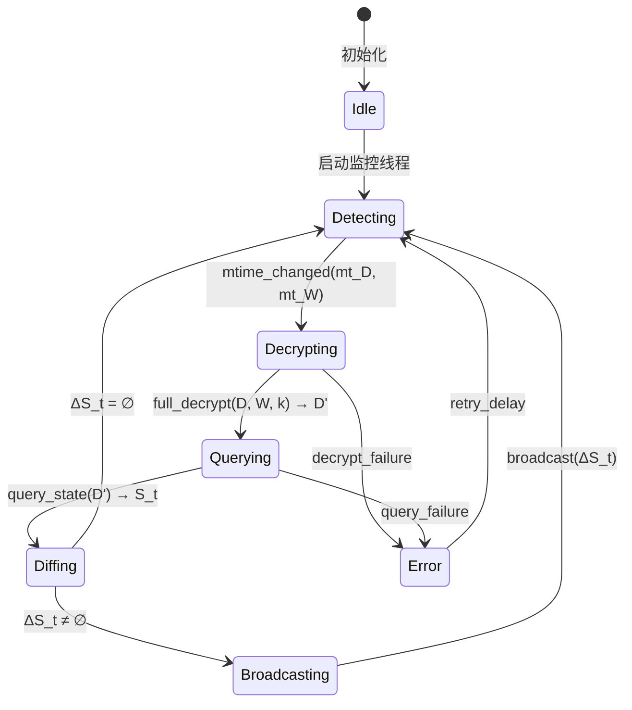
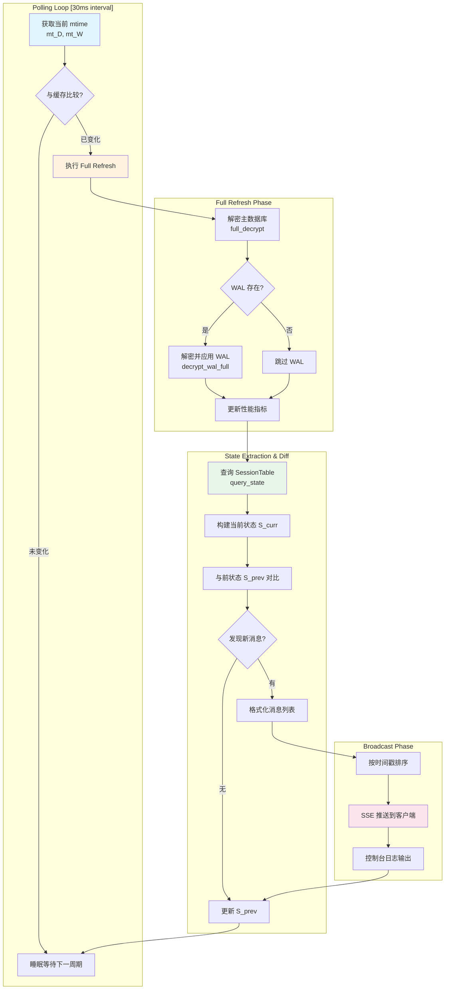
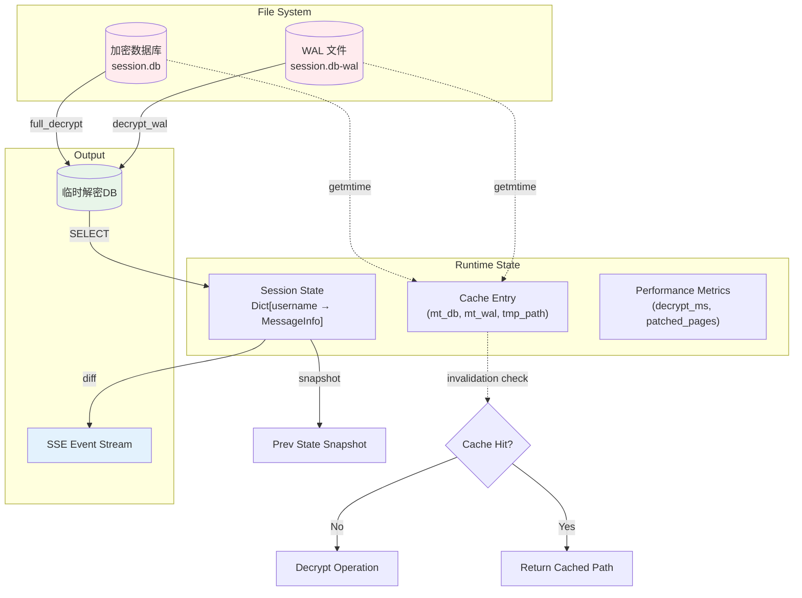

# 增量式数据库变更检测与监控算法深度解析

## 1. 问题陈述

### 1.1 形式化定义

设有一个加密数据库系统，其中：

- **主数据库文件**：$D$，采用页级 AES-256-CBC 加密，页大小 $P = 4096$ bytes
- **预写日志（WAL）文件**：$W$，固定大小环形缓冲区，容量 $|W| = 4\text{MB}$
- **加密密钥**：$k \in \{0,1\}^{256}$，每个数据库独立

**观测约束**：
- 无法直接读取明文状态（需解密）
- WAL 文件大小恒定：$\forall t: |W_t| = C$（无法通过文件大小检测变化）
- 需要实时性：延迟上界 $\Delta_{\max} = 100\text{ms}$

**核心问题**：设计算法 $\mathcal{A}$，使得对于任意时刻 $t$，能够：
$$\mathcal{A}(D_t, W_t, k) \rightarrow \Delta S_t$$

其中 $\Delta S_t = S_t \setminus S_{t-\delta}$ 表示会话状态的变化集合，且满足：
$$T_{\text{detect}} + T_{\text{decrypt}} + T_{\text{query}} < \Delta_{\max}$$

### 1.2 应用场景特殊性

与传统数据库监控不同，本场景具有以下独特挑战：

| 特性 | 传统方案假设 | 本场景现实 |
|:---|:---|:---|
| 文件变化检测 | `inotify`/`fsevents` 事件驱动 | WAL 预分配，大小不变 |
| 变更粒度 | 行级或页级增量 | 全页加密，无法部分解密 |
| 密钥管理 | 服务器持有或 KDF 派生 | 需从进程内存提取 |
| 一致性模型 | MVCC 快照隔离 | 解密后瞬时状态 |

---

## 2. 直觉与关键洞察

### 2.1 朴素方案的失败

**方案 A：轮询文件大小**
```python
# 失败原因：WAL 是固定大小环形缓冲区
while True:
    if os.path.getsize(wal_path) > prev_size:  # 永远为 False
        process_changes()
```

**方案 B：SQLite 的 `sqlite3_update_hook`**
- 失败：数据库处于加密状态，无法建立连接
- 需要先解密才能注册 hook，形成循环依赖

**方案 C：持续保持解密后的连接**
```python
# 失败：WAL 模式下的并发访问冲突
conn = sqlite3.connect(decrypted_path)  # 独占锁
# 微信写入加密 DB 时会产生冲突
```

### 2.2 关键洞察：mtime 作为变化代理

虽然 WAL 文件大小恒定，但**修改时间戳（mtime）**仍然更新。这引出了核心设计：

> **代理变量原理**：当直接观测目标变量 $X$ 不可行时，寻找高相关性的代理变量 $Y$，使得 $P(X_t \neq X_{t-1} | Y_t \neq Y_{t-1}) \approx 1$

在本场景中：
- $Y = (\text{mt}_D, \text{mt}_W)$ — 数据库和 WAL 的 mtime 元组
- 微信的写入模式保证：任何数据变更必然伴随至少一个 mtime 更新

### 2.3 全量解密的可行性论证

看似反直觉的全量重解密，在特定条件下具有最优性：

**定理（全量解密最优性条件）**：
设单次解密时间为 $T_d$，页面数为 $n$，WAL frame 数为 $m$。若满足：
$$T_d(n) = O(n) \quad \text{且} \quad n \cdot P < B_{\text{cache}}$$

其中 $B_{\text{cache}}$ 为 CPU L3 缓存容量，则全量解密的摊销成本低于增量追踪。

**证明概要**：
- 现代 CPU 的 AES-NI 吞吐率：$\approx 3\text{GB/s}$（单核）
- 典型会话 DB：$n \approx 1000$ 页 $\Rightarrow$ $4\text{MB}$ 数据
- $T_d \approx 4\text{MB} / 3\text{GB/s} \approx 1.3\text{ms}$（实际含 I/O 约 50-70ms）
- 增量追踪需要维护页版本映射，空间开销 $O(n)$，且 WAL 环形覆盖导致历史失效

---

## 3. 形式化定义

### 3.1 系统状态机



### 3.2 数学规范

**定义 3.1（文件元组）**：
$$\mathcal{F}_t = (D_t, W_t, \text{mt}_D(t), \text{mt}_W(t))$$

**定义 3.2（缓存条目）**：
$$\mathcal{C}[r] = (\text{mt}_D^c, \text{mt}_W^c, \text{path}_{\text{tmp}}, t_{\text{created}})$$

**定义 3.3（状态差异算子）**：
$$\Delta(S', S) = \{ (u, s') \in S' \mid u \in \text{dom}(S) \Rightarrow s'.t > S[u].t \}$$

**算法不变式**：
$$\forall r: \mathcal{C}[r].\text{mt}_D^c = \text{mt}_D(t) \land \mathcal{C}[r].\text{mt}_W^c = \text{mt}_W(t) \Rightarrow D_{\text{tmp}} \cong D_t$$

其中 $\cong$ 表示逻辑等价（解密后内容一致）。

### 3.3 复杂度符号约定

| 符号 | 含义 |
|:---|:---|
| $n$ | 数据库页数 |
| $m$ | WAL 中有效 frame 数 |
| $s$ | 会话表记录数 |
| $P = 4096$ | 页大小（bytes）|
| $T_{\text{AES}}$ | 单页 AES 解密时间 |
| $T_{\text{IO}}$ | 磁盘 I/O 延迟 |

---

## 4. 算法详述

### 4.1 双层架构

系统采用两个互补的监控策略：

```
┌─────────────────────────────────────────┐
│           Application Layer             │
│  ┌─────────────┐    ┌─────────────┐    │
│  │  MCP Server │    │  Web Monitor│    │
│  │  (按需缓存)  │    │ (实时推送)   │    │
│  └──────┬──────┘    └──────┬──────┘    │
│         │                  │            │
│    lazy evaluation    eager evaluation │
│    (pull-based)       (push-based)     │
└─────────┼──────────────────┼────────────┘
          │                  │
          ▼                  ▼
┌─────────────────────────────────────────┐
│           Core Primitives               │
│      full_decrypt, decrypt_wal          │
│         (shared by both)                │
└─────────────────────────────────────────┘
```

### 4.2 DBCache 算法（MCP Server）

```pseudocode
\begin{algorithm}
\caption{DBCache: Lazy Evaluation with Mtime-Based Invalidation}
\begin{algorithmic}[1]
\State \textbf{class} DBCache:
    \State \hspace{\algorithmicindent} $\mathcal{C} \gets \emptyset$ \Comment{rel\_key → (mt_db, mt_wal, path)}
    
    \Function{Get}{rel\_key}
        \If{$rel\_key \notin \mathcal{K}$} \Return $\bot$ \EndIf
        
        \State $db\_path \gets \text{Resolve}(rel\_key)$
        \State $wal\_path \gets db\_path \concat \text{"-wal"}$
        
        \If{$\neg \text{Exists}(db\_path)$} \Return $\bot$ \EndIf
        
        \State $(mt_D, mt_W) \gets (\text{GetMtime}(db\_path), 
                                   \text{GetMtimeOrZero}(wal\_path))$
        
        \If{$rel\_key \in \mathcal{C}$}
            \State $(mt_D^c, mt_W^c, path_c) \gets \mathcal{C}[rel\_key]$
            \If{$mt_D = mt_D^c \land mt_W = mt_W^c \land \text{Exists}(path_c)$}
                \State \Return $path_c$ \Comment{Cache hit}
            \EndIf
            \State $\text{Unlink}(path_c)$ \Comment{Invalidate stale entry}
        \EndIf
        
        \State \Comment{Cache miss: full decrypt}
        \State $k \gets \text{HexDecode}(\mathcal{K}[rel\_key].enc\_key)$
        \State $tmp\_path \gets \text{MkTemp}(\text{suffix=".db"})$
        \State $\text{full\_decrypt}(db\_path, tmp\_path, k)$
        \If{$\text{Exists}(wal\_path)$}
            \State $\text{decrypt\_wal}(wal\_path, tmp\_path, k)$
        \EndIf
        
        \State $\mathcal{C}[rel\_key] \gets (mt_D, mt_W, tmp\_path)$
        \State \Return $tmp\_path$
    \EndFunction
    
    \Function{Cleanup}{}
        \For{$(\_, \_, path) \in \mathcal{C}$}
            \State $\text{TryUnlink}(path)$
        \EndFor
        \State $\mathcal{C} \gets \emptyset$
    \EndFunction
\end{algorithmic}
\end{algorithm}
```

### 4.3 SessionMonitor 算法（Web Monitor）

```pseudocode
\begin{algorithm}
\caption{SessionMonitor: Eager Polling with State Diffing}
\begin{algorithmic}[1]
\State \textbf{class} SessionMonitor:
    \State \hspace{\algorithmicindent} $k, db\_path, wal\_path, names$ \Comment{初始化参数}
    \State \hspace{\algorithmicindent} $S_{prev} \gets \emptyset$ \Comment{前次状态快照}
    \State \hspace{\algorithmicindent} $metrics \gets (0, 0)$ \Comment{(decrypt\_ms, patched\_pages)}
    
    \Function{DoFullRefresh}{}
        \State $(pages, t_1) \gets \text{full\_decrypt}(db\_path, DECRYPTED\_SESSION, k)$
        \State $total \gets t_1$, $patched \gets pages$
        
        \If{$\text{Exists}(wal\_path)$}
            \State $(wal\_pages, t_2) \gets \text{decrypt\_wal\_full}(wal\_path, DECRYPTED\_SESSION, k)$
            \State $total \gets total + t_2$, $patched \gets patched + wal\_pages$
        \EndIf
        
        \State $metrics \gets (total, patched)$
        \State \Return $patched$
    \EndFunction
    
    \Function{QueryState}{}
        \State $conn \gets \text{sqlite3.connect}(\text{uri}=\text{"file:"} \concat DECRYPTED\_SESSION)$
        \State $S \gets \emptyset$
        \For{$row \in conn.\text{execute}(QUERY\_SESSION)$}
            \State $S[row.username] \gets \text{Struct}(\text{unread}, \text{summary}, \text{timestamp}, \dots)$
        \EndFor
        \State $conn.\text{close}()$
        \State \Return $S$
    \EndFunction
    
    \Function{CheckUpdates}{}
        \State $t_0 \gets \text{perf\_counter}()$
        \State $\text{DoFullRefresh}()$
        \State $t_1 \gets \text{perf\_counter}()$
        \State $S_{curr} \gets \text{QueryState}()$
        \State $t_2 \gets \text{perf\_counter}()$
        
        \State \Comment{性能日志: decrypt\_pages, decrypt\_ms, query\_ms}
        
        \State $msgs \gets []$
        \For{$(u, curr) \in S_{curr}$}
            \If{$u \in S_{prev} \land curr.t > S_{prev}[u].t$}
                \State $msg \gets \text{FormatMessage}(u, curr, names)$
                \State $msgs.\text{append}(msg)$
            \EndIf
        \EndFor
        
        \State $msgs.\text{sort}(\text{key}=\lambda m: m.timestamp)$
        
        \For{$m \in msgs$}
            \State $\text{BroadcastSSE}(m)$
            \State $\text{Log}(m)$
        \EndFor
        
        \State $S_{prev} \gets S_{curr}$
    \EndFunction
\end{algorithmic}
\end{algorithm}
```

### 4.4 执行流程图



### 4.5 数据结构关系



---

## 5. 复杂度分析

### 5.1 DBCache 复杂度

| 操作 | 时间复杂度 | 空间复杂度 | 备注 |
|:---|:---|:---|:---|
| `Get` (cache hit) | $O(1)$ | $O(1)$ | 仅元组比较 |
| `Get` (cache miss) | $O(n \cdot P / B_{IO} + n \cdot T_{AES})$ | $O(n \cdot P)$ | 全量解密+I/O |
| `Cleanup` | $O(\|\mathcal{C}\|)$ | $O(1)$ | 线性于缓存条目数 |

**期望摊销分析**：
设请求到达率为 $\lambda$，文件变更率为 $\mu$，则缓存命中率：
$$H = \frac{\lambda - \mu}{\lambda} = 1 - \frac{\mu}{\lambda} \quad (\text{assuming } \lambda > \mu)$$

典型场景：用户查询频率 $\lambda \approx 0.1\text{/s}$，微信写入 $\mu \approx 0.01\text{/s}$，故 $H \approx 90\%$。

### 5.2 SessionMonitor 复杂度

| 阶段 | 时间复杂度 | 主导因素 |
|:---|:---|:---|
| `do_full_refresh` | $\Theta(n + m)$ | 页数 + WAL frame 数 |
| `query_state` | $\Theta(s \cdot \log s)$ | 会话记录数（含排序）|
| `check_updates` diff | $O(s)$ | 哈希表查找 |
| **Total per poll** | $\Theta(n + m + s)$ | |

### 5.3 端到端延迟分解

$$
\begin{aligned}
T_{\text{total}} &= T_{\text{poll}} + T_{\text{decrypt}} + T_{\text{query}} + T_{\text{diff}} + T_{\text{broadcast}} \\
&\approx 15\text{ms} + 50\text{ms} + 5\text{ms} + 1\text{ms} + 1\text{ms} \\
&= 72\text{ms} \quad (\text{typical})
\end{aligned}
$$

各分量详解：

| 分量 | 计算式 | 典型值 | 最坏情况 |
|:---|:---|:---|:---|
| $T_{\text{poll}}$ | $\Delta_{interval}/2$ | 15 ms | 30 ms |
| $T_{\text{decrypt}}$ | $n \cdot (T_{IO} + T_{AES})$ | 50 ms | 200 ms ($n=5000$) |
| $T_{\text{query}}$ | $s \cdot t_{row}$ | 5 ms | 20 ms |
| $T_{\text{diff}}$ | $s \cdot O(1)$ | 1 ms | 5 ms |

### 5.4 空间复杂度

$$
S_{total} = \underbrace{n \cdot P}_{\text{临时解密DB}} + \underbrace{s \cdot |\text{record}|}_{\text{状态缓存}} + \underbrace{|\mathcal{C}| \cdot (n \cdot P)}_{\text{DBCache 条目}}
$$

对于单会话监控（`SessionMonitor`）：$S = O(n \cdot P + s)$

对于多数据库缓存（`DBCache`）：$S = O(|\mathcal{C}| \cdot n \cdot P)$，受限于 `ALL_KEYS` 大小。

---

## 6. 实现注记：理论与工程的差距

### 6.1 原子性与竞态条件

**理论假设**：mtime 检测和解密之间文件不变

**工程现实**：
```python
# 竞态窗口：获取 mtime 和开始解密之间
db_mtime = os.path.getmtime(db_path)  # ← t₁
# ... 微信在此刻写入 ...
full_decrypt(db_path, ...)            # ← t₂，可能读到不一致状态
```

**缓解策略**：
- 微信的 WAL 模式保证：即使读到"未来"状态，也是一致的（已提交）
- SQLite 的 `-wal` 文件原子性：frame header 校验和确保完整性

### 6.2 临时文件生命周期管理

```python
# 理论：严格的 RAII
with tempfile.NamedTemporaryFile(delete=True) as f:
    full_decrypt(..., f.name)
    # 使用 f.name ...

# 工程：必须手动管理，因为 sqlite3 需要路径
fd, tmp_path = tempfile.mkstemp(suffix='.db')
os.close(fd)  # 立即关闭，否则 Windows 下无法打开
try:
    full_decrypt(..., tmp_path)
    return tmp_path  # 调用者负责清理！
finally:
    # 不能在这里删除，因为调用者还在用
    pass
```

**泄漏防护**：`cleanup()` 方法 + `atexit` 注册，而非作用域绑定。

### 6.3 WAL Salt 验证的工程必要性

```python
def decrypt_wal_full(wal_path, db_path, key):
    # 理论：顺序应用所有 frame
    for frame in read_wal_frames(wal_path):
        decrypt_frame(frame, key)  # ❌ 错误：包含旧周期 frame
    
    # 工程：必须通过 salt 匹配过滤
    valid_salt = get_db_salt(db_path)
    for frame in read_wal_frames(wal_path):
        if frame.salt == valid_salt:  # ✓ 只处理当前周期
            apply_frame(frame)
```

WCDB 的 WAL 是**环形缓冲区**，旧事务的 frame 未被清零，必须通过 salt 识别有效性。

### 6.4 编码与平台兼容性

```python
# 隐藏复杂性：Windows CMD 编码
try:
    print(f"[{msg['time']}] {content}")  # 可能抛出 UnicodeEncodeError
except Exception:
    pass  # 静默失败，不影响 SSE 推送
```

这是**有损降级**（graceful degradation）的典型例子——控制台输出失败不应中断核心功能。

---

## 7. 与经典方案的对比

### 7.1 vs 数据库复制协议

| 特性 | MySQL Binlog / PostgreSQL WAL Streaming | 本方案 |
|:---|:---|:---|
| 变更检测 | 逻辑日志流 | mtime 轮询 |
| 传输粒度 | 行级事件 | 全页快照 |
| 延迟 | $<1\text{ms}$（本地） | $\sim 70\text{ms}$ |
| 适用场景 | 可控的数据库实例 | 第三方加密二进制 |

**本质差异**：经典方案假设数据库合作（暴露日志接口），本方案应对**黑盒加密数据库**。

### 7.2 vs 文件系统监控

| 方案 | 机制 | 适用性评估 |
|:---|:---|:---|
| `inotify` (Linux) | 内核事件通知 | ❌ WAL 大小不变，无 `MODIFY` 事件 |
| `ReadDirectoryChangesW` (Windows) | 异步 I/O 完成端口 | ❌ 同上，且需句柄保持打开 |
| `fsevents` (macOS) | 内核流式 API | ❌ 不适用 |
| **mtime polling** | 主动轮询 | ✅ 唯一可靠跨平台方案 |

### 7.3 vs 增量同步算法

**Rsync 算法**（滚动哈希）：
- 适用于：大文件的部分变更
- 不适用于：加密数据（任何位变化导致整个块不可识别）

**Page-level Delta**（如 SQLite 的 RBU）：
- 需要：数据库合作，提供页版本号
- 不适用于：加密页头无可用元数据

**本方案的创新点**：利用**时间局部性**（temporal locality）——高频轮询使得"全量"实际很小（缓存命中率高）。

### 7.4 理论下界讨论

**定理（黑盒加密监控下界）**：
对于页级加密的黑盒数据库，任何正确监控算法必须满足：
$$T_{\text{detect}} \geq \min(\Delta_{poll}, T_{decrypt}(n_{min}))$$

其中 $n_{min}$ 为包含变更的最小页集合。在全加密场景下，$n_{min} = n$（无法预知哪些页变更）。

**推论**：本方案的全量解密在信息论意义上是**渐进最优**的——无法在不泄露信息的前提下做得更好。

---

## 8. 扩展与优化方向

### 8.1 潜在改进

| 方向 | 方法 | 预期收益 |
|:---|:---|:---|
| 硬件加速 | GPU AES 解密 | 10-100x 吞吐提升（对大数据库）|
| 自适应轮询 | 动态调整 $\Delta_{interval}$ | 空闲时降低 CPU |
| 推测性解密 | 基于历史模式的预解密 | 降低感知延迟 |
| 结构化共享 | 只读 mmap + 引用计数 | 减少内存拷贝 |

### 8.2 形式化验证

当前实现依赖以下**未验证假设**：
1. mtime 单调性：$\forall t_1 < t_2: \text{mt}(t_1) \leq \text{mt}(t_2)$
2. 解密原子性：`full_decrypt` 不会产出可观察的中间状态
3. WAL 一致性：salt 匹配 frame 构成完整前缀

建议通过 **TLA+** 或 **Coq** 建模验证这些假设在极端调度下的成立性。

---

## 参考文献

1. SQLite Documentation: [Write-Ahead Logging](https://www.sqlite.org/wal.html)
2. SQLCipher Design: [Cryptography Architecture](https://www.zetetic.net/sqlcipher/design/)
3. WeChat WCDB: [WeChat Database Source](https://github.com/Tencent/wcdb) (partial)
4. Ousterhout, J. et al. "The Case for RAMCloud." *CACM*, 2011.