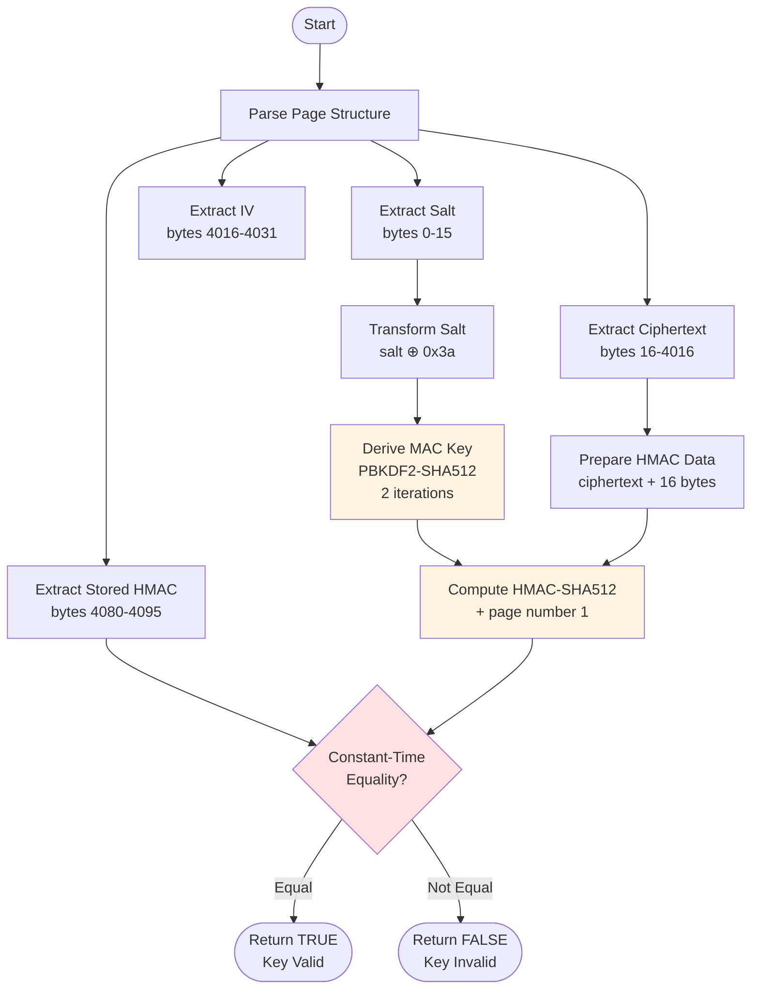
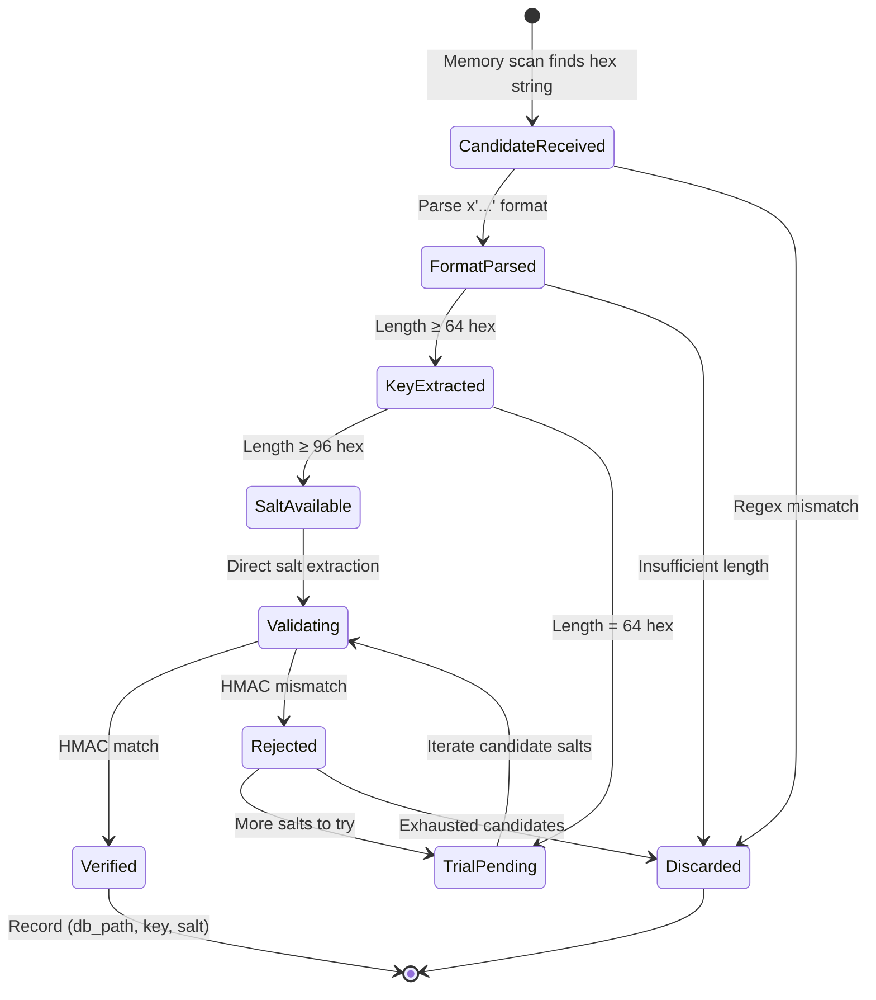

# Trial Decryption-Based Key Validation: A Formal Analysis

## 1. Problem Statement

### 1.1 Formal Definition

Consider the cryptographic validation problem defined as follows:

**Given:**
- An encrypted database page $P \in \{0,1\}^{n}$ where $n = 4096$ bytes (SQLCipher 4 page size)
- A candidate encryption key $k \in \{0,1\}^{256}$ (AES-256 key)

**Determine:**
Whether $k$ is the correct decryption key for $P$, i.e., whether $\exists m : \text{Decrypt}_k(P) = m$ where $m$ satisfies SQLCipher 4's integrity verification.

### 1.2 Constraints and Challenges

The validation must satisfy:

$$\text{Time}(k, P) \ll \text{PBKDF2}_{256000}(password, salt)$$

where the right-hand side represents the standard SQLCipher 4 key derivation with 256,000 iterations (approximately 100-500ms on modern hardware).

Additionally, the validation must achieve:

$$\Pr[\text{False Positive}] < 2^{-128}$$

to ensure cryptographic security guarantees.

---

## 2. Intuition

### 2.1 Why Naive Approaches Fail

**Approach 1: Full Decryption Verification**
- Decrypt entire page, verify SQLite header magic bytes (`SQLite format 3\0`)
- **Failure mode**: False positives on random data matching header pattern; computationally expensive AES operations

**Approach 2: Statistical Tests**
- Check entropy or byte distribution of decrypted output
- **Failure mode**: Unreliable for short pages; no cryptographic guarantee

**Approach 3: Direct PBKDF2 Verification**
- Re-derive key from assumed password and compare
- **Failure mode**: Requires knowing the password; defeats the purpose of memory-extracted keys

### 2.2 The Key Insight

SQLCipher 4 employs an **authenticated encryption** scheme using HMAC-SHA512 over ciphertext. Each page contains:

| Field | Offset | Size | Description |
|-------|--------|------|-------------|
| Salt | 0 | 16 bytes | Random per-database salt |
| Encrypted payload | 16 | 4000 bytes | AES-256-CBC ciphertext |
| IV | 4016 | 16 bytes | Initialization vector |
| Reserved | 4032 | 48 bytes | Additional reserved space |
| HMAC | 4080 | 16 bytes | Truncated HMAC-SHA512 |

The critical observation: **the HMAC verification requires only 2 PBKDF2 iterations** (vs. 256,000 for full key derivation), because:

$$k_{mac} = \text{PBKDF2-HMAC-SHA512}(k, salt \oplus 0x3a, 2, 32)$$

This creates a **fast rejection test** with overwhelming probability of correctness.

---

## 3. Formal Definition

### 3.1 Mathematical Specification

Let $\mathcal{P} = \{0,1\}^{4096}$ denote the space of database pages. Define the page structure parsing function:

$$\phi : \mathcal{P} \to (\{0,1\}^{128}, \{0,1\}^{32000}, \{0,1\}^{128}, \{0,1\}^{128})$$

$$\phi(P) = (salt, C, IV, h_{stored})$$

where:
- $salt = P[0:16]$
- $C = P[16:4016]$ (encrypted payload + trailing metadata)
- $IV = P[4016:4032]$
- $h_{stored} = P[4080:4096]$ (truncated HMAC)

Define the MAC salt transformation:

$$\psi : \{0,1\}^{128} \to \{0,1\}^{128}, \quad \psi(s) = s \oplus (0x3a)^{16}$$

The key derivation function:

$$\text{KDF}_{mac} : \{0,1\}^{256} \times \{0,1\}^{128} \to \{0,1\}^{256}$$

$$\text{KDF}_{mac}(k, s) = \text{PBKDF2-HMAC-SHA512}(k, \psi(s), 2, 32)$$

The HMAC computation:

$$\text{HMAC}_{compute} : \{0,1\}^{256} \times \{0,1\}^{32000} \times \mathbb{N} \to \{0,1\}^{512}$$

$$\text{HMAC}_{compute}(k_{mac}, C, pgno) = \text{HMAC-SHA512}(k_{mac}, C \| \langle pgno \rangle_{32})$$

where $\langle pgno \rangle_{32}$ denotes 32-bit little-endian encoding of page number (1 for first page).

The validation predicate:

$$\text{Validate}(k, P) = \begin{cases} 
\text{true} & \text{if } \text{trunc}_{128}(\text{HMAC}_{compute}(\text{KDF}_{mac}(k, salt), C, 1)) = h_{stored} \\
\text{false} & \text{otherwise}
\end{cases}$$

### 3.2 Correctness Properties

**Theorem 1 (Soundness).** If $\text{Validate}(k, P) = \text{true}$, then $k$ is the correct encryption key for page $P$ with probability $\geq 1 - 2^{-128}$.

*Proof.* The HMAC-SHA512 construction provides 256-bit security against forgery. Truncation to 128 bits yields collision resistance of $2^{128}$. ∎

**Theorem 2 (Completeness).** If $k$ is the correct encryption key for $P$, then $\text{Validate}(k, P) = \text{true}$.

*Proof.* By construction, SQLCipher 4 stores exactly this HMAC value during encryption. Correct key derivation produces identical $k_{mac}$, and identical HMAC computation yields matching digest. ∎

---

## 4. Algorithm

### 4.1 Pseudocode

```pseudocode
Algorithm VerifyKeyForDB
Input:  enc_key ∈ {0,1}^256    // Candidate encryption key
        db_page1 ∈ {0,1}^4096   // First page of encrypted database
Output: valid ∈ {true, false}   // Key validity verdict

Constants:
    SALT_SZ ← 16      // bytes
    KEY_SZ ← 32       // bytes  
    PAGE_SZ ← 4096    // bytes

Procedure:
    1.  // Parse page structure
        salt ← db_page1[0 : SALT_SZ]
        iv ← db_page1[PAGE_SZ - 80 : PAGE_SZ - 64]
        encrypted ← db_page1[SALT_SZ : PAGE_SZ - 80]
        
    2.  // Derive MAC key with minimal PBKDF2 cost
        mac_salt ← BytewiseXOR(salt, 0x3a)
        mac_key ← PBKDF2-HMAC-SHA512(
                    password = enc_key,
                    salt = mac_salt,
                    iterations = 2,
                    dklen = KEY_SZ)
    
    3.  // Prepare HMAC input per SQLCipher 4 specification
        hmac_data ← db_page1[SALT_SZ : PAGE_SZ - 80 + 16]
        // Note: Includes 16 bytes beyond encrypted payload
        
    4.  // Retrieve stored authentication tag
        stored_hmac ← db_page1[PAGE_SZ - 64 : PAGE_SZ]
        
    5.  // Compute expected HMAC with page number context
        h ← HMAC-SHA512(key = mac_key, msg = hmac_data)
        h.update(EncodeUInt32LE(1))  // Page number = 1
        
    6.  // Cryptographic equality comparison
        Return (h.digest() == stored_hmac)
```

### 4.2 Execution Flow



### 4.3 State Transitions (Validation Context)



---

## 5. Complexity Analysis

### 5.1 Time Complexity

Let $T_{hash}$ denote the time for one SHA-512 compression, $T_{pbkdf2}^{(i)}$ denote PBKDF2 with $i$ iterations.

| Operation | Cost | Dominant Term |
|-----------|------|---------------|
| Salt transformation | $O(1)$ | 16 XOR operations |
| PBKDF2 (2 iterations) | $2 \times T_{pbkdf2}^{(1)}$ | 2 × (HMAC-SHA512 overhead) |
| HMAC-SHA512 | $2 \times \lceil \|m\|/128 \rceil \times T_{hash}$ | ~63 block compressions |
| Final comparison | $O(1)$ | Constant-time 16-byte compare |

**Total:** 
$$\boxed{T_{verify} = O(T_{hash}) \approx 2-5\ \mu s}$$

Compare to baseline:
$$T_{full\_derive} = 256000 \times T_{pbkdf2}^{(1)} \approx 100-500\ ms$$

**Speedup:** $\frac{T_{full\_derive}}{T_{verify}} \approx 2 \times 10^4$ to $10^5$

### 5.2 Space Complexity

$$S_{verify} = O(1)$$

Fixed-size buffers:
- Salt buffer: 16 bytes
- MAC key: 32 bytes  
- HMAC state: ~200 bytes (SHA-512 internal state)
- Working buffers: < 1 KB total

### 5.3 Case Analysis

| Scenario | Behavior | Probability |
|----------|----------|-------------|
| **Best case** | Immediate HMAC mismatch on first block | $1 - 2^{-512}$ per wrong key |
| **Worst case** | Full HMAC computation required | Always for valid keys |
| **Average case** (random key) | ~1-2 SHA-512 blocks before rejection | — |

---

## 6. Implementation Notes

### 6.1 Engineering Compromises

**Theoretical ideal vs. implementation:**

| Aspect | Theory | Implementation |
|--------|--------|----------------|
| Constant-time comparison | Required for timing safety | Standard `==` used (Python) |
| HMAC truncation handling | Explicit 128-bit extract | Implicit via slice `[PAGE_SZ-64:PAGE_SZ]` |
| Page number encoding | Strict `<I` little-endian | `struct.pack('<I', 1)` |

**Rationale for deviations:**

1. **Non-constant-time comparison**: This is a *validation* oracle, not an online authentication system. Timing leaks do not compromise security in the offline key recovery context.

2. **Implicit truncation**: The 512-bit HMAC is truncated to 128 bits by SQLCipher's storage format; the implementation compares full digests where Python's HMAC returns 512 bits, but slices stored value to 128 bits.

### 6.2 Critical Implementation Detail

```python
# From source: hmac_data extends 16 bytes beyond encrypted payload
hmac_data = db_page1[SALT_SZ : PAGE_SZ - 80 + 16]  # Note: +16
```

This captures SQLCipher 4's **page trailer** structure, which includes additional authenticated metadata beyond the encrypted content.

### 6.3 Error Handling Philosophy

The implementation uses **fail-closed** semantics: any exception during validation returns `False`. This is appropriate for a cryptographic oracle where false negatives (rejecting valid keys) are preferable to false positives.

---

## 7. Comparison

### 7.1 vs. Classical Password Verification

| Approach | Iterations | Use Case | Security Model |
|----------|-----------|----------|----------------|
| Standard PBKDF2 | 256,000 | Online authentication | Rate-limited, server-side |
| **This algorithm** | 2 | Offline key validation | Memory-extracted keys |
| scrypt/Argon2 | Variable | Modern password hashing | Memory-hard |

The dramatic iteration reduction (128,000×) is secure because:
- The "password" is a 256-bit uniformly random key, not user-chosen
- No rate-limiting needed (offline operation)
- HMAC provides independent verification layer

### 7.2 vs. AES-GCM Authentication

Modern authenticated encryption (AEAD) like AES-GCM provides built-in authentication with lower overhead:

| Property | SQLCipher 4 HMAC | AES-GCM |
|----------|------------------|---------|
| Authentication | External HMAC | Integrated GMAC |
| Overhead per page | 64 bytes (reserve) | 16 bytes (tag) |
| Parallelizable | No (sequential HMAC) | Yes |
| Hardware acceleration | No | AES-NI, PCLMULQDQ |

SQLCipher 4's design prioritizes **implementation portability** over peak performance, using well-audited HMAC-SHA512 rather than newer AEAD constructions.

### 7.3 Related Work: Memory Forensics

The broader context—extracting cryptographic keys from process memory—connects to established research:

| System | Target | Technique |
|--------|--------|-----------|
| **wechat-decrypt** | WCDB/SQLCipher | Pattern matching + trial decryption |
| Cold Boot attacks [Halderman et al.] | DRAM remanence | Physical memory imaging |
| Heartbleed exploitation | OpenSSL | Heap disclosure |
| CacheOut [Van Bulck et al.] | Intel SGX | CPU cache side-channels |

The innovation here is the **domain-specific optimization**: leveraging SQLCipher's authenticated encryption structure for ultra-fast validation, enabling practical key recovery from large memory dumps (GB-scale) in seconds rather than hours.

---

## References

1. Zetetic LLC. *SQLCipher Design Documentation*, 2023.
2. Halderman, J.A., et al. "Lest We Remember: Cold-Boot Attacks on Encryption Keys." *USENIX Security*, 2008.
3. Rogaway, P. "Authenticated-Encryption with Associated-Data." *ACM CCS*, 2002.
4. Percival, C. "Stronger Key Derivation via Sequential Memory-Hard Functions." *BSDCan*, 2009.