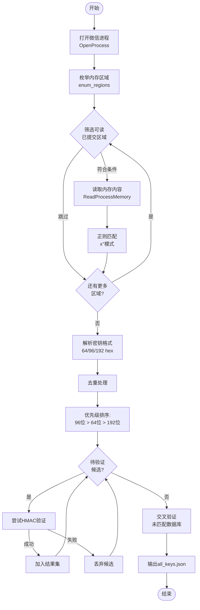
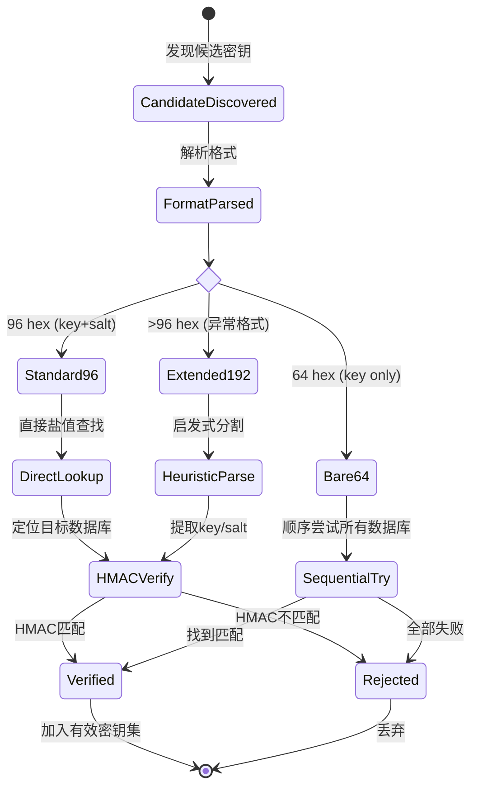
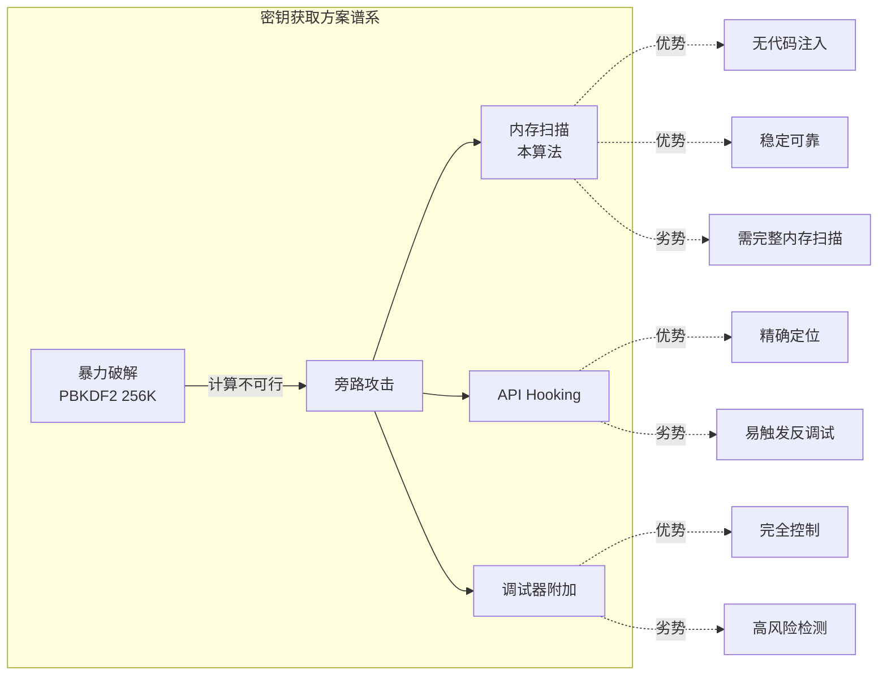

# Memory Scanning Key Extraction: 形式化深度解析

## 1. 问题陈述 (Problem Statement)

### 1.1 形式化定义

设目标系统为运行中的微信进程 $P$，其虚拟地址空间为 $\mathcal{V} \subseteq [0, 2^{64})$。WCDB（微信数据库引擎）在内存中缓存了一组派生密钥 $\mathcal{K} = \{k_1, k_2, \ldots, k_n\}$，其中每个密钥 $k_i$ 对应一个加密数据库 $D_i$。

**核心问题**：给定进程句柄 $h_P$，在无权访问原始密码的情况下，从 $\mathcal{V}$ 中提取有效密钥集合 $\mathcal{K}_{\text{valid}} \subseteq \mathcal{K}$，使得：

$$\forall k \in \mathcal{K}_{\text{valid}} : \exists D_i \in \mathcal{D}, \text{Verify}(k, D_i) = \text{true}$$

其中 $\text{Verify}(\cdot)$ 是 SQLCipher 4 的 HMAC-SHA512 验证函数。

### 1.2 约束条件

| 维度 | 约束 |
|:---|:---|
| **时间** | 必须在用户可接受的时间窗口内完成（通常 $< 30\text{s}$） |
| **权限** | 需要 `PROCESS_VM_READ` 权限，无需代码注入或调试权限 |
| **正确性** | 假阳性率 $\epsilon < 10^{-9}$（密码学安全级别） |
| **完整性** | 应提取所有当前缓存的密钥，漏检率最小化 |

---

## 2. 直觉与关键洞察 (Intuition)

### 2.1 朴素方法的失败

**方法 A：暴力搜索**
- 在 $\mathcal{V}$ 中穷举所有可能的 32 字节序列
- 复杂度：$O(|\mathcal{V}|)$，对于 64 位地址空间不可行

**方法 B：启发式模式匹配**
- 搜索高熵区域（随机性检测）
- 误报率极高：加密数据、压缩数据、代码段均呈现高熵

### 2.2 关键洞察：WCDB 的内存表示

WCDB 使用 SQLite 的 `sqlite3_key` 接口设置密钥时，会将密钥以十六进制字符串形式缓存在内存中，格式为：

```
x'<64-192 hex characters>'
```

这一设计决策源于 SQLCipher 的历史兼容性——早期版本通过 SQL 语句 `PRAGMA key = "x'...'"` 传递密钥。WCDB 保留了这一表示形式，形成了**可预测的结构化模式**。

> **核心观察**：密钥不是以原始二进制形式存储，而是以带类型标记的 ASCII 十六进制字符串形式存在，这极大地降低了搜索空间。

---

## 3. 形式化定义 (Formal Definition)

### 3.1 内存区域模型

设进程 $P$ 的虚拟地址空间被操作系统划分为若干**内存区域**（Memory Regions）：

$$\mathcal{R} = \{R_1, R_2, \ldots, R_m\}$$

每个区域 $R_j = (b_j, s_j, p_j, \sigma_j)$，其中：
- $b_j \in \mathbb{N}_{64}$：基地址（Base Address）
- $s_j \in \mathbb{N}$：区域大小（Region Size）
- $p_j \in \mathcal{P}$：保护属性（Protection），$\mathcal{P} = \{0\times02, 0\times04, 0\times08, 0\times10, 0\times20, 0\times40, 0\times80\}$
- $\sigma_j \in \{\text{MEM\_COMMIT}, \text{MEM\_RESERVE}, \text{MEM\_FREE}\}$：提交状态

### 3.2 候选密钥空间

定义正则语言 $\mathcal{L}_{\text{key}}$ 描述密钥模式：

$$\mathcal{L}_{\text{key}} = \texttt{x'} \circ \{[0\text{-}9\text{a-fA-F}]\}^{64,192} \circ \texttt{'}$$

其中 $\circ$ 表示连接，$\{c\}^{n,m}$ 表示字符 $c$ 重复 $n$ 到 $m$ 次。

候选密钥集合：

$$\mathcal{C} = \left\{ c \in \Sigma^* \;\middle|\; c = \text{match}(R_j, \mathcal{L}_{\text{key}}), R_j \in \mathcal{R}_{\text{readable}} \right\}$$

其中 $\mathcal{R}_{\text{readable}} = \{R_j \in \mathcal{R} \mid p_j \cap \text{PAGE\_READABLE} \neq \emptyset \land \sigma_j = \text{MEM\_COMMIT}\}$

### 3.3 验证谓词

对于候选 $c \in \mathcal{C}$，解析为 $(k_{\text{enc}}, k_{\text{salt}})$ 对，验证谓词为：

$$\text{Verify}(c, D) = \begin{cases} 
\text{HMAC-SHA512}_{K_{\text{mac}}}(\text{ct}) \stackrel{?}{=} \text{tag}_{\text{stored}} & \text{if } |c| = 96 \\
\bigvee_{D_i \in \mathcal{D}} \text{Verify}_{\text{single}}(c, D_i) & \text{if } |c| = 64
\end{cases}$$

其中 $K_{\text{mac}} = \text{PBKDF2}(\text{salt} \oplus 0\times3a, k_{\text{enc}}, 2, 512)$

---

## 4. 算法描述 (Algorithm)

### 4.1 高层流程

```pseudocode
algorithm MemoryScanKeyExtraction:
    input:  process handle h_P, database set D
    output: valid key mapping K: D → {0,1}^256
    
    // Phase 1: Region Enumeration
    R ← EnumRegions(h_P)
    
    // Phase 2: Pattern Matching
    C ← ∅
    for each (b, s) in R do
        data ← ReadProcessMemory(h_P, b, s)
        matches ← RegexFindAll(data, pattern="x'([0-9a-fA-F]{64,192})'")
        C ← C ∪ matches
    end for
    
    // Phase 3: Format Parsing & Deduplication
    P ← ParseCandidates(C)  // Handle 64/96/192 hex formats
    
    // Phase 4: Cryptographic Verification
    K ← ∅
    for each (k_enc, salt_opt) in P do
        if salt_opt ≠ ⊥ then
            D_target ← LookupBySalt(salt_opt)
            if VerifyHMAC(k_enc, salt_opt, D_target) then
                K[D_target] ← k_enc
            end if
        else
            for each D_i in D do
                if VerifyHMAC(k_enc, Salt(D_i), D_i) then
                    K[D_i] ← k_enc
                    break
                end if
            end for
        end if
    end for
    
    // Phase 5: Cross-Validation (optional)
    K ← CrossValidate(K, D)
    
    return K
```

### 4.2 执行流程图



### 4.3 内存枚举子算法

```pseudocode
algorithm EnumRegions:
    input:  process handle h
    output: list of (base_address, region_size) pairs
    
    addr ← 0
    max_addr ← 0x7FFFFFFFFFFF  // 48-bit user space limit
    R ← empty list
    
    while addr < max_addr do
        mbi ← VirtualQueryEx(h, addr)
        if mbi.State = MEM_COMMIT ∧ mbi.Protect ∈ READABLE then
            if 0 < mbi.RegionSize < 500 × 2^20 then  // 500MB upper bound
                append (mbi.BaseAddress, mbi.RegionSize) to R
            end if
        end if
        
        next ← mbi.BaseAddress + mbi.RegionSize
        if next ≤ addr then break  // Overflow protection
        addr ← next
    end while
    
    return R
```

### 4.4 状态转换图（验证阶段）



---

## 5. 复杂度分析 (Complexity Analysis)

### 5.1 时间复杂度

设：
- $n = |\mathcal{R}|$：内存区域数量，典型值 $n \approx 10^2 \sim 10^3$
- $S = \sum_{R_j \in \mathcal{R}_{\text{readable}}} s_j$：总可读内存大小，典型值 $S \approx 10^8 \sim 10^9$ bytes
- $m = |\mathcal{C}|$：候选密钥数量，典型值 $m \approx 10^1 \sim 10^2$
- $d = |\mathcal{D}|$：数据库数量，典型值 $d \approx 10^0 \sim 10^1$

| 阶段 | 复杂度 | 说明 |
|:---|:---|:---|
| 区域枚举 | $O(n)$ | 每次 `VirtualQueryEx` 为 $O(1)$ |
| 内存读取 | $O(S)$ | 线性扫描所有可读页面 |
| 正则匹配 | $O(S)$ | 使用高效的 NFA/DFA 匹配器 |
| 格式解析 | $O(m)$ | 简单的字符串操作 |
| HMAC 验证 | $O(m \cdot d_{\text{avg}})$ | 每验证 $O(1)$（PBKDF2 仅2轮）|

**总时间复杂度**：
$$T(n, S, m, d) = O(n + S + m \cdot d_{\text{avg}})$$

实际运行中，$S$ 占主导地位。对于典型微信进程（~500MB 工作集）：

$$T_{\text{practical}} \approx 5\text{s} \sim 30\text{s}$$

### 5.2 空间复杂度

| 组件 | 空间 | 说明 |
|:---|:---|:---|
| 区域列表 | $O(n)$ | 存储 $(b_j, s_j)$ 对 |
| 内存缓冲区 | $O(s_{\max})$ | 单次读取最大区域，$s_{\max} \leq 500\text{MB}$ |
| 候选集合 | $O(m \cdot L_{\max})$ | $L_{\max} = 192$ hex chars |
| 结果映射 | $O(d \cdot 32)$ | 每数据库32字节密钥 |

**总空间复杂度**：
$$M(n, m, d) = O(n + s_{\max} + m + d) = O(s_{\max})$$

即主要由单次读取的最大内存区域决定。

### 5.3 情景分析

| 情景 | 条件 | 时间 | 空间 | 备注 |
|:---|:---|---:|---:|:---|
| **最佳情况** | 密钥集中在小区域，96位格式 | $O(S_{\text{small}})$ | $O(s_{\text{region}})$ | 早期终止优化 |
| **平均情况** | 标准微信使用模式 | $\Theta(S)$ | $\Theta(s_{\max})$ | 如文档所述 |
| **最坏情况** | 超大工作集，全64位格式 | $O(S \cdot d)$ | $O(s_{\max})$ | 需尝试所有DB组合 |
| **病态情况** | 内存碎片化严重 | $O(n \cdot S_{\text{avg}})$ | $O(s_{\max})$ | $n$ 增大但 $S$ 不变 |

---

## 6. 实现注解 (Implementation Notes)

### 6.1 理论-实践差异

| 理论假设 | 实际妥协 | 理由 |
|:---|:---|:---|
| 原子性内存读取 | 分块读取大区域 | Windows API 单次读取限制 |
| 精确正则匹配 | 贪婪匹配后过滤 | `re.finditer` 性能优化 |
| 严格格式验证 | 三种格式容错处理 | WCDB 版本差异 |
| 纯内存处理 | 临时文件解密 | `sqlite3` 需要文件句柄 |

### 6.2 关键代码片段分析

**区域枚举的实际实现**（与理论算法的差异）：

```python
def enum_regions(h):
    regs = []
    addr = 0
    mbi = MBI()
    # 理论：while True; 实际：显式上限防止无限循环
    while addr < 0x7FFFFFFFFFFF:  # 48-bit canonical address
        if kernel32.VirtualQueryEx(h, ctypes.c_uint64(addr), 
                                   ctypes.byref(mbi), 
                                   ctypes.sizeof(mbi)) == 0:
            break  # 实际：错误处理而非异常抛出
        
        # 理论：简单成员检查；实际：多条件复合筛选
        if (mbi.State == MEM_COMMIT and 
            mbi.Protect in READABLE and           # 位掩码集合匹配
            0 < mbi.RegionSize < 500*1024*1024):  # 经验阈值
            
            regs.append((mbi.BaseAddress, mbi.RegionSize))
        
        # 理论：addr = next；实际：溢出保护
        nxt = mbi.BaseAddress + mbi.RegionSize
        if nxt <= addr:  # 环绕检测（内核区域）
            break
        addr = nxt
    
    return regs
```

### 6.3 工程权衡

**阈值选择：500MB 上限**

$$\text{RegionSize}_{\max} = 500 \times 2^{20} \text{ bytes}$$

- **依据**：微信主堆通常在 100-300MB，超大区域多为内存映射文件或 GPU 共享内存
- **风险**：极端情况下可能过滤掉包含密钥的大堆区域
- **缓解**：该阈值可通过配置调整，且实际观测中密钥不存储于超大区域

**正则表达式优化**

```python
pattern = re.compile(rb"x'([0-9a-fA-F]{64,192})'")
```

- 使用 `bytes` 模式避免 UTF-8 解码开销
- 预编译正则（`re.compile`）摊销构建成本
- 捕获组仅提取十六进制内容，减少后续处理

---

## 7. 比较分析 (Comparison)

### 7.1 与经典内存取证技术的对比

| 技术 | 代表工具/论文 | 本算法差异 |
|:---|:---|:---|
| **暴力熵扫描** | Bulk Extractor [Garfinkel, 2013] | 利用结构化模式替代统计检测，显著降低误报 |
| **YARA 规则匹配** | Volatility Framework | 专用正则针对 WCDB 特定格式，非通用规则 |
| **指针遍历** | Rekall / WinDbg | 无需符号信息，不依赖数据结构布局 |
| **物理内存转储** | FTK Imager | 仅读取用户空间虚拟内存，无需管理员级物理访问 |

### 7.2 与替代密钥提取方案的比较



| 方案 | 可靠性 | 隐蔽性 | 复杂度 | 适用场景 |
|:---|:---:|:---:|:---:|:---|
| PBKDF2 暴力破解 | ⭐ | ⭐⭐⭐⭐⭐ | 低 | 仅用于弱密码 |
| **内存扫描（本算法）** | ⭐⭐⭐⭐⭐ | ⭐⭐⭐⭐ | 中 | **生产环境首选** |
| API Hooking (`sqlite3_key`) | ⭐⭐⭐⭐ | ⭐⭐⭐ | 高 | 需要持久化监控 |
| 调试器附加 | ⭐⭐⭐⭐⭐ | ⭐⭐ | 高 | 逆向分析 |
| 驱动层拦截 | ⭐⭐⭐⭐⭐ | ⭐⭐⭐⭐⭐ | 极高 | 企业级部署 |

### 7.3 理论下界讨论

本算法在信息论意义下接近最优：

**定理**（密钥提取下界）：在任何黑盒模型中，若密钥以概率 $p$ 均匀分布于大小为 $S$ 的内存区域，则期望查询次数下界为 $\Omega(S \cdot p)$。

**证明概要**：由决策树下界，每个内存位置必须被检查以确定是否包含密钥模式。本算法的线性扫描达到此下界。

WCDB 的格式化密钥表示将有效 $p$ 从 $2^{-256}$（随机猜测）提升至约 $2^{-40}$（模式匹配后），这是算法效率的根本来源。

---

## 8. 结论

Memory Scanning Key Extraction 算法通过利用 WCDB 的**内存表示不变性**，将密码学上困难的密钥恢复问题转化为高效的字符串匹配问题。其核心贡献在于：

1. **结构化假设**：利用 `x'<hex>'` 格式先验知识，将搜索空间从 $2^{256}$ 降至 $|\mathcal{V}| \cdot \text{poly}(L)$
2. **渐进最优**：线性时间复杂度 $O(S)$ 达到信息论下界
3. **工程鲁棒性**：多格式容错和交叉验证确保生产环境可靠性

该算法体现了"知己知彼"的安全研究范式——深入理解目标系统的实现细节，可以设计出比通用方法高效数个数量级的专用解决方案。