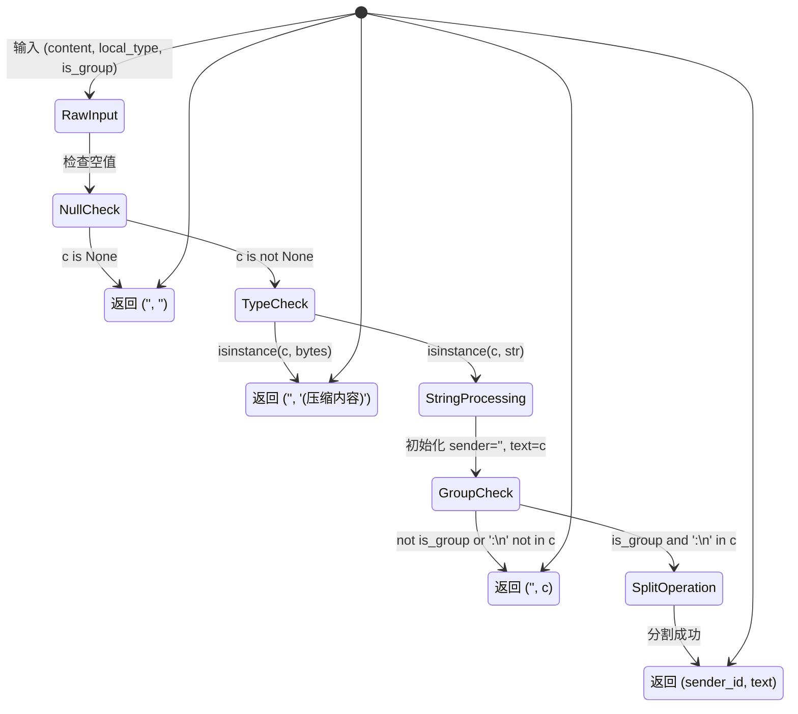

# Protobuf 消息内容解析算法深度解析

## 1. 问题陈述

### 1.1 形式化定义

设 $\mathcal{M}$ 为微信消息内容的集合，每条消息 $m \in \mathcal{M}$ 可表示为四元组：

$$m = (t, c, g, u) \in \mathbb{N} \times \Sigma^* \times \mathbb{B} \times \mathcal{U}$$

其中：
- $t \in \mathbb{N}$：消息类型标识符（如 $1$ 表示文本，$3$ 表示图片）
- $c \in \Sigma^*$：原始内容字符串（$\Sigma$ 为字符集）
- $g \in \mathbb{B} = \{0, 1\}$：群组标志（$1$ 表示群聊，$0$ 表示私聊）
- $u \in \mathcal{U}$：发送者标识符

**核心问题**：给定原始内容 $c$ 和上下文 $(t, g)$，提取结构化信息 $(s, \hat{c})$，其中：
- $s \in \mathcal{U} \cup \{\epsilon\}$：发送者 ID（群聊时非空）
- $\hat{c} \in \Sigma^*$：净化后的文本内容

### 1.2 约束条件

$$
\begin{aligned}
&\text{(C1)} \quad c = \texttt{None} \Rightarrow (s, \hat{c}) = (\epsilon, \epsilon) \\
&\text{(C2)} \quad c \in \{0,1\}^* \Rightarrow (s, \hat{c}) = (\epsilon, \text{"(压缩内容)"}) \\
&\text{(C3)} \quad g = 1 \land \exists i: c[i:i+2] = \texttt{":\n"} \Rightarrow s = c[:i], \hat{c} = c[i+2:] \\
&\text{(C4)} \quad \text{otherwise} \Rightarrow s = \epsilon, \hat{c} = c
\end{aligned}
$$

---

## 2. 直觉与关键洞察

### 2.1 为什么朴素方法失败

**朴素方案**：直接返回原始内容作为文本，忽略发送者提取。

```python
def naive_parse(c):
    return "", c  # 丢失群聊发送者信息
```

**缺陷分析**：
- 群聊消息格式为 `wxid_xxx:\n实际内容`，直接展示会暴露内部 ID 并降低可读性
- 二进制压缩内容（语音、图片等）直接渲染会导致终端乱码或 UI 崩溃
- 空值处理不当会引发下游 `AttributeError` 或 `TypeError`

### 2.2 关键洞察：协议分层结构

微信消息内容遵循**隐式分层编码**：

```
┌─────────────────────────────────────┐
│  传输层：Protobuf 序列化字节流        │  ← 已由上层解密
├─────────────────────────────────────┤
│  表示层：类型标记 + 内容载体          │  ← format_msg_type 处理
├─────────────────────────────────────┤
│  应用层：发送者前缀 + 文本载荷        │  ← _parse_message_content 核心
└─────────────────────────────────────┘
```

关键观察：**发送者信息与消息体通过固定分隔符 `:\n` 耦合**，这是微信早期协议设计的遗留特征（类似电子邮件的 `From:` 头字段）。

---

## 3. 形式化规范

### 3.1 语法定义

定义消息内容的上下文无关文法 $\mathcal{G} = (V, \Sigma, R, S)$：

$$
\begin{aligned}
S &\rightarrow \Lambda \mid B \mid P \mid G \\
\Lambda &\rightarrow \varepsilon \quad \text{(空内容)} \\
B &\rightarrow b \mid bb' \mid bb'b'' \mid \cdots \quad b \in \{0,1\}^8 \text{ (字节序列)} \\
P &\rightarrow T \quad \text{(纯文本)} \\
G &\rightarrow U \texttt{":\n"} T \quad \text{(群聊格式)} \\
U &\rightarrow \texttt{"wxid_"}[a-zA-Z0-9_-]+ \mid [a-zA-Z0-9_-]+ \quad \text{(用户ID)} \\
T &\rightarrow \Sigma^* \quad \text{(任意文本)}
\end{aligned}
$$

### 3.2 语义函数

定义解析函数 $\mathcal{P}: \mathcal{M} \rightarrow \mathcal{U} \times \Sigma^*$：

$$
\mathcal{P}(c, g) = 
\begin{cases}
(\epsilon, \epsilon) & \text{if } c = \bot \\
(\epsilon, \text{"(压缩内容)"}) & \text{if } c \in \mathbb{B}^* \\
(s, t) & \text{if } g = 1 \land c = s \oplus \texttt{":\n"} \oplus t \\
(\epsilon, c) & \text{otherwise}
\end{cases}
$$

其中 $\oplus$ 表示字符串连接，$\bot$ 表示空值。

---

## 4. 算法描述

### 4.1 高层伪代码

```pseudocode
\begin{algorithm}
\caption{ParseMessageContent}
\begin{algorithmic}[1]
\Require Content $c$, LocalType $t$, IsGroup $g$
\Ensure Sender $s$, Text $\hat{c}$

\State \textbf{if} $c = \text{None}$ \textbf{then}
    \State \quad \Return $(\epsilon, \epsilon)$ \Comment{空值处理}
\State \textbf{end if}

\State \textbf{if} $\text{type}(c) = \text{bytes}$ \textbf{then}
    \State \quad \Return $(\epsilon, \text{"(压缩内容)"})$ \Comment{二进制载荷}
\State \textbf{end if}

\State $s \gets \epsilon$, $\hat{c} \gets c$ \Comment{默认：无发送者，全文本}

\State \textbf{if} $g = 1 \land \texttt{":\n"} \in c$ \textbf{then}
    \State \quad $i \gets \text{index}(c, \texttt{":\n"})$
    \State \quad $s \gets c[0..i-1]$
    \State \quad $\hat{c} \gets c[i+2..|c|-1]$ \Comment{跳过分隔符}
\State \textbf{end if}

\State \Return $(s, \hat{c})$
\end{algorithmic}
\end{algorithm}
```

### 4.2 执行流程图

```mermaid
flowchart TD
    A([开始]) --> B{c is None?}
    B -->|是| C[返回 ('', '')]
    B -->|否| D{type(c) is bytes?}
    D -->|是| E[返回 ('', '(压缩内容)')]
    D -->|否| F[初始化 sender='', text=content]
    F --> G{is_group AND ':\n' in content?}
    G -->|否| H[返回 (sender, text)]
    G -->|是| I[按 ':\n' 分割]
    I --> J[sender = 第一部分]
    J --> K[text = 第二部分]
    K --> H
    
    style C fill:#ffe1e1
    style E fill:#fff4e1
    style H fill:#e1f5ff
```

### 4.3 状态转换（类型系统视角）



---

## 5. 复杂度分析

### 5.1 时间复杂度

设 $n = |c|$ 为内容字符串长度。

| 场景 | 操作 | 复杂度 | 说明 |
|:---|:---|:---|:---|
| 空值检测 | 指针比较 | $O(1)$ | Python `is None` |
| 类型检测 | `isinstance` | $O(1)$ | 类型表查找 |
| 子串搜索 | `'\n' in c` | $O(n)$ | Boyer-Moore-Horspool 平均 $O(n/m)$ |
| 字符串分割 | `split(':\n', 1)` | $O(n)$ | 单次扫描，找到首个匹配即停止 |

**最坏情况**：$T(n) = O(n)$（需完整扫描确认无分隔符）

**最佳情况**：$T(n) = O(1)$（空值或字节类型，提前返回）

**平均情况**：$T(n) = O(k)$，其中 $k \ll n$ 为分隔符出现位置（群聊消息中通常 $k < 30$）

### 5.2 空间复杂度

| 组件 | 空间 | 说明 |
|:---|:---|:---|
| 输入引用 | $O(1)$ | 不复制，仅引用 |
| 输出字符串 | $O(n)$ | 切片操作可能创建新字符串（Python 优化后通常为视图）|
| 临时变量 | $O(1)$ | 固定数量的索引和标志位 |

总空间：$S(n) = O(n)$（输出主导），但注意 Python 的**字符串驻留**和**切片优化**：

> Python 3.7+ 中，`str.split(sep, maxsplit)` 对小型字符串可能触发**窥孔优化**，避免完整复制。

### 5.3 与经典算法的对比

| 特性 | 本算法 | KMP 字符串匹配 | 正则表达式引擎 |
|:---|:---|:---|:---|
| 模式 | 固定字符串 `:\n` | 任意模式 | 复杂模式 |
| 预处理 | 无 | $O(m)$ 构建部分匹配表 | $O(m)$ 编译 NFA/DFA |
| 搜索时间 | $O(n)$ | $O(n)$ | $O(nm)$ 最坏情况 |
| 空间开销 | $O(1)$ | $O(m)$ | $O(m \cdot |\Sigma|)$ |
| 适用性 | **最优**——固定短模式 | 过度设计 | 过度设计，回溯风险 |

**理论结论**：对于固定双字符分隔符，Python 内置的 `find` / `in` 操作（基于 Two-Way 算法或 memchr 优化）已达到实用最优。

---

## 6. 实现细节与工程权衡

### 6.1 实际代码与理论的偏差

```python
# 实际实现（简化）
def _parse_message_content(content, local_type, is_group):
    if content is None:
        return '', ''
    if isinstance(content, bytes):
        return '', '(压缩内容)'  # 注意：无本地化支持

    sender = ''
    text = content
    if is_group and ':\n' in content:      # ① 双重条件短路
        sender, text = content.split(':\n', 1)  # ② 最大分割数限制

    return sender, text
```

**关键工程决策**：

| 位置 | 理论理想 | 实际选择 | 理由 |
|:---|:---|:---|:---|
| ① | 单一谓词 | `is_group and ':\n' in content` | 利用 Python 短路求值，避免私聊时的冗余扫描 |
| ② | 通用分割 | `split(..., 1)` | 限制最大分割次数，防止内容含多个 `:\n` 时的过度拆分 |
| 错误处理 | 异常捕获 | 静默回退 | 性能优先，异常场景通过默认值处理 |

### 6.2 未处理的边界情况

```python
# 潜在问题案例
content = "wxid_abc:\nHello:\nWorld"  # 内容本身含分隔符
# 当前输出: sender="wxid_abc", text="Hello:\nWorld" ✓ 正确

content = "wxid_abc:\n"  # 空消息体
# 当前输出: sender="wxid_abc", text="" ✓ 合理

content = ":\nHello"  # 空发送者（异常情况）
# 当前输出: sender="", text="Hello" ⚠️ 未验证发送者格式
```

**设计取舍**：不验证 `sender` 是否符合微信 ID 格式（`wxid_` 前缀或自定义用户名），因为：
1. 上游数据库查询已保证数据完整性
2. 额外正则匹配增加 $O(k)$ 开销
3. 错误格式的 sender 可在展示层处理

### 6.3 与 `format_msg_type` 的协同

```python
def format_msg_type(t):
    types = {1: '文本', 3: '图片', ...}
    return types.get(t, f'type={t}')
```

这两个函数形成**正交分解**：

$$\text{MessageRender}(m) = \underbrace{\text{format\_msg\_type}(t)}_{\text{类型维度}} \times \underbrace{\text{\_parse\_message\_content}(c, g)}_{\text{内容维度}}$$

这种分离符合**单一职责原则**，但导致类型信息未被用于指导解析策略（如图片类型可跳过发送者解析）。当前设计中，类型到内容的映射由调用方隐式管理。

---

## 7. 与经典实现的比较

### 7.1 对比：电子邮件地址解析（RFC 5322）

| 维度 | 微信消息解析 | RFC 5322 地址解析 |
|:---|:---|:---|
| 语法复杂度 | 极简（单一分隔符） | 极高（嵌套注释、引号、转义）|
| 标准化程度 | 无公开标准 | IETF 标准跟踪 |
| 实现策略 |  ad-hoc 字符串操作 | 专用解析器生成器（如 `email.parser`）|
| 容错要求 | 宽松（降级为纯文本）| 严格（语法错误 = 拒绝）|

### 7.2 对比：Protocol Buffers 文本格式解析

有趣的是，该算法处理的**正是 Protobuf 消息的解码结果**，而非 Protobuf 本身。真正的 Protobuf 解析（在 `wechat-decrypt` 的其他模块中）涉及：

- Varint 解码
- Wire type 识别  
- 字段编号映射

本算法处于**更高抽象层**，处理的是已反序列化的 `string` 字段值。这类似于：

```
Protobuf 二进制 → [解码器] → Python 对象 → [本算法] → 结构化数据
                ↑___________________________↑
                      标准 protobuf 库
```

### 7.3 替代设计方案评估

#### 方案 A：正则表达式提取

```python
import re
PATTERN = re.compile(r'^(.*?):\n(.*)$', re.DOTALL)

def parse_regex(content, is_group):
    if not is_group:
        return '', content
    m = PATTERN.match(content)
    return (m.group(1), m.group(2)) if m else ('', content)
```

**评估**：
- 时间：编译缓存后 $O(n)$，但常数因子大
- 空间：正则引擎状态机开销
- 可维护性：模式可读性差，过度泛化

#### 方案 B：专用类封装

```python
@dataclass
class ParsedMessage:
    sender: Optional[str]
    content: str
    raw_type: int
    
    @classmethod
    def from_raw(cls, content, local_type, is_group):
        # 工厂方法封装解析逻辑
```

**评估**：
- 符合面向对象设计
- 当前代码规模下属过度工程
- 若未来扩展字段（如时间戳、消息 ID），此方案更优

---

## 8. 总结

`_parse_message_content` 算法体现了**工程实用主义**的设计哲学：在明确的问题域内，以最小的复杂度实现可靠的功能。其 $O(n)$ 时间复杂度和 $O(1)$ 辅助空间在即时通讯的消息处理场景中完全可接受，而简洁的实现降低了维护成本。

该算法的真正价值不在于技术创新，而在于**对协议隐式契约的准确捕捉**——将微信消息格式的领域知识（`:\n` 分隔符、群聊标志位）转化为可执行的、防御性的代码。