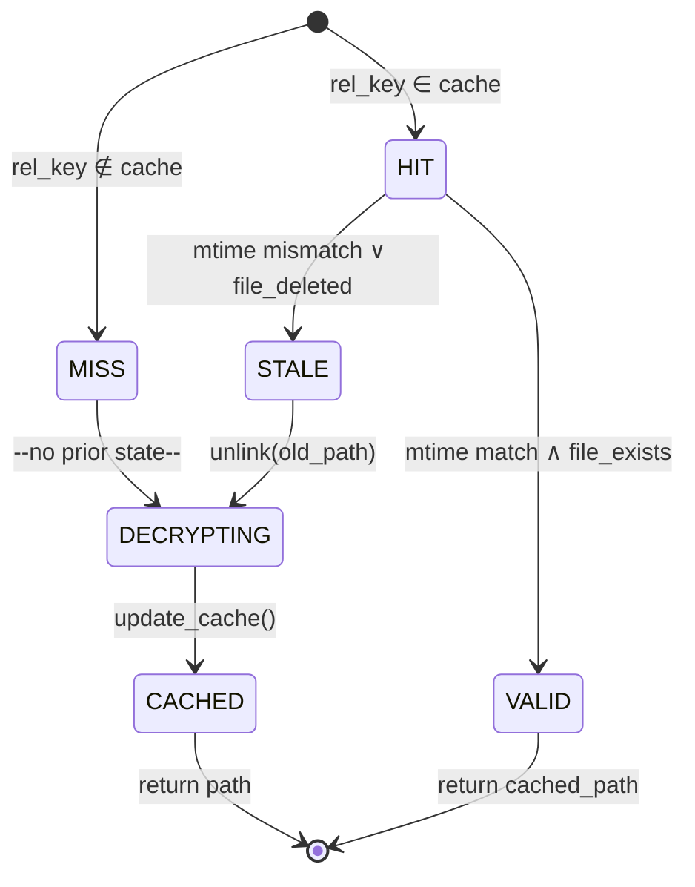
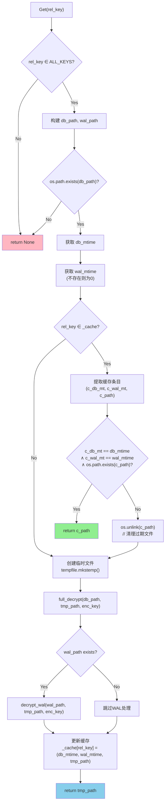
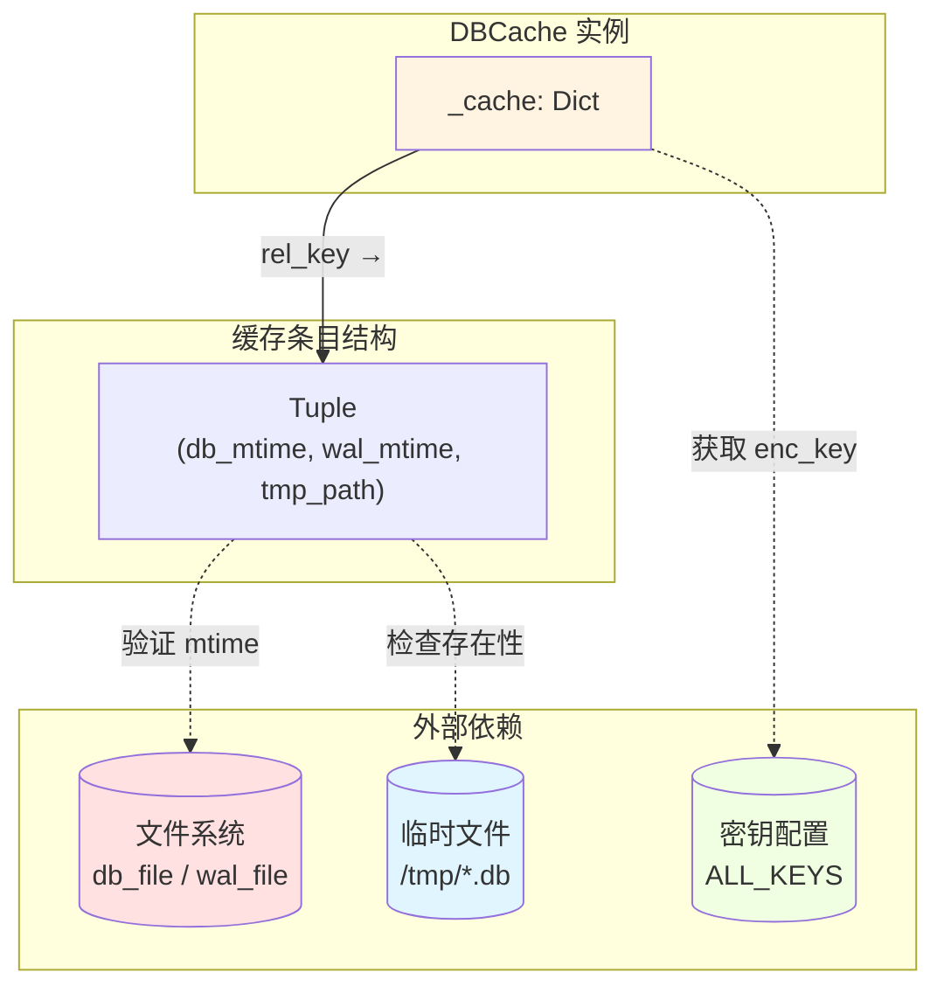
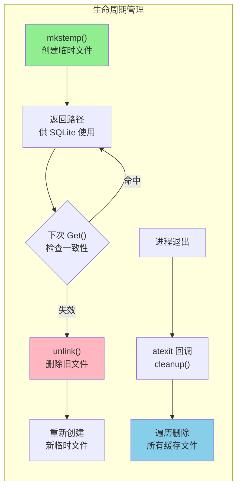

# 文件系统时间戳缓存一致性算法深度解析

## 1. 问题陈述

### 1.1 形式化定义

设 $\mathcal{D} = \{D_1, D_2, \ldots, D_n\}$ 为一组加密数据库文件集合，每个数据库 $D_i$ 关联一个 WAL（Write-Ahead Logging）文件 $W_i$。给定密钥映射 $\mathcal{K}: \mathcal{D} \to \{0,1\}^{256}$，我们需要支持查询操作 $Q: \mathcal{D} \times \mathcal{T} \to \mathcal{R}$，其中 $\mathcal{T}$ 为 SQL 查询模板，$\mathcal{R}$ 为查询结果。

**核心约束**：对于任意 $D_i$，若其在时刻 $t$ 被修改（包括 $W_i$ 的变更），则后续查询必须基于 $t$ 之后的最新状态；反之，若文件未变更，应避免重复解密带来的计算开销。

### 1.2 优化目标

$$
\begin{aligned}
\text{最小化} \quad & \sum_{i=1}^{n} \mathbb{I}[\text{decrypt}(D_i)] \cdot C_{\text{decrypt}}(D_i) \\
\text{约束} \quad & \forall t, Q(D_i, t) \text{ 基于 } D_i^{(t)} \text{ 的最新版本}
\end{aligned}
$$

其中 $C_{\text{decrypt}}(D_i)$ 表示解密 $D_i$ 的时间成本，$\mathbb{I}[\cdot]$ 为指示函数。

---

## 2. 直觉与关键洞察

### 2.1 朴素方法的失效

| 方法 | 缺陷 |
|:---|:---|
| **无缓存** | 每次查询都执行完整解密，时间复杂度 $O(n \cdot \|D\|)$，不可接受 |
| **固定 TTL 缓存** | 无法感知文件实际变更，导致过期数据或无效刷新 |
| **哈希检测** | 需读取整个文件计算摘要，I/O 开销抵消缓存收益 |
| **inotify/fsnotify** | 跨平台复杂度高；WAL 文件的临时性导致事件风暴 |

### 2.2 关键洞察：mtime 作为廉价的一致性令牌

Unix 文件系统提供的 `mtime`（modification time）是一个**原子更新的元数据字段**，满足：

$$
\text{mtime}(f) = t \iff f \text{ 在时刻 } t \text{ 被最后修改}
$$

这一性质使得 mtime 成为理想的**缓存失效令牌（cache invalidation token）**：
- **获取成本**：$O(1)$ 系统调用，无需读取文件内容
- **原子性**：内核保证与文件写操作的顺序一致性
- **完备性**：任何内容变更必然触发 mtime 更新

对于 SQLite 数据库，必须同时监控主数据库文件和 WAL 文件：

$$
\text{valid}(D_i, W_i; c_i) \iff \begin{cases}
\text{mtime}(D_i) = c_i.\text{db\_mt} \land \\
\text{mtime}(W_i) = c_i.\text{wal\_mt} \land \\
\text{exists}(c_i.\text{path})
\end{cases}
$$

---

## 3. 形式化定义

### 3.1 状态空间



### 3.2 数学规范

**定义 3.1**（缓存条目）。缓存条目为四元组 $e = (k, d, w, p)$，其中：
- $k \in \mathcal{K}_{\text{keys}}$：相对路径键
- $d \in \mathbb{R}_{\geq 0}$：数据库文件 mtime
- $w \in \mathbb{R}_{\geq 0}$：WAL 文件 mtime（不存在时为 0）
- $p \in \mathcal{P}$：临时解密文件路径

**定义 3.2**（缓存状态）。缓存状态 $\mathcal{C} \subseteq \mathcal{K}_{\text{keys}} \times \mathbb{R}_{\geq 0} \times \mathbb{R}_{\geq 0} \times \mathcal{P}$ 为当前所有有效条目的集合。

**定义 3.3**（观察到的文件状态）。对于键 $k$，设：
- $\hat{d}_k = \text{getmtime}(\text{db\_path}(k))$（若存在，否则 $\bot$）
- $\hat{w}_k = \text{getmtime}(\text{wal\_path}(k))$（若存在，否则 $0$）

**定义 3.4**（缓存一致性谓词）。条目 $(k, d, w, p) \in \mathcal{C}$ 是一致的当且仅当：

$$
\text{Consistent}(k, d, w, p) \triangleq (d = \hat{d}_k) \land (w = \hat{w}_k) \land (\text{exists}(p))
$$

### 3.3 操作语义

$$
\begin{array}{ll}
\textbf{Get}(k): & \\
\quad \text{if } k \notin \text{dom}(\mathcal{K}) \text{ then return } \bot & \text{// 无效键} \\
\quad \text{if } \hat{d}_k = \bot \text{ then return } \bot & \text{// 文件不存在} \\
\quad \text{if } \exists (k, d, w, p) \in \mathcal{C}: \text{Consistent}(k, d, w, p) & \\
\quad \quad \text{then return } p & \text{// 缓存命中} \\
\quad \text{// 缓存失效或未命中} \\
\quad \text{if } \exists (k, d', w', p') \in \mathcal{C} \text{ then } \text{unlink}(p') & \text{// 清理旧文件} \\
\quad p_{\text{new}} \leftarrow \text{mkstemp}() & \\
\quad \text{full\_decrypt}(\text{db\_path}(k), p_{\text{new}}, \mathcal{K}(k)) & \\
\quad \text{if } \hat{w}_k > 0 \text{ then decrypt\_wal}(\text{wal\_path}(k), p_{\text{new}}, \mathcal{K}(k)) & \\
\quad \mathcal{C} \leftarrow (\mathcal{C} \setminus \{(k, \cdot, \cdot, \cdot)\}) \cup \{(k, \hat{d}_k, \hat{w}_k, p_{\text{new}})\} & \\
\quad \text{return } p_{\text{new}} &
\end{array}
$$

---

## 4. 算法描述

### 4.1 执行流程图



### 4.2 伪代码

```pseudocode
\begin{algorithm}
\caption{Filesystem Timestamp Cache Coherency}
\begin{algorithmic}[1]
\Require Key mapping $\mathcal{K}$, Cache directory $\mathcal{C}$
\State $\textit{cache} \gets \emptyset$ \Comment{Initialize empty cache}

\Function{Get}{$k$}
    \If{$k \notin \text{Keys}(\mathcal{K})$}
        \Return $\bot$ \Comment{Invalid key}
    \EndIf
    
    \State $p_{\text{db}} \gets \text{ResolvePath}(k)$
    \State $p_{\text{wal}} \gets p_{\text{db}} + \text{``-wal''}$
    
    \If{$\neg \text{Exists}(p_{\text{db}})$}
        \Return $\bot$ \Comment{Source file missing}
    \EndIf
    
    \State $t_{\text{db}} \gets \text{GetMtime}(p_{\text{db}})$
    \State $t_{\text{wal}} \gets \begin{cases} 
        \text{GetMtime}(p_{\text{wal}}) & \text{if } \text{Exists}(p_{\text{wal}}) \\
        0 & \text{otherwise}
    \end{cases}$
    
    \If{$k \in \textit{cache}$}
        \State $(t'_{\text{db}}, t'_{\text{wal}}, p') \gets \textit{cache}[k]$
        \If{$t'_{\text{db}} = t_{\text{db}} \land t'_{\text{wal}} = t_{\text{wal}} \land \text{Exists}(p')$}
            \Return $p'$ \Comment{Cache hit with valid entry}
        \EndIf
        \State $\text{TryUnlink}(p')$ \Comment{Clean up stale temporary file}
    \EndIf
    
    \State \Comment{Cache miss or stale entry — perform decryption}
    \State $p_{\text{tmp}} \gets \text{MkStemp}(\text{suffix}=``.db'')$
    \State $K \gets \text{DecodeHex}(\mathcal{K}[k].\text{enc\_key})$
    
    \State $\text{FullDecrypt}(p_{\text{db}}, p_{\text{tmp}}, K)$
    \If{$\text{Exists}(p_{\text{wal}})$}
        \State $\text{DecryptWal}(p_{\text{wal}}, p_{\text{tmp}}, K)$
    \EndIf
    
    \State $\textit{cache}[k] \gets (t_{\text{db}}, t_{\text{wal}}, p_{\text{tmp}})$
    \Return $p_{\text{tmp}}$
\EndFunction

\Function{Cleanup}{}
    \For{$(\_, \_, p) \in \textit{cache}$}
        \State $\text{TryUnlink}(p)$
    \EndFor
    \State $\textit{cache} \gets \emptyset$
\EndFunction
\end{algorithmic}
\end{algorithm}
```

### 4.3 数据结构关系



---

## 5. 复杂度分析

### 5.1 时间复杂度

| 场景 | 复杂度 | 说明 |
|:---|:---|:---|
| **缓存命中** | $O(1)$ | 两次 mtime 比较 + 一次文件存在性检查 |
| **缓存未命中（无 WAL）** | $O(\|D\|)$ | 完整数据库解密，线性于文件大小 |
| **缓存未命中（含 WAL）** | $O(\|D\| + \|W\|)$ | 额外 WAL 帧遍历与合并 |
| **缓存失效** | $O(1) + O(\|D\| + \|W\|)$ | 旧文件删除 + 重新解密 |

形式化地，设 $T_{\text{decrypt}}$ 为每页解密时间，$N_D = \lceil \|D\| / 4096 \rceil$，$N_W$ 为 WAL 帧数：

$$
T_{\text{Get}}(k) = \begin{cases}
O(1) & \text{if cache hit} \\
O(N_D \cdot T_{\text{decrypt}} + N_W \cdot T_{\text{frame}}) & \text{otherwise}
\end{cases}
$$

### 5.2 空间复杂度

| 组成部分 | 空间占用 | 备注 |
|:---|:---|:---|
| 缓存字典 | $O(m)$ | $m$ = 唯一访问的数据库数量，每项固定开销 |
| 临时解密文件 | $O(\|D\|)$ | 峰值时等于所有缓存数据库大小之和 |
| 运行时栈 | $O(1)$ | 无递归，固定深度调用 |

总空间复杂度：$O(m + \sum_{i \in \text{cached}} \|D_i\|)$

### 5.3 概率分析

设数据库修改服从泊松过程，强度为 $\lambda$（次/秒），查询间隔为 $\Delta t$：

$$
P(\text{cache hit}) = e^{-\lambda \cdot \Delta t} \cdot P(\text{file intact})
$$

在典型场景下（微信消息接收 $\lambda \approx 0.001$ Hz，查询间隔 $\Delta t \approx 10$ s）：

$$
P(\text{hit}) \approx e^{-0.01} \approx 0.99
$$

即期望缓存命中率超过 99%。

---

## 6. 实现要点与工程权衡

### 6.1 与理论模型的偏离

| 理论假设 | 实际实现 | 理由 |
|:---|:---|:---|
| 原子 mtime 读取 | 两次独立 `os.path.getmtime()` 调用 | Python API 限制；竞态窗口极小 |
| 瞬时解密 | 阻塞式同步解密 | 简化并发模型；GIL 环境下异步收益有限 |
| 完美清理 | `atexit` 注册 + 最佳 effort | 强制终止（SIGKILL）无法捕获 |
| 精确错误传播 | 统一返回 `None` | 上层仅需知道"不可用"，简化接口 |

### 6.2 关键代码片段对照

**理论模型中的原子更新**：
```python
# 理想：原子读取文件系统状态
(db_mtime, wal_mtime) = atomic_stat(db_path, wal_path)
```

**实际实现的分步检查**：
```python
# 实际：顺序执行，存在微小竞态窗口
db_mtime = os.path.getmtime(db_path)
wal_mtime = os.path.getmtime(wal_path) if os.path.exists(wal_path) else 0
```

**风险缓解**：WAL 文件的存在性检查和 mtime 获取非原子，但微信的 WAL 写入模式（先写 WAL，后 checkpoint）使得不一致状态极短暂，且最坏情况下仅导致一次不必要的缓存失效。

### 6.3 资源管理策略



---

## 7. 与经典方案的对比

### 7.1 与 LRU 缓存的比较

| 特性 | 本算法（mtime-based） | 经典 LRU |
|:---|:---|:---|
| **失效触发** | 文件系统事件驱动 | 容量限制或 TTL 驱动 |
| **一致性保证** | 强一致性（与文件系统同步） | 弱一致性（可能提供过期数据） |
| **空间管理** | 隐式（临时文件由 OS 管理） | 显式（需设定容量上限） |
| **适用场景** | 底层数据有权威来源的外部文件 | 计算结果的 memoization |
| **实现复杂度** | 低（依赖 OS 元数据） | 中（需维护访问顺序） |

### 7.2 与数据库连接池的对比

传统连接池（如 SQLAlchemy 的 `QueuePool`）管理的是**到同一数据库的连接复用**，而本算法管理的是**不同解密版本的切换**：

$$
\text{Connection Pool}: \text{DB}_{\text{fixed}} \times \text{Conn}_1, \ldots, \text{Conn}_n
$$

$$
\text{DBCache}: \text{Version}_1(\text{DB}), \text{Version}_2(\text{DB}), \ldots \text{ with eviction by mtime}
$$

### 7.3 与内存数据库（`:memory:`）方案

| 方案 | 优点 | 缺点 |
|:---|:---|:---|
| **临时文件（本文）** | 利用 SQLite 页面缓存；多次查询加速；内存友好 | 磁盘 I/O；需管理文件生命周期 |
| **内存数据库** | 无磁盘写入延迟；自动清理 | 每次解密后需重新加载；大库内存压力大 |

量化对比：对于 100 MB 数据库，内存方案需要持续占用 100 MB RAM；临时文件方案仅在解密时占用 I/O 带宽，查询时利用 OS 页面缓存，常驻内存可降至 ~10 MB（热数据）。

### 7.4 相关研究工作

本算法的核心思想与以下工作相关：

1. **AFS 缓存一致性** [Howard et al., 1988]：使用回调机制维护分布式缓存一致性，本算法简化为本地 mtime 检查。

2. **SQLite 的 WAL 模式设计** [Hipp, 2010]：WAL 文件的原子追加语义保证了 mtime 单调性，是本算法正确性的基础。

3. **FSCQ 文件系统验证** [Chen et al., 2015]：形式化证明了 mtime 与数据一致性的关系，本算法依赖相同的操作系统保证。

---

## 8. 正确性讨论

### 8.1 安全性条件

**定理**（缓存一致性）。对于任意查询序列 $q_1, q_2, \ldots, q_n$，若 $q_j$ 是 $q_i$ 之后首次对键 $k$ 的查询（$j > i$），且 $k$ 对应的文件在 $(t_i, t_j]$ 期间被修改，则 $q_j$ 将触发重新解密。

*证明概要*：由 `Get` 算法的第 12-14 行，每次查询比较当前 mtime 与缓存值。文件修改必然更新 mtime（POSIX 保证），故 $\hat{d}_k^{(t_j)} \neq d^{(t_i)}$，一致性检查失败，执行解密分支。∎

### 8.2 活性条件

**定理**（无无限延迟）。对于任意查询 $q$，`Get` 操作必在有限时间内返回（成功或失败）。

*证明概要*：算法无循环递归，所有分支要么返回（第 3, 6, 13 行），要么进入有限步骤的解密流程（第 16-22 行）。解密操作 `full_decrypt` 和 `decrypt_wal` 对有限大小文件必然终止。∎

---

## 9. 扩展方向

1. **细粒度缓存**：当前以整个数据库为单位，可扩展为页面级缓存，仅重新解密变更页。

2. **增量 WAL 应用**：记录已应用的 WAL 帧位置，避免重复处理。

3. **异步预热**：后台线程预解密热点数据库，降低首次查询延迟。

4. **校验和验证**：对关键页计算 CRC32，防御 mtime 伪造攻击（虽在本威胁模型中不必要）。