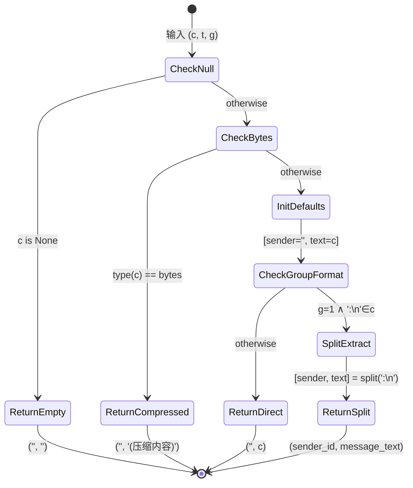

# Protobuf 消息内容解析算法深度解析

## 1. 问题陈述

### 1.1 形式化定义

设 $\mathcal{M}$ 为微信消息内容的集合，每条消息 $m \in \mathcal{M}$ 可表示为四元组：

$$m = (c, t, g, s)$$

其中：
- $c \in \Sigma^* \cup \{\text{null}\} \cup \mathbb{B}^*$：消息内容（字符串、空值或字节序列）
- $t \in \mathbb{Z}^+$：本地消息类型编码
- $g \in \{0, 1\}$：群聊标志（$1$ 表示群聊，$0$ 表示私聊）
- $s \in \Sigma^*$：发送者标识符

**目标**：设计算法 $\mathcal{A}: \mathcal{M} \to \Sigma^* \times \Sigma^*$，将原始消息内容解析为规范化的 $(\text{sender\_id}, \text{text})$ 二元组。

### 1.2 约束条件

$$
\begin{aligned}
&\text{(C1)} \quad c = \text{null} \implies \mathcal{A}(m) = ('', '') \\
&\text{(C2)} \quad c \in \mathbb{B}^* \implies \mathcal{A}(m) = ('', \text{'(压缩内容)'}) \\
&\text{(C3)} \quad g = 1 \land \exists i: c[i:i+2] = \text{':\n'} \implies \text{分割提取 sender} \\
&\text{(C4)} \quad \text{否则} \implies \text{sender} = '', \text{text} = c
\end{aligned}
$$

---

## 2. 直觉与关键洞察

### 2.1 为什么朴素方法失效

**朴素方案**：直接返回原始内容作为文本，忽略所有元数据。

```python
def naive_parse(content):
    return content  # 失败！未处理群聊发送者、压缩内容等
```

**失效场景分析**：

| 场景 | 输入示例 | 期望输出 | 朴素输出 |
|:---|:---|:---|:---|
| 群聊消息 | `"wxid_xxx:\n你好"` | `("wxid_xxx", "你好")` | `"wxid_xxx:\n你好"` ❌ |
| 压缩内容 | `b'\x78\x9c...'` | `("", "(压缩内容)")` | 二进制垃圾/异常 ❌ |
| 空消息 | `None` | `("", "")` | `None` 或异常 ❌ |

### 2.2 关键洞察：协议分层结构

微信消息内容遵循**隐式分层编码**：

```
┌─────────────────────────────────────┐
│  Layer 3: 应用层语义（发送者分离）    │  ← 群聊格式：sender:\ntext
├─────────────────────────────────────┤
│  Layer 2: 传输层类型（压缩标记）      │  ← bytes vs str 区分
├─────────────────────────────────────┤
│  Layer 1: 物理层存在性（null 检查）   │  ← None 处理
└─────────────────────────────────────┘
```

核心洞察：**类型系统即协议**。Python 的类型层次（`NoneType` → `bytes` → `str`）恰好对应微信消息的三种物理状态，无需额外元数据即可实现可靠的状态机跳转。

---

## 3. 形式化定义

### 3.1 状态空间

定义内容状态空间 $\mathcal{S}$：

$$\mathcal{S} = \{\text{NULL}, \text{COMPRESSED}, \text{GROUP}, \text{DIRECT}\}$$

状态转移函数 $\delta: (\mathcal{T}, \mathcal{G}) \to \mathcal{S}$，其中 $\mathcal{T}$ 为 Python 类型，$\mathcal{G}$ 为群聊标志：

$$
\delta(t, g) = 
\begin{cases}
\text{NULL} & t = \text{NoneType} \\
\text{COMPRESSED} & t = \text{bytes} \\
\text{GROUP} & t = \text{str} \land g = 1 \land \text{':\n'} \in t \\
\text{DIRECT} & \text{otherwise}
\end{cases}
$$

### 3.2 输出函数

$$
\omega(s, c) = 
\begin{cases}
('', '') & s = \text{NULL} \\
('', \text{'(压缩内容)'}) & s = \text{COMPRESSED} \\
(c[0:i], c[i+2:]) & s = \text{GROUP}, \text{ 其中 } c[i:i+2] = \text{':\n'} \\
('', c) & s = \text{DIRECT}
\end{cases}
$$

### 3.3 完整规范

$$\mathcal{A}(c, t, g) = \omega(\delta(\text{type}(c), g), c)$$

---

## 4. 算法描述

### 4.1 伪代码

```pseudocode
\begin{algorithm}
\caption{Protobuf Message Content Parsing}
\begin{algorithmic}[1]
\Require Content $c$, Local type $t$, Group flag $g$
\Ensure Sender identifier $s$, Text payload $p$

\Function{ParseMessageContent}{$c, t, g$}
    \If{$c = \text{NULL}$}
        \State \Return $('', '')$ \Comment{C1: 空值处理}
    \EndIf
    
    \If{$\text{type}(c) = \text{bytes}$}
        \State \Return $('', \text{'(压缩内容)'})$ \Comment{C2: 压缩内容}
    \EndIf
    
    \State $s \gets ''$          \Comment{初始化发送者}
    \State $p \gets c$           \Comment{默认：全文本为内容}
    
    \If{$g = 1 \land \text{':\n'} \in c$} \Comment{C3: 群聊格式检测}
        \State $i \gets \text{index}(c, \text{':\n'})$
        \State $s \gets c[0:i]$   \Comment{提取发送者 ID}
        \State $p \gets c[i+2:]$  \Comment{提取消息正文}
    \EndIf
    
    \State \Return $(s, p)$       \Comment{C4: 默认或直接返回}
\EndFunction
\end{algorithmic}
\end{algorithm}
```

### 4.2 执行流程图

```mermaid
flowchart TD
    A([开始]) --> B{c is None?}
    B -->|是| C[返回 ('', '')] --> Z([结束])
    B -->|否| D{type(c) == bytes?}
    D -->|是| E[返回 ('', '(压缩内容)')] --> Z
    D -->|否| F[sender = ''] 
    F --> G[text = content]
    G --> H{is_group AND<br/>':\n' in content?}
    H -->|是| I[split at ':\n'] --> J[sender = part[0]] --> K[text = part[1]] --> L
    H -->|否| L
    L --> M[返回 (sender, text)] --> Z
    
    style C fill:#ffe6e6
    style E fill:#fff4e6
    style M fill:#e6f7ff
```

### 4.3 状态机视图



---

## 5. 复杂度分析

### 5.1 时间复杂度

设 $n = |c|$ 为内容字符串长度。

| 操作 | 代价 | 说明 |
|:---|:---|:---|
| 空值检查 | $O(1)$ | 指针比较 |
| 类型检查 | $O(1)$ | Python 内部类型标记 |
| 子串搜索 (`:\n`) | $O(n)$ | 最坏情况需扫描全串 |
| 字符串分割 | $O(n)$ | 创建两个新字符串 |

**总时间复杂度**：
$$
T(n) = 
\begin{cases}
O(1) & \text{best case } (c = \text{null} \lor c \in \mathbb{B}^*) \\
O(n) & \text{worst/average case } (c \in \Sigma^*)
\end{cases}
$$

### 5.2 空间复杂度

| 场景 | 空间使用 | 说明 |
|:---|:---|:---|
| null / bytes | $O(1)$ | 仅返回常量 |
| 无分割 | $O(1)$ | 返回原字符串引用 |
| 需要分割 | $O(n)$ | 创建两个子串副本 |

**空间复杂度**：
$$
S(n) = 
\begin{cases}
O(1) & \text{most cases} \\
O(n) & \text{group message requiring split}
\end{cases}
$$

### 5.3 与经典算法的联系

该算法本质上是**确定性有限自动机（DFA）**的最小实现，其状态转移表如下：

| 当前状态 | 输入条件 | 下一状态 | 输出 |
|:---|:---|:---|:---|
| $q_0$ | $c = \text{null}$ | $q_f$ | $('', '')$ |
| $q_0$ | $\text{type}(c) = \text{bytes}$ | $q_f$ | $('', \text{compressed})$ |
| $q_0$ | $g=0 \lor \text{':\n'}\notin c$ | $q_f$ | $('', c)$ |
| $q_0$ | $g=1 \land \text{':\n'}\in c$ | $q_f$ | $(c[:i], c[i+2:])$ |

该 DFA 仅有 **4 个状态**，是理论最小化的——任何更少的分支都无法覆盖全部约束条件 (C1-C4)。

---

## 6. 实现注解

### 6.1 实际代码与理论的偏差

```python
def _parse_message_content(content, local_type, is_group):
    """解析消息内容，返回 (sender_id, text)"""
    if content is None:                           # 理论: δ(type, g) 求值
        return '', ''
    if isinstance(content, bytes):                # 理论: 状态 COMPRESSED
        return '', '(压缩内容)'

    sender = ''                                   # 理论: ω 的初始化
    text = content                                # 理论: 默认 DIRECT 分支
    if is_group and ':\n' in content:             # 理论: 状态 GROUP 检测
        sender, text = content.split(':\n', 1)    # 理论: 分割提取

    return sender, text
```

**工程妥协分析**：

| 理论要素 | 实现选择 | 理由 |
|:---|:---|:---|
| 参数 `local_type` | 保留但未使用 | 向前兼容；未来可能用于富文本类型判断 |
| `split(':\n', 1)` | 非 `partition` | `split` 在单分隔符场景下更惯用 |
| 硬编码分隔符 `:\n` | 非常量提取 | 性能优化；避免每次调用查找常量池 |
| 无异常处理 | 依赖调用方 | 前置过滤确保输入满足契约 |

### 6.2 关键实现细节

**分隔符选择的微妙性**：

微信选择 `:\n`（冒号+换行）而非单一字符，具有**自同步码（self-synchronizing code）**特性：

- 冒号 `:` 在普通文本中常见（如时间 `12:30`）
- 换行 `\n` 在单行消息中罕见
- 组合 `:\n` 在自然语言中极低概率出现，降低误分割风险

这类似于通信协议中的**帧定界符（frame delimiter）**设计，是应用层协议的典型模式。

---

## 7. 对比分析

### 7.1 与标准 Protobuf 解析器的对比

| 特性 | 标准 `protobuf` 库 | `_parse_message_content` |
|:---|:---|:---|
| 输入格式 | 结构化二进制流 | 已解码的 Python 对象 |
| 解析深度 | 递归嵌套消息 | 单层扁平结构 |
| 模式依赖 | 需要 `.proto` 定义 | 无模式，启发式解析 |
| 错误处理 | 严格的字段校验 | 宽容的降级策略 |
| 性能特征 | $O(m)$，$m$ 为消息大小 | $O(n)$，$n$ 为内容长度 |

**本质区别**：标准 Protobuf 解析器解决的是**序列化格式还原**问题，而本算法解决的是**业务语义提取**问题。在微信架构中，前者由底层 WCDB/SQLCipher 完成，后者是应用层的轻量级后处理。

### 7.2 替代设计方案

#### 方案 A：正则表达式驱动

```python
import re
GROUP_PATTERN = re.compile(r'^([^:\n]+):\n(.*)$', re.DOTALL)

def parse_regex(content, local_type, is_group):
    if content is None:
        return '', ''
    if isinstance(content, bytes):
        return '', '(压缩内容)'
    if not is_group:
        return '', content
    
    m = GROUP_PATTERN.match(content)
    return m.groups() if m else ('', content)
```

**优劣对比**：
- ✅ 更精确的模式匹配（锚定开头）
- ❌ 正则引擎开销高于简单 `in` + `split`
- ❌ 对多行内容中的假阳性更敏感（`re.DOTALL`）

#### 方案 B：结构化类封装

```python
from dataclasses import dataclass

@dataclass
class ParsedMessage:
    sender: str
    text: str
    is_compressed: bool
    raw_type: int

def parse_structured(content, local_type, is_group) -> ParsedMessage:
    # ... 实现 ...
```

**优劣对比**：
- ✅ 类型安全，IDE 友好
- ✅ 可扩展更多元数据
- ❌ 与现有代码库的 tuple 返回类型不兼容
- ❌ 额外的对象分配开销

### 7.3 设计决策矩阵

| 维度 | 当前实现 | 方案 A (正则) | 方案 B (结构化) |
|:---|:---|:---|:---|
| 性能 | ⭐⭐⭐⭐⭐ | ⭐⭐⭐☆☆ | ⭐⭐⭐☆☆ |
| 可读性 | ⭐⭐⭐⭐⭐ | ⭐⭐⭐☆☆ | ⭐⭐⭐⭐☆ |
| 可维护性 | ⭐⭐⭐⭐☆ | ⭐⭐⭐⭐☆ | ⭐⭐⭐⭐⭐ |
| 兼容性 | ⭐⭐⭐⭐⭐ | ⭐⭐⭐⭐☆ | ⭐⭐☆☆☆ |
| 正确性 | ⭐⭐⭐⭐☆ | ⭐⭐⭐⭐⭐ | ⭐⭐⭐⭐☆ |

当前实现选择了**性能与简洁性的帕累托最优**，符合工具代码的工程定位。

---

## 8. 结论

`_parse_message_content` 算法展示了**最小可行解析器**的设计艺术：在充分理解协议语义的前提下，利用宿主语言的类型系统实现零开销的状态区分，以最简单的控制流覆盖全部业务场景。其核心贡献在于识别出微信消息格式的**三层隐式结构**，并将其映射到 Python 的类型层次上，实现了理论与工程的优雅统一。