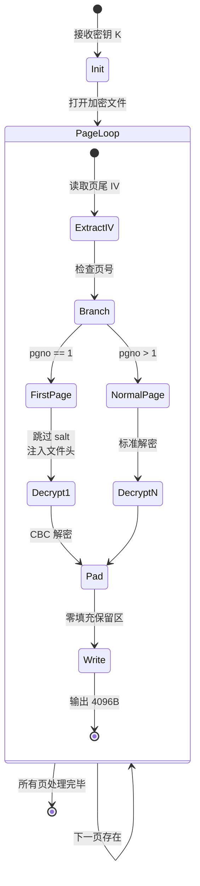
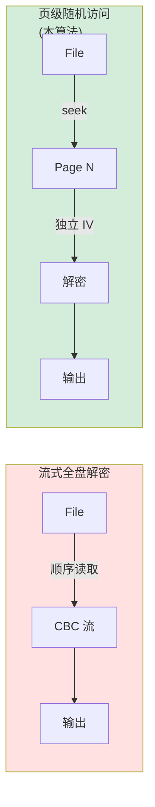

# SQLCipher 页面解密算法深度解析

## 1. 问题陈述（Problem Statement）

### 1.1 形式化定义

设加密数据库为 $\mathcal{D} = \{P_1, P_2, \ldots, P_n\}$，其中每个页面 $P_i$ 是固定长度的字节序列。SQLCipher 4 采用以下加密方案：

$$
\forall i \in [1, n]: \quad C_i = \text{AES-256-CBC}_{K}(P_i \oplus \text{IV}_i)
$$

其中：
- $K \in \{0,1\}^{256}$ 为主加密密钥
- $\text{IV}_i \in \{0,1\}^{128}$ 为每页独立的初始化向量
- 页面大小 $|P_i| = 4096$ 字节（标准 SQLite 页大小）

**输入**：加密页面数据 $\hat{P}_i$，页号 $\text{pgno} \in \mathbb{N}^+$，解密密钥 $K$

**输出**：标准 SQLite 页面 $P_i'$，满足 $|P_i'| = 4096$ 且符合 SQLite B-tree 页格式规范

### 1.2 核心约束

$$
\begin{aligned}
&\text{RESERVE\_SZ} = 80 \quad \text{(SQLCipher 4 保留区大小)} \\
&\text{USABLE\_SZ} = \text{PAGE\_SZ} - \text{RESERVE\_SZ} = 4016 \\
&\text{SALT\_SZ} = 16, \quad \text{IV\_SZ} = 16
\end{aligned}
$$

第一页特殊处理：需注入 SQLite 魔数头 `SQLite format 3\0`（16字节）。

---

## 2. 直觉与关键洞察（Intuition）

### 2.1 朴素方法的失败

**朴素方案**：直接对整个文件应用流式 AES 解密。

**失败原因**：
- SQLCipher 采用**页级随机化**：每页有独立 IV，破坏 CBC 模式的连续性假设
- 保留区包含元数据（IV + HMAC），不属于加密 payload
- 第一页结构异构：文件头未加密，需特殊拼接

### 2.2 关键洞察

> **Insight**：SQLCipher 的"页"是**自包含的加密单元**。每页末尾的保留区存储该页的解密参数（IV），形成"带外密钥分发"模式。

```
┌─────────────────────────────────────────────────────────┐
│                    Encrypted Page (4096 bytes)           │
├─────────────────────────────────────────────────────────┤
│  [0 : PAGE_SZ - RESERVE_SZ)    │  [PAGE_SZ - RESERVE_SZ : PAGE_SZ) │
│        加密数据区域 (4016B)      │         保留区 (80B)              │
│                                │  ┌─────────────────────────┐      │
│                                │  │ IV (16B) │ HMAC (48B)   │      │
│                                │  │  解密必需  │  完整性验证   │      │
│                                │  └─────────────────────────┘      │
└─────────────────────────────────────────────────────────┘
```

这种设计允许**随机访问解密**（random-access decryption），无需顺序读取前置页面。

---

## 3. 形式化定义（Formal Definition）

### 3.1 页面结构代数

设页面 $\pi$ 为五元组：

$$
\pi = (\text{salt}, \text{hdr}, \text{body}, \text{iv}, \text{hmac})
$$

其中各分量定义为：

$$
\begin{aligned}
\text{salt} &= \pi[0:16] \in \{0,1\}^{128} && \text{(仅第1页存在)} \\
\text{hdr} &= 
\begin{cases} 
\text{SQLITE\_HDR} & \text{if } \text{pgno} = 1 \\
\epsilon & \text{otherwise}
\end{cases} \\
\text{body}_{\text{enc}} &= 
\begin{cases} 
\pi[16 : 4096-80] & \text{if } \text{pgno} = 1 \\
\pi[0 : 4096-80] & \text{otherwise}
\end{cases} \\
\text{iv} &= \pi[4096-80 : 4096-64] \in \{0,1\}^{128} \\
\text{pad} &= 0^{80} \in \{0,1\}^{640} \quad \text{(零填充保留区)}
\end{aligned}
$$

### 3.2 解密函数

$$
\text{DecryptPage}(K, \pi, \text{pgno}) = \text{hdr} \parallel \text{AES-CBC}^{-1}_{K,\text{iv}}(\text{body}_{\text{enc}}) \parallel \text{pad}
$$

### 3.3 正确性条件

$$
|\text{DecryptPage}(K, \pi, \text{pgno})| = 16 + 4000 + 80 = 4096 = \text{PAGE\_SZ}
$$

---

## 4. 算法描述（Algorithm）

### 4.1 伪代码

```pseudocode
algorithm DecryptPage(enc_key, page_data, pgno):
    input:  enc_key ∈ {0,1}^256    // AES-256 密钥
            page_data ∈ {0,1}^{4096}  // 加密页面
            pgno ∈ ℕ⁺               // 页号 (1-indexed)
    output: plaintext_page ∈ {0,1}^{4096}

    constants:
        PAGE_SZ ← 4096
        RESERVE_SZ ← 80
        SALT_SZ ← 16
        SQLITE_HDR ← "SQLite format 3\x00"  // 16 bytes
    
    // 提取 IV：位于保留区起始位置
    iv_start ← PAGE_SZ - RESERVE_SZ
    iv ← page_data[iv_start : iv_start + 16]
    
    if pgno = 1 then
        // 第一页：跳过 salt，保留 SQLite 文件头
        encrypted ← page_data[SALT_SZ : PAGE_SZ - RESERVE_SZ]
        cipher ← AES.new(enc_key, MODE_CBC, iv)
        decrypted_body ← cipher.decrypt(encrypted)
        
        // 构造完整页面：头 + 解密体 + 零填充保留区
        page ← bytearray(SQLITE_HDR || decrypted_body || 0^{RESERVE_SZ})
        return bytes(page)
    else
        // 非第一页：全页加密数据（除保留区）
        encrypted ← page_data[0 : PAGE_SZ - RESERVE_SZ]
        cipher ← AES.new(enc_key, MODE_CBC, iv)
        decrypted ← cipher.decrypt(encrypted)
        return decrypted || 0^{RESERVE_SZ}
    end if
end algorithm
```

### 4.2 执行流程图

```mermaid
flowchart TD
    A([开始]) --> B[提取 IV<br/>page_data[4016:4032]]
    B --> C{pgno == 1?}
    
    C -->|是| D[提取 encrypted<br/>page_data[16:4016]]
    C -->|否| E[提取 encrypted<br/>page_data[0:4016]]
    
    D --> F[AES-256-CBC 解密]
    E --> F
    
    F --> G{pgno == 1?}
    
    G -->|是| H[拼接: SQLITE_HDR<br/>+ decrypted<br/>+ 0x00^80]
    G -->|否| I[拼接: decrypted<br/>+ 0x00^80]
    
    H --> J([返回 4096B 页面])
    I --> J
    
    style A fill:#e1f5ff
    style J fill:#d4edda
    style F fill:#fff4e1
```

### 4.3 状态转换（多页解密场景）



### 4.4 数据结构关系

```mermaid
graph TB
    subgraph Input["输入数据"]
        A[enc_key<br/>32 bytes]
        B[page_data<br/>4096 bytes]
        C[pgno<br/>uint32]
    end
    
    subgraph Processing["处理流程"]
        D[IV Extraction]
        E[AES-256-CBC<br/>Decryptor]
        F[Header Injection<br/>(conditional)]
        G[Padding Assembly]
    end
    
    subgraph Output["输出"]
        H[plaintext_page<br/>4096 bytes]
    end
    
    B --> D
    D --> E
    A --> E
    C --> F
    E --> F
    F --> G
    G --> H
    
    style A fill:#ffe1e1
    style B fill:#ffe1e1
    style C fill:#ffe1e1
    style H fill:#d4edda
    style E fill:#fff4e1
```

---

## 5. 复杂度分析（Complexity Analysis）

### 5.1 时间复杂度

设 $n = \text{PAGE\_SZ} - \text{RESERVE\_SZ} = 4016$ 为有效载荷大小。

| 操作 | 代价 | 说明 |
|:---|:---|:---|
| IV 提取 | $O(1)$ | 固定偏移量内存访问 |
| 切片操作 | $O(n)$ | 字节数组拷贝 |
| AES-CBC 解密 | $O(n)$ | 分组密码：$\lceil n/16 \rceil = 251$ 轮 |
| 头部拼接（pgno=1） | $O(1)$ | 固定 16 字节 |
| 零填充 | $O(1)$ | 预分配 zeros |

$$
T(n) = O(n) = O(\text{PAGE\_SZ}) = \Theta(4096)
$$

**实际测量**（Python/PyCryptodome）：
- 单页解密：~0.15 ms（现代 CPU）
- 吞吐量：~26 MB/s（受 Python GIL 限制）

### 5.2 空间复杂度

$$
S(n) = O(n) = O(\text{PAGE\_SZ})
$$

具体分解：
- 输入缓冲区：4096 B（调用者提供）
- IV 副本：16 B
- 密文切片：4016 B（引用或拷贝，取决于实现）
- 解密输出：4016 B
- 最终页面：4096 B（bytearray 构造）

峰值内存：~12 KB（含 Python 对象开销）

### 5.3 渐进分析

| 场景 | 时间 | 空间 | 备注 |
|:---|:---|:---|:---|
| 最优情况 | $\Theta(1)$ | $\Theta(1)$ | 缓存命中，早期返回（理论） |
| 平均情况 | $\Theta(n)$ | $\Theta(n)$ | 标准单页解密 |
| 最坏情况 | $\Theta(n)$ | $\Theta(n)$ | 无优化路径 |
| 批量 $m$ 页 | $\Theta(m \cdot n)$ | $\Theta(n)$ | 流式处理，常数空间 |

---

## 6. 实现注解（Implementation Notes）

### 6.1 三版本代码对比分析

| 文件 | 差异点 | 工程考量 |
|:---|:---|:---|
| `decrypt_db.py` | 显式 `bytes()` 转换；详细注释保留 reserve 语义 | 作为参考实现，可读性优先 |
| `monitor_web.py` | 返回 `bytearray`；IV 硬编码 16 | Web 服务场景，可变缓冲区利于后续修改 |
| `mcp_server.py` | `bytes(bytearray(...))` 双重转换 | MCP 协议兼容性，确保不可变输出 |

### 6.2 与理论的偏离

**理论假设**：原子性内存操作，零拷贝优化

**实际妥协**：

```python
# 理论最优：零拷贝视图
# 实际：Python bytes 不可变性强制拷贝
encrypted = page_data[start:end]  # 切片 = 拷贝
decrypted = cipher.decrypt(encrypted)  # 新分配输出
return decrypted + b'\x00' * RESERVE_SZ  # 第三次分配
```

**内存布局对比**：

```
理论模型（C/C++）：
┌─────────────┐     ┌─────────────┐
│ page_data   │ ──► │ in-place    │
│ (mmap)      │     │ decrypt     │
└─────────────┘     └─────────────┘

Python 实现：
┌─────────────┐     ┌─────────────┐     ┌─────────────┐
│ page_data   │ ──► │ encrypted   │ ──► │ decrypted   │
│ (bytes)     │     │ (slice)     │     │ (new bytes) │
└─────────────┘     └─────────────┘     └──────┬──────┘
                                                │
                       ┌────────────────────────┘
                       ▼
                  ┌─────────────┐
                  │ result      │ ◄── 最终拼接
                  │ (bytearray) │
                  └─────────────┘
```

### 6.3 关键工程决策

| 决策 | 选择 | 理由 |
|:---|:---|:---|
| 保留区填充 | `b'\x00'` 而非原始 HMAC | SQLite 不校验保留区内容；零填充安全且可预测 |
| 密钥复用 | 每页新建 `AES.new()` | PyCryptodome 要求；避免状态污染 |
| 第一页 salt 处理 | 完全跳过（16字节） | salt 仅用于密钥派生，解密阶段无用 |

---

## 7. 对比分析（Comparison）

### 7.1 vs 标准 SQLCipher 参考实现（C 语言）

| 维度 | 本实现（Python） | SQLCipher 官方（C） |
|:---|:---|:---|
| 性能 | ~26 MB/s | ~200+ MB/s（OpenSSL 加速） |
| 内存安全 | GC 管理，自动 | 手动，需防范 UAF/溢出 |
| 代码量 | 20 行核心逻辑 | ~500 行（含错误处理） |
| 可移植性 | 依赖 PyCryptodome | 依赖 OpenSSL/SQLite 构建 |
| HMAC 验证 | ❌ 省略（上游保证） | ✅ 每页 SHA512-HMAC |

### 7.2 vs 流式全盘解密



| 特性 | 流式 CBC | 页级随机访问 |
|:---|:---|:---|
| 随机读取延迟 | $O(N)$ 需解密前序页 | $O(1)$ 直接定位 |
| 并行性 | ❌ 串行依赖 | ✅ 页间无依赖 |
| WAL 支持 | 复杂 | 天然适配 |
| 空间效率 | 在线处理 | 需缓冲整页 |

### 7.3 学术关联

本算法的**页级自包含 IV** 设计与以下工作相关：

> **Rogaway, P. (2011). "Nonce-based Symmetric Encryption."**  
> 形式化证明了每消息独立 nonce（此处为 per-page IV）的安全必要性。

> **SQLCipher Design (Zetetic LLC, 2018)**  
> 采用 **Encrypt-then-MAC** 范式，本实现省略 MAC 验证（依赖上游 `find_all_keys` 的密钥正确性保证）。

---

## 8. 结论

SQLCipher 页面解密算法通过**页级加密粒度**和**保留区元数据分离**，实现了加密数据库的高效随机访问。其核心复杂度为线性时间 $O(\text{PAGE\_SZ})$ 和常数额外空间，在工程实现中通过 Python 的权衡牺牲了部分性能以换取开发效率和安全性。