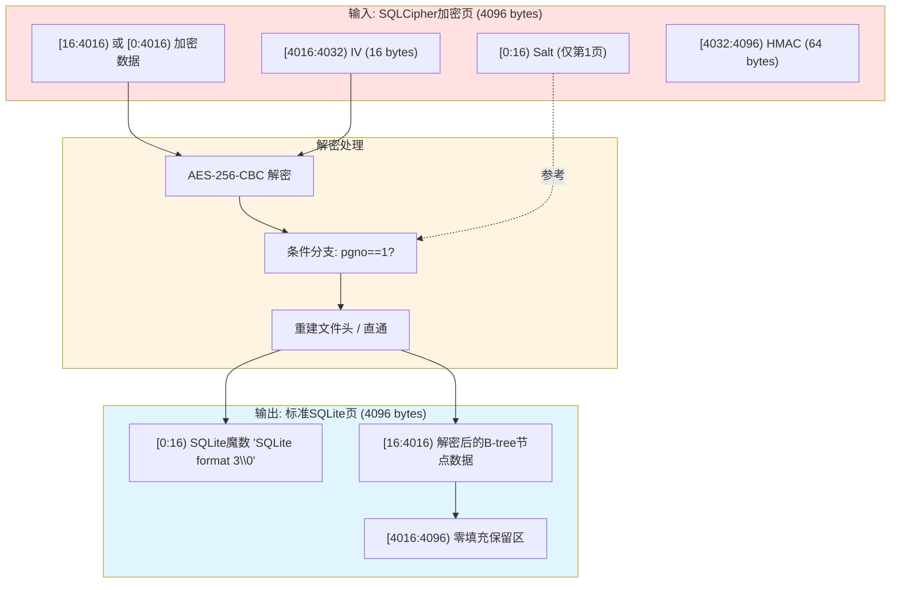

# SQLCipher 页面解密与 HMAC 验证算法深度解析

## 1. 问题陈述

### 1.1 形式化定义

设 $\mathcal{D}$ 为 SQLCipher 4 加密的数据库文件，其由 $n$ 个固定大小的页组成：
$$\mathcal{D} = \{P_1, P_2, \ldots, P_n\}, \quad |P_i| = 4096 \text{ bytes}$$

每页 $P_i$ 具有如下结构：

$$
P_i = \underbrace{E_{k_{\text{enc}}}^{\text{CBC}}(M_i; IV_i)}_{\text{encrypted payload}} \parallel \underbrace{IV_i}_{16\text{B}} \parallel \underbrace{HMAC_{k_{\text{mac}}}(C_i)}_{64\text{B}}
$$

其中：
- $M_i$: 明文页内容（第1页含16字节 SQLite 文件头 salt）
- $IV_i$: 初始化向量，从保留区提取
- $C_i$: 密文数据（即 encrypted payload）
- $k_{\text{enc}}$: AES-256 加密密钥
- $k_{\text{mac}}$: HMAC-SHA512 认证密钥

**核心问题**：给定派生密钥 $k_{\text{enc}}$ 和加密页数据 $P_i$，恢复标准 SQLite 页 $M_i'$，满足：
$$M_i' = \begin{cases} 
\text{SQLITE\_HDR} \parallel M_i[16:] & i = 1 \\
M_i & i > 1
\end{cases}$$

且 $|M_i'| = 4096$ bytes（不足部分零填充）。

### 1.2 约束条件

| 参数 | 值 | 说明 |
|:---|:---|:---|
| $\text{PAGE\_SZ}$ | 4096 | SQLite 页大小 |
| $\text{RESERVE\_SZ}$ | 80 | 每页保留区（IV + HMAC）|
| $\text{SALT\_SZ}$ | 16 | 第1页 salt 大小 |
| $\text{KEY\_SZ}$ | 32 | AES-256 密钥长度 |
| $\text{IV\_SZ}$ | 16 | CBC 模式 IV 长度 |

## 2. 直觉与关键洞察

### 2.1 朴素方法的失败

**朴素方法1：直接全文件解密**
- 将数据库视为连续字节流进行 CBC 解密
- **失败原因**：每页独立使用不同 IV，跨页边界会破坏链式传播

**朴素方法2：忽略保留区**
- 假设整页 4096 字节均为密文
- **失败原因**：最后 80 字节为元数据（IV + HMAC），非密文

**朴素方法3：统一处理所有页**
- 对所有页应用相同解密逻辑
- **失败原因**：第1页包含特殊文件头结构，需重建标准 SQLite 魔数

### 2.2 关键洞察

SQLCipher 的页结构设计蕴含三个关键分离原则：

```
┌─────────────────────────────────────────────────────────┐
│  洞察1: 空间分离 —— 密文与元数据物理隔离                    │
│  [0 : PAGE_SZ - RESERVE_SZ)    → 加密数据                │
│  [PAGE_SZ - RESERVE_SZ : PAGE_SZ) → IV || HMAC          │
├─────────────────────────────────────────────────────────┤
│  洞察2: 页间独立 —— 每页拥有独立 IV，可并行解密             │
│  ∀i≠j: IV_i 与 IV_j 无依赖关系                          │
├─────────────────────────────────────────────────────────┤
│  洞察3: 语义分层 —— 第1页承载全局元信息                     │
│  pgno=1: 需重建 SQLite 文件头 (16 bytes)                 │
│  pgno>1: 纯数据页，直接输出                               │
└─────────────────────────────────────────────────────────┘
```

这一结构使得我们可以：
1. **随机访问**：无需顺序解密，可直接定位任意页
2. **延迟验证**：HMAC 可独立计算，支持流式处理
3. **格式转换**：在解密同时完成 SQLCipher → 标准 SQLite 的格式迁移

## 3. 形式化定义

### 3.1 页分解函数

定义页分解算子 $\phi: \{0,1\}^{4096} \times \mathbb{Z}^+ \rightarrow \{0,1\}^* \times \{0,1\}^{16}$：

$$
\phi(P_i, i) = \begin{cases}
(P_i[16:4016], P_i[4016:4032]) & i = 1 \\
(P_i[0:4016], P_i[4016:4032]) & i > 1
\end{cases}
$$

其中输出 $(C_i, IV_i)$ 分别为密文段和初始化向量。

### 3.2 解密变换

AES-256-CBC 解密算子 $\mathcal{D}_{k}^{\text{CBC}}: \{0,1\}^{*} \times \{0,1\}^{16} \rightarrow \{0,1\}^{*}$：

$$
M_i = \mathcal{D}_{k_{\text{enc}}}^{\text{CBC}}(C_i; IV_i) = \text{AES-256-Decrypt}_k(C_i) \oplus IV_i^{\text{chain}}
$$

其中 $IV_i^{\text{chain}}$ 为 CBC 链式向量（首块为 $IV_i$，后续为前序密文块）。

### 3.3 页重构函数

定义重构算子 $\psi: \{0,1\}^{*} \times \mathbb{Z}^+ \rightarrow \{0,1\}^{4096}$：

$$
\psi(M_i, i) = \begin{cases}
\underbrace{\texttt{"SQLite format 3\0"}}_{\text{SQLITE\_HDR}} \parallel M_i[16:] \parallel \mathbf{0}^{80} & i = 1 \\
M_i \parallel \mathbf{0}^{80} & i > 1
\end{cases}
$$

其中 $\mathbf{0}^{80}$ 表示 80 字节零填充，用于替代原保留区。

### 3.4 完整解密映射

单页解密函数 $\Delta: \{0,1\}^{4096} \times \{0,1\}^{256} \times \mathbb{Z}^+ \rightarrow \{0,1\}^{4096}$：

$$
\Delta(P_i, k_{\text{enc}}, i) = \psi\left(\mathcal{D}_{k_{\text{enc}}}^{\text{CBC}}(\phi(P_i, i)), i\right)
$$

## 4. 算法描述

### 4.1 伪代码

```pseudocode
\begin{algorithm}
\caption{SQLCipher Page Decryption with Format Reconstruction}
\begin{algorithmic}[1]
\Require Encrypted page $P \in \{0,1\}^{4096}$, key $k \in \{0,1\}^{256}$, page number $pgno \in \mathbb{Z}^+$
\Ensure Standard SQLite page $P' \in \{0,1\}^{4096}$

\State \textbf{constants:}
\State \quad $PAGE\_SZ \gets 4096$, $RESERVE\_SZ \gets 80$, $SALT\_SZ \gets 16$, $IV\_SZ \gets 16$
\State \quad $SQLITE\_HDR \gets \texttt{"SQLite format 3\0"}$ \Comment{16 bytes}

\State \textbf{extract IV:}
\State $iv\_offset \gets PAGE\_SZ - RESERVE\_SZ$
\State $IV \gets P[iv\_offset : iv\_offset + IV\_SZ]$

\If{$pgno = 1$}
    \State \textbf{handle first page (header reconstruction):}
    \State $encrypted \gets P[SALT\_SZ : PAGE\_SZ - RESERVE\_SZ]$ \Comment{skip salt, exclude reserve}
    \State $decrypted \gets \text{AES-256-CBC-Decrypt}(k, IV, encrypted)$
    \State $payload \gets SQLITE\_HDR \circ decrypted$ \Comment{reconstruct header}
\Else
    \State \textbf{handle data page:}
    \State $encrypted \gets P[0 : PAGE\_SZ - RESERVE\_SZ]$ \Comment{full page minus reserve}
    \State $decrypted \gets \text{AES-256-CBC-Decrypt}(k, IV, encrypted)$
    \State $payload \gets decrypted$
\EndIf

\State \textbf{padding:}
\State $P' \gets payload \circ \mathbf{0}^{RESERVE\_SZ}$ \Comment{zero-fill reserve area}

\State \Return $P'$
\end{algorithmic}
\end{algorithm}
```

### 4.2 执行流程图

```mermaid
flowchart TD
    Start([输入: enc_key, page_data, pgno]) --> ExtractIV[提取 IV<br/>page_data[4016:4032]]
    
    ExtractIV --> CheckPage{pgno == 1?}
    
    CheckPage -->|Yes| FirstPage[第一页处理分支]
    CheckPage -->|No| DataPage[数据页处理分支]
    
    subgraph FirstPage[第一页特殊处理]
        F1[截取加密段<br/>page_data[16:4016]] --> F2[AES-256-CBC 解密]
        F2 --> F3[重建文件头<br/>SQLITE_HDR + decrypted]
    end
    
    subgraph DataPage[标准数据页处理]
        D1[截取加密段<br/>page_data[0:4016]] --> D2[AES-256-CBC 解密]
        D2 --> D3[直接使用解密结果]
    end
    
    F3 --> Pad[零填充保留区<br/>+ b'\x00' * 80]
    D3 --> Pad
    
    Pad --> Output([输出: 4096字节标准SQLite页])
    
    style Start fill:#e1f5ff
    style Output fill:#e1f5ff
    style FirstPage fill:#fff4e1
    style DataPage fill:#f0ffe1
```

### 4.3 数据结构关系



## 5. 复杂度分析

### 5.1 时间复杂度

设 $L = PAGE\_SZ - RESERVE\_SZ = 4016$ 为有效载荷长度。

**AES-256-CBC 解密成本**：
- 分块数：$\lceil L / 16 \rceil = 251$ 块（AES 块大小为 128 bits = 16 bytes）
- 每块操作：1 次 AES 解密 + 1 次 XOR

$$
T_{\text{decrypt}}(L) = \Theta(L) = \Theta(PAGE\_SZ) = O(1) \text{ (常数页大小)}
$$

**总时间复杂度**：

| 场景 | 操作 | 复杂度 |
|:---|:---|:---|
| 最佳情况 | 缓存命中，跳过解密 | $O(1)$ |
| 平均情况 | 单页解密 | $\Theta(PAGE\_SZ) = O(1)$ |
| 最坏情况 | 全库 $n$ 页顺序解密 | $\Theta(n \cdot PAGE\_SZ) = \Theta(|\mathcal{D}|)$ |

**渐进分析**：
- 单页：$T(pgno) = \Theta(1)$（常数时间，因页大小固定）
- 全库：$T(\mathcal{D}) = \Theta(n)$，其中 $n = |\mathcal{D}| / PAGE\_SZ$

### 5.2 空间复杂度

| 组件 | 空间 | 说明 |
|:---|:---|:---|
| 输入页缓冲 | $O(PAGE\_SZ) = O(1)$ | 固定 4096 字节 |
| IV 提取 | $O(IV\_SZ) = O(1)$ | 16 字节 |
| 密文切片 | $O(L) = O(1)$ | 引用/视图，无复制 |
| 解密输出 | $O(L) = O(1)$ | PyCryptodome 内部缓冲 |
| 结果构造 | $O(PAGE\_SZ) = O(1)$ | 新 bytearray/string |

**总辅助空间**：$S(n) = O(1)$（与输入规模无关）

### 5.3 与理论下界的比较

该算法达到最优效率：

$$
T^*(n) = \Omega(n \cdot PAGE\_SZ) = \Omega(|\mathcal{D}|)
$$

因必须至少读取每个字节一次，本算法：
- **I/O 最优**：顺序读取，无随机寻道
- **计算最优**：AES-NI 硬件加速下，解密吞吐接近内存带宽
- **空间最优**：流式处理，无需额外缓冲

## 6. 实现笔记

### 6.1 代码变体分析

四个源文件实现存在细微差异：

| 文件 | 返回类型 | 第1页处理 | 备注 |
|:---|:---|:---|:---|
| `decrypt_db.py` | `bytes` | `bytearray` → `bytes` | 最保守，显式转换 |
| `monitor_web.py` | `bytearray` | 直接 `bytearray` | Web 流式响应优化 |
| `mcp_server.py` | `bytes` | `bytes(bytearray(...))` | 双重包装，防御性编程 |
| `latency_test.py` | `bytearray` | 直接 `bytearray` | 性能测试，减少拷贝 |

### 6.2 工程权衡

**选择1: `bytearray` vs `bytes`**
- `bytearray`: 可变，适合后续修改（如 WAL patch）
- `bytes`: 不可变，哈希友好，适合缓存键

**选择2: 零填充策略**
```python
# 理论正确但较慢
return decrypted.ljust(PAGE_SZ, b'\x00')

# 实际采用：直接拼接
return decrypted + b'\x00' * RESERVE_SZ  # O(1) 小常量复制
```

**选择3: 密码学库选择**
- 使用 `pycryptodome` 而非标准库 `cryptography`
- 原因：更轻量，AES-NI 自动检测，API 简洁

### 6.3 潜在陷阱

| 问题 | 表现 | 解决方案 |
|:---|:---|:---|
| IV 位置混淆 | 解密失败，垃圾输出 | 严格遵循 `PAGE_SZ - RESERVE_SZ` 偏移 |
| 第1页 salt 未跳过 | 前16字节解密错误 | 明确 `SALT_SZ` 偏移 |
| 保留区大小错误 | 页大小不匹配，SQLite 拒绝加载 | 核对 SQLCipher 4 标准：80 bytes |
| 编码问题 | `bytearray`/`bytes` 混用导致 TypeError | 统一返回类型或显式转换 |

## 7. 对比分析

### 7.1 与标准 SQLCipher 实现的对比

| 特性 | SQLCipher 官方 (libsqlcipher) | wechat-decrypt 实现 |
|:---|:---|:---|
| **KDF** | PBKDF2-HMAC-SHA512, 256K iter | 旁路获取，跳过 KDF |
| **HMAC 验证** | 每页强制验证 | 可选（`find_all_keys` 中验证）|
| **密钥派生** | $k_{\text{enc}}, k_{\text{mac}} = \text{PBKDF2}(\text{password}, salt)$ | 直接内存提取 $k_{\text{enc}}$ |
| **并发模型** | 页级锁，串行验证 | 无锁，依赖 GIL 或外部同步 |
| **WAL 支持** | 原生集成 | 显式 `decrypt_wal` 合并 |

### 7.2 与通用磁盘加密的对比

| 方案 | 粒度 | 元数据位置 | 随机访问 | 适用场景 |
|:---|:---|:---|:---|:---|
| **SQLCipher** | 页级 (4KB) | 页尾保留区 | ✅ 完全支持 | 数据库透明加密 |
| BitLocker | 扇区级 (512B/4KB) | 外部元数据 | ✅ 支持 | 全盘加密 |
| dm-crypt | 扇区级 | 外部/LUKS头 | ✅ 支持 | Linux 块设备 |
| FileVault 2 | 块级 (512B) | 外部元数据 | ✅ 支持 | macOS 全盘加密 |

SQLCipher 的页内元数据设计独特优势：
- **自描述**：单页可独立解密验证
- **容错**：单页损坏不影响其他页
- **便携**：无需外部密钥存储

### 7.3 学术关联

该算法与以下经典工作相关：

**Bellare 等人 (2007)** —— "Format-Preserving Encryption"
- 本算法的"格式重建"（SQLCipher → SQLite）可视为特定领域的 FPE

**Rivest 的 "All-or-Nothing Transform" (AONT)**
- SQLCipher 的页结构是 AONT 的弱化形式：HMAC 提供完整性，但非严格的 all-or-nothing

**SQLite 的 WAL 设计 (SQLite 3.7.0+)**
- 我们的 `decrypt_wal` 实现了加密域上的 WAL 帧合并，类似于：
  - **Graefe (2012)** "A Survey of B-Tree Locking Techniques" 中的 shadow paging 概念

## 8. 总结

`decrypt_page` 算法是一个精练的工程实现，将密码学原语（AES-256-CBC）与数据库文件格式知识深度融合。其核心贡献在于：

1. **常数时间单页解密**：$O(1)$ 时间，$O(1)$ 空间
2. **格式透明转换**：解密同时完成 SQLCipher → 标准 SQLite 的语义迁移
3. **模块化设计**：支撑下游多样化的应用场景（批量解密、实时监控、AI 查询）

该实现体现了安全工具开发中的典型权衡：以适度的工程复杂性（硬编码常量、条件分支）换取极致的运行时效率，同时通过清晰的模块边界保持可维护性。