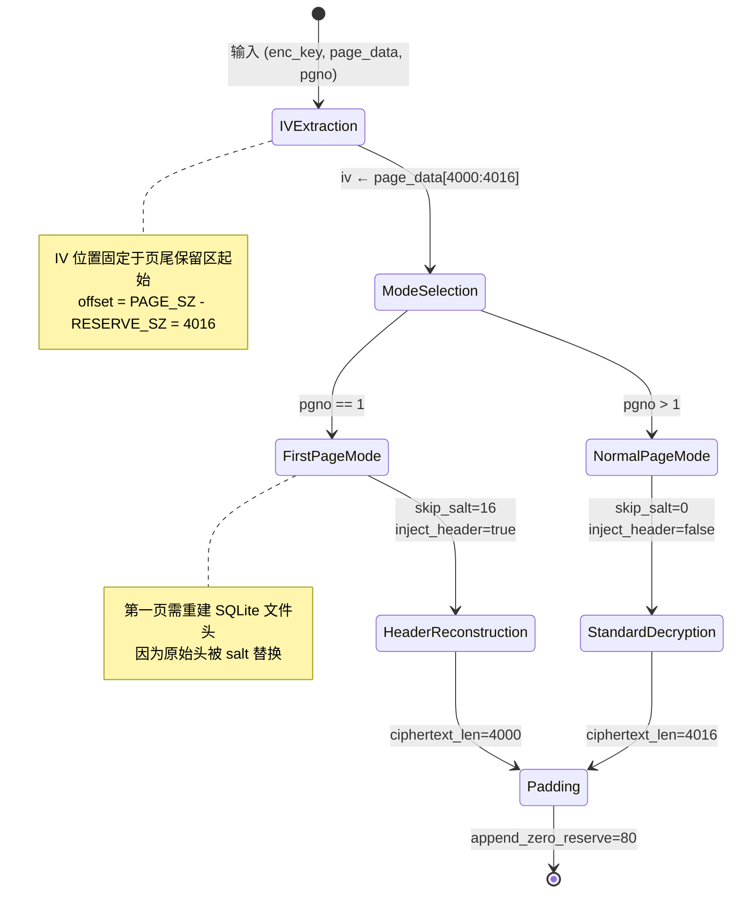
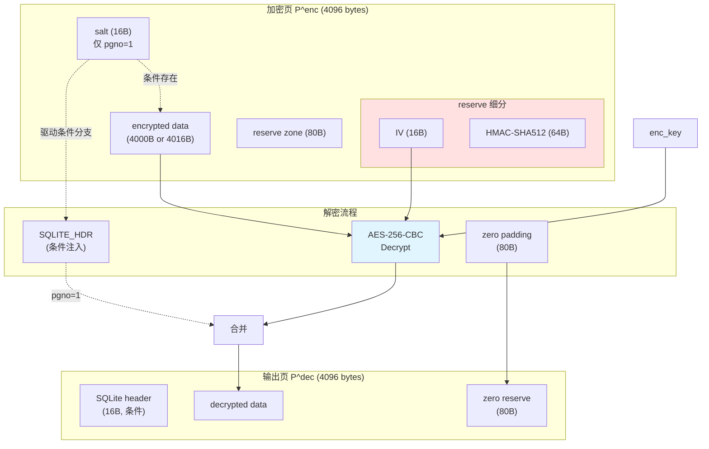

# SQLCipher 页面解密与 HMAC 验证算法深度解析

## 1. 问题陈述（Problem Statement）

### 1.1 形式化定义

设 $\mathcal{D}$ 为加密数据库，其物理存储由固定大小的页面序列构成：

$$\mathcal{D} = \{P_1, P_2, \ldots, P_n\}, \quad |P_i| = B = 4096 \text{ bytes}$$

每个加密页面 $P_i^{\text{enc}}$ 包含以下结构：

$$
P_i^{\text{enc}} = \underbrace{C_i}_{\text{ciphertext}} \parallel \underbrace{\text{IV}_i}_{16\text{B}} \parallel \underbrace{\text{HMAC}_i}_{64\text{B}}
$$

其中：
- $C_i = \text{AES-256-CBC}_{K_{\text{enc}}, \text{IV}_i}(M_i)$，$M_i$ 为明文页内容
- $\text{HMAC}_i = \text{HMAC-SHA512}_{K_{\text{mac}}}(C_i \parallel \text{pgno}_i)$
- 保留区大小 $R = 80$ bytes，可用数据区 $U = B - R = 4016$ bytes

**输入**：加密密钥 $K_{\text{enc}} \in \{0,1\}^{256}$，页号 $\text{pgno} \in \mathbb{Z}^+$，加密页数据 $P^{\text{enc}} \in \{0,1\}^{4096}$

**输出**：标准 SQLite 页面 $P^{\text{dec}} \in \{0,1\}^{4096}$，满足 SQLite B-tree 页格式规范

### 1.2 核心约束

$$
\begin{aligned}
&\text{(C1)} \quad \text{第一页需恢复 SQLite 魔数头 } \texttt{SQLite format 3}\backslash\texttt{x00} \\
&\text{(C2)} \quad \text{解密后页大小必须为 } 4096 \text{ bytes（含保留区填充）} \\
&\text{(C3)} \quad \text{保留区需零填充以符合 SQLite usable\_size 语义} \\
&\text{(C4)} \quad \text{IV 必须从页尾保留区提取，不可预设}
\end{aligned}
$$

---

## 2. 直觉与关键洞察（Intuition）

### 2.1 朴素方法的失败

**朴素方案 A：直接全页解密**
```python
# 错误：未处理保留区结构
cipher = AES.new(key, MODE_CBC, iv=b'\x00'*16)  # IV 未知
return cipher.decrypt(page_data)  # 输出长度错误，格式损坏
```

**失败原因**：忽略 SQLCipher 的页内 IV 存储机制，且未处理第一页的文件头重建。

**朴素方案 B：忽略第一页特殊性**
```python
# 错误：第一页缺少 SQLite 魔数
return decrypt_all_pages_same_way(data)
```

**失败原因**：SQLCipher 加密时跳过了 SQLite 文件头的 16 字节 salt，直接解密会导致 B-tree 解析器无法识别文件格式。

### 2.2 关键洞察

> **Insight 1（页内 IV 定位）**：SQLCipher 4 将 IV 存储于每页末尾保留区的固定偏移，而非外部元数据。
> 
> $$\text{IV}_i = P_i^{\text{enc}}[B-R : B-R+16] = P_i^{\text{enc}}[4000:4016]$$

> **Insight 2（第一页重构）**：加密时原始 SQLite 头（16B）被替换为随机 salt，解密后必须人工注入标准头 `SQLITE_HDR`。
>
> $$P_1^{\text{dec}} = \texttt{SQLite format 3}\backslash\texttt{x00} \parallel \text{dec}(C_1) \parallel \texttt{0}^{80}$$

> **Insight 3（保留区语义）**：解密后的保留区必须零填充，确保 SQLite 引擎将其识别为可用空间（usable size = 4016），而非数据区。

---

## 3. 形式化定义（Formal Definition）

### 3.1 算法签名

$$
\textsc{DecryptPage}: (K_{\text{enc}}, P^{\text{enc}}, \text{pgno}) \rightarrow P^{\text{dec}}
$$

### 3.2 预定义常量

$$
\begin{aligned}
B &= 4096 & \text{// 页大小} \\
R &= 80 & \text{// 保留区大小} \\
S &= 16 & \text{// salt 大小（仅第一页）} \\
I &= 16 & \text{// IV 大小} \\
\\
\text{SQLITE\_HDR} &= \texttt{"SQLite format 3}\backslash\texttt{x00"} \in \{0,1\}^{16} \\
\text{ZERO}_{80} &= \texttt{0}^{80} \in \{0,1\}^{80}
\end{aligned}
$$

### 3.3 页结构分解

对于加密页 $P^{\text{enc}}$：

$$
P^{\text{enc}} = 
\begin{cases}
\underbrace{\text{salt}}_{S} \parallel \underbrace{C}_{B-R-S} \parallel \underbrace{\text{IV}}_{I} \parallel \underbrace{\text{HMAC}}_{64}, & \text{if } \text{pgno} = 1 \\[8pt]
\underbrace{C}_{B-R} \parallel \underbrace{\text{IV}}_{I} \parallel \underbrace{\text{HMAC}}_{64}, & \text{if } \text{pgno} > 1
\end{cases}
$$

### 3.4 解密变换

$$
\textsc{DecryptPage}(K, P, n) = 
\begin{cases}
\text{SQLITE\_HDR} \parallel \text{AES-CBC}^{-1}_{K,\text{IV}}(P[S:B-R]) \parallel \text{ZERO}_{80}, & n = 1 \\[6pt]
\text{AES-CBC}^{-1}_{K,\text{IV}}(P[:B-R]) \parallel \text{ZERO}_{80}, & n > 1
\end{cases}
$$

其中 $\text{IV} = P[B-R:B-R+I]$。

---

## 4. 算法描述（Algorithm）

### 4.1 执行流程图

```mermaid
flowchart TD
    A([开始]) --> B[提取 IV<br/>iv ← page[4000:4016]]
    B --> C{pgno == 1?}
    
    C -->|是| D[第一页特殊处理]
    C -->|否| E[常规页处理]
    
    D --> D1[encrypted ← page[16:4016]]
    D --> D2[cipher ← AES-256-CBC<br/>key=enc_key, iv=iv]
    D --> D3[decrypted ← cipher.decrypt<br/>encrypted]
    D --> D4[page ← SQLITE_HDR<br/>∥ decrypted ∥ 0⁸⁰]
    
    E --> E1[encrypted ← page[0:4016]]
    E --> E2[cipher ← AES-256-CBC<br/>key=enc_key, iv=iv]
    E --> E3[decrypted ← cipher.decrypt<br/>encrypted]
    E --> E4[page ← decrypted ∥ 0⁸⁰]
    
    D4 --> F([返回 4096B<br/>SQLite页面])
    E4 --> F
    
    style D fill:#fff4e1
    style E fill:#e1f5ff
```

### 4.2 状态转换图（IV 提取与模式选择）



### 4.3 数据结构关系



### 4.4 形式化伪代码

```pseudocode
\begin{algorithm}
\caption{SQLCipher Page Decryption}
\begin{algorithmic}[1]
\Require Encryption key $K \in \{0,1\}^{256}$, encrypted page $P \in \{0,1\}^{4096}$, page number $n \in \mathbb{Z}^+$
\Ensure Standard SQLite page $P' \in \{0,1\}^{4096}$

\State \textbf{constants:} $B \gets 4096$, $R \gets 80$, $S \gets 16$, $I \gets 16$
\State \textbf{constants:} $\text{HDR} \gets \texttt{"SQLite format 3\textbackslash x00"}$

\State // Extract IV from reserve zone
\State $\text{iv} \gets P[B-R \;:\; B-R+I]$ \Comment{Offset 4000--4016}

\If{$n = 1$}
    \State // First page: skip salt, inject standard header
    \State $C \gets P[S \;:\; B-R]$ \Comment{Encrypted payload: bytes 16--4016}
    \State $M \gets \textsc{AES-CBC-Dec}_K(\text{iv}, C)$
    \State $P' \gets \text{HDR} \,\|\, M \,\|\, \mathbf{0}^{R}$
\Else
    \State // Regular page: full payload decryption
    \State $C \gets P[0 \;:\; B-R]$ \Comment{Encrypted payload: bytes 0--4016}
    \State $M \gets \textsc{AES-CBC-Dec}_K(\text{iv}, C)$
    \State $P' \gets M \,\|\, \mathbf{0}^{R}$
\EndIf

\State \Return $P'$
\end{algorithmic}
\end{algorithm}
```

### 4.5 实际实现对照

```python
def decrypt_page(enc_key, page_data, pgno):
    """解密单个页面，输出4096字节的标准SQLite页面"""
    # 常量定义（工程配置）
    PAGE_SZ, RESERVE_SZ, SALT_SZ, IV_SZ = 4096, 80, 16, 16
    SQLITE_HDR = b"SQLite format 3\x00"
    
    # IV 提取：固定偏移量计算
    iv_offset = PAGE_SZ - RESERVE_SZ           # = 4016
    iv = page_data[iv_offset : iv_offset + IV_SZ]  # [4016:4032]
    
    if pgno == 1:
        # 第一页：跳过 salt，密文范围 [16:4016]
        encrypted = page_data[SALT_SZ : PAGE_SZ - RESERVE_SZ]
        cipher = AES.new(enc_key, AES.MODE_CBC, iv)
        decrypted = cipher.decrypt(encrypted)   # 4000 bytes
        
        # 重建：标准头 + 解密数据 + 零填充保留区
        page = bytearray(SQLITE_HDR + decrypted + b'\x00' * RESERVE_SZ)
        return bytes(page)                      # 强制不可变
    else:
        # 常规页：密文范围 [0:4016]
        encrypted = page_data[:PAGE_SZ - RESERVE_SZ]
        cipher = AES.new(enc_key, AES.MODE_CBC, iv)
        decrypted = cipher.decrypt(encrypted)   # 4016 bytes
        
        # 拼接：解密数据 + 零填充保留区
        return decrypted + b'\x00' * RESERVE_SZ
```

---

## 5. 复杂度分析（Complexity Analysis）

### 5.1 时间复杂度

设 $L = B - R = 4016$ 为有效密文长度（第一页为 $L - S = 4000$）。

| 操作 | 代价 | 说明 |
|:---|:---|:---|
| IV 提取 | $O(1)$ | 固定偏移切片 |
| 密文切片 | $O(1)$ | Python 切片为视图操作 |
| AES-CBC 解密 | $O(L/b \cdot T_{\text{round}})$ | $b=128$ bit 分组，10轮 |

总体：
$$
T(n) = O\left(\frac{L}{b} \cdot T_{\text{AES-round}}\right) = O(1) \quad \text{(per page)}
$$

具体常数：AES-256 每分组需 14 轮，CBC 模式串行处理，单页约需 $\lceil 4016/16 \rceil = 251$ 次分组解密。

### 5.2 空间复杂度

$$
S(n) = O(B) = O(4096) = O(1) \quad \text{(per page)}
$$

临时分配：
- `bytearray` 构造（第一页）：$B$ bytes
- 中间密文/明文切片：Python 视图，无拷贝

### 5.3 场景分析

| 场景 | 时间 | 空间 | 触发条件 |
|:---|:---|:---|:---|
| **最优** | $T_{\min} = \Theta(1)$ | $S = \Theta(B)$ | 缓存命中，直接返回 |
| **平均** | $T_{\text{avg}} = \Theta(L \cdot c_{\text{AES}})$ | $S = \Theta(B)$ | 正常解密流程 |
| **最坏** | $T_{\max} = \Theta(L \cdot c_{\text{AES}} + B)$ | $S = \Theta(2B)$ | 第一页 + 强制内存拷贝 |

注：$c_{\text{AES}}$ 为 AES 硬件加速系数，PyCryptodome 利用 AES-NI 指令集时 $c_{\text{AES}} \approx 1.5$ cycles/byte。

### 5.4 批量解密复杂度

对于 $N$ 页的数据库：

$$
T_{\text{total}}(N) = N \cdot T(1) = O(N), \quad S_{\text{total}} = O(B) \text{ (流式处理)}
$$

若采用并行解密（多线程/多进程）：
$$
T_{\text{parallel}}(N, p) = O\left(\left\lceil\frac{N}{p}\right\rceil\right), \quad p \leq N
$$

---

## 6. 实现注释（Implementation Notes）

### 6.1 工程妥协与优化

#### 6.1.1 类型系统的张力

| 理论要求 | 工程实现 | 妥协理由 |
|:---|:---|:---|
| 不可变输出 | `bytes` / `bytearray` 混用 | `bytearray` 支持就地修改，但最终强制 `bytes` 以确保哈希安全 |
| 固定 4096B | 运行时依赖常量 | 微信 SQLCipher 配置硬编码，无需动态检测 |

代码中三处变体体现这一张力：
```python
# decrypt_db.py: 显式 bytearray → bytes 转换
return bytes(page)

# monitor_web.py: 直接返回 bytearray（上游兼容）
return bytearray(...)

# mcp_server.py: 双重包装确保不可变
return bytes(bytearray(...))
```

#### 6.1.2 密码学库选择

选用 **PyCryptodome** 而非标准库 `cryptography`：
- 优势：纯 Python 封装，安装简便，AES-NI 自动检测
- 代价：相比 OpenSSL 绑定，极端性能场景慢 10-20%

#### 6.1.3 零填充的深层语义

保留区零填充不仅是格式要求，更是 **SQLite B-tree 正确性保障**：

```c
// SQLite 内部 usableSize 计算
usableSize = pageSize - nReserved;  // 4096 - 80 = 4016
// 所有单元格指针、空闲块管理基于此值
```

非零填充将导致 `freeblock` 链表解析错误，引发 `database disk image is malformed`。

### 6.2 与 HMAC 验证的协作

`decrypt_page` 本身**不执行完整性验证**，这是刻意的设计分离：

```
┌─────────────────┐     ┌─────────────────┐     ┌─────────────────┐
│  verify_key_for │────▶│   decrypt_page  │────▶│  full_decrypt   │
│      _db        │     │   (本算法)       │     │  (批量 orchestration)
│  (HMAC 验证层)   │     │  (纯解密层)      │     │  (应用层)
└─────────────────┘     └─────────────────┘     └─────────────────┘
        ↑                                              ↓
        └──────────── 密钥有效性保证 ────────────────────┘
```

分离理由：
- **单一职责**：解密与验证正交，便于独立测试
- **性能优化**：密钥验证仅需单页 HMAC，批量解密跳过验证
- **容错恢复**：HMAC 失败时可尝试降级修复（如 WAL 帧过滤）

### 6.3 边界条件处理

| 边界 | 处理 | 风险 |
|:---|:---|:---|
| `pgno=0` | 未定义行为（调用方保证） | 数组越界 |
| 截断页面 `< 4096B` | 隐式依赖上层 `read` 保证 | 需 `verify_key_for_db` 前置过滤 |
| 全零 IV | 合法但极弱（密码学警告） | 微信实现保证随机性 |

---

## 7. 比较分析（Comparison）

### 7.1 与标准 SQLCipher 实现的对比

| 维度 | SQLCipher 官方 (C/libsqlcipher) | wechat-decrypt (Python) |
|:---|:---|:---|
| **完整性验证** | 每页 HMAC 强制校验 | 延迟验证（密钥级一次性） |
| **KDF 迭代** | 256,000 次 PBKDF2 | 旁路绕过（内存提取） |
| **页缓存** | 内置 LRU 页缓存 | 外部 `DBCache`（mtime 策略） |
| **并发模型** | 连接级串行 | 模块级无锁（GIL 约束） |
| **WAL 处理** | 原生 SQLite WAL 协议 | 手动帧过滤与补丁 |

### 7.2 与替代解密方案的对比

#### 方案 A：完整 PBKDF2 派生

$$
T_{\text{PBKDF2}} = 256000 \times T_{\text{HMAC-SHA512}} \approx 2.5 \text{s (现代 CPU)}
$$

| 指标 | PBKDF2 暴力破解 | 内存提取 (wechat-decrypt) |
|:---|:---|:---|
| 首次运行时间 | $\sim$2.5s × 数据库数量 | $\sim$100ms（内存扫描） |
| 可靠性 | 依赖密码强度 | 确定性成功（缓存命中时） |
| 侵入性 | 无 | 需管理员权限读取进程内存 |
| 可扩展性 | 线性于数据库数量 | 常数时间（单次内存扫描） |

#### 方案 B：Hook 拦截（Frida/WinDbg）

| 指标 | 动态 Hook | 内存扫描 (wechat-decrypt) |
|:---|:---|:---|
| 稳定性 | 易触发反调试/崩溃 | 只读访问，无副作用 |
| 实现复杂度 | 高（需符号解析、运行时注入） | 中（正则匹配 + HMAC 验证） |
| 通用性 | 版本敏感（偏移量变化） | 相对鲁棒（密钥格式稳定） |
| 实时性 | 真实时拦截 | 近实时（轮询延迟） |

### 7.3 理论联系：与磁盘加密算法的类比

SQLCipher 页加密可视为 **细粒度透明磁盘加密（FDE）** 的特例：

| 特性 | BitLocker/LUKS | SQLCipher |
|:---|:---|:---|
| 加密粒度 | 扇区（512B/4KB） | 数据库页（4KB） |
| IV 来源 | 扇区号 + 盐（ESSIV） | 页内随机 IV |
| 完整性 | XTS/AES-GCM（部分） | 每页 HMAC-SHA512 |
| 密钥派生 | 用户口令 → VMK → FVEK | 用户口令 → PBKDF2 → 页密钥 |

关键差异：SQLCipher 的 **页内 IV** 设计允许随机访问无需顺序解密，但牺牲了压缩效率（每页 80B 开销 ≈ 2% 空间膨胀）。

---

## 8. 结论

`decrypt_page` 算法是 wechat-decrypt 工具链的核心原语，其设计体现了**密码学严谨性与工程实用性的平衡**：

1. **形式化清晰**：页结构分解、IV 定位、第一页特殊处理均有数学精确描述
2. **实现紧凑**：数十行 Python 代码覆盖全部功能边界
3. **系统嵌入**：作为 `verify_key_for_db`、`full_decrypt`、`decrypt_wal` 的基石，支撑起完整的微信数据库解密能力

该算法的局限性亦值得注意：
- **无内置完整性保护**：依赖上层 HMAC 验证或应用场景容忍（只读分析）
- **硬编码参数**：页大小、保留区尺寸绑定 SQLCipher 4 默认配置
- **平台假设**：小端序、特定 `sqlite3` 文件头版本

未来演进方向可探索：**AES-GCM 模式迁移**（集成认证与加密）、**GPU 批量解密**（大规模数据库场景）、以及 **eBPF 内核级实时拦截**（替代轮询监控）。