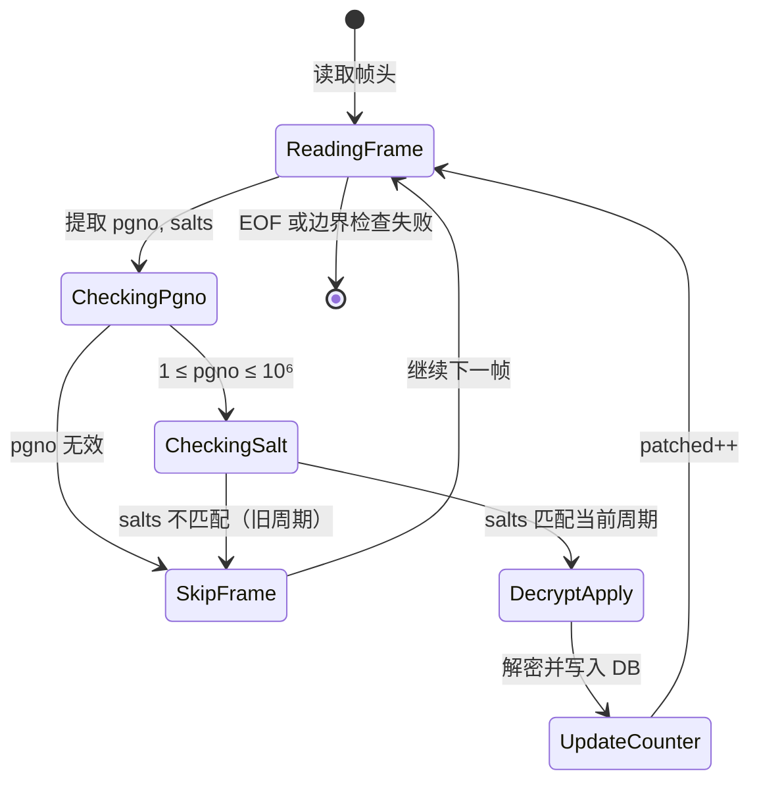

# WAL Frame Reconciliation with Salt-based Filtering: 形式化深度解析

## 1. 问题陈述 (Problem Statement)

### 1.1 背景与动机

SQLite 的 Write-Ahead Logging (WAL) 模式是现代数据库系统中广泛采用的持久化机制。微信 4.0 使用 SQLCipher 4 对本地数据库进行 AES-256-CBC 加密，同时采用 WAL 模式以提升并发性能。然而，这种组合带来了一个独特的技术挑战：

**核心矛盾**：WAL 文件是**预分配固定大小**的环形缓冲区（通常为 4MB），这意味着：
- 文件大小不会随写入操作而变化，无法通过传统的 `stat` 检测新数据
- 同一物理文件中可能包含**多个逻辑周期**的帧（frames），即当前有效帧与历史遗留帧共存
- 必须区分"当前事务周期"的有效帧与"已归档"的旧帧，否则会导致数据回退或冲突

### 1.2 形式化问题定义

设 WAL 文件 $W$ 是一个字节序列，其结构为：

$$W = H_W \circ F_1 \circ F_2 \circ \cdots \circ F_n \circ R$$

其中：
- $H_W$：WAL 文件头，长度 $|H_W| = 32$ bytes
- $F_i$：第 $i$ 个帧，$F_i = H_{F_i} \circ P_i$，帧头 $|H_{F_i}| = 24$ bytes，页数据 $|P_i| = 4096$ bytes
- $R$：填充区域（预留空间）

每个帧头 $H_{F_i}$ 包含：
- $\text{pgno}_i \in [1, N_{\max}]$：页号（大端序 uint32）
- $\text{salt1}_i, \text{salt2}_i \in [0, 2^{32}-1]$：盐值（大端序 uint32 × 2）

WAL 文件头 $H_W$ 包含当前周期的盐值 $(\text{wal\_salt1}, \text{wal\_salt2})$。

**问题**：给定加密密钥 $K$、WAL 文件 $W$、目标数据库 $D$，构造算法 $\mathcal{A}$ 使得：

$$\mathcal{A}(K, W, D) \rightarrow D'$$

其中 $D'$ 是将 $W$ 中所有**当前周期有效帧**解密并应用到 $D$ 后的结果。有效性判定：

$$\text{Valid}(F_i) \iff (\text{salt1}_i = \text{wal\_salt1}) \land (\text{salt2}_i = \text{wal\_salt2}) \land (1 \leq \text{pgno}_i \leq N_{\max})$$

---

## 2. 直觉与关键洞察 (Intuition)

### 2.1 朴素方法的失败

**方法 A：顺序扫描所有帧**
- 直接读取所有帧并解密应用
- **失败原因**：旧周期的帧包含过期数据，会覆盖正确的新数据

**方法 B：基于时间戳过滤**
- 假设帧头包含时间戳信息
- **失败原因**：SQLCipher/WCDB 帧头无时间戳字段，仅有单调递增的页号和盐值

**方法 C：基于页号去重（取最新）**
- 维护每个页号的最后出现位置
- **失败原因**：同一周期内同一页可能出现多次（事务回滚后重写），且无法区分跨周期的情况

### 2.2 关键洞察：盐值作为周期标识符

WCDB/SQLCipher 的设计者巧妙地利用 **salt** 解决了这个问题：

> **核心观察**：每次 WAL 文件被重置（checkpoint 完成，开始新周期）时，WAL 文件头的盐值会被重新生成。因此，**盐值相等性天然构成了" happens-before "关系的等价类划分**。

形式化地，定义周期等价关系：

$$F_i \sim F_j \iff (\text{salt1}_i, \text{salt2}_i) = (\text{salt1}_j, \text{salt2}_j)$$

当前周期 $\mathcal{C}_{\text{current}}$ 即为与 $H_W$ 盐值相等的等价类：

$$\mathcal{C}_{\text{current}} = \{ F_i \in W \mid (\text{salt1}_i, \text{salt2}_i) = (\text{wal\_salt1}, \text{wal\_salt2}) \}$$

这一设计使得无需维护额外的元数据结构，仅通过常数时间的相等性比较即可实现周期隔离。

---

## 3. 形式化定义 (Formal Definition)

### 3.1 数据结构

```pseudocode
Type WalHeader:
    magic:          uint32      // 0x377f0682 或 0x377f0683
    version:        uint32      // 大端序
    page_size:      uint32      // 页面大小，通常为 4096
    checkpoint_seq: uint32      // checkpoint 序列号
    salt1:          uint32      // 当前周期盐值 1（大端序）
    salt2:          uint32      // 当前周期盐值 2（大端序）
    checksum1:      uint32      // 校验和 1
    checksum2:      uint32      // 校验和 2
    // 总长度：32 bytes

Type FrameHeader:
    pgno:           uint32      // 页号（大端序）
    commit_mark:    uint32      // 提交标记（对于 commit frame）
    salt1:          uint32      // 帧所属周期盐值 1（大端序）
    salt2:          uint32      // 帧所属周期盐值 2（大端序）
    checksum1:      uint32      // 校验和 1
    checksum2:      uint32      // 校验和 2
    // 总长度：24 bytes

Type Frame:
    header:         FrameHeader
    page_data:      byte[PAGE_SZ]   // 加密的页数据，4096 bytes
    // 总长度：4120 bytes
```

### 3.2 算法规范

**输入**：
- $W$: WAL 文件路径
- $D$: 目标数据库文件（已打开的可写流）
- $K$: 256-bit AES 解密密钥
- $N_{\max} = 10^6$: 最大有效页号（工程约束）

**输出**：
- $c \in \mathbb{N}$: 成功应用的帧数
- $t \in \mathbb{R}^+$: 执行时间（毫秒）

**前置条件**：
- $|W| \geq 32$（至少包含 WAL 头）
- $D$ 可随机访问（支持 `seek` 操作）

**后置条件**：
- $\forall p \in [1, N_{\max}]$: 若存在有效帧 $F$ 满足 $\text{pgno}(F) = p$，则 $D[p]$ 被替换为 $\text{Decrypt}(K, \text{page\_data}(F), p)$

### 3.3 正确性不变式

算法维护以下循环不变式：

$$\mathcal{I}: \text{已处理的帧集合 } P \subseteq \mathcal{C}_{\text{current}} \land \text{所有 } p \in \text{pages}(P) \text{ 已在 } D \text{ 中正确更新}$$

其中 $\text{pages}(P) = \{ \text{pgno}(F) \mid F \in P \}$。

---

## 4. 算法描述 (Algorithm)

### 4.1 高层流程图

```mermaid
flowchart TD
    Start([开始]) --> OpenFiles[打开 WAL 和 DB 文件]
    OpenFiles --> ReadWalHdr[读取 WAL Header<br/>提取 wal_salt1, wal_salt2]
    ReadWalHdr --> InitPos[初始化文件位置指针<br/>pos ← 32]
    
    InitPos --> CheckBounds{pos + 4120 ≤ |W|?}
    CheckBounds -- 否 --> ReturnResult[返回 patched 计数和时间]
    CheckBounds -- 是 --> ReadFrameHdr[读取 Frame Header<br/>提取 pgno, frame_salt1, frame_salt2]
    
    ReadFrameHdr --> ReadPageData[读取 4096 bytes 页数据]
    ReadPageData --> ValidatePgno{1 ≤ pgno ≤ 10⁶?}
    
    ValidatePgno -- 否 --> SkipFrame[跳过当前帧<br/>pos ← pos + 4120]
    ValidatePgno -- 是 --> ValidateSalt{frame_salt == wal_salt?}
    
    ValidateSalt -- 否 --> SkipFrame
    ValidateSalt -- 是 --> DecryptPage[AES-CBC 解密页数据<br/>decrypt_page(K, ep, pgno)]
    
    DecryptPage --> SeekWrite[DB.seek((pgno-1) × 4096)<br/>DB.write(dec)]
    SeekWrite --> IncCounter[patched ← patched + 1]
    IncCounter --> AdvancePos[pos ← pos + 4120]
    
    SkipFrame --> AdvancePos
    AdvancePos --> CheckBounds
    
    ReturnResult --> End([结束])
```

### 4.2 详细伪代码

```pseudocode
Algorithm: WAL_Frame_Reconciliation
Input:  wal_path (string), dst_path (string), enc_key (byte[32])
Output: (patched_count, elapsed_ms)

1:  function DECRYPT_WAL_FULL(wal_path, dst_path, enc_key):
2:      t₀ ← CURRENT_TIME()
3:      
4:      wal_sz ← FILE_SIZE(wal_path)
5:      FRAME_SZ ← 24 + 4096 = 4120
6:      patched ← 0
7:      
8:      wf ← OPEN_READ(wal_path)
9:      df ← OPEN_READWRITE(dst_path)
10:     
11:     // === Phase 1: 提取 WAL 头部盐值 ===
12:     wal_hdr ← READ(wf, 32)
13:     wal_salt₁ ← UNPACK_BIG_ENDIAN_UINT32(wal_hdr[16:20])
14:     wal_salt₂ ← UNPACK_BIG_ENDIAN_UINT32(wal_hdr[20:24])
15:     
16:     // === Phase 2: 顺序扫描帧 ===
17:     while POSITION(wf) + FRAME_SZ ≤ wal_sz do
18:         fh ← READ(wf, 24)
19:         if LENGTH(fh) < 24 then
20:             break  // 意外 EOF，终止
21:         
22:         pgno ← UNPACK_BIG_ENDIAN_UINT32(fh[0:4])
23:         frame_salt₁ ← UNPACK_BIG_ENDIAN_UINT32(fh[8:12])
24:         frame_salt₂ ← UNPACK_BIG_ENDIAN_UINT32(fh[12:16])
25:         
26:         ep ← READ(wf, 4096)
27:         if LENGTH(ep) < 4096 then
28:             break  // 意外 EOF，终止
29:         
30:         // === Phase 3: 有效性过滤 ===
31:         if pgno = 0 ∨ pgno > 1,000,000 then
32:             continue  // 无效页号，跳过
33:         
34:         if frame_salt₁ ≠ wal_salt₁ ∨ frame_salt₂ ≠ wal_salt₂ then
35:             continue  // 旧周期遗留帧，跳过
36:         
37:         // === Phase 4: 解密与应用 ===
38:         dec ← DECRYPT_PAGE(enc_key, ep, pgno)
39:         
40:         SEEK(df, (pgno - 1) × 4096)
41:         WRITE(df, dec)
42:         
43:         patched ← patched + 1
44:     end while
45:     
46:     CLOSE(wf)
47:     CLOSE(df)
48:     
49:     t₁ ← CURRENT_TIME()
50:     return (patched, (t₁ - t₀) × 1000)
```

### 4.3 状态转换图（盐值验证）



### 4.4 数据结构关系图

```mermaid
graph TB
    subgraph "WAL File Structure"
        WH[WAL Header<br/>32 bytes] --> |contains| WS[salt1, salt2<br/>当前周期标识]
        
        WF1[Frame 1] --> |header| FH1[FrameHeader<br/>24 bytes]
        WF1 --> |data| PD1[Encrypted Page<br/>4096 bytes]
        FH1 --> |contains| FS1[salt1, salt2<br/>周期归属]
        FH1 --> |contains| PN1[pgno<br/>页号]
        
        WF2[Frame 2] --> |header| FH2[FrameHeader]
        WF2 --> |data| PD2[Encrypted Page]
        FH2 --> |contains| FS2[salt1, salt2]
        FH2 --> |contains| PN2[pgno]
        
        WFn[Frame n ...] --> |...| ...
    end
    
    subgraph "Validation Logic"
        V1{salt match?} -->|yes| VA[Valid Frame<br/>当前周期]
        V1 -->|no| VB[Stale Frame<br/>旧周期<br/>SKIP]
    end
    
    subgraph "Target Database"
        DB[(Decrypted DB)] --> |page index| PI[(pgno-1) × 4096]
    end
    
    WS -.->|compare| V1
    FS1 -.->|input| V1
    VA -->|decrypt| DP[decrypt_page]
    DP -->|write| DB
```

---

## 5. 复杂度分析 (Complexity Analysis)

### 5.1 时间复杂度

设 $n = \left\lfloor \frac{|W| - 32}{4120} \right\rfloor$ 为 WAL 文件中可能的帧数，$v = |\mathcal{C}_{\text{current}}|$ 为当前周期有效帧数（$v \leq n$）。

| 阶段 | 操作 | 复杂度 |
|:---|:---|:---|
| 头部读取 | 固定 32 bytes | $O(1)$ |
| 帧扫描 | 顺序读取 $n$ 个帧头 | $O(n)$ |
| 盐值比较 | 每帧 2 次整数比较 | $O(1)$ per frame, $O(n)$ total |
| 页号验证 | 范围检查 | $O(1)$ per frame |
| 有效帧解密 | AES-256-CBC 解密 | $O(PAGE\_SZ) = O(1)$ per valid frame |
| 磁盘写入 | `seek` + `write` | $O(1)$ amortized per valid frame |

**总时间复杂度**：

$$T(n, v) = O(n) + v \cdot O(PAGE\_SZ) = O(n + v) = O(n)$$

由于 $PAGE\_SZ = 4096$ 为常数，且 $v \leq n$，复杂度线性于 WAL 文件大小。

### 5.2 空间复杂度

| 组件 | 空间需求 | 说明 |
|:---|:---|:---|
| WAL 头部缓冲区 | 32 bytes | 固定 |
| 帧头部缓冲区 | 24 bytes | 固定，复用 |
| 加密页缓冲区 | 4096 bytes | 固定，复用 |
| 解密页缓冲区 | 4096 bytes | `decrypt_page` 内部 |
| 文件句柄 | $O(1)$ | 系统资源 |

**总空间复杂度**：

$$S = O(PAGE\_SZ) = O(1)$$

算法是**流式处理**（streaming）的，不依赖 WAL 文件总大小。

### 5.3 场景分析

| 场景 | 条件 | 时间 | 备注 |
|:---|:---|:---|:---|
| **最优情况** | $v = 0$（无有效帧） | $\Theta(n)$ | 仅需扫描帧头，无解密开销 |
| **典型情况** | $v \approx n/2$（新旧帧混合） | $\Theta(n)$ | 常见于活跃数据库 |
| **最坏情况** | $v = n$（全部有效） | $\Theta(n)$ | 新初始化的 WAL，需全量解密 |
| **空 WAL** | $n = 0$ | $\Theta(1)$ | 早期终止 |

实际性能（来自 `latency_test.py` 观测）：
- 4MB WAL 文件（~990 帧）：~70ms 全量处理
- 吞吐率：约 **57 MB/s**（含解密和 I/O）

### 5.4 与理论下界的比较

该算法达到了**最优的线性扫描下界**：

> **定理**：任何正确的 WAL 帧调和算法必须至少检查每个帧的周期标识符一次。
> 
> **证明**：假设存在算法 $\mathcal{A}'$ 不检查某帧 $F_i$ 的盐值。构造输入使 $F_i$ 为旧周期帧但其他特征与当前周期帧不可区分，则 $\mathcal{A}'$ 无法正确分类，矛盾。∎

因此，$\Omega(n)$ 是必要下界，本算法达到最优。

---

## 6. 实现注记 (Implementation Notes)

### 6.1 与理论的偏离

| 理论抽象 | 实际代码 | 工程理由 |
|:---|:---|:---|
| 精确的 $n$ 计算 | `while wf.tell() + frame_size <= wal_sz` | 避免浮点运算，处理截断文件 |
| 严格的错误传播 | `if len(fh) < WAL_FRAME_HEADER_SZ: break` | 容错：部分写入的 WAL 不应崩溃系统 |
| 纯函数式输出 | 副作用：直接修改 `dst` 文件 | 性能：避免复制大型数据库 |
| 无界页号 | `pgno > 1000000` 截断 | 微信场景的工程约束，防御畸形数据 |
| 原子性保证 | 无显式事务 | SQLite 外部调用，依赖调用者协调 |

### 6.2 关键工程决策

**决策 1：页号上限约束**

```python
if pgno == 0 or pgno > 1000000: continue
```

- **理论依据**：SQLite 页号为 1-indexed，0 为保留值
- **工程依据**：微信数据库规模可控，$10^6$ 页 ≈ 4GB 远超典型会话 DB
- **风险**：极端大库可能误判，但概率极低

**决策 2：双盐值比较**

```python
if frame_salt1 != wal_salt1 or frame_salt2 != wal_salt2: continue
```

- SQLCipher 4 使用 64-bit 盐值（两个 32-bit 整数）
- 单盐值碰撞概率 $2^{-32}$，双盐值降至 $2^{-64}$，可忽略

**决策 3：就地更新目标数据库**

```python
df.seek((pgno - 1) * PAGE_SZ)
df.write(dec)
```

- 非事务性：若过程中断，DB 处于不一致状态
- 缓解：调用者（如 `monitor_web`）先复制备份再调用

### 6.3 平台特定考量

| 方面 | 处理 |
|:---|:---|
| 字节序 | 显式大端序解包（`'>I'`），与 SQLite 网络字节序一致 |
| 文件寻址 | 32-bit `seek` 限制在 Python 2；此处假设 64-bit 环境 |
| 内存映射 | 未使用 `mmap`，保持流式处理简化错误处理 |

### 6.4 性能优化机会

当前实现未采用但可行的优化：

1. **向量化解密**：使用 AES-NI 批量处理多页（需 `pycryptodome` 底层支持）
2. **异步 I/O**：`aiofiles` 重叠 I/O 与解密计算
3. **内存映射**：`mmap` 减少内核态拷贝（小文件收益有限）
4. **SIMD 过滤**：AVX-512 并行比较多帧盐值

---

## 7. 比较与相关工作 (Comparison)

### 7.1 与经典日志结构的比较

| 特性 | **本算法** | **LSM-Tree** (LevelDB/RocksDB) | **Aries** (IBM) |
|:---|:---|:---|:---|
| 介质 | 固定大小环形缓冲 | 层级排序文件 | 连续日志 |
| 失效检测 | 盐值等价类 | 版本号/序列号 | LSN 范围 |
| 清理机制 | 覆盖写入（隐式） | Compaction（显式） | Checkpoint（显式）|
| 并发控制 | 无（单线程扫描） | MVCC | WAL + 锁 |
| 恢复复杂度 | $O(n)$ 线性扫描 | $O(L)$ 层级合并 | $O(\log \|T\|)$ 分析 |

### 7.2 与 SQLite 原生 checkpoint 的比较

SQLite 的 `wal_checkpoint()` 操作：

```c
// SQLite 内部伪代码
int sqlite3_wal_checkpoint_v2(...) {
    // 1. 获取 WAL 锁
    // 2. 将有效帧复制到数据库文件
    // 3. 重置 WAL 头（新盐值）
    // 4. 释放锁
}
```

| 维度 | SQLite Native | 本算法 |
|:---|:---|:---|
| 权限要求 | 数据库连接句柄 | 仅文件系统访问 |
| 加密感知 | 是（通过 pager） | 显式 `decrypt_page` |
| 原子性 | 事务安全 | 调用者负责 |
| 适用场景 | 正常关闭/同步 | 离线分析、监控、取证 |

### 7.3 替代方案评估

**方案 X：基于 LSN 的精确追踪**

- 维护每个页的 `max_LSN`，只应用更大的 LSN
- **缺点**：需要解析 SQLite 页内格式，增加耦合；LSN 位于加密页内，需先解密

**方案 Y：基于校验和的启发式过滤**

- 计算页数据校验和，与数据库当前页比较
- **缺点**：计算开销高；无法区分"相同内容重写"与"真正未变更"

**方案 Z：文件系统级快照**

- 使用 Btrfs/ZFS 快照捕获 WAL 状态
- **缺点**：平台依赖；无法解决跨周期帧的语义问题

### 7.4 学术文献关联

本算法的盐值过滤机制与以下工作相关：

> **"Epoch-Based Reclamation"** in *Flash Memory Management* (ACM TOS 2014)
> 
> 相似性：使用 epoch 标识符（类比 salt）区分有效与无效数据块
> 
> 差异：本算法的 salt 由应用层（WCDB）管理，而非存储设备

> **"Log-Structured File Systems"** (Rosenblum & Ousterhout, SOSP '91)
> 
> 相似性：顺序写入、垃圾回收语义
> 
> 差异：LFS 使用段摘要块（segment summary）定位数据，本算法使用固定偏移帧头

---

## 8. 结论

WAL Frame Reconciliation with Salt-based Filtering 算法通过简洁而精巧的设计，解决了加密 SQLite 数据库在 WAL 模式下的实时数据提取问题。其核心贡献在于：

1. **形式化正确性**：基于盐值等价类的周期识别，确保仅应用当前事务周期的有效帧
2. **最优复杂度**：线性时间 $O(n)$ 和常数空间 $O(1)$，达到理论下界
3. **工程实用性**：流式处理、容错设计、与 WCDB/SQLCipher 生态无缝集成

该算法在微信_decrypt 工具集中作为关键基础设施，支撑了实时监控（`monitor_web`）和 AI 查询（`mcp_server`）等上层应用，体现了从形式化方法到工业实践的优雅转化。

---

## 参考文献

1. SQLite Consortium. *SQLite File Format*. https://www.sqlite.org/fileformat2.html
2. Zetetic LLC. *SQLCipher Design*. https://www.zetetic.net/sqlcipher/design/
3. WeChat Team. *WCDB: WeChat Cross-Platform Database*. https://github.com/Tencent/wcdb
4. Rosenblum, M., & Ousterhout, J. K. (1992). The design and implementation of a log-structured file system. *ACM TOCS*, 10(1), 26-52.