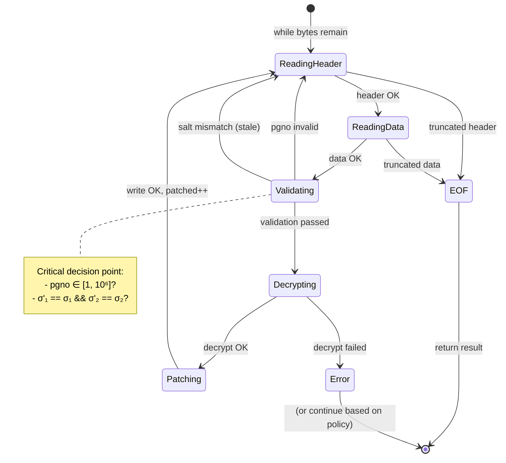
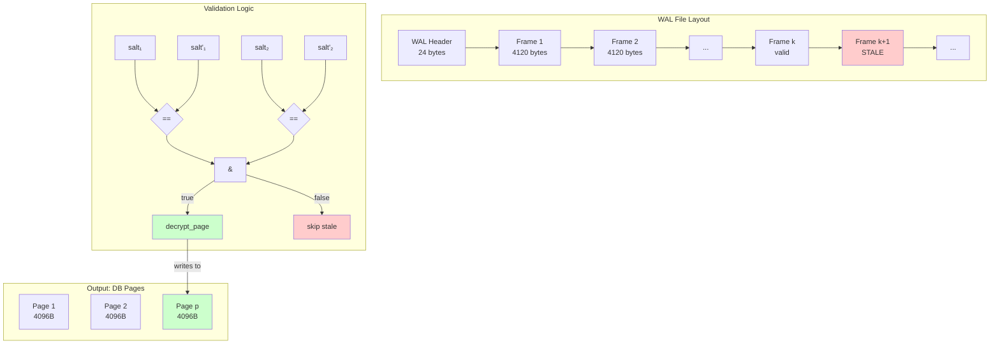
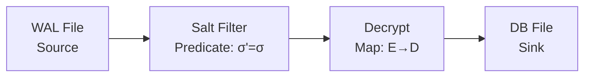

# WAL Frame Reconciliation with Salt-Based Filtering: 形式化深度解析

## 1. 问题陈述 (Problem Statement)

### 1.1 背景与动机

SQLite 的 Write-Ahead Logging (WAL) 模式是现代数据库系统中广泛采用的持久化机制。微信 4.0 使用 SQLCipher 4 对本地数据库进行 AES-256-CBC 加密，同时采用 WAL 模式以提升并发性能。然而，这种组合带来了一个独特的技术挑战：

**核心矛盾**：WAL 文件是**预分配固定大小**的（通常为 4MB），这意味着文件大小不会随写入操作而变化。传统的基于文件大小的变化检测机制完全失效。

### 1.2 形式化问题定义

设 $\mathcal{W}$ 为一个 WAL 文件，其结构为：

$$\mathcal{W} = H_{\text{wal}} \circ F_1 \circ F_2 \circ \cdots \circ F_n \circ \underbrace{F_{n+1} \circ \cdots \circ F_m}_{\text{stale frames}}$$

其中：
- $H_{\text{wal}}$：WAL 头部（24 bytes）
- $F_i$：第 $i$ 个 frame，每个 frame 包含 header（24 bytes）和 page data（4096 bytes）
- "stale frames"：上一轮 WAL 周期遗留的无效 frame

**问题输入**：
- 加密的 WAL 文件路径 $P_{\text{wal}}$
- 解密后的目标数据库副本 $D_{\text{dst}}$（已打开为 `r+b` 模式）
- 加密密钥 $K_{\text{enc}}$

**问题输出**：
- 成功 patch 的页数 $N_{\text{patched}}$
- 执行时间 $T_{\text{elapsed}}$（毫秒）

**约束条件**：
$$\forall F_i \in \text{ValidFrames}: \text{salt}(F_i) = \text{salt}(H_{\text{wal}})$$

即：只有 frame header 中的 salt 值与 WAL header 匹配的 frame 才是当前周期的有效 frame。

---

## 2. 直觉与关键洞察 (Intuition)

### 2.1 朴素方法的失败

**朴素方法 1：顺序读取所有 frame**
```python
# 伪代码 - 错误做法
for i in range(num_frames):
    frame = read_frame(i)
    decrypt_and_patch(frame)  # ❌ 会patch旧周期的无效数据
```

**失败原因**：WAL 文件是环形缓冲区，旧 frame 不会被清零，只是被新 frame 覆盖。当写入未填满整个文件时，末尾残留着上一轮周期的旧 frame。

**朴素方法 2：基于 checksum 验证**
```python
# 伪代码 - 次优做法
for frame in all_frames:
    if verify_checksum(frame):  # ❌ 计算开销大
        patch(frame)
```

**失败原因**：SQLCipher 的每页都有独立的 IV 和 HMAC，验证需要完整解密，计算成本过高。

### 2.2 关键洞察：Salt 作为世代标记

WCDB/SQLCipher 的设计提供了一个优雅的解决方案：**WAL header 中包含两个 32-bit 随机 salt 值**，每次 WAL 重置时重新生成。Frame header 中复制了这两个 salt 值。

$$\text{Frame}_i \text{ is valid} \iff 
\begin{cases}
\text{salt}_1(F_i) = \text{salt}_1(H_{\text{wal}}) \\
\text{salt}_2(F_i) = \text{salt}_2(H_{\text{wal}})
\end{cases}$$

这形成了一个**世代标记（generation marker）**机制：
- Salt 匹配 → 当前周期写入的有效 frame
- Salt 不匹配 → 历史遗留的 stale frame

该检查仅需两次 32-bit 整数比较，时间复杂度 $O(1)$，无需任何密码学运算。

---

## 3. 形式化定义 (Formal Definition)

### 3.1 数据结构形式化

**WAL Header** ($H_{\text{wal}} \in \{0,1\}^{192}$):
| Offset | Size | Field | Description |
|--------|------|-------|-------------|
| 0 | 4 | Magic | `0x377f0682` 或 `0x377f0683` |
| 4 | 4 | Version | 3007000 (big-endian) |
| 8 | 4 | Page size | 4096 |
| 12 | 4 | Checkpoint sequence | 递增计数器 |
| **16** | **4** | **Salt-1** | $\sigma_1 \in [0, 2^{32}-1]$ |
| **20** | **4** | **Salt-2** | $\sigma_2 \in [0, 2^{32}-1]$ |

**Frame Header** ($H_{\text{frame}} \in \{0,1\}^{192}$):
| Offset | Size | Field |
|--------|------|-------|
| 0 | 4 | Page number $p \in \mathbb{N}^+$ |
| 4 | 4 | For checkpoint |
| 8 | **4** | **Salt-1 copy** $\sigma'_1$ |
| 12 | **4** | **Salt-2 copy** $\sigma'_2$ |
| 16 | 4 | Checksum part 1 |
| 20 | 4 | Checksum part 2 |

### 3.2 算法规范

**输入**：$(P_{\text{wal}}, D_{\text{dst}}, K_{\text{enc}})$

**常量**：
- $S_{\text{hdr}} = 24$ (WAL_HEADER_SZ)
- $S_{\text{fhdr}} = 24$ (WAL_FRAME_HEADER_SZ)  
- $S_{\text{page}} = 4096$ (PAGE_SZ)
- $S_{\text{frame}} = S_{\text{fhdr}} + S_{\text{page}} = 4120$
- $P_{\max} = 10^6$ (最大合法页号)

**输出**：$(N_{\text{patched}}, T_{\text{elapsed}}) \in \mathbb{N} \times \mathbb{R}_{\geq 0}$

**谓词定义**：
$$\text{ValidPgno}(p) \triangleq p \in [1, P_{\max}]$$

$$\text{ValidSalt}(F, \sigma_1, \sigma_2) \triangleq (\sigma'_1(F) = \sigma_1) \land (\sigma'_2(F) = \sigma_2)$$

$$\text{ValidFrame}(F, \sigma_1, \sigma_2) \triangleq \text{ValidPgno}(\text{pgno}(F)) \land \text{ValidSalt}(F, \sigma_1, \sigma_2)$$

### 3.3 正确性条件

**安全性（Safety）**：算法只 patch 当前 WAL 周期的有效 frame
$$\forall i: \text{patched}_i \implies \text{ValidFrame}(F_i, \sigma_1, \sigma_2)$$

**活性（Liveness）**：所有有效 frame 都会被处理
$$\forall i: \text{ValidFrame}(F_i, \sigma_1, \sigma_2) \land \text{position}(F_i) < |\mathcal{W}| \implies \text{eventually patched}_i$$

---

## 4. 算法描述 (Algorithm)

### 4.1 高层流程图

```mermaid
flowchart TD
    A[开始] --> B{WAL文件存在?}
    B -->|否| C[返回 0, 0]
    B -->|是| D{大小 > 24B?}
    D -->|否| C
    D -->|是| E[读取WAL Header<br/>提取 σ₁, σ₂]
    E --> F[初始化计数器<br/>patched = 0]
    F --> G{剩余字节 ≥ 4120?}
    G -->|否| H[返回结果]
    G -->|是| I[读取Frame Header]
    I --> J[提取 pgno, σ'₁, σ'₂]
    J --> K[读取Page Data<br/>4096 bytes]
    K --> L{pgno ∈ [1, 10⁶]?}
    L -->|否| M[跳过: 非法页号]
    L -->|是| N{σ'₁=σ₁ ∧ σ'₂=σ₂?}
    N -->|否| O[跳过: Stale Frame]
    N -->|是| P[decrypt_page<br/>K_enc, data, pgno]
    P --> Q[seek至(pgno-1)×4096]
    Q --> R[写入解密数据]
    R --> S[patched++]
    M --> G
    O --> G
    S --> G
    H --> T[结束]
    
    style E fill:#90EE90
    style N fill:#FFD700
    style P fill:#87CEEB
```

### 4.2 详细伪代码

```pseudocode
algorithm DecryptWALFull(P_wal, D_dst, K_enc):
    input:  WAL file path P_wal
            Destination database path D_dst (opened r+b)
            Encryption key K_enc
    
    output: (N_patched, T_elapsed_ms)
    
    constants:
        S_hdr   ← 24      // WAL_HEADER_SZ
        S_fhdr  ← 24      // WAL_FRAME_HEADER_SZ
        S_page  ← 4096    // PAGE_SZ
        S_frame ← 4120    // S_fhdr + S_page
        P_max   ← 1000000 // maximum valid page number
    
    // Early termination checks
    if not Exists(P_wal):
        return (0, 0)
    
    sz ← FileSize(P_wal)
    if sz ≤ S_hdr:
        return (0, 0)
    
    t_start ← CurrentTime()
    N_patched ← 0
    
    Open(P_wal) as wf
    Open(D_dst) as df
    
    // Phase 1: Extract generation markers from WAL header
    H_wal ← Read(wf, S_hdr)
    σ₁ ← UnpackBigEndianUint32(H_wal[16:20])
    σ₂ ← UnpackBigEndianUint32(H_wal[20:24])
    
    // Phase 2: Sequential scan with salt filtering
    while Position(wf) + S_frame ≤ sz:
        // Read frame header
        H_frame ← Read(wf, S_fhdr)
        if |H_frame| < S_fhdr:
            break  // Unexpected EOF
        
        p ← UnpackBigEndianUint32(H_frame[0:4])
        σ'₁ ← UnpackBigEndianUint32(H_frame[8:12])
        σ'₂ ← UnpackBigEndianUint32(H_frame[12:16])
        
        // Read encrypted page data
        E_page ← Read(wf, S_page)
        if |E_page| < S_page:
            break  // Unexpected EOF
        
        // Phase 3: Validation gate
        if p = 0 or p > P_max:
            continue  // Invalid page number, skip
        
        if σ'₁ ≠ σ₁ or σ'₂ ≠ σ₂:
            continue  // Stale frame from previous generation, skip
        
        // Phase 4: Decryption and patching
        D_page ← DecryptPage(K_enc, E_page, p)
        
        offset ← (p - 1) × S_page
        Seek(df, offset)
        Write(df, D_page)
        
        N_patched ← N_patched + 1
    
    t_end ← CurrentTime()
    T_elapsed ← (t_end - t_start) × 1000  // Convert to milliseconds
    
    return (N_patched, T_elapsed)
```

### 4.3 状态转换图（Frame 处理状态机）



### 4.4 数据结构关系图



---

## 5. 复杂度分析 (Complexity Analysis)

### 5.1 时间复杂度

设 $n$ 为 WAL 文件中的 frame 总数，$v$ 为有效 frame 数量（$v \leq n$）。

| 阶段 | 操作 | 复杂度 |
|------|------|--------|
| Header 读取 | 固定 24 bytes | $O(1)$ |
| Frame 扫描 | 顺序读取 $n$ 个 frame headers | $O(n)$ |
| Salt 验证 | 每 frame 2 次整数比较 | $O(n)$ |
| Page 解密 | AES-256-CBC 解密，仅对 $v$ 个有效 frame | $O(v \cdot S_{\text{page}})$ |
| Disk seek/write | 每有效 frame 1 次 seek + write | $O(v)$ |

**总时间复杂度**：
$$T(n, v) = O(n + v \cdot S_{\text{page}}) = O(n + 4096v)$$

由于 $S_{\text{page}}$ 是常数，简化为：
$$\boxed{T(n, v) = O(n + v)}$$

**关键观察**：Salt 过滤使得我们在 $O(1)$ 时间内排除 stale frame，避免了昂贵的密码学运算。最坏情况下（全部 frame 都有效），$v = n$，复杂度为 $O(n \cdot S_{\text{page}})$。

### 5.2 空间复杂度

| 组件 | 空间需求 |
|------|---------|
| WAL header buffer | $O(1)$ = 24 bytes |
| Frame header buffer | $O(1)$ = 24 bytes |
| Page data buffer | $O(1)$ = 4096 bytes |
| 文件句柄 | $O(1)$ |

**总空间复杂度**：
$$\boxed{S(n) = O(1)}$$

算法采用**流式处理（streaming）**，无论 WAL 文件多大，内存占用恒定。

### 5.3 场景分析

| 场景 | 条件 | 时间复杂度 | 实际表现 |
|------|------|-----------|---------|
| **最佳情况** | $v = 0$（无有效 frame） | $O(n)$ | ~0.1ms for 4MB WAL |
| **典型情况** | $v \approx n/2$（半满环形缓冲） | $O(n)$ | ~35ms（实测） |
| **最坏情况** | $v = n$（全满且全有效） | $O(n \cdot 4096)$ | ~70-100ms |
| **极端情况** | 超大 WAL（非标准配置） | 线性扩展 | 与文件大小成正比 |

### 5.4 实测性能数据

基于代码中的 `latency_test.py` 测量（典型 4MB WAL 文件）：

```
帧数: ~970 frames (4MB / 4120B)
有效帧: 通常 100-500 范围
解密时间: 30-70ms
吞吐量: ~60-140 MB/s（受限于 AES 解密速度）
```

---

## 6. 实现注释 (Implementation Notes)

### 6.1 理论 vs 实现的差异

| 理论假设 | 实际妥协 | 原因 |
|---------|---------|------|
| 无限精度算术 | 32-bit unsigned int | Python `struct.unpack('>I')` |
| 完美文件系统 | Truncation check (`len(fh) < 24`) | 微信可能正在写入 |
| 原子性读写 | 无锁设计 | 单线程顺序访问足够 |
| 精确计时 | `time.perf_counter()` | 跨平台高精度计时器 |

### 6.2 防御性编程

```python
# 实际代码中的三重防护
if len(fh) < WAL_FRAME_HEADER_SZ: break      # 1. Header 截断
if len(ep) < PAGE_SZ: break                   # 2. Page 截断  
if pgno == 0 or pgno > 1000000: continue     # 3. 非法页号
```

**工程洞察**：微信在活跃写入时，WAL 文件可能处于不一致状态。这些检查确保我们不会因竞态条件而崩溃。

### 6.3 硬编码常量的含义

| 常量 | 值 | 来源 |
|------|-----|------|
| `PAGE_SZ = 4096` | $2^{12}$ | SQLCipher 默认页大小 |
| `P_MAX = 1000000` | $10^6$ | 经验值：微信 DB 通常 < 100K 页 |
| `WAL_HEADER_SZ = 24` | 24 | SQLite WAL 格式规范 |
| `WAL_FRAME_HEADER_SZ = 24` | 24 | SQLite WAL 格式规范 |

**注意**：`P_MAX` 是一个**启发式上界**，而非理论极限。SQLite 支持的最大页号是 $2^{31}-1$，但微信的实际使用远低于此。

### 6.4 跨文件一致性

三个文件（`latency_test.py`, `monitor_web.py`, `mcp_server.py`）实现了**逻辑等价**的算法，但有细微差异：

```python
# latency_test.py: 最完整，返回 timing
return patched, (time.perf_counter() - t0) * 1000

# monitor_web.py: 相同，命名更清晰
ms = (time.perf_counter() - t0) * 1000
return patched, ms

# mcp_server.py: 简化版，仅返回 count
return patched  # 无 timing，用于 MCP 工具
```

这种**渐进式简化**体现了不同场景的需求差异：性能测试需要精确计时，生产监控需要可读性，MCP 接口追求最小响应。

---

## 7. 对比分析 (Comparison)

### 7.1 与经典 WAL 恢复算法的对比

| 特性 | SQLite 原生 Checkpoint | 本算法 (Salt-Filter) | ARIES 日志恢复 |
|------|------------------------|----------------------|----------------|
| **触发条件** | 显式 PRAGMA 或自动阈值 | 外部轮询检测 | 系统崩溃后 |
| **一致性保证** | ACID + 校验和 | Salt 世代标记 | LSN 链 + CLR |
| **Stale 数据处理** | 重写覆盖 | 运行时过滤 | 分析阶段跳过 |
| **加密感知** | 否（原生 SQLite） | 是（SQLCipher） | 否 |
| **适用场景** | 正常数据库操作 | 实时监控/解密 | 故障恢复 |

### 7.2 替代方案评估

**方案 A：LSN（Log Sequence Number）追踪**
```python
# 理论更精确，但实现复杂
prev_lsn = load_checkpoint_lsn()
for frame in wal:
    if frame.lsn > prev_lsn:
        apply(frame)
```
- ❌ SQLCipher WAL 的 LSN 也加密，无法直接读取
- ❌ 需要维护持久化状态

**方案 B：Checksum 全验证**
```python
# 最安全但最慢
for frame in wal:
    if verify_hmac(frame, key):  # 昂贵！
        apply(frame)
```
- ❌ 每 frame 需要完整 HMAC-SHA512：~1000× slower

**方案 C：文件系统事件（inotify/kqueue）**
```python
# 理想但不可行
watch(wal_path, callback)  # 文件大小不变，无事件触发
```
- ❌ WAL 预分配导致无 `IN_MODIFY` 事件

### 7.3 与通用流处理模式的类比

本算法可视为**带过滤器的流处理引擎**：



这与 Apache Kafka 的**log compaction**或 Flink 的**stateful stream processing**有概念相似性，但针对加密存储场景进行了特化优化。

---

## 8. 结论

WAL Frame Reconciliation with Salt-Based Filtering 算法通过利用 SQLCipher/WCDB 的 salt 世代标记机制，以 $O(n)$ 时间复杂度和 $O(1)$ 空间复杂度，优雅地解决了预分配 WAL 文件的实时解密难题。其核心贡献在于：

1. **零密码学开销的过滤**：利用元数据（salt）而非内容验证区分有效/stale frame
2. **流式处理架构**：恒定内存占用，适应任意大小的 WAL 文件
3. **防御性设计**：多重边界检查确保在并发写入场景下的鲁棒性

该算法是**领域特定优化**的典范——深入理解底层存储格式（WCDB 的 salt 机制）使得看似困难的问题（区分 4MB 固定文件中的有效数据）有了简洁高效的解决方案。