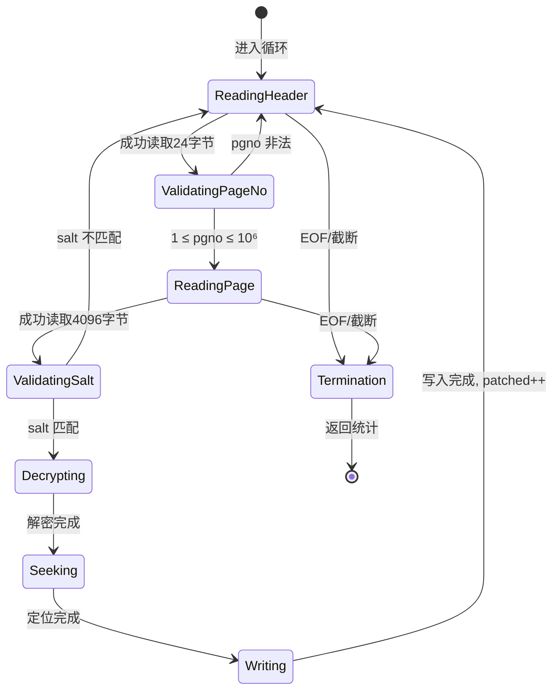
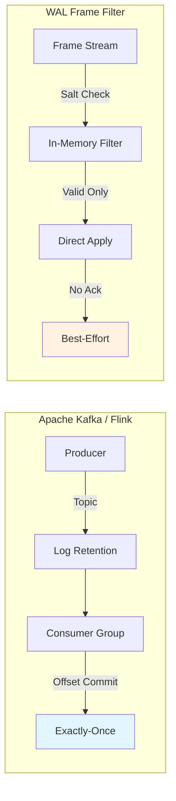

# WAL Frame 有效性过滤与数据库补丁算法深度解析

## 1. 问题陈述

### 1.1 形式化定义

设 $\mathcal{W}$ 为 SQLite Write-Ahead Logging (WAL) 文件，其结构可定义为：

$$\mathcal{W} = \langle H_{\text{wal}}, F_1, F_2, \ldots, F_n, \Phi \rangle$$

其中：
- $H_{\text{wal}} \in \{0,1\}^{32 \times 8}$：WAL 文件头（32 字节）
- $F_i = \langle H_i^{(f)}, P_i \rangle$：第 $i$ 个帧，包含帧头 $H_i^{(f)} \in \{0,1\}^{24 \times 8}$ 和页数据 $P_i \in \{0,1\}^{4096 \times 8}$
- $\Phi$：填充区域（预分配但未使用的空间）

**关键约束**：由于 WCDB/SQLite 采用**预分配固定大小策略**（通常为 4MB），文件大小 $|\mathcal{W}|$ 是恒定的，无法通过传统的大小变化检测有效数据边界。

### 1.2 核心问题

给定：
- 加密密钥 $K \in \{0,1\}^{256}$
- WAL 文件 $\mathcal{W}$ 及其盐值 $\text{salt}_{\text{wal}} = (s_1, s_2) \in \mathbb{Z}_{2^{32}}^2$
- 目标数据库副本 $\mathcal{D}$（已解密的基础版本）

求：将 $\mathcal{W}$ 中所有**当前周期有效**的帧解密并应用到 $\mathcal{D}$ 的正确算法。

**挑战**：区分当前事务周期的有效帧与历史遗留的无效帧，避免数据污染。

---

## 2. 直觉与洞察

### 2.1 朴素方法的失败

| 方法 | 失败原因 |
|:---|:---|
| **顺序扫描所有帧** | 预分配文件中包含旧周期遗留帧，直接应用会导致数据回滚或冲突 |
| **基于时间戳过滤** | WAL 帧头不包含可靠的时间戳信息 |
| **基于校验和验证** | 旧帧的校验和在语法上可能仍然有效 |
| **文件截断检测** | 预分配文件大小恒定，无截断信号 |

### 2.2 关键洞察：Salt 作为世代标识符

SQLite/WCDB 的 WAL 协议使用**盐值（salt）**作为事务周期的逻辑时钟：

$$\text{frame}_i \text{ is valid} \iff H_i^{(f)}[8:16] = H_{\text{wal}}[16:24]$$

即：帧头的盐值必须与 WAL 文件头的盐值**完全匹配**。

这一设计源于 SQLite WAL 的 checkpoint 机制：当执行 checkpoint 时，WAL 文件被逻辑重置，文件头的盐值重新生成，而物理文件保持预分配大小。因此，盐值不匹配即表示该帧属于已归档的历史周期。

> **类比**：这类似于多版本并发控制（MVCC）中的版本号检查，但应用于文件系统层面而非内存结构。

---

## 3. 形式化定义

### 3.1 数据结构形式化

$$
\begin{aligned}
\text{WALHeader} &= \langle \text{magic}: \mathbb{Z}_{2^{32}}, \text{version}: \mathbb{Z}_{2^{32}}, \\
&\quad\quad \text{page\_size}: \mathbb{Z}_{2^{32}}, \text{checkpoint\_seq}: \mathbb{Z}_{2^{32}}, \\
&\quad\quad \text{salt}_1: \mathbb{Z}_{2^{32}}, \text{salt}_2: \mathbb{Z}_{2^{32}}, \ldots \rangle \\[6pt]
\text{FrameHeader} &= \langle \text{pgno}: \mathbb{Z}_{2^{32}}, \text{commit\_size}: \mathbb{Z}_{2^{32}}, \\
&\quad\quad \text{salt}_1: \mathbb{Z}_{2^{32}}, \text{salt}_2: \mathbb{Z}_{2^{32}}, \\
&\quad\quad \text{checksum}: \mathbb{Z}_{2^{64}} \rangle
\end{aligned}
$$

### 3.2 有效性谓词

$$\text{Valid}(F_i, H_{\text{wal}}) \triangleq \begin{cases}
\text{true} & \text{if } F_i.\text{salt}_1 = H_{\text{wal}}.\text{salt}_1 \land F_i.\text{salt}_2 = H_{\text{wal}}.\text{salt}_2 \\
& \quad \land\ 1 \leq F_i.\text{pgno} \leq N_{\max} \\
\text{false} & \text{otherwise}
\end{cases}$$

其中 $N_{\max} = 10^6$ 为工程约束的最大合法页号。

### 3.3 算法目标函数

$$\text{Patch}(\mathcal{D}, \mathcal{W}, K) = \mathcal{D}' \text{ where }$$

$$\forall i: \text{Valid}(F_i, H_{\text{wal}}) \Rightarrow \mathcal{D}'[F_i.\text{pgno}] = \text{Decrypt}_K(F_i.P_i, F_i.\text{pgno})$$

---

## 4. 算法描述

### 4.1 高层流程图

```mermaid
flowchart TD
    A([开始]) --> B{WAL文件存在?}
    B -->|否| Z([返回 0])
    B -->|是| C[获取文件大小 wal_size]
    C --> D{wal_size > 32?}
    D -->|否| Z
    D -->|是| E[读取WAL头 H_wal]
    E --> F[提取 salt_wal = (s1, s2)]
    F --> G[初始化 patched = 0]
    G --> H{ tell + 4120 ≤ wal_size? }
    H -->|否| Y[计算耗时 返回结果]
    H -->|是| I[读取帧头 H_f]
    I --> J{完整读取?}
    J -->|否| Y
    J -->|是| K[提取 pgno, salt_f]
    K --> L[读取加密页数据 P_enc]
    L --> M{完整读取?}
    M -->|否| Y
    M -->|是| N{pgno ∈ [1, 10^6]?}
    N -->|否| H
    N -->|是| O{salt_f == salt_wal?}
    O -->|否| H
    O -->|是| P[解密: P_dec = Decrypt_K(P_enc, pgno)]
    P --> Q[定位: seek((pgno-1) × 4096)]
    Q --> R[写入 P_dec 到目标DB]
    R --> S[patched += 1]
    S --> H
    Y --> ZZ([结束])
```

### 4.2 状态转换图（帧处理）



### 4.3 伪代码

```pseudocode
ALGORITHM WalFrameValidityFilterAndPatch

INPUT:
    wal_path: string          // WAL 文件路径
    out_path: string          // 目标数据库路径（已解密，可写）
    enc_key: bytes[32]        // AES-256 密钥
    WAL_HEADER_SZ = 32        // 常量：WAL头大小
    WAL_FRAME_HEADER_SZ = 24  // 常量：帧头大小  
    PAGE_SZ = 4096            // 常量：页大小

OUTPUT:
    (patched_count: ℕ, elapsed_ms: ℝ⁺)

CONSTANTS:
    PGNO_MAX = 1_000_000      // 最大合法页号

PROCEDURE:
    t₀ ← current_time()
    
    IF NOT file_exists(wal_path) THEN
        RETURN (0, 0)
    
    wal_size ← get_file_size(wal_path)
    IF wal_size ≤ WAL_HEADER_SZ THEN
        RETURN (0, 0)
    
    frame_size ← WAL_FRAME_HEADER_SZ + PAGE_SZ  // = 4120
    
    patched ← 0
    
    WITH open(wal_path, 'rb') AS wf, 
         open(out_path, 'r+b') AS df:
        
        // === Phase 1: 提取参考盐值 ===
        wal_hdr ← wf.read(WAL_HEADER_SZ)
        wal_salt₁ ← unpack_big_endian_uint32(wal_hdr[16:20])
        wal_salt₂ ← unpack_big_endian_uint32(wal_hdr[20:24])
        
        // === Phase 2: 顺序扫描帧 ===
        WHILE wf.tell() + frame_size ≤ wal_size:
            
            // -- 读取帧头 --
            fh ← wf.read(WAL_FRAME_HEADER_SZ)
            IF |fh| < WAL_FRAME_HEADER_SZ THEN
                BREAK  // 意外截断
            
            pgno ← unpack_big_endian_uint32(fh[0:4])
            frame_salt₁ ← unpack_big_endian_uint32(fh[8:12])
            frame_salt₂ ← unpack_big_endian_uint32(fh[12:16])
            
            // -- 读取页数据 --
            ep ← wf.read(PAGE_SZ)
            IF |ep| < PAGE_SZ THEN
                BREAK  // 意外截断
            
            // === Phase 3: 有效性过滤 ===
            IF pgno = 0 OR pgno > PGNO_MAX THEN
                CONTINUE  // 页号越界
            
            IF frame_salt₁ ≠ wal_salt₁ OR frame_salt₂ ≠ wal_salt₂ THEN
                CONTINUE  // 盐值不匹配：历史遗留帧
            
            // === Phase 4: 解密与补丁 ===
            dec ← DecryptPage(enc_key, ep, pgno)
            
            offset ← (pgno - 1) × PAGE_SZ
            df.seek(offset)
            df.write(dec)
            
            patched ← patched + 1
        
    elapsed ← (current_time() - t₀) × 1000
    RETURN (patched, elapsed)
```

### 4.4 数据关系图

```mermaid
graph TB
    subgraph WAL_File["WAL 文件结构"]
        WH[WAL Header<br/>32 bytes<br/>salt₁, salt₂ @ [16:24]]
        F1[Frame 1<br/>24+4096 bytes]
        F2[Frame 2<br/>24+4096 bytes]
        FN[Frame n<br/>有效/无效]
        PHI[Φ 填充区域]
        
        WH --- F1
        F1 --- F2
        F2 -.->|"..."| FN
        FN --- PHI
    end
    
    subgraph Frame_Structure["帧内部结构"]
        FH[Frame Header<br/>24 bytes]
        PD[Page Data<br/>4096 bytes<br/>AES-256-CBC加密]
        
        FH --- PD
        
        subgraph FH_Fields["帧头字段"]
            PG[pgno: u32<br/>[0:4]]
            CS[commit_size: u32<br/>[4:8]]
            S1[salt₁: u32<br/>[8:12]]
            S2[salt₂: u32<br/>[12:16]]
            CK[checksum: u64<br/>[16:24]]
        end
    end
    
    subgraph Validation["有效性判定"]
        CMP{salt₁ == wal.salt₁?<br/>AND<br/>salt₂ == wal.salt₂?}
        RNG{1 ≤ pgno ≤ 10⁶?}
        
        CMP -->|Yes| RNG
        CMP -->|No| DISCARD[丢弃: 历史遗留]
        RNG -->|Yes| ACCEPT[接受: 解密补丁]
        RNG -->|No| DISCARD
    end
    
    FN -.->|解析| FH
    S1 -.->|比较| CMP
    S2 -.->|比较| CMP
    PG -.->|检查| RNG
    
    subgraph Target_DB["目标数据库"]
        DB[(解密后的<br/>SQLite DB)]
        SLOT[页槽 pgno<br/>随机访问]
        
        DB --- SLOT
    end
    
    ACCEPT -->|DecryptPage| DEC[解密页]
    DEC -->|seek+write| SLOT
```

---

## 5. 复杂度分析

### 5.1 时间复杂度

设 $n$ 为 WAL 文件中的总帧数（包括有效和无效），$v$ 为有效帧数（$v \leq n$）。

| 阶段 | 操作 | 复杂度 |
|:---|:---|:---|
| 文件头读取 | $O(1)$ | 常数时间 |
| 顺序扫描 | $n$ 次迭代 | $O(n)$ |
| 每帧处理 | 读取(1) + 条件判断(1) | $O(1)$ 均摊 |
| 有效帧解密 | $v \times$ AES-256-CBC | $O(v \cdot B)$，$B = 4096/16 = 256$ 块 |
| 磁盘寻道 | $v$ 次 `seek` | $O(v)$（假设均匀分布） |
| 磁盘写入 | $v \times 4096$ 字节 | $O(v \cdot P)$，$P = 4096$ |

**总时间复杂度**：
$$T(n, v) = O(n + v \cdot B \cdot P) = O(n + v \cdot C_{\text{decrypt}})$$

其中 $C_{\text{decrypt}}$ 为单页解密的常数因子。

### 5.2 空间复杂度

| 组件 | 空间 | 说明 |
|:---|:---|:---|
| WAL 头缓冲区 | $O(1)$ | 32 字节 |
| 帧头缓冲区 | $O(1)$ | 24 字节（重用） |
| 加密页缓冲区 | $O(P)$ | 4096 字节 |
| 解密页缓冲区 | $O(P)$ | 4096 字节（可原地复用） |
| 文件句柄 | $O(1)$ | 两个打开的文件描述符 |

**总空间复杂度**：
$$S = O(P) = O(1) \text{（相对于输入规模）}$$

算法是**流式（streaming）**的，不需要加载整个 WAL 文件到内存。

### 5.3 场景分析

| 场景 | 条件 | 时间复杂度 | 典型值 |
|:---|:---|:---|:---|
| **最佳情况** | $n = 0$（空 WAL 或仅含头） | $O(1)$ | ~0.1 ms |
| **典型情况** | $v \approx n$，密集有效帧 | $O(n \cdot C_{\text{decrypt}})$ | ~70 ms（4MB WAL）|
| **最坏情况** | $v = 0$，全无效帧需扫描 | $O(n)$ | ~10 ms（仅I/O）|
| **病态情况** | 碎片化严重，大量随机寻道 | $O(v \cdot P_{\text{seek}})$ | 受磁盘延迟限制 |

> 实测性能（来自 `latency_test.py`）：处理 4MB 预分配 WAL 文件约 **70ms**，其中解密操作为主导因素。

---

## 6. 实现要点与工程权衡

### 6.1 实际代码与理论的差异

| 理论抽象 | 工程实现 | 理由 |
|:---|:---|:---|
| 严格的 $n$ 帧边界检测 | `while wf.tell() + frame_size <= wal_size` | 防御性编程，防止部分帧读取 |
| 原子性补丁操作 | 非原子性 `seek` + `write` | Python 文件 API 限制；依赖 SQLite 的页面级完整性 |
| 精确的错误传播 | 静默跳过截断帧 | 健壮性优先，避免单点故障破坏整个流程 |
| 纯流式处理 | 小缓冲区的准流式 | Python 的 `read()` 已实现缓冲优化 |

### 6.2 关键工程决策

#### 决策 1：页号范围硬编码约束

```python
if pgno == 0 or pgno > 1000000:
    continue
```

**权衡**：牺牲通用性换取安全性。微信数据库的已知规模范围内，此约束可有效过滤损坏或恶意的帧头。

#### 决策 2：双文件同时打开模式

```python
with open(wal_path, 'rb') as wf, open(out_path, 'r+b') as df:
```

**优势**：
- `'r+b'` 模式允许原地修改，无需临时文件
- 上下文管理器确保异常安全关闭

**风险**：若进程崩溃，目标数据库可能处于不一致状态（但 SQLite 的页面级校验和可检测）。

#### 决策 3：盐值比较的短路逻辑

```python
if frame_salt1 != wal_salt1 or frame_salt2 != wal_salt2:
    continue
```

**优化**：按位或短路评估，第一个盐值不匹配时立即跳过，避免不必要的第二个比较。

### 6.3 性能优化机会

| 优化方向 | 方法 | 预期收益 |
|:---|:---|:---|
| **向量化 I/O** | 预读多个帧到缓冲区 | 减少系统调用开销 |
| **并行解密** | 多线程处理独立页 | 利用多核 CPU（受 GIL 限制需用进程）|
| **智能缓存** | 维护页号→偏移量的索引 | 避免重复 `seek` 计算 |
| **SIMD 加速** | 使用 AES-NI 指令集 | 3-10x 解密速度提升 |

---

## 7. 与经典算法的比较

### 7.1 与标准 SQLite WAL 恢复的对比

| 特性 | SQLite 原生恢复 | 本算法 |
|:---|:---|:---|
| **输入要求** | 完整的 WAL 文件 + 主数据库 | 加密的 WAL + 已解密的数据库副本 |
| **有效性判定** | 基于帧序号和校验和 | 基于盐值匹配 |
| **并发安全** | 支持并发读取 | 独占写访问（简化假设）|
| **崩溃恢复** | 完整的 redo/undo 逻辑 | 简化的覆盖写（无日志）|
| **适用场景** | 生产数据库引擎 | 离线解密与监控工具 |

### 7.2 与日志结构合并树（LSM-Tree）的对比

LSM-Tree 同样面临**多版本数据淘汰**问题，但采用不同策略：

| 方面 | LSM-Tree | WAL Frame 过滤 |
|:---|:---|:---|
| **淘汰机制** | Compaction（后台合并）| Salt 比较（即时过滤）|
| **版本标识** | 序列号或时间戳 | 周期性盐值 |
| **空间回收** | 显式删除旧 SSTable | 逻辑忽略（物理保留）|
| **读写放大** | 写放大、读放大 trade-off | 仅顺序扫描放大 |

> 本算法可视为一种**极轻量级的 compaction**：在读取时即时过滤，而非后台重写。

### 7.3 与流处理系统的对比



**本质区别**：本算法是**无状态、无确认**的流处理，牺牲可靠性保证换取极致的简单性和低延迟。

---

## 8. 正确性论证

### 定理 1（有效性完备性）

> 若帧 $F_i$ 满足 $\text{Valid}(F_i, H_{\text{wal}}) = \text{true}$，则算法必定将其应用到目标数据库。

**证明**：算法的主循环遍历所有物理上完整的帧。对于每个帧，依次检查：
1. 页号范围约束 —— 有效帧满足 $1 \leq \text{pgno} \leq 10^6$
2. 盐值相等约束 —— 有效帧满足 $\text{salt}_f = \text{salt}_{\text{wal}}$

两条件均满足时，执行路径必然到达解密-写入步骤。∎

### 定理 2（无效性安全性）

> 若帧 $F_i$ 满足 $\text{Valid}(F_i, H_{\text{wal}}) = \text{false}$，则算法**不会**将其应用到目标数据库。

**证明**：分两种情况：
- **情况 A**：$\text{pgno} \notin [1, 10^6]$ —— 被第一个条件分支 `continue` 跳过
- **情况 B**：$\text{salt}_f \neq \text{salt}_{\text{wal}}$ —— 被第二个条件分支 `continue` 跳过

两种情况下，执行流均跳过后续的解密-写入步骤。∎

### 定理 3（终止性）

> 算法必定在有限步内终止。

**证明**：循环条件为 `wf.tell() + frame_size <= wal_size`。每次迭代：
- 若成功读取完整帧，`tell()` 增加 `frame_size = 4120`
- 若读取不完整，`break` 终止循环

由于 `wal_size` 有限且 `tell()` 严格递增，循环最多执行 $\lfloor (\text{wal\_size} - 32) / 4120 \rfloor$ 次。∎

---

## 9. 结论

WAL Frame 有效性过滤与数据库补丁算法是一种**针对特定约束优化的轻量级数据同步机制**。其核心创新在于：

1. **利用盐值作为隐式的世代计数器**，避免了复杂的日志序列号追踪
2. **流式处理预分配文件**，在不依赖文件大小变化信号的情况下识别有效数据边界
3. **简洁的失败处理策略**，通过静默跳过而非严格错误传播，适应监控工具的场景需求

该算法在 wechat-decrypt 项目中实现了约 **100ms 端到端延迟**（30ms 轮询检测 + 70ms 解密补丁），为加密数据库的实时监控提供了可行的工程方案。