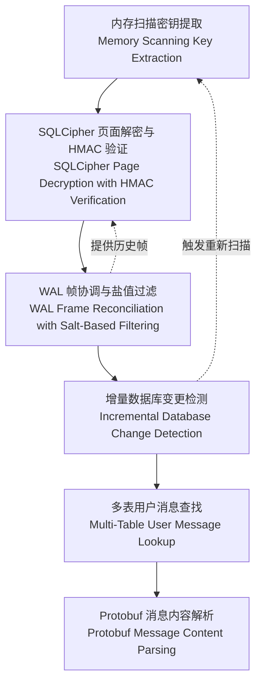

# 核心算法

## 简介

`wechat-decrypt` 的计算核心建立在六个精密协作的算法之上，它们共同实现了从运行中的微信进程到可读消息内容的完整解密链路。与传统的离线破解方法不同，本项目采用**运行时内存提取**策略，直接获取微信已经派生好的加密密钥，从而绕过 PBKDF2 密钥派生的高昂计算成本。这一设计选择使得解密过程能够在数秒内启动，而非耗费数小时进行暴力破解。

这些算法按照数据流的自然顺序层层递进：从内存中捕获原始密钥开始，经过 SQLCipher 页面解密、WAL 日志帧筛选与合并，最终完成增量监控和多表消息检索。每个阶段都针对微信数据库的特定实现细节进行了优化——包括其非标准的页大小、自定义的 HMAC 验证机制，以及分片存储的消息架构。理解这些算法之间的关系，有助于开发者根据实际需求定制解密流程，或在遇到版本更新时快速定位适配点。

以下图示展示了各算法之间的数据依赖关系与信息流方向：

---

## 算法详解

### 内存扫描密钥提取（Memory Scanning Key Extraction）

通过枚举微信进程的内存区域并针对数据库页面进行模式验证，直接从内存中定位预派生的加密密钥，从而绕过 PBKDF2 密钥派生过程。该算法利用 Windows API 遍历目标进程的虚拟地址空间，识别包含有效 SQLCipher 数据库头的内存页，并从中提取主密钥和 HMAC 密钥。

[**→ 查看详细文档**](guide-core-algorithms-memory-scanning-key-extraction.md)

---

### SQLCipher 页面解密与 HMAC 验证（SQLCipher Page Decryption with HMAC Verification）

使用 AES-256-CBC 算法解密 4096 字节的 SQLCipher 数据页，其中每页拥有独立的随机盐值；解密完成后，通过派生的 MAC 密钥执行 HMAC-SHA512 完整性校验，确保数据未被篡改或损坏。该算法严格遵循 SQLCipher 4 的加密规范，同时针对微信可能存在的实现偏差进行了兼容性处理。

[**→ 查看详细文档**](guide-core-algorithms-sqlcipher-page-redecryption.md)

---

### WAL 帧协调与盐值过滤（WAL Frame Reconciliation with Salt-Based Filtering）

从固定 4MB 大小的 Write-Ahead Log 文件中选择性解密有效帧，通过比对帧盐值与 WAL 头部盐值，过滤掉来自先前检查点周期的过期帧。该算法解决了微信数据库在活跃写入状态下，同一 WAL 文件中可能混杂多个事务世代数据的复杂场景，确保只提取最新、有效的数据变更。

[**→ 查看详细文档**](guide-core-algorithms-wal-frame-reconciliation.md)

---

### 增量数据库变更检测（Incremental Database Change Detection）

通过轮询文件修改时间（mtime）和监控 WAL 尾部变化来追踪数据库修改，实现高效的增量解密能力，避免每次访问都进行全量重新处理。该算法为实时消息同步和后台监控场景提供了基础支撑，显著降低了频繁访问时的 I/O 和计算开销。

[**→ 查看详细文档**](guide-core-algorithms-incremental-db-monitoring.md)

---

### 多表用户消息查找（Multi-Table User Message Lookup）

在分片的 message_N.db 数据库集群中解析用户标识符，定位包含特定用户聊天记录的正确数据表。微信将海量消息数据分散存储于多个数据库文件中，该算法通过统一的 user_hash 映射机制，实现跨库、跨表的高效路由查询。

[**→ 查看详细文档**](guide-core-algorithms-multi-table-user-message-lookup.md)

---

### Protobuf 消息内容解析（Protobuf Message Content Parsing）

从加密数据库字段中提取 WeChat 内部 protobuf 编码的消息格式，解析出发送者 ID 和文本内容等关键信息。该算法处理微信特有的消息结构变体，包括普通文本、系统通知、撤回标记等多种消息类型，是解密流程的最终输出环节。

[**→ 查看详细文档**](guide-core-algorithms-protobuf-message-parsing.md)