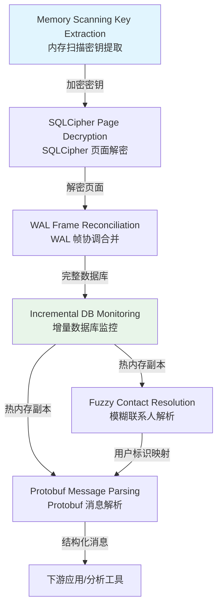

# 核心算法

## 简介

`wechat-decrypt` 的计算核心建立在一套精密协作的逆向工程算法之上，旨在突破微信客户端的加密防护，实现对其本地数据库的安全、高效访问。与传统的暴力破解或密钥猜测方法不同，本项目采用了一种混合策略：通过内存扫描直接获取运行时派生的加密密钥，绕过计算成本极高的 PBKDF2 密钥派生过程；随后利用这些密钥对 SQLCipher 加密的数据库页面进行解密，并处理 Write-Ahead Logging（WAL）机制带来的数据一致性挑战。

整个算法体系的设计遵循"一次解密、持续可用"的原则。在初始化解密环境后，系统会维护热内存中的解密数据库副本，并通过增量监控机制追踪文件变化，避免重复的全量解密操作。这种架构不仅显著降低了查询延迟，也为上层应用提供了接近原生 SQLite 的访问体验。与此同时，针对微信特有的数据模型——包括分片的消息表结构、protobuf 编码的消息内容，以及多样化的用户标识系统——我们开发了一系列专用解析与匹配算法，确保从原始二进制数据到结构化信息的准确转换。

以下图表展示了各核心算法之间的数据流向与依赖关系，帮助理解它们如何协同工作以构成完整的解密与分析管道。

## 算法架构图

## 算法详解

### [内存扫描密钥提取](guide-core-algorithms-memory-scanning-key-extraction.md)

该算法通过枚举 WeChat 进程的内存区域，结合密码学验证手段定位预派生的加密密钥，从而完全绕过 PBKDF2 密钥派生的计算瓶颈。其核心在于识别包含有效 AES-256 密钥材料的内存页，并通过试解密数据库页面头部来确认密钥的正确性，实现从"计算密集型"到"内存访问型"的根本转变。

---

### [SQLCipher 页面解密](guide-core-algorithms-sqlcipher-page-decryption.md)

实现对 SQLCipher 4 标准加密格式的完整兼容，针对 4096 字节的 SQLite 页面执行 AES-256-CBC 解密。算法逐页提取随机盐值、验证 HMAC-SHA512 消息认证码、移除 PKCS7 填充，确保每个页面的完整性与正确性，为后续的数据重组奠定可靠基础。

---

### [WAL 帧协调合并与基于盐值的过滤](guide-core-algorithms-wal-frame-reconciliation.md)

处理微信数据库的 Write-Ahead Logging 机制，解密 WAL 文件中的事务帧并将其补丁式合并至主数据库副本。关键创新在于利用 WAL 头部盐值区分当前有效帧与环形缓冲区中的陈旧残留数据，解决固定 4MB WAL 文件大小限制下的数据时效性问题。

---

### [增量数据库监控与变更检测](guide-core-algorithms-incremental-db-monitoring.md)

维护热内存中的解密数据库副本，通过文件 mtime 变更检测与 WAL 尾部实时监控实现低延迟的数据同步。该机制避免了任何全量重新解密操作，使上层查询能够以毫秒级响应获取最新数据，是支撑实时分析场景的核心基础设施。

---

### [模糊联系人解析](guide-core-algorithms-fuzzy-contact-resolution.md)

解决微信多标识系统的歧义性问题，将昵称、备注名或 wxid 等多种输入形式解析为标准化的用户名。算法自动发现分片的 message_N.db 表结构，并在跨表范围内执行模糊匹配，为消息内容的归属定位提供可靠的标识映射服务。

---

### [Protobuf 消息内容解析](guide-core-algorithms-message-content-parsing.md)

深入解析微信内部 protobuf 编码的二进制消息结构，从加密数据库字段中提取发送者 ID、消息文本及类型元数据。该算法揭示了微信消息存储的底层协议细节，是将原始字节流转化为可理解、可分析的业务数据的关键解码层。