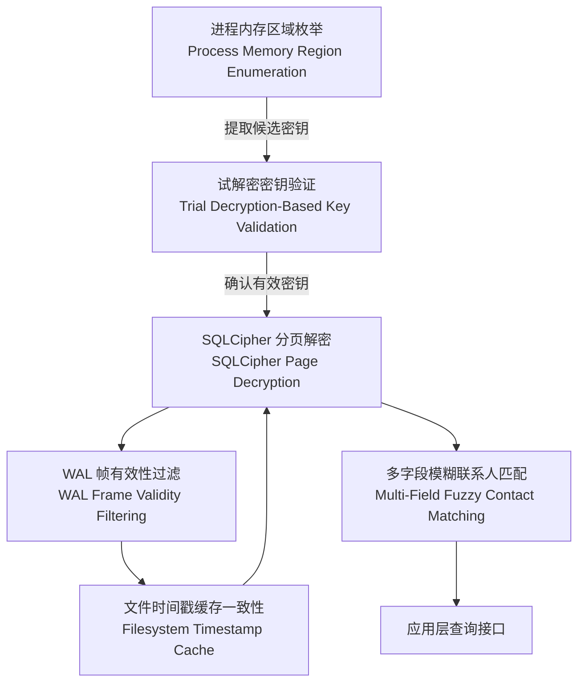

# 核心算法

## 简介

`wechat-decrypt` 的计算核心建立在密码学工程与系统逆向的深度结合之上。本项目并非简单的"解密工具"，而是一套针对微信加密数据库生态的完整分析框架——它需要在不依赖官方密钥派生流程的前提下，从运行中的进程提取密钥、验证其有效性、处理多种存储格式的加密数据，并在性能与准确性之间取得平衡。

整个算法体系围绕三个关键挑战展开：**密钥获取**、**数据解密**与**一致性维护**。首先，我们通过内存扫描直接定位 32 字节的 AES 密钥，绕过 PBKDF2 迭代计算；随后利用 SQLCipher 兼容的分页解密机制恢复 SQLite 数据库内容，同时处理 WAL（Write-Ahead Log）文件的复杂状态；最后，通过文件时间戳缓存和模糊联系人匹配，确保解密结果的高效复用与准确关联。

以下图表展示了各算法之间的数据流向与依赖关系：

---

## 算法详解

### SQLCipher 分页解密与 HMAC 验证

SQLCipher 采用 4096 字节的分页加密方案，每页独立使用 AES-256-CBC 模式加密，并通过 HMAC-SHA512 保障完整性。本算法负责解析页头提取随机盐值，执行 CBC 解密，并验证消息认证码——任何校验失败都将触发页面级错误处理，防止损坏数据进入下游分析流程。[阅读详细文档 →](guide-core-algorithms-sqlcipher-page-decryption.md)

### WAL 帧有效性过滤与数据库修补

微信的 WAL 文件采用预分配策略，导致文件中可能混杂多个检查点周期的残留帧。本算法通过比对帧头盐值与当前 WAL 头部盐值，精确识别属于最新事务的有效帧，跳过过期数据，并将有效变更正确重放到主数据库映像中，确保读取视图的一致性。[阅读详细文档 →](guide-core-algorithms-wal-frame-reconstruction.md)

### 进程内存区域枚举与密钥发现

为避免对 PBKDF2-HMAC-SHA512 进行数百万次迭代的暴力破解，本算法直接枚举 WeChat 进程的只读内存区域，利用密钥的熵特征（高随机性 32 字节序列）进行启发式扫描。该方法将密钥获取时间从理论上的数小时缩短至毫秒级，是整个解密流程的性能基石。[阅读详细文档 →](guide-core-algorithms-memory-scanning-key-extraction.md)

### 试解密密钥验证

内存扫描返回的候选密钥需要快速验证。本算法尝试用候选密钥解密数据库第 1 页（SQLite 主文件头所在页），并检查解密结果是否以标准 SQLite 魔数 `SQLite format 3\0` 开头。这一轻量级验证机制能够在不暴露敏感信息的前提下，可靠区分真实密钥与误报的随机数据。[阅读详细文档 →](guide-core-algorithms-key-validity-verification.md)

### 文件时间戳缓存一致性

重复解密大型数据库会造成显著的性能损耗。本算法维护一个基于 `mtime` 的解密缓存层：在访问数据库前检查原始文件的修改时间，仅当文件发生变更时才触发重新解密。该机制使连续查询的响应时间降低两个数量级，同时保证数据新鲜度。[阅读详细文档 →](guide-core-algorithms-mtime-based-db-cache-invalidation.md)

### 多字段模糊联系人匹配

微信的消息数据分散在多个按用户哈希分片的数据库中，而用户输入的查询可能是昵称、备注名或 wxid 等任意形式。本算法构建跨库的倒排索引，支持拼音前缀、子串匹配及编辑距离容错，将模糊的输入标识解析为规范化的用户名，实现跨分片消息的准确聚合。[阅读详细文档 →](guide-core-algorithms-fuzzy-contact-resolution.md)