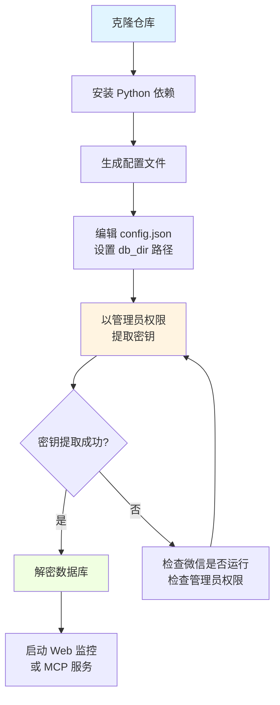
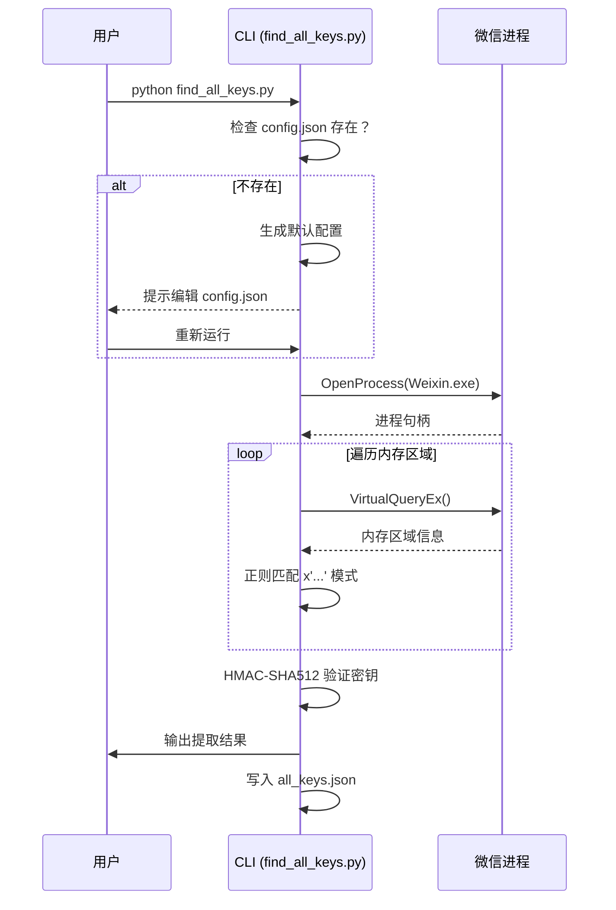

# 快速开始

> 15 分钟内运行 wechat-decrypt，解密你的微信数据库

---

## 安装流程图



---

## 前置要求

| 项目 | 版本/要求 | 说明 |
|:---|:---|:---|
| **操作系统** | Windows 10/11 | 需要管理员权限读取进程内存 |
| **Python** | 3.10+ | 推荐使用 [uv](https://github.com/astral-sh/uv) 或官方安装包 |
| **微信** | 4.0+ | 必须正在运行（登录状态） |
| **磁盘空间** | 2GB+ 可用空间 | 解密后的数据库约为原大小的 1-2 倍 |

### 验证环境

```powershell
# 检查 Python 版本
python --version
# 预期输出: Python 3.10.x 或更高

# 检查微信进程是否运行
tasklist | findstr Weixin
# 预期输出: Weixin.exe ... 正在运行
```

**常见错误 #1：Python 未安装或版本过低**

```
'python' 不是内部或外部命令，也不是可运行的程序
```
**修复**：从 [python.org](https://python.org) 下载安装，或 `winget install Python.Python.3.12`

---

## 第一步：安装依赖

```bash
# 克隆仓库
git clone https://github.com/yourusername/wechat-decrypt.git
cd wechat-decrypt

# 安装依赖
pip install pycryptodome
```

**预期输出：**
```
Successfully installed pycryptodome-3.20.0
```

**常见错误 #2：pip 安装失败**

```
ERROR: Could not find a version that satisfies the requirement pycryptodome
```
**修复**：升级 pip 后重试
```bash
python -m pip install --upgrade pip
pip install pycryptodome
```

---

## 第二步：配置

首次运行会自动生成配置模板：

```bash
python find_all_keys.py
```

**预期输出：**
```
[!] 已生成配置文件: C:\...\wechat-decrypt\config.json
    请修改 config.json 中的路径后重新运行
```

编辑 `config.json`，将 `db_dir` 改为你的微信数据目录：

```json
{
    "db_dir": "D:\\xwechat_files\\wxid_xxxxxxxxxxxx\\db_storage",
    "keys_file": "all_keys.json",
    "decrypted_dir": "decrypted",
    "wechat_process": "Weixin.exe"
}
```

> 💡 **如何找到 db_dir？** 打开微信 → 设置 → 文件管理 → 查看"文件管理"路径，追加 `\db_storage`

**配置项说明**

| 名称 | 必需 | 默认值 | 说明 |
|:---|:---|:---|:---|
| `db_dir` | ✅ | — | 微信加密数据库目录，格式如 `D:\xwechat_files\{wxid}\db_storage` |
| `keys_file` | ❌ | `all_keys.json` | 提取的密钥保存位置（相对路径基于项目根目录） |
| `decrypted_dir` | ❌ | `decrypted` | 解密后数据库输出目录 |
| `wechat_process` | ❌ | `Weixin.exe` | 微信进程名（多开时需指定具体实例） |

**常见错误 #3：路径配置错误**

```
[!] 数据库目录不存在: D:\xwechat_files\...
```
**修复**：确认路径存在且包含 `.db` 文件：
```powershell
ls "D:\xwechat_files\*\db_storage\*.db"
```

---

## 第三步：提取密钥（需要管理员权限）

右键点击 PowerShell 或 CMD，选择"以管理员身份运行"，然后执行：

```powershell
cd C:\path\to\wechat-decrypt
python find_all_keys.py
```

**预期输出：**
```
[*] 发现微信进程 PID: 12345
[*] 扫描内存中...
[*] 找到 26 个数据库
[✓] session/session.db -> key: x'abc123...'
[✓] message/message_0.db -> key: x'def456...'
...
[✓] 成功提取 26/26 个密钥
[*] 密钥已保存到: all_keys.json
```

**首次运行交互时序**



**常见错误 #4：权限不足**

```
[!] 无法打开进程: Access is denied
```
**修复**：必须以**管理员身份**运行终端。右键 PowerShell → "以管理员身份运行"

**常见错误 #5：微信未运行**

```
[!] 未找到微信进程: Weixin.exe
```
**修复**：先登录微信，确认任务管理器中有 `Weixin.exe` 进程

---

## 第四步：解密数据库

```bash
python decrypt_db.py
```

**预期输出：**
```
[*] 加载 26 个密钥
[*] 解密: session/session.db -> decrypted/session/session.db
[*] 解密: message/message_0.db -> decrypted/message/message_0.db
...
[✓] 完成! 共解密 26 个数据库
[*] 输出目录: C:\...\wechat-decrypt\decrypted
```

现在可以用任意 SQLite 工具打开解密后的数据库：

```bash
# 使用 SQLite 命令行
sqlite3 decrypted/session/session.db ".tables"

# 预期输出
Contact        SessionAttach  SessionInfo    ...
```

---

## 第五步：实时消息监控（可选）

### Web UI 方式（推荐）

```bash
python monitor_web.py
```

**预期输出：**
```
[*] 加载 26 个密钥
[*] 启动监控服务器 http://localhost:5678
[*] SSE 端点: /events
```

浏览器访问 http://localhost:5678，即可看到实时消息流。

### 命令行方式

```bash
python monitor.py
```

**预期输出：**
```
[*] 监控会话变化 (每 3 秒)...
[2024-03-15 14:32:01] 文件传输助手: [图片]
[2024-03-15 14:32:15] 工作群: @所有人 下午三点开会
```

---

## 第六步：接入 Claude AI（可选）

```bash
# 安装 MCP 依赖
pip install mcp

# 注册到 Claude Code
claude mcp add wechat -- python C:\full\path\to\mcp_server.py
```

然后在 Claude Code 中直接对话：
```
> 看看微信最近谁找我了
```

---

## 常见问题速查

| 错误现象 | 原因 | 一键修复 |
|:---|:---|:---|
| `Access is denied` | 未以管理员运行 | 右键 PowerShell → "以管理员身份运行" |
| `未找到微信进程` | 微信未启动 | 先登录微信客户端 |
| `数据库目录不存在` | `db_dir` 路径错误 | 微信设置 → 文件管理 查看正确路径 |
| `HMAC 验证失败` | 密钥不匹配或微信版本更新 | 重启微信后重新提取密钥 |
| `端口 5678 被占用` | 其他程序占用端口 | `python monitor_web.py --port 5679` |

---

## 下一步

| 文档 | 适合场景 |
|:---|:---|
| 📘 [新手入门指南](guide-beginners-guide.md) | 想理解工作原理，无需密码学背景 |
| 🏗️ [构建与代码组织](guide-build-and-organization.md) | 准备修改代码或贡献 PR |
| 🔑 [find_all_keys 模块详解](find_all_keys.md) | 深入内存扫描与密钥验证机制 |
| 📡 [monitor_web 模块详解](monitor_web.md) | 定制实时监控功能 |
| 🤖 [mcp_server 模块详解](mcp_server.md) | 扩展 AI 查询能力 |