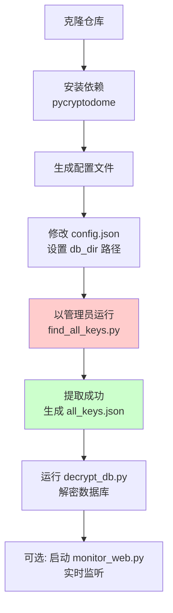
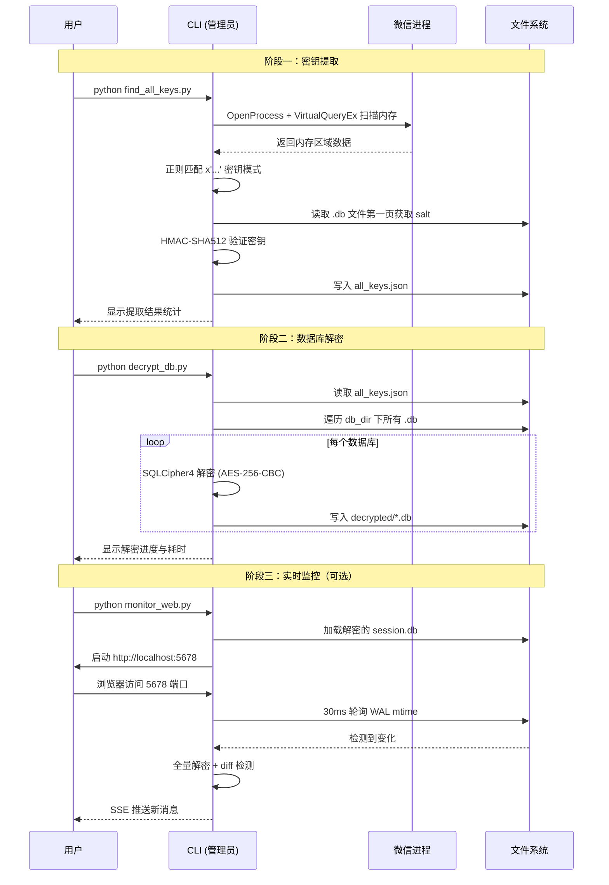

# wechat-decrypt 快速上手指南

> **目标**：15 分钟内在本地运行微信数据库解密工具，实现密钥提取、数据库解密和实时消息监控。

---

## 前置要求

| 项目 | 版本/要求 | 说明 |
|:---|:---|:---|
| Windows | 10/11 | 必需，依赖 Windows API 读取进程内存 |
| Python | 3.10+ | 推荐 3.11 |
| 微信 | 4.0+ | 必须正在运行 |
| 权限 | 管理员 | 读取其他进程内存需要 UAC 提升 |

**检查环境命令：**

```bash
# 验证 Python 版本
python --version
# 预期输出: Python 3.11.x (或 3.10+)

# 验证微信进程（确保微信已登录）
tasklist | findstr Weixin
# 预期输出: Weixin.exe  ...  正在运行的进程信息
```

**常见错误 #1：Python 未安装或版本过低**
```
'python' 不是内部或外部命令...
```
**修复**：从 [python.org](https://python.org) 下载安装 3.11+，勾选"Add to PATH"

---

## 安装流程



### 步骤 1：克隆项目

```bash
# 使用 git 克隆
git clone https://github.com/lfyuomr-gylo/wechat-decrypt.git
cd wechat-decrypt

# 或使用 GitHub CLI
gh repo clone lfyuomr-gylo/wechat-decrypt
cd wechat-decrypt
```

**预期输出：**
```
Cloning into 'wechat-decrypt'...
remote: Enumerating objects: 150, done.
Receiving objects: 100% (150/150), done.
```

**常见错误 #2：无 git 命令**
```
'git' 不是内部或外部命令...
```
**修复**：`winget install Git.Git` 或下载 [Git for Windows](https://git-scm.com/download/win)

---

### 步骤 2：安装依赖

```bash
pip install pycryptodome
```

**预期输出：**
```
Successfully installed pycryptodome-3.20.0
```

**常见错误 #3：pip 安装失败/超时**
```
ERROR: Could not find a version that satisfies...
```
**修复**：换国内源 `pip install pycryptodome -i https://pypi.tuna.tsinghua.edu.cn/simple`

---

### 步骤 3：生成并编辑配置

```bash
# 首次运行会自动生成 config.json
python find_all_keys.py
```

**预期输出：**
```
[!] 已生成配置文件: C:\...\wechat-decrypt\config.json
    请修改 config.json 中的路径后重新运行
```

**编辑 `config.json`：**

```bash
# 用记事本打开（或 VS Code: code config.json）
notepad config.json
```

修改为实际路径：
```json
{
    "db_dir": "D:\\xwechat_files\\wxid_xxxxxxxxxxxx\\db_storage",
    "keys_file": "all_keys.json",
    "decrypted_dir": "decrypted",
    "wechat_process": "Weixin.exe"
}
```

> 💡 **如何找到 `db_dir`**：微信 → 设置 → 文件管理 → 查看存储路径，加上 `\db_storage`

**常见错误 #4：路径格式错误**
```
FileNotFoundError: [WinError 3] 系统找不到指定的路径...
```
**修复**：Windows 路径需双反斜杠 `\\` 或正斜杠 `/`，如 `D:/xwechat_files/...`

---

## 首次运行完整示例



### 步骤 4：提取密钥（关键步骤）

**必须以管理员身份运行 PowerShell/CMD：**

```bash
# 右键点击 PowerShell → 以管理员身份运行
# 然后进入项目目录
cd C:\Users\你的用户名\wechat-decrypt

python find_all_keys.py
```

**预期输出：**
```
[*] 查找微信进程 Weixin.exe ...
[+] 找到微信进程 PID: 15234
[*] 扫描进程内存中...
[+] 发现 26 个数据库文件
[+] 成功提取 26/26 个密钥
[+] 密钥已保存到: all_keys.json

数据库清单:
  - contact/contact.db
  - message/message_0.db
  - message/message_1.db
  ...
  - session/session.db
```

**常见错误 #5：非管理员权限**
```
PermissionError: [WinError 5] 拒绝访问。
```
**修复**：关闭当前窗口，右键 PowerShell → **以管理员身份运行**

**常见错误 #6：微信未运行**
```
RuntimeError: 未找到微信进程 Weixin.exe
```
**修复**：启动微信并登录，再运行命令

---

### 步骤 5：解密数据库

```bash
python decrypt_db.py
```

**预期输出：**
```
[*] 加载密钥文件: all_keys.json
[*] 发现 26 个数据库需要解密
[*] 输出目录: C:\...\wechat-decrypt\decrypted

[1/26] contact/contact.db ... OK (0.45s)
[2/26] message/message_0.db ... OK (12.30s)
[3/26] message/message_1.db ... OK (8.72s)
...
[26/26] session/session.db ... OK (0.12s)

[+] 全部完成! 总耗时: 45.67s
[+] 解密文件位于: decrypted/
```

**验证解密成功：**
```bash
# 用 sqlite3 或 DB Browser for SQLite 打开
sqlite3 decrypted\session\session.db ".tables"
# 预期输出: Session  SessionAttachInfo  ...
```

---

### 步骤 6：启动实时消息监控（Web UI）

```bash
python monitor_web.py
```

**预期输出：**
```
[*] 加载会话数据库...
[+] 已加载 156 个会话
[*] 启动 HTTP 服务器 on http://0.0.0.0:5678
[+] SSE endpoint: /events

监控状态:
- 轮询间隔: 30ms
- 当前会话数: 156
- 等待客户端连接...
```

**浏览器访问：** http://localhost:5678

界面显示：
- 左侧：会话列表（含未读数、最后消息预览）
- 右侧：选中会话的实时消息流
- 新消息自动高亮并滚动

**停止服务：** 按 `Ctrl+C`

---

## 配置项详解

| 配置名 | 必需 | 默认值 | 说明 |
|:---|:---|:---|:---|
| `db_dir` | ✅ | `D:\xwechat_files\your_wxid\db_storage` | 微信加密数据库目录，从微信设置中获取 |
| `keys_file` | ❌ | `all_keys.json` | 提取的密钥保存位置（相对/绝对路径均可） |
| `decrypted_dir` | ❌ | `decrypted` | 解密后数据库输出目录 |
| `wechat_process` | ❌ | `Weixin.exe` | 微信进程名（多开时需指定具体实例） |

**高级：多开微信配置**
```json
{
    "wechat_process": "Weixin.exe",
    "multi_instance": {
        "pid": 15234,
        "note": "工作号"
    }
}
```

---

## 常见错误速查表

| 错误现象 | 根因 | 一行修复 |
|:---|:---|:---|
| `PermissionError: [WinError 5]` | 非管理员权限 | 右键 PowerShell → 以管理员身份运行 |
| `FileNotFoundError: db_dir` | 路径配置错误 | 微信设置 → 文件管理复制完整路径，双反斜杠转义 |
| `RuntimeError: 未找到微信进程` | 微信未启动 | 启动微信并登录后再运行 |
| `KeyError: xxx.db` in decrypt | 密钥提取不完整 | 重新运行 `find_all_keys.py`（微信保持运行） |
| `ModuleNotFoundError: Crypto` | pycryptodome 未装 | `pip install pycryptodome` |
| Web 界面空白/404 | 端口被占用 | `python monitor_web.py --port 5679` 换端口 |

---

## 下一步

根据你的使用场景选择深入方向：

| 目标 | 下一步文档 |
|:---|:---|
| 理解核心原理（内存扫描、SQLCipher 解密） | [🔑 find_all_keys 模块详解](find_all_keys.md) |
| 自定义监控功能、集成到其他系统 | [📡 monitor_web 架构指南](monitor_web.md) |
| 让 Claude AI 查询微信数据 | [🤖 MCP Server 配置](mcp_server.md) + [USAGE.md 案例](USAGE.md) |
| 批量分析聊天记录、数据导出 | 参考 `decrypt_db.py` 输出，直接用 SQLite 工具 |

**推荐探索顺序：**
1. 先用 `monitor_web.py` 体验实时消息流
2. 阅读 `find_all_keys.md` 理解"内存找密钥"的技术巧思
3. 尝试 [MCP Server](mcp_server.md) 让 AI 帮你分析聊天数据

---

**安全提醒**：本工具仅用于解密自己的微信数据。请勿将提取的密钥或解密后的数据库上传至公共平台。