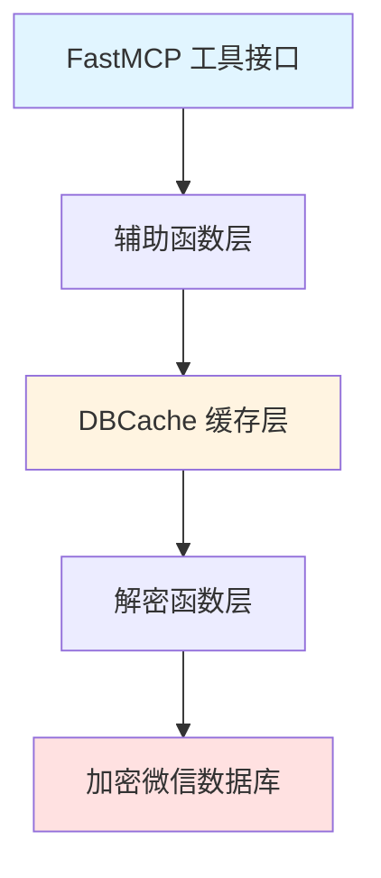

# mcp_server 模块技术深度解析

## 1. 模块概述

mcp_server 模块是一个基于 FastMCP 的微信数据查询服务，它允许通过 Claude AI 工具接口访问和查询本地微信的加密数据库文件。这个模块解决了从加密的微信数据库中高效、安全地提取联系人、聊天记录等信息的问题。

### 问题背景

微信的本地数据库文件都是加密存储的，直接无法读取。传统的做法可能是每次需要查询时都解密整个数据库文件，但这样会带来几个问题：

1. **性能低下**：每次查询都需要完整解密数据库文件，耗时较长
2. **重复解密**：多次查询相同数据会造成不必要的计算开销
3. **WAL 文件处理**：SQLite 的 WAL（Write-Ahead Logging）文件也需要正确处理才能获取最新数据
4. **资源管理**：临时解密文件的清理和资源泄漏问题

### 解决方案

mcp_server 模块设计了一个智能的数据库缓存机制（DBCache），配合一系列解密函数和 MCP 工具接口，实现了高效、安全的微信数据查询。

---

## 2. 核心架构

### 2.1 架构概览



### 2.2 组件角色

1. **FastMCP 工具接口层**：提供 `get_recent_sessions`、`get_chat_history`、`search_messages`、`get_contacts` 等工具，供 AI 调用
2. **辅助函数层**：处理联系人解析、消息格式化、用户名匹配等业务逻辑
3. **DBCache 缓存层**：核心组件，负责解密数据库文件的缓存管理
4. **解密函数层**：实现 `decrypt_page`、`full_decrypt`、`decrypt_wal` 等底层解密操作
5. **加密微信数据库**：原始的加密 SQLite 数据库文件和 WAL 文件

### 2.3 数据流程

以查询聊天记录为例，数据流程如下：

1. 用户调用 `get_chat_history(chat_name)` 工具
2. `resolve_username` 函数将聊天名解析为微信用户名
3. `_find_msg_table_for_user` 函数查找对应的数据库和表
4. 调用 `_cache.get(rel_key)` 获取解密后的数据库路径
   - 如果缓存命中且未过期，直接返回临时文件路径
   - 如果缓存未命中或已过期，执行解密流程
5. 解密流程：
   - 调用 `full_decrypt` 解密主数据库文件
   - 调用 `decrypt_wal` 合并 WAL 文件中的最新数据
   - 将解密后的文件路径和元数据存入缓存
6. 连接解密后的 SQLite 数据库，执行查询
7. 格式化并返回结果

---

## 3. 核心组件深度解析

### 3.1 DBCache 类

DBCache 是整个模块的核心，它实现了一个基于文件修改时间（mtime）的数据库缓存系统。

#### 设计意图

DBCache 的设计解决了两个关键问题：
1. **性能优化**：避免重复解密相同的数据库文件
2. **数据新鲜度**：通过检测文件修改时间确保使用最新数据

#### 内部实现

```python
class DBCache:
    def __init__(self):
        self._cache = {}  # rel_key -> (db_mtime, wal_mtime, tmp_path)
```

- `_cache` 字典存储缓存条目，键是相对路径（如 "contact\\contact.db"）
- 值是一个三元组：(数据库文件修改时间, WAL 文件修改时间, 临时解密文件路径)

#### get() 方法详解

`get()` 方法是 DBCache 的核心，它的工作流程如下：

1. **验证密钥存在**：检查 `rel_key` 是否在 `ALL_KEYS` 中
2. **构建路径**：将相对路径转换为绝对路径，并处理 WAL 文件路径
3. **获取修改时间**：获取数据库文件和 WAL 文件的 mtime
4. **缓存验证**：
   - 如果缓存条目存在
   - 检查数据库 mtime 是否匹配
   - 检查 WAL mtime 是否匹配
   - 检查临时文件是否存在
   - 如果所有条件都满足，直接返回缓存的临时文件路径
5. **缓存失效处理**：
   - 删除旧的临时文件
   - 执行完整解密流程
   - 合并 WAL 文件数据
   - 更新缓存条目
6. **返回临时文件路径**

#### 设计亮点

1. **mtime 双重检测**：同时检测数据库文件和 WAL 文件的修改时间，确保数据新鲜度
2. **临时文件管理**：使用 `tempfile.mkstemp()` 创建临时文件，避免文件名冲突
3. **自动清理**：通过 `atexit.register(_cache.cleanup)` 确保程序退出时清理所有临时文件
4. **WAL 合并**：不仅解密主数据库文件，还会合并 WAL 文件中的最新数据

---

## 4. 解密机制详解

### 4.1 加密常量

```python
PAGE_SZ = 4096      # SQLite 页大小
KEY_SZ = 32          # 密钥大小（256位）
SALT_SZ = 16         # Salt 大小
RESERVE_SZ = 80      # 保留区大小
```

微信数据库使用 AES-256-CBC 加密，每页 4096 字节。

### 4.2 decrypt_page 函数

这是最底层的解密函数，负责解密单个 SQLite 页。

**设计要点**：
1. **IV 提取**：从页的保留区提取 IV（初始化向量）
2. **第一页特殊处理**：第一页需要添加 SQLite 文件头
3. **CBC 模式解密**：使用 AES-256-CBC 模式解密

### 4.3 full_decrypt 函数

完整解密整个数据库文件。

**流程**：
1. 计算总页数
2. 逐页读取加密文件
3. 逐页解密
4. 写入输出文件

### 4.4 decrypt_wal 函数

处理 SQLite WAL 文件，将其中的最新数据合并到已解密的数据库中。

**关键操作**：
1. 读取 WAL 文件头
2. 遍历 WAL 帧
3. 验证帧的 salt 值
4. 解密帧数据
5. 将解密后的页写入正确位置

---

## 5. 设计决策与权衡

### 5.1 缓存策略选择

**选择**：基于 mtime 的缓存策略

**替代方案**：
- 固定时间过期：简单但可能使用过期数据
- 手动失效：需要外部触发，不自动化

**选择理由**：
- mtime 是文件系统提供的可靠元数据
- 能够自动检测文件变化
- 实现简单高效

**权衡**：
- 依赖文件系统时间正确性
- 如果文件被 touch 但内容未变，会导致不必要的重新解密

### 5.2 临时文件 vs 内存数据库

**选择**：临时文件

**替代方案**：内存中解密并创建 SQLite 连接

**选择理由**：
- 可以复用 SQLite 的文件缓存机制
- 多次查询同一数据库时无需重新解密
- 内存占用更低

**权衡**：
- 磁盘 I/O 开销
- 需要管理临时文件的生命周期

### 5.3 联系人缓存策略

**选择**：全局变量缓存，首次加载后永久有效

**替代方案**：
- 随数据库缓存一起失效
- 定期刷新

**选择理由**：
- 联系人数据变化不频繁
- 简化实现
- 提高查询性能

**权衡**：
- 联系人更新可能不会立即反映
- 需要重启服务才能获取最新联系人

---

## 6. 使用指南

### 6.1 配置

模块依赖 `config.json` 配置文件，包含以下字段：

```json
{
  "db_dir": "D:\\WeChat\\Files\\...",
  "keys_file": "keys.json",
  "decrypted_dir": "./decrypted"
}
```

- `db_dir`：微信数据库目录
- `keys_file`：存储数据库密钥的 JSON 文件
- `decrypted_dir`：预解密数据库目录（可选）

### 6.2 MCP 工具

模块提供了以下 MCP 工具：

1. `get_recent_sessions(limit)`：获取最近会话列表
2. `get_chat_history(chat_name, limit)`：获取指定聊天的消息记录
3. `search_messages(keyword, limit)`：在所有聊天记录中搜索关键词
4. `get_contacts(query, limit)`：搜索或列出微信联系人

---

## 7. 注意事项与陷阱

### 7.1 路径分隔符

代码中使用了 Windows 风格的路径分隔符 `\\`，在 `get()` 方法中会转换为操作系统特定的分隔符：

```python
rel_path = rel_key.replace('\\', os.sep)
```

这确保了代码在不同操作系统上的可移植性。

### 7.2 WAL 文件处理

WAL 文件的处理非常重要，它包含了数据库的最新修改。如果不处理 WAL 文件，可能会获取到过期数据。

### 7.3 临时文件清理

虽然模块通过 `atexit` 注册了清理函数，但如果程序异常终止（如被 kill -9），临时文件可能不会被清理，需要注意磁盘空间管理。

### 7.4 性能考虑

- 首次解密大数据库文件可能需要较长时间
- 搜索所有消息（`search_messages`）会遍历所有数据库文件，可能较慢
- 建议在搜索时使用合理的 `limit` 参数

### 7.5 并发安全

当前实现没有考虑并发访问，如果多个请求同时访问同一数据库，可能会导致问题。在实际使用中需要注意。

---

## 8. 总结

mcp_server 模块通过精心设计的缓存机制和解密流程，实现了高效、安全的微信数据查询。DBCache 类是整个模块的核心，它通过 mtime 检测和临时文件管理，在性能和数据新鲜度之间取得了良好的平衡。

这个模块展示了如何在复杂的加密数据库环境中，通过合理的缓存策略和资源管理，提供高效的数据访问服务。
