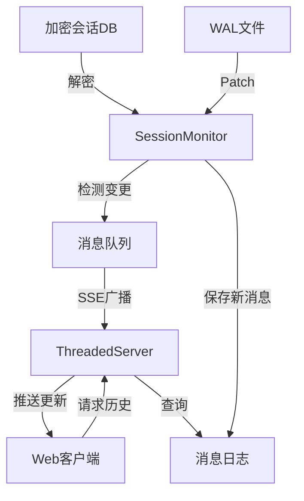

# monitor_web 模块技术深度解析

## 1. 问题域与解决方案

### 问题背景
在现代即时通讯应用中，会话数据通常以加密的 SQLite 数据库形式存储，以保护用户隐私。然而，这给需要实时监控和展示会话更新的应用场景带来了挑战：

1. 原始数据库文件是加密的，无法直接查询
2. 数据库使用 Write-Ahead Logging (WAL) 机制，最新数据可能未完全写入主数据库
3. 需要实时、低延迟地将新消息推送给订阅者
4. 需要一个 Web 界面来展示历史消息和实时更新

### 设计洞察
monitor_web 模块采用了一种"解密-监控-推送"的三层架构，通过定期解密数据库并检测变化，结合 SSE (Server-Sent Events) 实现实时消息推送。这种设计既保证了数据的安全性，又提供了良好的实时性。

## 2. 核心概念与心理模型

### 核心抽象

1. **SessionMonitor**：会话监控核心，负责加密数据库的解密、状态查询和变更检测
2. **ThreadedServer**：基于多线程的 HTTP 服务器，处理并发连接
3. **Handler**：HTTP 请求处理器，负责提供静态页面、历史消息 API 和 SSE 流
4. **SSE 广播机制**：实时消息推送系统，使用队列和锁保证多线程安全

### 心理模型
想象 SessionMonitor 是一位**密码破译员兼侦探**：
- 它持有解密密钥，能定期打开加密的数据库保险箱
- 它仔细比对当前和上次看到的会话状态，找出新消息
- 发现新消息后，它像**广播站**一样，通过 SSE 渠道将消息推送给所有订阅的客户端
- 同时，它还维护一份**消息档案**，供新连接的客户端查询历史记录

## 3. 架构与数据流程

### 系统架构图



### 数据流程详解

1. **数据库解密流程**：
   - `SessionMonitor.check_updates()` 被周期性调用
   - 调用 `do_full_refresh()` 解密主数据库
   - 如有 WAL 文件，通过 `decrypt_wal_full()` 将最新变更应用到解密后的数据库

2. **变更检测流程**：
   - `query_state()` 从解密数据库读取当前会话状态
   - 与 `prev_state` 比较，识别新消息
   - 新消息按时间排序后加入 `messages_log`

3. **实时推送流程**：
   - `broadcast_sse()` 将消息格式化后加入所有客户端队列
   - `Handler` 的 `/stream` 端点从队列读取并推送给客户端
   - 每 15 秒发送心跳保持连接活跃

## 4. 核心组件深度解析

### SessionMonitor 类

**设计意图**：作为整个模块的核心，负责加密数据库的解密、会话状态监控和新消息检测。

**关键方法解析**：

1. **`__init__(enc_key, session_db, contact_names)`**
   - 初始化时接收加密密钥、数据库路径和联系人名称映射
   - 设置 WAL 文件路径（SQLite 的默认 WAL 命名规则）
   - 初始化状态缓存和性能统计变量

2. **`do_full_refresh()`**
   - **设计意图**：创建加密数据库的完整解密副本，包括应用 WAL 中的最新变更
   - **实现细节**：
     - 先调用 `full_decrypt()` 解密主数据库
     - 再通过 `decrypt_wal_full()` 应用 WAL 中的有效帧
     - 记录解密时间和处理的页数用于性能监控
   - **为什么这样设计**：
     - 每次都创建完整副本而非增量更新，简化了实现
     - 虽然有一定性能开销，但对于消息监控场景是可接受的

3. **`check_updates()`**
   - **设计意图**：执行完整的检查流程，包括解密、状态比较和消息推送
   - **工作流程**：
     1. 执行完整刷新
     2. 查询当前状态
     3. 与前一状态比较，识别新消息
     4. 格式化新消息并加入日志
     5. 通过 SSE 广播新消息
     6. 更新 `prev_state`
   - **关键设计决策**：
     - 所有新消息先收集后按时间排序，确保时序正确性
     - 异常处理确保单个错误不会破坏整个监控流程
     - 详细的性能日志便于优化和调试

### ThreadedServer 类

**设计意图**：提供一个支持多线程的 HTTP 服务器，能够处理多个并发客户端连接。

**实现特点**：
- 继承自 `ThreadingMixIn` 和 `HTTPServer`
- 设置 `daemon_threads = True` 确保主线程退出时子线程也能正确终止
- 这种组合是 Python 标准库中创建多线程 HTTP 服务器的经典模式

### Handler 类

**设计意图**：处理不同类型的 HTTP 请求，提供 Web UI、历史消息 API 和 SSE 流。

**关键端点解析**：

1. **`/` 和 `/index.html`**
   - 提供静态 HTML 页面
   - 设计简洁，所有 UI 逻辑包含在单个 `HTML_PAGE` 中

2. **`/api/history`**
   - 返回历史消息 JSON 数组
   - 使用 `messages_lock` 确保线程安全
   - 消息按时间戳排序返回

3. **`/stream`**
   - **设计意图**：实现 SSE (Server-Sent Events) 推送
   - **实现细节**：
     - 创建一个队列并注册到 `sse_clients`
     - 循环从队列读取消息并推送给客户端
     - 15 秒超时发送心跳保持连接
     - 异常时确保清理队列注册
   - **为什么这样设计**：
     - 每个客户端有自己的队列，避免消息丢失
     - 使用锁保护 `sse_clients` 列表，确保多线程安全
     - 心跳机制解决网络中间设备的超时断开问题

## 5. 依赖分析

### 模块依赖

- **内部依赖**：
  - `full_decrypt`：用于解密完整的 SQLite 数据库
  - `decrypt_wal_full`：用于解密并应用 WAL 文件中的变更
  - `format_msg_type`、`msg_type_icon`：消息类型格式化工具

- **外部依赖**：
  - `sqlite3`：数据库操作
  - `threading`、`queue`：多线程支持
  - `http.server`：HTTP 服务器基础

### 数据契约

1. **输入契约**：
   - `enc_key`：有效的数据库加密密钥
   - `session_db`：存在且可访问的加密 SQLite 数据库路径
   - `contact_names`：用户名到显示名的映射字典

2. **输出契约**：
   - SSE 消息格式：JSON 对象，包含时间戳、聊天信息、发送者、内容等字段
   - 历史 API 返回：按时间排序的消息 JSON 数组

### 调用关系

```
SessionMonitor.check_updates()
├─> do_full_refresh()
│  ├─> full_decrypt()
│  └─> decrypt_wal_full()
├─> query_state()
└─> broadcast_sse()
    └─> [sse_clients 队列操作]

Handler.do_GET()
├─> [返回 HTML]
├─> [查询 messages_log]
└─> [注册到 sse_clients 并推送]
```

## 6. 设计决策与权衡

### 1. 全量解密 vs 增量解密

**决策**：每次都执行完整解密，而不是尝试增量更新。

**理由**：
- SQLite WAL 机制的复杂性使得增量解密难以正确实现
- 全量解密实现简单，逻辑清晰，不易出错
- 对于监控场景，数据库大小通常不会增长到无法处理的程度

**权衡**：
- 优点：代码简单可靠，不需要维护复杂的状态
- 缺点：每次都有一定的性能开销，特别是对于大型数据库

### 2. 轮询 vs 事件驱动

**决策**：采用定期轮询检查数据库变化，而不是尝试监听文件系统事件。

**理由**：
- SQLite 写入操作的复杂性使得文件系统事件不可靠
- 轮询实现简单，可控性强
- 对于消息监控场景，秒级延迟通常是可接受的

**权衡**：
- 优点：实现简单，不受文件系统特定行为影响
- 缺点：有一定的资源浪费，延迟取决于轮询间隔

### 3. SSE vs WebSocket

**决策**：使用 SSE (Server-Sent Events) 而不是 WebSocket。

**理由**：
- 通信是单向的（服务器到客户端），SSE 更适合这种场景
- SSE 实现更简单，不需要处理 WebSocket 的握手和帧协议
- 浏览器原生支持，客户端代码简单

**权衡**：
- 优点：实现简单，适合单向推送场景
- 缺点：不支持客户端到服务器的消息传递（本场景不需要）

### 4. 每个客户端一个队列 vs 广播机制

**决策**：为每个连接的客户端创建一个单独的队列。

**理由**：
- 确保消息不会因为一个客户端处理慢而影响其他客户端
- 实现简单，队列满时可以灵活处理
- 易于清理和资源管理

**权衡**：
- 优点：客户端之间隔离好，一个慢客户端不会拖慢整个系统
- 缺点：内存使用随着客户端数量线性增长

## 7. 使用指南与最佳实践

### 初始化流程

```python
# 1. 创建 SessionMonitor 实例
monitor = SessionMonitor(
    enc_key=your_encryption_key,
    session_db="path/to/encrypted.db",
    contact_names={"user1": "张三", "user2": "李四"}
)

# 2. 创建并启动服务器
server = ThreadedServer(('0.0.0.0', 8000), Handler)
server_thread = threading.Thread(target=server.serve_forever)
server_thread.daemon = True
server_thread.start()

# 3. 定期调用 check_updates()
while True:
    monitor.check_updates()
    time.sleep(1)  # 每秒检查一次
```

### 配置建议

1. **轮询间隔**：根据实际需求调整，通常 1-2 秒是合理的折中
2. **`MAX_LOG`**：根据预期的消息量和内存限制设置，保留足够的历史记录但不占用过多内存
3. **心跳间隔**：当前设置为 15 秒，可根据网络环境调整

### 扩展点

1. **自定义消息格式化**：修改 `check_updates()` 中消息构造部分
2. **添加过滤规则**：在消息广播前添加条件判断
3. **权限控制**：在 `Handler` 中添加认证逻辑
4. **持久化**：将 `messages_log` 持久化到磁盘

## 8. 注意事项与潜在陷阱

### 线程安全

- 所有访问 `messages_log` 和 `sse_clients` 的地方都必须使用对应的锁
- 不要在持有锁的情况下执行耗时操作

### 资源管理

- SSE 连接异常时确保队列被正确清理
- 长时间运行时注意 `messages_log` 的内存占用

### 数据库相关

- 不要在数据库写入高峰期频繁调用 `check_updates()`
- 确保有足够的磁盘空间用于解密后的数据库副本

### 性能考虑

- 大型数据库会导致每次 `check_updates()` 耗时较长
- 可以考虑添加性能监控，在解密时间过长时发出警告

### 错误处理

- 当前实现中的异常处理较为简单，生产环境可能需要更完善的错误恢复机制
- 注意网络异常和客户端断开连接的处理

## 9. 总结

monitor_web 模块通过简洁而有效的设计，解决了加密数据库实时监控和 Web 展示的问题。它的核心价值在于将复杂的数据库解密、变更检测和实时推送逻辑封装在一个易于理解和使用的模块中。

虽然在某些方面采用了较为简单的实现方式（如全量解密和轮询），但这些选择在特定场景下是合理的权衡，带来了代码的简洁性和可靠性。对于需要监控加密会话数据库并提供实时 Web 界面的应用来说，monitor_web 提供了一个现成的、可直接使用的解决方案。
