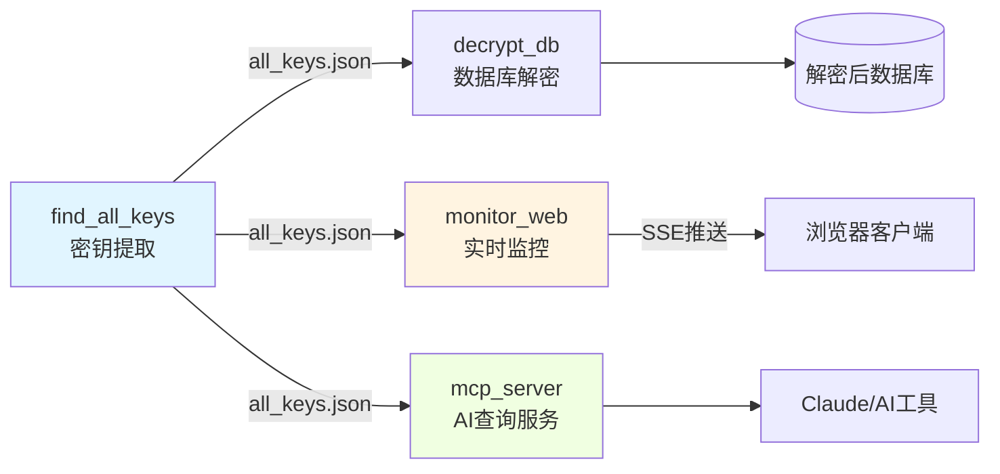

# wechat-decrypt 项目概览

> 一个优雅的微信本地数据库解密与实时监控系统

---

## 📚 文档指南

除了模块技术文档，我们还提供以下指南帮助你快速上手和深入理解：

- **[快速开始](guide-getting-started.md)** —— 从零到运行的完整安装教程，包含环境准备、依赖安装和首次密钥提取的详细步骤。

- **[新手入门指南](guide-beginners-guide.md)** —— 分章节循序渐进的学习路径，无需密码学背景也能理解核心原理，适合希望系统掌握项目的读者。

- **[构建与代码组织](guide-build-and-organization.md)** —— 解析项目构建流程、目录结构设计和各组件间的协作关系，帮助开发者快速定位代码。

- **[核心算法详解](guide-core-algorithms.md)** —— 形式化描述内存扫描、HMAC-SHA512 验证、AES-256-CBC 解密等关键算法的数学原理与实现细节。

---

## 30秒快速理解

想象你的微信聊天记录被锁在一个个加密保险箱里，而钥匙藏在运行中的微信程序内存中。**wechat-decrypt** 就是一套"开锁工具集"：它先通过内存扫描精准定位密钥位置，然后解密数据库文件，最后提供实时监控、Web 展示和 AI 查询等多种访问方式。

整个过程无需暴力破解，不依赖密码猜测，而是巧妙利用 WCDB（微信的 SQLCipher 封装）会在内存中缓存派生密钥这一特性——这是安全研究者称之为"旁路攻击"的经典思路，在这里被转化为可靠的数据访问方案。

---

## 架构全景



### 数据与控制流解读

整个系统采用**分层流水线架构**，数据单向流动，各模块解耦独立：

**第一层：密钥发现（find_all_keys）**
作为整个系统的基石，该模块直接与 Windows 内核 API 交互，枚举微信进程的内存空间，通过正则匹配 `x'([0-9a-fA-F]{64,192})'` 模式定位缓存的派生密钥，并使用 HMAC-SHA512 进行密码学级别的验证。输出是一份 JSON 密钥映射表，供所有下游模块使用。

**第二层：数据消费（多模态并行）**
- **decrypt_db**：批量解密工具，将加密数据库转换为标准 SQLite 文件
- **monitor_web**：实时监控系统，通过 SSE 向 Web 客户端推送新消息
- **mcp_server**：MCP 协议服务，让 Claude 等 AI 助手能直接查询你的微信数据

三个消费模块互不依赖，可根据场景单独部署或组合使用。

---

## 关键设计决策

| 决策 | 选择 | 理由 |
|:---|:---|:---|
| **架构风格** | 模块化单体而非微服务 | 本地工具场景，避免分布式复杂度；模块间通过文件/配置松耦合 |
| **密钥获取** | 内存扫描替代 PBKDF2 暴力破解 | 256,000 次迭代的密钥派生计算不可行；利用目标系统自身缓存是工程最优解 |
| **监控模式** | 轮询 + 全量解密而非事件驱动 | SQLite WAL 机制复杂，轮询实现简单可靠；秒级延迟对聊天监控可接受 |
| **实时推送** | SSE 替代 WebSocket | 单向通信场景，SSE 更简单；原生支持自动重连 |
| **缓存策略** | mtime 检测 + 临时文件 | 平衡性能与新鲜度；复用 SQLite 文件缓存机制 |
| **并发模型** | 多线程 HTTP 服务器 | Python GIL 限制下，IO 密集型场景足够；实现简洁 |

---

## 模块指南

### 🔑 find_all_keys —— 密钥猎人

这是项目的起点，也是最具技术巧思的模块。它不破解加密，而是"借用"微信自己已经算好的密钥。通过 `VirtualQueryEx` 遍历进程内存，筛选可读区域，用精心设计的正则表达式匹配 WCDB 的密钥缓存格式，最后用轻量级 HMAC 验证确保准确性。[深入了解内存扫描与验证机制 →](find_all_keys.md)

### 📡 monitor_web —— 实时会话监控

一旦拥有密钥，这个模块将你的加密会话数据库变成实时消息流。`SessionMonitor` 定期执行"解密-比对-推送"循环：全量解密数据库（包括 WAL 补丁），对比前后状态识别新消息，通过 SSE 广播给所有连接的浏览器。设计上故意选择简单可靠的轮询，而非复杂的文件系统事件监听。[探索实时推送架构 →](monitor_web.md)

### 🤖 mcp_server —— AI 数据接口

让大语言模型能"读懂"你的微信。基于 FastMCP 框架，暴露 `get_chat_history`、`search_messages` 等工具函数。核心创新在于 `DBCache` 类：通过检测文件修改时间（mtime）智能管理解密缓存，避免重复计算，同时自动合并 WAL 文件保证数据最新。这是性能与实时性的精妙平衡。[查看 MCP 服务设计 →](mcp_server.md)

---

## 端到端工作流

### 工作流一：首次部署与密钥提取

```
用户执行 find_all_keys.py
    │
    ▼
┌─────────────────┐     ┌─────────────────┐     ┌─────────────────┐
│  收集 .db 文件   │────▶│  提取每个文件的  │────▶│  获取微信 PID   │
│  读取第一页 salt │     │  salt 值        │     │  (内存最大进程)  │
└─────────────────┘     └─────────────────┘     └─────────────────┘
                                                       │
    ◄──────────────────────────────────────────────────┘
    │
    ▼
┌─────────────────┐     ┌─────────────────┐     ┌─────────────────┐
│  枚举可读内存区  │────▶│  正则匹配密钥   │────▶│  HMAC 验证密钥  │
│  VirtualQueryEx │     │  x'...' 模式    │     │  对抗数据库测试  │
└─────────────────┘     └─────────────────┘     └─────────────────┘
                                                       │
    ◄──────────────────────────────────────────────────┘
    │
    ▼
生成 all_keys.json ──▶ 后续所有模块的输入
```

**关键数据转换**：原始加密数据库 → salt 映射表 ←→ 内存中的 hex 字符串 → 经验证的 32 字节密钥

### 工作流二：实时监控新消息

```
monitor_web 启动
    │
    ▼
┌─────────────────┐     ┌─────────────────┐     ┌─────────────────┐
│  加载密钥配置   │────▶│  SessionMonitor │────▶│  ThreadedServer │
│  all_keys.json  │     │  初始化         │     │  启动 HTTP 服务  │
└─────────────────┘     └─────────────────┘     └─────────────────┘
                              │
                    ┌─────────┴─────────┐
                    ▼                   ▼
              [定时触发 check_updates()]
                    │
    ┌───────────────┼───────────────┐
    ▼               ▼               ▼
┌─────────┐    ┌─────────┐    ┌─────────┐
│full_    │    │query_   │    │broadcast│
│decrypt()│───▶│state()  │───▶│_sse()   │
│+ WAL补丁 │    │差异检测  │    │消息队列  │
└─────────┘    └─────────┘    └─────────┘
                                   │
                    ┌───────────────┼───────────────┐
                    ▼               ▼               ▼
                浏览器A          浏览器B          浏览器C
               (SSE连接)        (SSE连接)        (SSE连接)
```

**关键数据转换**：加密页 → AES-256-CBC 解密 → 会话状态快照 → 差异消息 → JSON SSE 事件

---

## 开始探索

建议按以下顺序深入：

1. **先读** [`find_all_keys`](find_all_keys.md) —— 理解核心创新
2. **再选** [`monitor_web`](monitor_web.md) 或 [`mcp_server`](mcp_server.md) —— 根据你的使用场景
3. **参考** 各模块的"设计决策与权衡"章节 —— 学习工程判断

欢迎贡献代码或提出改进建议！