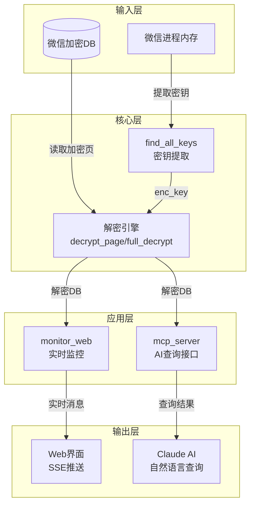

# wechat-decrypt 模块深度解析

## 1. 模块概述

**wechat-decrypt** 是一个用于解密和实时监控微信本地数据库的工具集。它解决了一个核心问题：微信在本地使用 AES 加密存储聊天记录，而用户需要一种安全、高效的方式来访问、搜索和实时监控这些数据。

想象一下，微信的数据库就像一个上锁的保险箱。`wechat-decrypt` 不仅帮你打开这个保险箱（`find_all_keys`），还能：
- 实时监控保险箱里的内容变化（`monitor_web`）
- 通过自然语言与保险箱里的内容交互（`mcp_server`）

这个模块的设计体现了"分层解耦"的思想——密钥提取、解密逻辑、实时监控和查询接口各自独立，通过配置和文件系统交互，而不是直接耦合。

## 2. 架构总览

**数据流向说明：**
1. **密钥提取**：`find_all_keys` 从微信进程内存中扫描出数据库加密密钥
2. **解密**：各子模块共享相同的解密逻辑，对加密的 SQLite 页进行 AES-CBC 解密
3. **应用**：
   - `monitor_web` 通过轮询 WAL 文件的 mtime 检测变化，全量解密后通过 SSE 推送到浏览器
   - `mcp_server` 维护解密后的 DB 缓存，提供 MCP 工具供 Claude 调用查询

## 3. 核心设计决策

### 3.1 为什么选择从进程内存提取密钥，而不是暴力破解？

**选择**：通过扫描微信进程内存中的 `x'<hex>'` 模式提取缓存的密钥。

**原因**：
- 微信使用 256 位 AES 密钥，暴力破解在计算上不可行
- WCDB（微信数据库引擎）在内存中缓存了每个数据库的 `enc_key` 和 `salt`，格式可预测
- 这种方法虽然依赖微信进程的运行状态，但在实际使用中是最可靠的方案

**权衡**：
- ✅ 优点：快速、准确，无需用户提供密码
- ❌ 缺点：需要管理员权限读取进程内存，必须在微信运行时提取

### 3.2 为什么用 mtime 轮询而不是 inotify/fsevents？

**选择**：每 30ms 检查一次 DB 和 WAL 文件的 mtime（修改时间）。

**原因**：
- 微信的 WAL 文件是预分配固定大小的（4MB），文件大小不会变化，无法通过 size 检测
- mtime 是跨平台最可靠的变化指示器
- 30ms 的轮询间隔在实时性和 CPU 占用之间取得了良好平衡（通常 <1% CPU）

**权衡**：
- ✅ 优点：实现简单、跨平台、可靠
- ❌ 缺点：有最多 30ms 的延迟，极端情况下可能错过极快的连续变化

### 3.3 为什么每次变化都全量解密，而不是增量？

**选择**：检测到变化后，重新解密整个 DB 并应用所有 WAL frame。

**原因**：
- SQLite 的加密是按页进行的，每个页都有独立的 IV
- WAL 是环形缓冲区，旧 frame 会被覆盖，难以跟踪"哪些页变了"
- 全量解密虽然听起来开销大，但实际上：
  - 现代 CPU 的 AES-NI 指令集可以每秒解密数百 MB
  - 会话 DB 通常只有几 MB 到几十 MB
  - 实现简单，不易出错

**权衡**：
- ✅ 优点：代码简洁、状态一致、不会遗漏变化
- ❌ 缺点：对于非常大的 DB 可能有性能问题（但在微信场景下不常见）

## 4. 子模块概览

### 4.1 [find_all_keys](wechat-decrypt-find_all_keys.md)
密钥提取模块，负责从微信进程内存中扫描和验证所有数据库的加密密钥。它就像一个"开锁匠"，通过分析微信的内存布局，找到存储在那里的密钥。

### 4.2 [monitor_web](wechat-decrypt-monitor_web.md)
实时监控模块，通过高频轮询检测数据库变化，全量解密后通过 SSE（Server-Sent Events）推送到 Web 界面。它是模块的"眼睛"，让你能实时看到新消息。

### 4.3 [mcp_server](wechat-decrypt-mcp_server.md)
AI 查询接口模块，提供 MCP（Model Context Protocol）工具，让 Claude 等 AI 助手能够通过自然语言查询微信消息和联系人。它是模块的"翻译官"，将自然语言转换为 SQL 查询。

## 5. 关键依赖与外部接口

### 5.1 配置文件
所有子模块共享 `config.json`，定义：
- `db_dir`：微信加密数据库目录
- `keys_file`：提取的密钥存储文件
- `decrypted_dir`：解密后数据库的存储目录

### 5.2 外部库
- `pycryptodome`：提供 AES 解密
- `mcp`：仅 `mcp_server` 使用，提供 AI 接口
- 标准库：`ctypes`（进程内存读取）、`sqlite3`（数据库查询）、`http.server`（Web 界面）

### 5.3 与外部系统的交互
- 微信进程：通过 `ReadProcessMemory` 读取内存
- 浏览器：通过 SSE 推送实时消息
- Claude AI：通过 stdio 传输的 MCP 协议交互

## 6. 新贡献者指南

### 6.1 常见陷阱
1. **不要修改解密逻辑**：`decrypt_page` 的实现与 WCDB 的加密格式严格对应，修改任何字节都可能导致解密失败
2. **注意 Windows 路径**：微信使用反斜杠路径，代码中多处有 `\\` 处理，跨平台修改需谨慎
3. **WAL 的 salt 验证**：WAL 文件包含旧 frame，必须通过 salt 匹配过滤出当前周期的有效 frame

### 6.2 扩展点
- 要添加新的输出格式（如导出到 CSV），建议在 `mcp_server` 中添加新工具
- 要支持其他数据库（如 MediaDB），只需在 `find_all_keys` 中确保其密钥被提取，然后复用解密逻辑
- 要降低延迟，可以考虑使用 `ReadDirectoryChangesW`（Windows）或 `inotify`（Linux）替代 mtime 轮询

### 6.3 调试技巧
- 检查 `keys_file` 是否存在且包含所有需要的密钥
- 验证解密后的 DB 是否能被 SQLite 正常打开（`sqlite3 decrypted.db .schema`）
- 在 `monitor_web` 中，查看控制台输出的性能指标（`[perf] decrypt=X页/Yms`）
