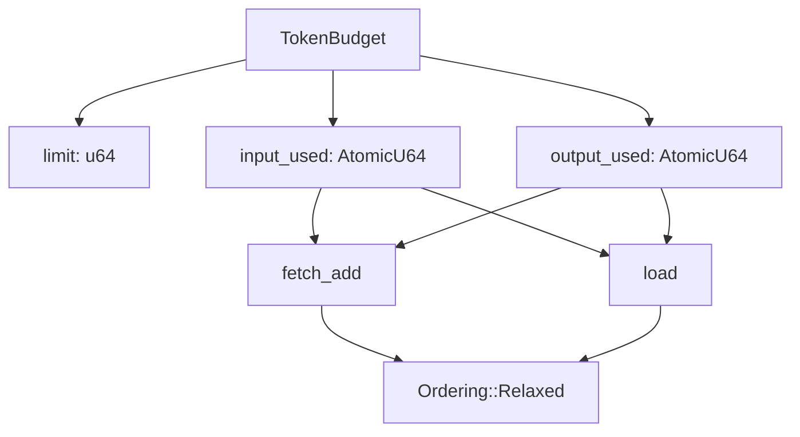
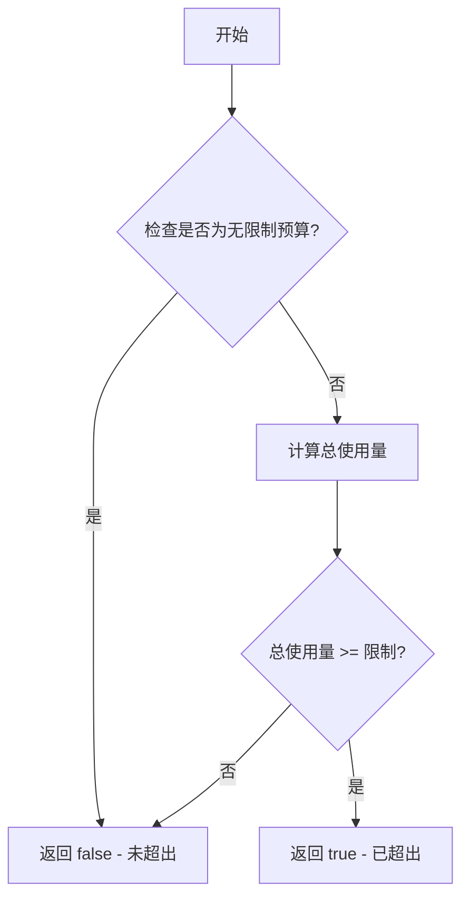
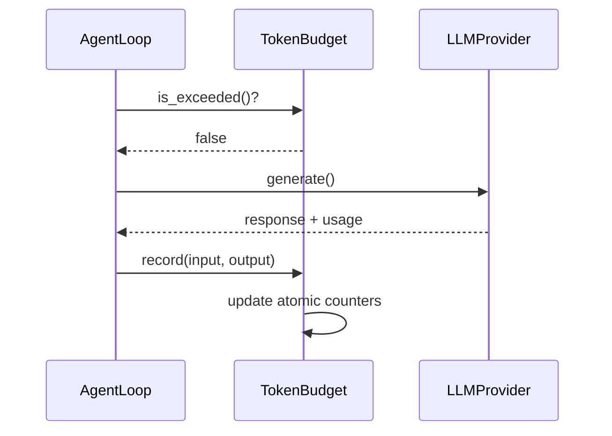

# agent_budget 模块文档

## 概述

`agent_budget` 模块提供了一个线程安全的令牌预算跟踪系统，用于在会话级别控制 LLM（大型语言模型）的令牌使用量。该模块的核心组件是 `TokenBudget`，它通过原子操作实现无锁的令牌计数和预算管理，确保在多线程环境下的安全并发访问。

### 设计理念

该模块的设计遵循以下原则：
1. **线程安全**：使用原子操作确保多线程环境下的数据一致性
2. **轻量级**：采用无锁设计，最小化性能开销
3. **灵活性**：支持有限预算和无限制预算两种模式
4. **可观察性**：提供详细的使用统计和状态查询功能

## 核心组件

### TokenBudget

`TokenBudget` 是该模块的核心结构体，负责跟踪和管理 LLM 令牌的使用情况。

#### 数据结构

```rust
pub struct TokenBudget {
    limit: u64,
    input_used: AtomicU64,
    output_used: AtomicU64,
}
```

**字段说明：**
- `limit`：最大允许的总令牌数（输入 + 输出），0 表示无限制
- `input_used`：已消耗的输入令牌数（原子计数器）
- `output_used`：已消耗的输出令牌数（原子计数器）

#### 核心方法

##### 构造方法

**`new(limit: u64) -> Self`**

创建一个具有指定令牌限制的新预算对象。

- **参数**：
  - `limit`：最大允许的令牌总数，0 表示无限制
- **返回值**：初始化的 `TokenBudget` 实例

**`unlimited() -> Self`**

创建一个无限制的令牌预算对象。

- **返回值**：限制为 0 的 `TokenBudget` 实例，永远不会被视为超出预算

**`default() -> Self`**

创建默认的令牌预算对象（默认为无限制）。

- **返回值**：与 `unlimited()` 相同的无限制预算对象

##### 使用记录方法

**`record(&self, input_tokens: u64, output_tokens: u64)`**

记录一次 LLM 调用的令牌消耗。

- **参数**：
  - `input_tokens`：此次调用消耗的输入令牌数
  - `output_tokens`：此次调用消耗的输出令牌数
- **特殊说明**：
  - 使用内部可变性（通过原子操作），因此不需要 `&mut self`
  - 采用 `Relaxed` 内存序进行原子更新，确保高性能

##### 查询方法

**`total_used(&self) -> u64`**

返回已消耗的令牌总数（输入 + 输出）。

- **返回值**：已使用的令牌总数

**`input_used(&self) -> u64`**

返回已消耗的输入令牌数。

- **返回值**：输入令牌使用量

**`output_used(&self) -> u64`**

返回已消耗的输出令牌数。

- **返回值**：输出令牌使用量

**`remaining(&self) -> Option<u64>`**

返回预算剩余的令牌数。

- **返回值**：
  - `None`：表示预算无限制
  - `Some(0)`：表示预算已用尽
  - `Some(n)`：表示剩余 n 个令牌可用

**`is_exceeded(&self) -> bool`**

检查预算是否已超出。

- **返回值**：
  - `true`：预算已超出（仅在有限预算模式下可能）
  - `false`：预算未超出或为无限制模式

**`is_unlimited(&self) -> bool`**

检查是否为无限制预算。

- **返回值**：预算是否无限制

**`limit(&self) -> u64`**

返回配置的令牌限制。

- **返回值**：令牌限制值（0 表示无限制）

**`usage_percentage(&self) -> Option<f64>`**

返回预算使用百分比。

- **返回值**：
  - `None`：预算无限制
  - `Some(pct)`：使用百分比，可能超过 100.0%

**`summary(&self) -> String`**

返回人类可读的令牌使用摘要。

- **返回值**：格式化的摘要字符串，例如：
  - `"Tokens: 1500/10000 (15.0%)"`（有限预算）
  - `"Tokens: 1500 (unlimited)"`（无限制预算）

##### 管理方法

**`reset(&self)`**

重置所有令牌计数器为零。

- **特殊说明**：
  - 不改变预算限制
  - 可用于在多个会话间重用相同配置的预算对象

## 架构与工作原理

### 线程安全设计



`TokenBudget` 使用 `AtomicU64` 类型来存储输入和输出令牌计数，配合 `Ordering::Relaxed` 内存序实现无锁的线程安全操作。这种设计确保了在高并发场景下的高性能，同时避免了锁竞争带来的开销。

### 预算检查流程



预算检查是咨询性的，实际的强制执行应该在代理循环中进行。每次 LLM 调用前，代理循环应该调用 `is_exceeded()` 方法检查预算状态，以决定是否继续执行。

### 数据流向



## 使用指南

### 基本使用

```rust
use zeptoclaw::agent::budget::TokenBudget;

// 创建一个有 10,000 令牌限制的预算
let budget = TokenBudget::new(10_000);

// 记录 LLM 调用的令牌使用
budget.record(500, 200); // 500 输入令牌，200 输出令牌

// 检查预算状态
assert!(!budget.is_exceeded());
assert_eq!(budget.remaining(), Some(9300));
assert_eq!(budget.usage_percentage(), Some(7.0));

// 获取使用摘要
println!("{}", budget.summary()); // 输出: "Tokens: 700/10000 (7.0%)"
```

### 无限制预算

```rust
// 创建无限制预算
let budget = TokenBudget::unlimited();

// 即使使用大量令牌也不会被视为超出
budget.record(1_000_000, 1_000_000);
assert!(!budget.is_exceeded());
assert_eq!(budget.remaining(), None);
```

### 与 AgentLoop 集成

在实际应用中，`TokenBudget` 通常与 `AgentLoop` 配合使用：

```rust
// 在代理初始化时创建预算
let budget = TokenBudget::new(50_000);

// 在代理循环中
while !budget.is_exceeded() {
    // 执行 LLM 调用
    let (input_tokens, output_tokens) = llm.generate(...);
    
    // 记录令牌使用
    budget.record(input_tokens, output_tokens);
    
    // 可选：检查剩余预算
    if let Some(remaining) = budget.remaining() {
        if remaining < 1000 {
            log::warn!("预算即将用尽，剩余: {}", remaining);
        }
    }
}
```

### 重用预算对象

```rust
// 创建一次预算配置
let budget = TokenBudget::new(10_000);

// 在多个会话中重用
for session in sessions {
    budget.reset(); // 重置计数器，保留限制设置
    process_session(&budget, session);
}
```

## 配置选项

| 配置方式 | 说明 | 示例 |
|---------|------|------|
| `TokenBudget::new(limit)` | 创建有限预算 | `TokenBudget::new(10_000)` |
| `TokenBudget::unlimited()` | 创建无限制预算 | `TokenBudget::unlimited()` |
| `TokenBudget::default()` | 使用默认配置（无限制） | `TokenBudget::default()` |

## 边缘情况与注意事项

### 重要行为约束

1. **预算检查的咨询性质**：`TokenBudget` 仅提供状态跟踪，不强制执行预算限制。实际的预算控制逻辑必须在调用方（如 `AgentLoop`）中实现。

2. **原子操作的内存序**：使用 `Ordering::Relaxed` 意味着操作不提供跨线程的同步保证，仅保证原子性。如果需要更强的内存序保证，需要在调用方额外实现同步机制。

3. **超限行为**：预算可以被超出，`record` 方法不会阻止超限记录。`is_exceeded()` 仅在总使用量达到或超过限制时返回 `true`。

### 错误条件

- 该模块不返回错误，所有操作都是幂等和安全的。
- 记录零令牌是允许的，不会产生任何效果。
- 记录非常大的令牌数可能导致 `u64` 溢出，但在实际应用中这种情况极不可能发生。

### 已知限制

1. **仅跟踪令牌总数**：不区分不同模型或不同类型的令牌使用。
2. **无历史记录**：仅跟踪累计使用量，不保留每次调用的详细历史。
3. **无通知机制**：预算状态变化时不会主动通知，需要调用方主动查询。

### 操作建议

1. **定期检查**：在每次 LLM 调用前检查预算状态，而不是仅在开始时检查一次。
2. **摘要记录**：定期记录 `summary()` 的输出，便于监控和调试。
3. **适当重置**：在多会话场景中正确使用 `reset()` 方法，避免会话间的数据污染。
4. **监控使用百分比**：通过 `usage_percentage()` 提前预警预算即将用尽的情况。

## 与其他模块的关系

- **agent_loop**：`AgentLoop` 是 `TokenBudget` 的主要使用者，负责在每次 LLM 调用前检查预算并记录使用情况。
- **agent_context**：`RuntimeContext` 可能包含 `TokenBudget` 实例，使其在整个代理运行时环境中可用。
- **agent_facade**：`ZeptoAgentBuilder` 可能提供配置令牌预算的接口。

相关模块文档：
- [agent_loop](agent_loop.md)
- [agent_context](agent_context.md)
- [agent_facade](agent_facade.md)

## 测试覆盖

该模块包含全面的单元测试，覆盖以下场景：
- 预算对象的创建和初始化
- 令牌记录和累计
- 各种预算状态查询
- 无限制预算的行为
- 预算超限检测
- 重置功能
- 多次记录的累加
- 摘要和显示格式化

所有测试可以通过 `cargo test` 命令运行。
