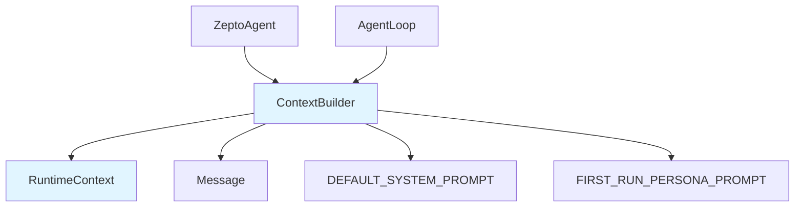

# agent_context 模块文档

## 模块概述

agent_context 模块负责构建智能代理的对话上下文，是整个 ZeptoClaw 代理系统的核心组件之一。该模块通过 `RuntimeContext` 和 `ContextBuilder` 两个主要结构，为代理提供环境感知能力，并构建完整的 LLM 对话上下文。

### 设计理念

该模块的设计遵循以下原则：
- **环境感知**：通过运行时上下文注入，使代理能够感知其运行环境
- **可配置性**：通过构建器模式支持灵活的系统提示配置
- **时间准确性**：动态计算当前时间，避免时间信息过时
- **模块化设计**：将不同类型的上下文信息分离管理

## 核心组件

### RuntimeContext

`RuntimeContext` 结构体负责捕获代理运行时的环境信息，并将其格式化为系统提示的一部分。

#### 主要功能

- **环境信息捕获**：记录代理运行的渠道、可用工具、时区、工作区和操作系统信息
- **动态时间计算**：实时计算当前时间，确保时间信息始终准确
- **Markdown 渲染**：将环境信息格式化为易读的 Markdown 格式

#### 字段说明

| 字段 | 类型 | 说明 |
|------|------|------|
| `channel` | `Option<String>` | 代理运行的渠道（如 "telegram", "cli", "discord"） |
| `available_tools` | `Vec<String>` | 可用工具名称列表 |
| `timezone` | `Option<String>` | 时区标签（如 "Asia/Kuala_Lumpur"） |
| `workspace` | `Option<String>` | 工作区路径 |
| `os_info` | `Option<String>` | 操作系统/平台信息 |

#### 方法说明

##### `new()`
创建一个新的空运行时上下文。

```rust
use zeptoclaw::agent::RuntimeContext;

let ctx = RuntimeContext::new();
assert!(ctx.is_empty());
```

##### `with_channel(channel: &str) -> Self`
设置渠道名称。

```rust
let ctx = RuntimeContext::new().with_channel("telegram");
```

##### `with_tools(tools: Vec<String>) -> Self`
设置可用工具列表。

```rust
let ctx = RuntimeContext::new().with_tools(vec!["shell".to_string(), "web_search".to_string()]);
```

##### `with_timezone(tz: &str) -> Self`
设置时区标签并启用系统提示中的时间显示。设置后，`render()` 方法会通过 `chrono::Local` 动态计算当前本地时间。

```rust
let ctx = RuntimeContext::new().with_timezone("Asia/Kuala_Lumpur");
```

##### `with_workspace(workspace: &str) -> Self`
设置工作区路径。

```rust
let ctx = RuntimeContext::new().with_workspace("/home/user/project");
```

##### `with_os_info() -> Self`
从当前环境设置操作系统/平台信息。

```rust
let ctx = RuntimeContext::new().with_os_info();
```

##### `is_empty() -> bool`
检查是否设置了任何上下文字段。

```rust
assert!(RuntimeContext::new().is_empty());
assert!(!RuntimeContext::new().with_channel("cli").is_empty());
```

##### `render() -> Option<String>`
将上下文渲染为系统提示的 Markdown 部分。如果没有设置任何字段，则返回 `None`。

```rust
let ctx = RuntimeContext::new().with_channel("cli");
let rendered = ctx.render().unwrap();
assert!(rendered.starts_with("## Runtime Context"));
assert!(rendered.contains("Channel: cli"));
```

### ContextBuilder

`ContextBuilder` 结构体是一个构建器，用于构造 LLM 调用的完整对话上下文，包括系统提示、技能信息、对话历史和用户输入。

#### 主要功能

- **系统提示构建**：支持自定义系统提示、SOUL.md 内容、技能信息
- **上下文组合**：将多种类型的上下文信息组合成完整的消息列表
- **历史管理**：处理对话历史和新用户输入的集成

#### 字段说明

| 字段 | 类型 | 说明 |
|------|------|------|
| `system_prompt` | `String` | 系统提示文本 |
| `soul_prompt` | `Option<String>` | SOUL.md 内容，在系统提示之前 |
| `skills_prompt` | `Option<String>` | 技能内容，附加到系统提示 |
| `runtime_context` | `Option<RuntimeContext>` | 运行时上下文 |
| `memory_context` | `Option<String>` | 内存上下文 |

#### 方法说明

##### `new() -> Self`
创建一个带有默认系统提示的新上下文构建器。

```rust
use zeptoclaw::agent::ContextBuilder;

let builder = ContextBuilder::new();
let system = builder.build_system_message();
assert!(system.content.contains("ZeptoClaw"));
```

##### `with_system_prompt(prompt: &str) -> Self`
设置自定义系统提示。

```rust
let builder = ContextBuilder::new().with_system_prompt("You are a helpful assistant.");
```

##### `with_soul(content: &str) -> Self`
设置 SOUL.md 身份内容，在系统提示之前。SOUL.md 定义代理的个性、价值观和行为约束。

```rust
let builder = ContextBuilder::new().with_soul("You are kind and empathetic.");
```

##### `with_skills(skills_content: &str) -> Self`
向系统提示添加技能信息。技能内容附加在系统提示的 "Available Skills" 部分下。

```rust
let builder = ContextBuilder::new().with_skills("- /search: Search the web\n- /help: Show help");
```

##### `with_runtime_context(ctx: RuntimeContext) -> Self`
向系统提示添加运行时上下文。如果提供的上下文为空（没有设置字段），则会被忽略。

```rust
use zeptoclaw::agent::{ContextBuilder, RuntimeContext};

let ctx = RuntimeContext::new().with_channel("discord").with_os_info();
let builder = ContextBuilder::new().with_runtime_context(ctx);
```

##### `with_memory_context(memory_context: String) -> Self`
向系统提示添加内存上下文。将长期内存内容（固定 + 相关条目）注入为 `## Memory` 部分。

```rust
let builder = ContextBuilder::new()
    .with_memory_context("## Memory\n\n### Pinned\n- user:name: Alice".to_string());
```

##### `with_system_prompt_suffix(suffix: &str) -> Self`
向系统提示添加后缀。用于注入额外的指令，如首次运行角色提示。

##### `build_system_message() -> Message`
构建包含所有配置内容的系统消息。

```rust
let builder = ContextBuilder::new();
let system = builder.build_system_message();
assert_eq!(system.role, Role::System);
```

##### `build_messages(history: &[Message], user_input: &str) -> Vec<Message>`
构建 LLM 调用的完整消息列表。

这个方法构建的消息列表包括：
1. 系统消息（如果配置了技能则包含技能）
2. 对话历史
3. 新用户输入（如果非空），设置时区时会添加时间戳信封

```rust
use zeptoclaw::agent::ContextBuilder;
use zeptoclaw::session::Message;

let builder = ContextBuilder::new();
let history = vec![
    Message::user("Hello"),
    Message::assistant("Hi there!"),
];
let messages = builder.build_messages(&history, "How are you?");
assert_eq!(messages.len(), 4); // system + 2 history + new user
```

### 辅助函数

#### `format_message_envelope() -> String`
为用户消息格式化时间戳信封。返回类似 "[Mon 2026-02-16 12:51 +08:00]" 的字符串，用于添加到用户消息前面。使用系统本地时区。

## 系统提示

### 默认系统提示

默认系统提示定义了 ZeptoClaw 代理的基本行为：

```
You are ZeptoClaw, an ultra-lightweight personal AI assistant.

You have access to tools to help accomplish tasks. Use them when needed.

Be concise but helpful. Focus on completing the user's request efficiently.

You have a longterm_memory tool. Use it proactively to:
- Save important facts, user preferences, and decisions for future recall
- Recall relevant information from past conversations by calling longterm_memory with action "search"
- Pin critical information that should always be available

## Scheduled & Background Messages

When a message begins with `Reminder:`, it was delivered by the scheduler on behalf of the user — not typed by them now. Respond with a friendly, concise notification of the reminder content, as if you're the reminder itself notifying the user.

When a message is the heartbeat prompt (checking workspace tasks), reply with `HEARTBEAT_OK` if there is nothing actionable to do, or take the requested action if there is.
```

### 首次运行角色提示

`FIRST_RUN_PERSONA_PROMPT` 是用于首次对话的附加提示，指导代理介绍自己并询问用户偏好的助手风格。

## 架构关系



## 使用示例

### 基本用法

```rust
use zeptoclaw::agent::{ContextBuilder, RuntimeContext};
use zeptoclaw::session::Message;

// 创建基本的上下文构建器
let builder = ContextBuilder::new();

// 构建消息列表
let messages = builder.build_messages(&[], "Hello!");
assert_eq!(messages.len(), 2); // system + user message
```

### 完整配置示例

```rust
use zeptoclaw::agent::{ContextBuilder, RuntimeContext};

// 创建运行时上下文
let runtime_ctx = RuntimeContext::new()
    .with_channel("telegram")
    .with_tools(vec!["shell".to_string(), "web_search".to_string()])
    .with_timezone("Asia/Kuala_Lumpur")
    .with_workspace("/home/user/project")
    .with_os_info();

// 创建完整配置的上下文构建器
let builder = ContextBuilder::new()
    .with_soul("You are a helpful and friendly assistant.")
    .with_skills("- /help: Show help information\n- /search: Search the web")
    .with_runtime_context(runtime_ctx)
    .with_memory_context("## Memory\n\n### Pinned\n- user:name: Bob".to_string());

// 构建系统消息
let system_message = builder.build_system_message();
```

### 带历史记录的对话

```rust
use zeptoclaw::agent::ContextBuilder;
use zeptoclaw::session::Message;

let builder = ContextBuilder::new();
let history = vec![
    Message::user("Previous message"),
    Message::assistant("Previous response"),
];
let messages = builder.build_messages(&history, "New message");

assert_eq!(messages.len(), 4); // system + 2 history + new user
```

## 注意事项和限制

1. **时间动态性**：`RuntimeContext` 在每次调用 `render()` 时都会重新计算当前时间，确保时间信息始终准确。
2. **空上下文处理**：如果 `RuntimeContext` 没有设置任何字段，`render()` 方法会返回 `None`，不会向系统提示添加任何内容。
3. **内容顺序**：系统提示的内容按以下顺序组合：
   - SOUL.md 内容（如果有）
   - 系统提示
   - 可用技能（如果有）
   - 运行时上下文（如果有）
   - 内存上下文（如果有）
4. **时区标签**：虽然可以设置时区标签，但显示的时区偏移始终使用 `chrono::Local` 获取的实际系统偏移，以避免矛盾。
5. **消息信封**：只有在设置了时区时，用户消息才会添加时间戳信封。

## 测试

该模块包含全面的测试，涵盖了 `RuntimeContext` 和 `ContextBuilder` 的所有主要功能，包括：
- 基本创建和配置
- 各种字段的设置和渲染
- 系统提示的构建
- 消息列表的生成
- 时间戳信封的格式化
- 内存上下文的集成

## 相关模块

- [agent_facade](agent_facade.md) - 提供 ZeptoAgent 和 ZeptoAgentBuilder，使用 ContextBuilder 构建代理上下文
- [agent_loop](agent_loop.md) - 代理主循环，使用 ContextBuilder 构建每次迭代的对话上下文
- [session_and_memory](session_and_memory.md) - 提供 Message 类型和内存管理功能
