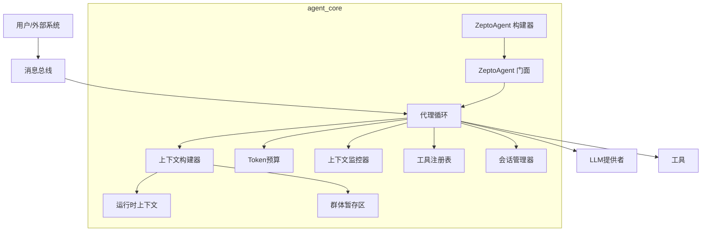

# agent_core 模块文档

## 概述

`agent_core` 模块是 ZeptoClaw 系统的核心组件，提供了智能代理的完整实现。该模块负责协调 LLM 调用、工具执行、对话管理和上下文处理，为构建灵活、可扩展的 AI 代理提供基础架构。

### 主要功能

- **代理循环管理**：处理消息、调用 LLM、执行工具的完整工作流
- **上下文管理**：构建和维护对话上下文，支持上下文压缩
- **预算控制**：跟踪 Token 使用情况，防止超出预算
- **工具执行**：安全地执行工具调用，支持并行和顺序执行
- **会话管理**：维护对话历史和状态
- **安全防护**：集成安全层，防止提示注入和恶意操作

## 架构设计

`agent_core` 模块采用分层架构，各个组件职责明确，相互协作：



### 核心组件说明

#### 1. AgentLoop（代理循环）
`AgentLoop` 是整个模块的核心协调者，负责：
- 从消息总线接收消息
- 构建对话上下文
- 调用 LLM 提供者
- 执行工具调用
- 发布响应回消息总线

该组件支持流式输出、干运行模式、工具反馈等高级特性，并集成了安全检查和预算控制。

#### 2. ContextBuilder（上下文构建器）
`ContextBuilder` 负责构建 LLM 调用所需的完整消息列表，包括：
- 系统提示词
- 技能信息
- 运行时上下文
- 记忆内容
- 对话历史
- 用户输入

它提供了灵活的构建器模式，支持自定义系统提示词、注入 SOUL.md 身份定义等。

#### 3. TokenBudget（Token 预算）
`TokenBudget` 提供线程安全的 Token 使用跟踪，支持：
- 设置总预算限制
- 分别跟踪输入和输出 Token
- 检查预算是否超出
- 计算剩余 Token 和使用百分比
- 重置计数器

使用原子操作实现无锁更新，确保高性能并发访问。

#### 4. ContextMonitor（上下文监控器）
`ContextMonitor` 使用启发式方法估计对话上下文的 Token 数量，并在接近上下文窗口限制时建议压缩策略：
- **Summarize**：让 LLM 压缩旧消息，保留最近的消息
- **Truncate**：直接删除最旧的消息（紧急情况）

#### 5. SwarmScratchpad（群体暂存区）
`SwarmScratchpad` 为群体会话中的代理间通信提供线程安全的键值存储：
- 子代理可以写入其结果
- 后续子代理可以看到之前代理的输出
- 支持格式化为系统提示词注入

#### 6. ZeptoAgent & ZeptoAgentBuilder（门面模式）
`ZeptoAgent` 提供了高层次的库门面，适合嵌入到 GUI 应用或其他 Rust 程序中：
- 简单的 `chat()` 方法
- 持久化对话历史
- 工具执行回调
- 历史修复功能

## 子模块

`agent_core` 模块包含以下子模块，每个子模块都有详细的文档：

- [agent_budget.md](agent_budget.md) - Token 预算跟踪
- [agent_context.md](agent_context.md) - 上下文构建和运行时环境
- [agent_context_monitor.md](agent_context_monitor.md) - 上下文监控和压缩策略
- [agent_facade.md](agent_facade.md) - 高级门面接口
- [agent_loop.md](agent_loop.md) - 核心代理循环
- [agent_scratchpad.md](agent_scratchpad.md) - 群体暂存区

## 使用指南

### 基本使用

使用 `ZeptoAgent` 门面是最简单的方式：

```rust
use zeptoclaw::agent::ZeptoAgent;
use zeptoclaw::providers::ClaudeProvider;
use zeptoclaw::tools::EchoTool;

#[tokio::main]
async fn main() -> Result<(), Box<dyn std::error::Error>> {
    // 构建代理
    let agent = ZeptoAgent::builder()
        .provider(ClaudeProvider::new("api-key"))
        .tool(EchoTool)
        .system_prompt("You are a helpful assistant.")
        .build()?;
    
    // 发送消息
    let response = agent.chat("Hello!").await?;
    println!("{}", response);
    
    // 历史记录会自动维护
    let response2 = agent.chat("What did I just say?").await?;
    println!("{}", response2);
    
    Ok(())
}
```

### 高级使用：直接使用 AgentLoop

对于需要更多控制的场景，可以直接使用 `AgentLoop`：

```rust
use std::sync::Arc;
use zeptoclaw::agent::AgentLoop;
use zeptoclaw::bus::MessageBus;
use zeptoclaw::config::Config;
use zeptoclaw::session::SessionManager;
use zeptoclaw::providers::OpenAIProvider;

#[tokio::main]
async fn main() -> Result<(), Box<dyn std::error::Error>> {
    let config = Config::default();
    let session_manager = SessionManager::new_memory();
    let bus = Arc::new(MessageBus::new());
    
    let agent = AgentLoop::new(config, session_manager, bus.clone());
    
    // 配置提供者
    agent.set_provider(Box::new(OpenAIProvider::new("api-key"))).await;
    
    // 注册工具
    agent.register_tool(Box::new(MyTool)).await;
    
    // 启动代理循环
    let agent_clone = agent.clone();
    tokio::spawn(async move {
        agent_clone.start().await.expect("Agent loop failed");
    });
    
    // 发送消息
    let msg = InboundMessage::new("cli", "user1", "chat1", "Hello!");
    bus.publish_inbound(msg).await?;
    
    // 等待响应
    if let Some(response) = bus.consume_outbound().await {
        println!("Response: {}", response.content);
    }
    
    // 停止代理
    agent.stop();
    
    Ok(())
}
```

### 配置选项

`agent_core` 支持丰富的配置选项，主要通过 `Config` 结构体提供：

- **Token 预算**：设置每次会话的 Token 限制
- **上下文压缩**：配置上下文窗口大小和压缩阈值
- **工具迭代**：设置最大工具调用迭代次数
- **超时**：配置代理执行超时时间
- **安全设置**：启用提示注入检测和安全层
- **流式输出**：启用或禁用最终响应的流式输出

## 安全考虑

`agent_core` 模块集成了多层安全防护：

1. **提示注入检测**：扫描入站消息，防止注入攻击
2. **工具安全**：按类别限制工具访问，支持审批流程
3. **代理模式**：根据安全级别限制可用工具
4. **输出过滤**：安全层检查和过滤工具输出
5. **设备配对**：可选的设备令牌验证

## 性能特点

- **无锁数据结构**：广泛使用原子操作和读写锁
- **并发处理**：不同会话可并行处理，同一会话串行化
- **响应缓存**：可选的 LLM 响应缓存，减少重复调用
- **工具并行**：安全的工具并行执行，提高效率

## 扩展性

`agent_core` 设计为高度可扩展：

- **自定义工具**：实现 `Tool` trait 添加新工具
- **自定义提供者**：实现 `LLMProvider` trait 支持新的 LLM
- **钩子系统**：在工具执行前后注入自定义逻辑
- **插件架构**：通过插件系统扩展功能

## 与其他模块的关系

`agent_core` 是整个系统的核心，与其他模块紧密协作：

- **provider_core**：提供 LLM 接口和实现
- **tooling_framework**：提供工具定义和执行框架
- **configuration**：提供配置管理
- **session_and_memory**：提供会话和记忆管理
- **channels_and_message_bus**：提供消息总线和通信渠道
- **safety_and_security**：提供安全防护

详细信息请参考各模块的文档。
