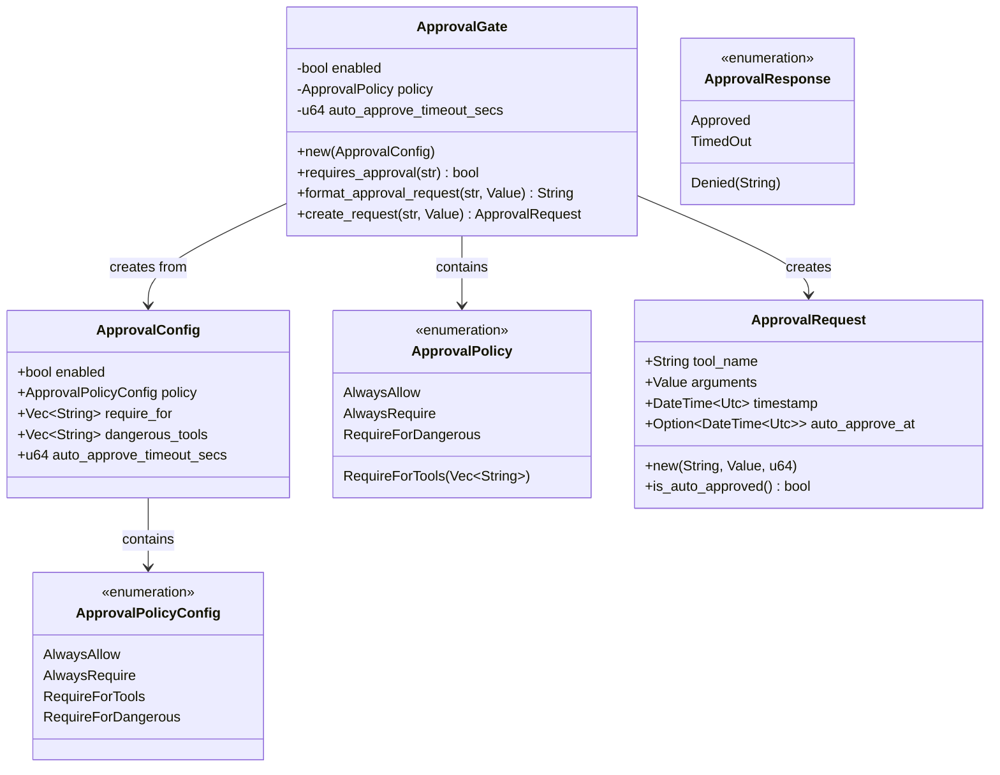
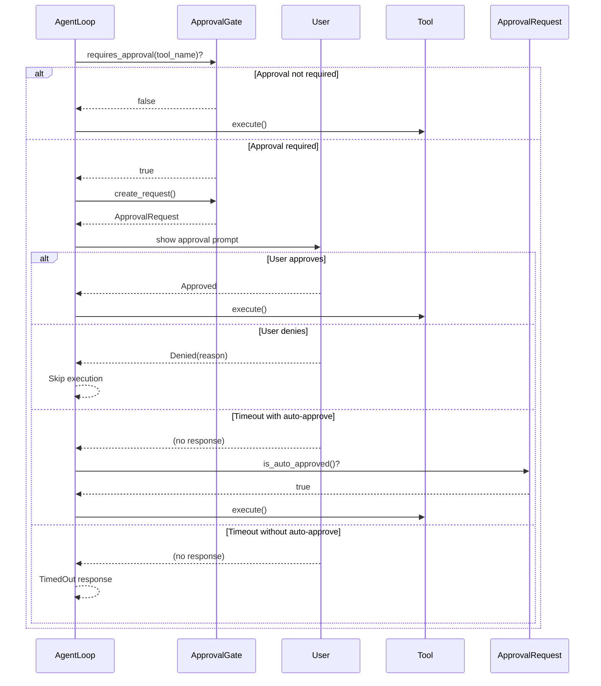

# Approval System Module Documentation

## Overview

The Approval System module provides a configurable mechanism for controlling tool execution by requiring user approval before certain tools are invoked. This safety feature ensures that potentially harmful operations are explicitly authorized by a user, preventing accidental or malicious execution of sensitive actions.

The module implements a policy-based approach where different approval strategies can be applied depending on the use case, ranging from completely unrestricted execution to requiring approval for every single tool invocation.

## Architecture

The approval system consists of three main components that work together:



The architecture follows a clear separation of concerns:
- **Configuration**: `ApprovalConfig` and `ApprovalPolicyConfig` handle persistent settings
- **Runtime Checking**: `ApprovalGate` performs the actual approval logic
- **Request/Response**: `ApprovalRequest` and `ApprovalResponse` manage the approval workflow

## Core Components

### ApprovalPolicy

The `ApprovalPolicy` enum represents the runtime policy that determines which tools require user approval. This enum is used internally by `ApprovalGate` and is not directly serialized.

**Variants:**
- `AlwaysAllow`: All tools execute without approval
- `AlwaysRequire`: Every tool invocation requires approval
- `RequireForTools(Vec<String>)`: Only the listed tools require approval
- `RequireForDangerous`: Tools tagged as "dangerous" require approval

### ApprovalPolicyConfig

The `ApprovalPolicyConfig` enum is the serializable version of the approval policy, designed for use in configuration files.

**Variants:**
- `AlwaysAllow`: All tools execute without approval (default)
- `AlwaysRequire`: Every tool invocation requires approval
- `RequireForTools`: Only tools listed in `require_for` need approval
- `RequireForDangerous`: Tools in the `dangerous_tools` list need approval

### ApprovalConfig

The `ApprovalConfig` struct holds the complete configuration for the approval system. This is what gets serialized to and deserialized from `config.json`.

**Fields:**
- `enabled: bool` - Master switch. When `false`, all tools execute without approval regardless of policy
- `policy: ApprovalPolicyConfig` - Which approval policy to apply
- `require_for: Vec<String>` - Tool names that require approval when policy is `RequireForTools`
- `dangerous_tools: Vec<String>` - Tool names considered dangerous (used with `RequireForDangerous` policy)
- `auto_approve_timeout_secs: u64` - If greater than zero, auto-approve after this many seconds without a response (0 means wait indefinitely)

**Default Configuration:**
```rust
ApprovalConfig {
    enabled: false,
    policy: ApprovalPolicyConfig::AlwaysAllow,
    require_for: Vec::new(),
    dangerous_tools: vec!["shell", "write_file", "edit_file"],
    auto_approve_timeout_secs: 0,
}
```

### ApprovalRequest

The `ApprovalRequest` struct represents a pending approval request for a tool invocation that needs user confirmation.

**Fields:**
- `tool_name: String` - Name of the tool awaiting approval
- `arguments: Value` - Arguments the tool would be called with (as serde_json::Value)
- `timestamp: DateTime<Utc>` - When the request was created
- `auto_approve_at: Option<DateTime<Utc>>` - If auto-approve is enabled, the deadline after which the request is automatically approved

**Methods:**
- `new(tool_name: String, arguments: Value, auto_approve_timeout_secs: u64) -> Self` - Creates a new approval request
- `is_auto_approved() -> bool` - Checks whether this request has passed its auto-approve deadline

### ApprovalResponse

The `ApprovalResponse` enum represents the outcome of an approval decision.

**Variants:**
- `Approved` - The user approved the tool execution
- `Denied(String)` - The user denied the tool execution with an optional reason
- `TimedOut` - The approval request timed out without a response and auto-approve was not configured

### ApprovalGate

The `ApprovalGate` struct is the main component that evaluates tool invocations against the configured policy at runtime.

**Fields:**
- `enabled: bool` - Whether approval checking is enabled
- `policy: ApprovalPolicy` - The resolved runtime policy
- `auto_approve_timeout_secs: u64` - Auto-approve timeout in seconds (0 = disabled)

**Methods:**

- `new(config: ApprovalConfig) -> Self` - Creates a new `ApprovalGate` from the given configuration, resolving the policy and converting `RequireForDangerous` to `RequireForTools` with the dangerous tools list

- `requires_approval(tool_name: &str) -> bool` - Checks whether a tool with the given name requires user approval. Returns `false` if the system is disabled or the policy doesn't require approval

- `format_approval_request(tool_name: &str, args: &Value) -> String` - Formats a human-readable approval prompt for display in a CLI or chat interface

- `create_request(tool_name: &str, args: &Value) -> ApprovalRequest` - Creates an `ApprovalRequest` for the given tool invocation using the gate's configured timeout

- `default_dangerous_tools() -> Vec<String>` - Returns the default list of dangerous tool names: `["shell", "write_file", "edit_file"]`

- `policy() -> &ApprovalPolicy` - Returns a reference to the resolved runtime policy

- `is_enabled() -> bool` - Returns whether the approval gate is enabled

## Usage Examples

### Basic Configuration and Usage

```rust
use zeptoclaw::tools::approval::{ApprovalConfig, ApprovalPolicyConfig, ApprovalGate};

// Create a default configuration (disabled, AlwaysAllow)
let config = ApprovalConfig::default();
let gate = ApprovalGate::new(config);

// Nothing requires approval when disabled
assert!(!gate.requires_approval("shell"));
```

### Enabling Approval for Dangerous Tools

```rust
let config = ApprovalConfig {
    enabled: true,
    policy: ApprovalPolicyConfig::RequireForDangerous,
    ..Default::default()
};
let gate = ApprovalGate::new(config);

// Check which tools require approval
assert!(gate.requires_approval("shell"));
assert!(gate.requires_approval("write_file"));
assert!(gate.requires_approval("edit_file"));
assert!(!gate.requires_approval("echo"));
assert!(!gate.requires_approval("read_file"));
```

### Requiring Approval for Specific Tools

```rust
let config = ApprovalConfig {
    enabled: true,
    policy: ApprovalPolicyConfig::RequireForTools,
    require_for: vec!["web_fetch".to_string(), "message".to_string()],
    ..Default::default()
};
let gate = ApprovalGate::new(config);

assert!(gate.requires_approval("web_fetch"));
assert!(gate.requires_approval("message"));
assert!(!gate.requires_approval("shell")); // Not in the require_for list
```

### Creating and Using Approval Requests

```rust
use serde_json::json;

let config = ApprovalConfig {
    enabled: true,
    policy: ApprovalPolicyConfig::RequireForDangerous,
    auto_approve_timeout_secs: 60, // Auto-approve after 60 seconds
    ..Default::default()
};
let gate = ApprovalGate::new(config);

// Check if approval is needed
if gate.requires_approval("shell") {
    // Create an approval request
    let args = json!({"command": "rm -rf /tmp/some_folder"});
    let request = gate.create_request("shell", &args);
    
    // Format the prompt for the user
    let prompt = gate.format_approval_request("shell", &args);
    println!("{}", prompt);
    
    // Check if auto-approved (shouldn't be immediately)
    assert!(!request.is_auto_approved());
}
```

### JSON Configuration Example

The approval system is typically configured via `config.json`:

```json
{
    "approval": {
        "enabled": true,
        "policy": "require_for_dangerous",
        "dangerous_tools": ["shell", "write_file", "edit_file", "http_request"],
        "auto_approve_timeout_secs": 300
    }
}
```

## Integration with Agent Loop

The approval system is designed to integrate with the agent loop (see [agent_core](agent_core.md)) to pause tool execution when approval is needed. Here's how the integration typically works:



## Edge Cases and Considerations

### Case Sensitivity

Tool names are case-sensitive. The approval check for "Shell" will not match a policy configured for "shell". Always use consistent casing when configuring tool names.

### Empty Tool Lists

When using `RequireForTools` with an empty `require_for` list, no tools will require approval. This is functionally equivalent to `AlwaysAllow`.

### Custom Dangerous Tools

When specifying a custom `dangerous_tools` list, it completely replaces the default list, not appends to it. If you want to keep the defaults and add more, include them explicitly in your configuration.

### Disabled State

When `enabled` is `false`, all policies are bypassed and no tools require approval, even if `AlwaysRequire` is set as the policy.

### Auto-Approval Behavior

- If `auto_approve_timeout_secs` is 0, auto-approval is disabled and requests wait indefinitely
- Auto-approval only applies if no user response is received within the timeout period
- The `is_auto_approved()` method checks against the current time, so repeated calls can return different values over time

### Policy Conversion

The `RequireForDangerous` policy is internally converted to `RequireForTools` during `ApprovalGate` construction using either the default or configured dangerous tools list. This means the runtime policy will never actually be `RequireForDangerous`.

## Testing

The module includes comprehensive tests covering:

- All policy types with various configurations
- Edge cases like empty tool lists and disabled state
- Serialization/deserialization roundtrips
- Auto-approval timeout logic
- Tool name case sensitivity
- Request formatting

To run the tests:

```bash
cargo test tools::approval::tests
```

## Related Modules

- [agent_core](agent_core.md) - The agent loop that uses the approval system
- [tooling_framework](tooling_framework.md) - The broader tool system this module is part of
- [configuration](configuration.md) - How the approval system is configured alongside other components
