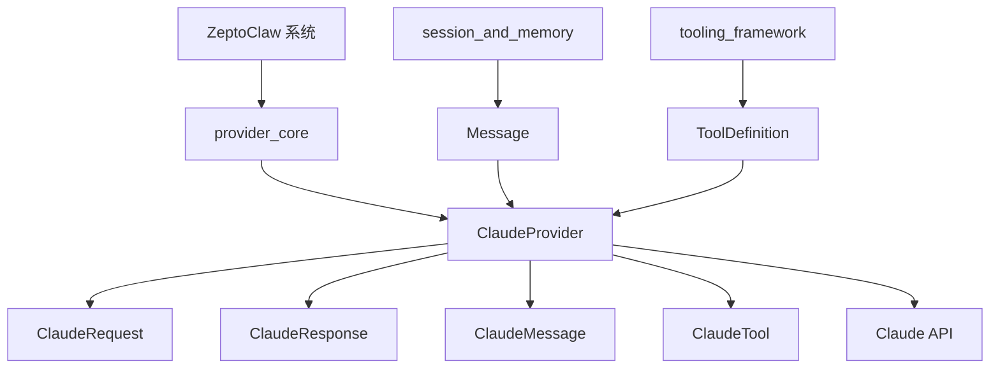
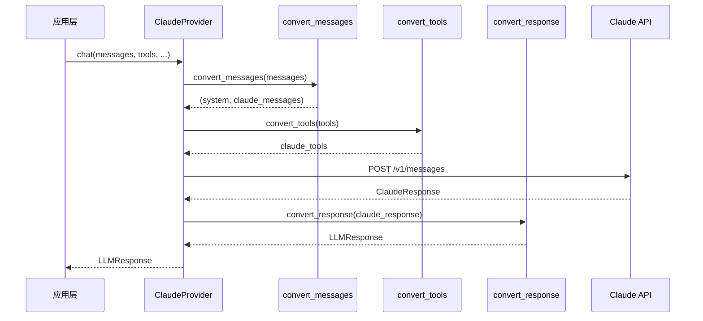
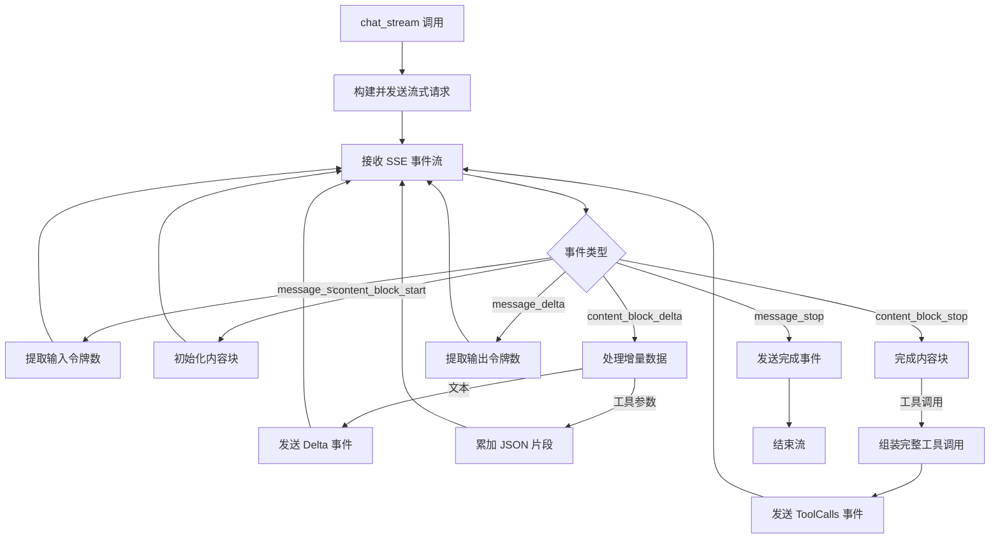

# Claude 模块文档

## 概述

Claude 模块是 ZeptoClaw 系统中专门用于与 Anthropic Claude API 交互的 LLM（大语言模型）提供者实现。该模块负责处理与 Claude API 的通信，包括消息格式转换、工具调用管理、响应解析以及流式响应处理等核心功能。

### 设计理念

本模块遵循了 ZeptoClaw 系统的提供者架构模式，通过实现 `LLMProvider` 特性来统一不同 LLM 服务的接口。设计重点在于：
- 完整封装 Claude API 的特性，包括其独特的消息格式和工具调用机制
- 提供与系统其他模块无缝集成的标准化接口
- 支持同步和流式两种交互模式
- 提供灵活的认证方式和配置选项

### 模块架构



上图展示了 Claude 模块在 ZeptoClaw 系统中的位置和主要组件关系。ClaudeProvider 作为核心，连接了系统的其他部分与 Claude API。

### 数据流程图



上图展示了非流式聊天请求的完整数据流程，从应用层调用到最终响应返回的全过程。

## 核心组件

### ClaudeProvider

`ClaudeProvider` 是本模块的核心类，实现了 `LLMProvider` 特性，负责管理与 Claude API 的所有交互。

#### 主要功能

- 认证管理：支持 API 密钥和 OAuth 承载令牌两种认证方式
- 请求构建：将内部消息格式转换为 Claude API 要求的格式
- 响应处理：解析 Claude API 响应并转换为系统标准格式
- 流式支持：处理 Claude API 的 SSE（服务器发送事件）流式响应

#### 创建方式

`ClaudeProvider` 提供了三种创建方式：

1. **基础 API 密钥创建**
```rust
use zeptoclaw::providers::claude::ClaudeProvider;

let provider = ClaudeProvider::new("sk-ant-api03-xxx");
```

2. **使用已解析凭证创建**
```rust
use zeptoclaw::auth::ResolvedCredential;

let credential = ResolvedCredential::BearerToken {
    access_token: "your-token".to_string(),
    expires_at: None,
};
let provider = ClaudeProvider::with_credential(credential);
```

3. **使用自定义 HTTP 客户端创建**
```rust
use reqwest::Client;

let client = Client::builder()
    .timeout(std::time::Duration::from_secs(60))
    .build()
    .unwrap();
let provider = ClaudeProvider::with_client("sk-ant-api03-xxx", client);
```

#### 核心方法

`ClaudeProvider` 实现了 `LLMProvider` 特性的两个主要方法：

1. **chat**: 发送非流式聊天请求
2. **chat_stream**: 发送流式聊天请求
3. **default_model**: 返回默认模型名称
4. **name**: 返回提供者名称 "claude"

### 请求和响应类型

#### ClaudeRequest

表示发送到 Claude API 的请求体结构，包含以下字段：

- `model`: 模型标识符
- `max_tokens`: 最大生成令牌数
- `messages`: 对话消息（不包含系统消息）
- `system`: 系统提示（Claude API 将其作为独立字段处理）
- `tools`: 可用工具列表
- `temperature`: 采样温度
- `top_p`: 核采样参数
- `stop_sequences`: 停止序列
- `stream`: 是否使用流式响应

#### ClaudeResponse

表示从 Claude API 接收的响应结构，包含：

- `content`: 响应内容块数组
- `usage`: 令牌使用情况
- `stop_reason`: 停止原因

#### ClaudeMessage

表示 Claude 格式的消息，包含：

- `role`: 角色（"user" 或 "assistant"）
- `content`: 消息内容，可以是简单文本或内容块数组

#### ClaudeContentBlock

表示消息内容块的枚举类型，有三种变体：

1. **Text**: 纯文本内容
2. **ToolUse**: 工具使用请求（助手请求调用工具）
3. **ToolResult**: 工具执行结果（用户提供工具执行结果）

#### ClaudeTool

表示 Claude 工具定义，包含：

- `name`: 工具名称
- `description`: 工具描述
- `input_schema`: 工具参数的 JSON Schema

## 转换逻辑

Claude 模块的核心工作之一是在 ZeptoClaw 内部格式和 Claude API 格式之间进行转换。以下是主要的转换函数：

### 消息转换：`convert_messages`

这个函数将 ZeptoClaw 的 `Message` 向量转换为 Claude API 所需的格式，并提取系统消息。

#### 转换规则

1. **系统消息**: 提取为独立的 `system` 字段，而不是作为消息列表的一部分
2. **用户消息**: 转换为 `role: "user"` 的 Claude 消息
3. **助手消息**: 
   - 简单文本消息：转换为 `role: "assistant"` 的文本消息
   - 包含工具调用的消息：转换为包含 `ToolUse` 内容块的消息
4. **工具结果**: 
   - 转换为 `role: "user"` 的消息
   - 包含 `ToolResult` 内容块
   - 连续的工具结果会被分组到同一个用户消息中

#### 示例

```rust
let messages = vec![
    Message::system("You are a helpful assistant"),
    Message::user("Search for Rust"),
    Message::assistant_with_tools("Let me search.", vec![tool_call]),
    Message::tool_result("call_1", "Results here"),
];

let (system, claude_messages) = convert_messages(messages).unwrap();
// system = Some("You are a helpful assistant")
// claude_messages 包含 3 条消息：用户问题、带工具调用的助手消息、带工具结果的用户消息
```

### 工具转换：`convert_tools`

将 ZeptoClaw 的 `ToolDefinition` 转换为 Claude 的 `ClaudeTool` 格式，主要是直接映射字段，保持参数的 JSON Schema 不变。

### 响应转换：`convert_response`

将 Claude API 的响应转换为 ZeptoClaw 的 `LLMResponse` 格式：

- 合并多个文本内容块，用换行符分隔
- 提取 `ToolUse` 内容块为 `LLMToolCall` 对象
- 转换使用统计信息

## 流式处理

Claude 模块支持通过 SSE（服务器发送事件）进行流式交互。`chat_stream` 方法返回一个 `tokio::sync::mpsc::Receiver`，可以接收以下类型的事件：

- **Delta**: 文本内容增量
- **ToolCalls**: 完整的工具调用列表
- **Done**: 流式处理完成，包含完整内容和使用统计
- **Error**: 错误信息

### 流式处理流程图



### 流式处理详细步骤

1. 发送带有 `stream: true` 的请求到 Claude API
2. 接收并解析 SSE 事件流
3. 处理不同类型的事件：
   - `message_start`: 提取输入令牌数
   - `content_block_start`: 初始化新的内容块（如工具调用）
   - `content_block_delta`: 处理文本或工具参数的增量
   - `content_block_stop`: 完成内容块（如组装完整工具调用）
   - `message_delta`: 提取输出令牌数
   - `message_stop`: 发送最终完成事件
4. 通过通道发送相应的 `StreamEvent`

## 配置和默认值

### 默认模型

默认使用 `claude-sonnet-4-5-20250929` 模型，但可以通过以下方式覆盖：
1. 编译时设置 `ZEPTOCLAW_CLAUDE_DEFAULT_MODEL` 环境变量
2. 调用 `chat` 或 `chat_stream` 时通过 `model` 参数指定

### API 端点

固定使用 `https://api.anthropic.com/v1/messages` 作为 API 端点。

### API 版本

使用 `2023-06-01` 版本的 Anthropic API。

### HTTP 超时

默认设置 120 秒的请求超时时间。

## 错误处理

Claude 模块通过以下方式处理错误：

1. **HTTP 请求错误**: 转换为 `ZeptoError`
2. **API 错误响应**: 解析 Claude 的错误响应格式，提取错误类型和消息
3. **格式转换错误**: 处理 JSON 序列化/反序列化错误
4. **流式处理错误**: 通过 `StreamEvent::Error` 发送错误信息

## 与其他模块的关系

Claude 模块是 ZeptoClaw 提供者生态系统的一部分，与以下模块紧密协作：

- **[provider_core](provider_core.md)**: 定义了 `LLMProvider` 特性和相关类型，Claude 模块实现了这些接口
- **[session_and_memory](session_and_memory.md)**: 使用 `Message` 和 `ToolCall` 类型作为输入和输出
- **[tooling_framework](tooling_framework.md)**: 通过 `ToolDefinition` 接收工具定义

## 使用示例

### 基础聊天

```rust
use zeptoclaw::providers::{claude::ClaudeProvider, ChatOptions, LLMProvider};
use zeptoclaw::session::Message;

async fn basic_chat() {
    let provider = ClaudeProvider::new("your-api-key");

    let messages = vec![
        Message::system("You are a helpful assistant."),
        Message::user("Hello!"),
    ];

    let response = provider
        .chat(messages, vec![], None, ChatOptions::default())
        .await
        .unwrap();

    println!("Claude: {}", response.content);
}
```

### 带工具调用的聊天

```rust
use zeptoclaw::providers::{claude::ClaudeProvider, ChatOptions, LLMProvider, ToolDefinition};
use zeptoclaw::session::Message;
use serde_json::json;

async fn chat_with_tools() {
    let provider = ClaudeProvider::new("your-api-key");

    let tools = vec![
        ToolDefinition::new(
            "web_search",
            "Search the web",
            json!({
                "type": "object",
                "properties": {
                    "query": { "type": "string" }
                },
                "required": ["query"]
            }),
        ),
    ];

    let messages = vec![
        Message::user("Search for information about Rust programming language"),
    ];

    let response = provider
        .chat(messages, tools, None, ChatOptions::default())
        .await
        .unwrap();

    if response.has_tool_calls() {
        for tool_call in &response.tool_calls {
            println!("Tool call: {} with args {}", tool_call.name, tool_call.arguments);
        }
    } else {
        println!("Response: {}", response.content);
    }
}
```

### 流式聊天

```rust
use zeptoclaw::providers::{claude::ClaudeProvider, ChatOptions, LLMProvider, StreamEvent};
use zeptoclaw::session::Message;

async fn stream_chat() {
    let provider = ClaudeProvider::new("your-api-key");

    let messages = vec![
        Message::user("Tell me a story about a robot learning to paint."),
    ];

    let mut stream = provider
        .chat_stream(messages, vec![], None, ChatOptions::default())
        .await
        .unwrap();

    while let Some(event) = stream.recv().await {
        match event {
            StreamEvent::Delta(text) => print!("{}", text),
            StreamEvent::ToolCalls(calls) => println!("\nTool calls: {:?}", calls),
            StreamEvent::Done { content, usage } => {
                if let Some(usage) = usage {
                    println!("\nTokens used: {}", usage.total_tokens);
                }
            }
            StreamEvent::Error(e) => eprintln!("\nError: {}", e),
        }
    }
}
```

## 注意事项和限制

1. **系统消息处理**: Claude API 将系统消息作为独立字段处理，而不是消息列表的一部分，这与其他一些 LLM API 不同
2. **工具结果格式**: 工具结果必须包装在用户消息中，且连续的工具结果会被分组
3. **最大令牌数**: 默认设置为 8192，但不同的 Claude 模型可能有不同的限制
4. **流式工具调用**: 在流式模式下，工具调用参数是逐步构建的，只有在 `content_block_stop` 事件后才完整
5. **认证方式**: 确保使用正确的认证方式，API 密钥和 OAuth 令牌使用不同的请求头
6. **API 版本**: 模块固定使用 `2023-06-01` 版本的 API，未来可能需要更新以支持新版本

## 测试

Claude 模块包含全面的单元测试，覆盖：
- 提供者创建和基本属性
- 消息转换（简单消息、带系统消息、带工具调用、多个工具结果）
- 工具转换
- 响应转换
- 请求序列化
- 流式事件解析

这些测试确保了模块在各种场景下的正确行为，同时也作为理解模块功能的实际示例。
