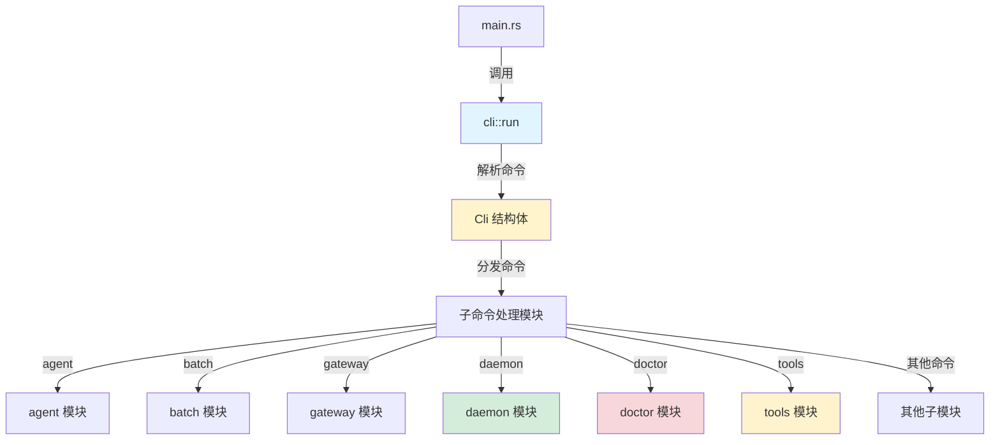

# CLI 界面模块文档

## 概述

`cli_surface` 模块是 ZeptoClaw 系统的命令行界面入口，负责解析用户输入的命令并将其分发到相应的处理函数。该模块提供了丰富的命令集，涵盖了从初始配置、代理交互到系统监控等全方位的功能，是用户与 ZeptoClaw 系统交互的主要桥梁。

本模块的设计理念是提供简洁、直观且功能完整的命令行体验，使用户能够轻松地配置、使用和监控 ZeptoClaw 系统。通过统一的 CLI 入口，用户可以完成从初始化设置到日常使用的所有操作，无需切换不同的工具或界面。

## 架构概览

`cli_surface` 模块采用分层设计，将命令解析、分发和具体执行逻辑清晰分离。核心架构包括以下几个关键部分：



### 核心组件说明

1. **Cli 结构体**：负责定义和解析所有命令行参数，使用 `clap` 库实现强大的命令行接口。
2. **命令分发机制**：通过 `match` 语句将解析后的命令分发到相应的处理函数。
3. **子命令模块**：每个主要功能领域都有对应的子模块，包含具体的命令实现逻辑。

## 主要功能模块

### 1. 命令解析与分发系统

命令解析系统由 `Cli` 结构体和相关枚举类型组成，定义了所有可用的命令及其参数。该系统支持丰富的命令类型，包括：

- **基础命令**：初始化配置、版本查看、系统状态等
- **代理交互**：交互式代理模式、批量处理、标准输入模式
- **系统管理**：网关、守护进程、设备配对等
- **资源管理**：历史记录、记忆、模板、技能、工具等
- **安全与配置**：认证、密钥管理、配置验证等

### 2. 守护进程管理 (daemon)

守护进程模块提供了监督式的长期运行服务功能，主要特点包括：

- 自动重启机制：当网关服务异常退出时自动重启
- 指数退避策略：避免频繁重启造成资源浪费
- 状态持久化：将运行状态保存到磁盘供监控使用
- 优雅关闭：支持信号处理和干净的 shutdown 流程

详见 [daemon 子模块文档](cli_surface_daemon.md)

### 3. 系统诊断 (doctor)

诊断模块提供全面的系统健康检查功能，包括：

- 配置验证：检查配置文件的有效性和合理性
- 环境检查：验证必要的系统依赖和工具是否可用
- 提供商状态：检查 AI 服务提供商的配置状态
- 通道配置：验证通信渠道的设置
- 内存状态：检查长期记忆存储的可访问性

详见 [doctor 子模块文档](cli_surface_doctor.md)

### 4. 工具管理 (tools)

工具管理模块提供了工具发现和信息查询功能：

- 工具列表展示：显示所有可用工具及其状态
- 详细信息查询：提供特定工具的完整说明和配置要求
- 配置状态检查：动态评估工具是否已正确配置

详见 [tools 子模块文档](cli_surface_tools.md)

## 核心组件详解

### Cli 结构体

`Cli` 是整个命令行界面的核心，使用 `clap` 库的 derive 宏定义了完整的命令树结构。

```rust
#[derive(Parser)]
#[command(name = "zeptoclaw")]
#[command(version)]
#[command(about = "Ultra-lightweight personal AI assistant", long_about = None)]
struct Cli {
    #[command(subcommand)]
    command: Option<Commands>,
}
```

该结构包含以下主要特点：
- 自动版本管理：通过 `env!("CARGO_PKG_VERSION")` 获取版本信息
- 完整的帮助系统：自动生成命令帮助文档
- 子命令组织：通过 `Commands` 枚举组织所有功能

### 命令执行流程

1. **初始化阶段**：加载配置并初始化日志系统
2. **命令解析**：使用 `clap` 解析命令行参数
3. **命令分发**：根据解析结果调用相应的处理函数
4. **结果处理**：处理返回结果或错误信息

这种设计确保了每个命令都可以独立开发和测试，同时保持了统一的用户体验。

## 使用指南

### 基本使用

ZeptoClaw CLI 的基本使用格式为：

```bash
zeptoclaw <子命令> [选项]
```

### 常用命令示例

1. **初始化系统**：
   ```bash
   zeptoclaw onboard
   ```

2. **启动交互式代理**：
   ```bash
   zeptoclaw agent --stream
   ```

3. **运行系统诊断**：
   ```bash
   zeptoclaw doctor --online
   ```

4. **启动守护进程**：
   ```bash
   zeptoclaw daemon
   ```

5. **查看可用工具**：
   ```bash
   zeptoclaw tools list
   ```

## 配置与扩展

### 配置加载

CLI 模块在启动时会尝试加载配置文件，配置文件的位置通常在 `~/.zeptoclaw/config.json`。如果配置文件不存在或无法读取，系统会使用默认值。

### 日志初始化

在命令处理之前，系统会根据配置初始化日志系统，支持控制台输出和文件输出两种方式。

### 扩展性设计

模块的分层设计使得添加新命令变得简单：

1. 在 `Commands` 枚举中添加新的命令变体
2. 如有需要，创建相应的子模块处理逻辑
3. 在 `run()` 函数的 `match` 语句中添加处理分支

## 注意事项与限制

1. **配置依赖**：大多数功能命令需要先运行 `onboard` 创建配置文件
2. **权限要求**：某些命令（如 `daemon`）可能需要特定的系统权限
3. **平台差异**：部分功能可能在不同操作系统上有差异
4. **资源使用**：长时间运行的命令（如 `gateway` 或 `daemon`）会持续占用系统资源

## 相关模块参考

- [配置系统文档](configuration.md)：了解更多关于配置文件的结构和选项
- [代理核心文档](agent_core.md)：深入了解代理的工作原理
- [通道与消息总线文档](channels_and_message_bus.md)：了解多通道通信功能
