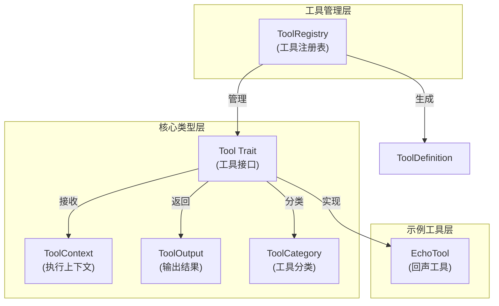
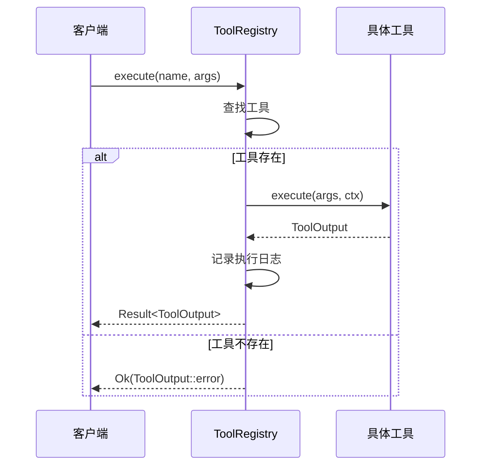

# Core Infrastructure Module Documentation

## 1. 模块概述

Core Infrastructure 模块是 ZeptoClaw 工具系统的基础核心，提供了工具定义、注册、执行上下文管理和结果处理的完整基础设施。它定义了所有工具必须遵循的标准接口，实现了工具的集中管理机制，并为工具执行提供了必要的上下文支持。

该模块的核心价值在于：
- 建立统一的工具抽象层，使 LLM 能够以一致的方式调用各种功能
- 提供工具注册和发现机制，实现功能的动态扩展
- 分离工具执行结果的受众（LLM 和用户），支持更精细的交互控制
- 为工具提供执行上下文信息，支持多渠道、多场景的工具调用

## 2. 架构与组件关系

Core Infrastructure 模块采用分层架构设计，包含核心类型定义、工具注册表和示例工具三个主要部分。以下是该模块的架构图和组件关系说明：



### 组件关系说明：

1. **核心类型层**：定义了工具系统的基础抽象
   - `Tool` trait 是所有工具必须实现的核心接口
   - `ToolContext` 提供工具执行时的环境信息
   - `ToolOutput` 封装工具执行结果，支持面向不同受众的内容分离
   - `ToolCategory` 枚举定义了工具的安全分类

2. **工具管理层**：负责工具的注册、发现和执行
   - `ToolRegistry` 是工具的中央注册表，维护工具名称到工具实例的映射
   - 提供工具执行、定义收集等核心功能

3. **示例工具层**：提供简单的工具实现作为参考
   - `EchoTool` 是一个基本的工具实现，用于演示和测试

## 3. 核心组件详解

### 3.1 Tool Trait

`Tool` 是所有工具必须实现的核心 trait，定义了工具的基本行为和元数据。

```rust
#[async_trait]
pub trait Tool: Send + Sync {
    fn name(&self) -> &str;
    fn description(&self) -> &str;
    fn parameters(&self) -> Value;
    async fn execute(&self, args: Value, ctx: &ToolContext) -> Result<ToolOutput>;
    fn compact_description(&self) -> &str;
    fn category(&self) -> ToolCategory;
}
```

**主要方法说明**：
- `name()`: 返回工具的唯一标识符，用于在注册表中查找工具
- `description()`: 返回工具的详细描述，帮助 LLM 理解工具的功能和使用场景
- `parameters()`: 返回工具参数的 JSON Schema 定义，用于 LLM 生成正确的调用参数
- `execute()`: 执行工具的核心逻辑，接收参数和上下文，返回执行结果
- `compact_description()`: 返回工具的简短描述，用于 token 受限的环境
- `category()`: 返回工具的安全分类，用于代理模式下的权限控制

**设计意图**：
- 使用 `async_trait` 支持异步执行，适应 I/O 密集型工具操作
- 强制所有工具提供明确的元数据，提高 LLM 调用的准确性
- 通过 `category()` 方法支持安全分级，实现细粒度的权限控制

### 3.2 ToolContext

`ToolContext` 结构体提供了工具执行时的环境上下文信息。

```rust
#[derive(Debug, Clone, Default)]
pub struct ToolContext {
    pub channel: Option<String>,
    pub chat_id: Option<String>,
    pub workspace: Option<String>,
}
```

**主要字段说明**：
- `channel`: 表示工具调用来源的渠道（如 "telegram"、"discord"、"cli"）
- `chat_id`: 表示特定渠道内的对话或会话标识符
- `workspace`: 表示工具执行时的工作目录路径，用于文件操作等场景

**构建方法**：
- `new()`: 创建一个空的上下文
- `with_channel(channel, chat_id)`: 设置渠道和聊天 ID，返回修改后的上下文
- `with_workspace(workspace)`: 设置工作目录，返回修改后的上下文

**设计意图**：
- 采用构建者模式，支持链式调用，方便上下文的构建
- 使用 `Option` 类型表示可选字段，适应不同的使用场景
- 实现 `Clone` trait，支持上下文的安全复制和传递

### 3.3 ToolOutput

`ToolOutput` 结构体封装了工具的执行结果，支持面向不同受众的内容分离。

```rust
#[derive(Debug, Clone, PartialEq)]
pub struct ToolOutput {
    pub for_llm: String,
    pub for_user: Option<String>,
    pub is_error: bool,
    pub is_async: bool,
}
```

**主要字段说明**：
- `for_llm`: 发送给 LLM 的工具执行结果内容，总是必需的
- `for_user`: 发送给用户的内容，`None` 表示用户不可见
- `is_error`: 标识执行结果是否为错误状态
- `is_async`: 标识工具是否在异步执行（结果将在稍后到达）

**便捷构造方法**：
- `llm_only(content)`: 创建仅 LLM 可见的结果
- `user_visible(content)`: 创建 LLM 和用户都可见的结果
- `error(content)`: 创建错误结果
- `async_task(content)`: 创建异步任务启动的结果
- `split(for_llm, for_user)`: 创建 LLM 和用户看到不同内容的结果

**设计意图**：
- 实现结果内容的受众分离，提高交互的灵活性
- 支持异步执行模式，适应长时间运行的任务
- 提供多种便捷构造方法，简化常见场景的使用

### 3.4 ToolRegistry

`ToolRegistry` 是工具的中央注册表，负责工具的注册、发现和执行管理。

```rust
pub struct ToolRegistry {
    tools: HashMap<String, Box<dyn Tool>>,
}
```

**主要方法说明**：
- `new()`: 创建一个新的空工具注册表
- `register(tool)`: 注册一个新工具，如果同名工具已存在则替换
- `get(name)`: 根据名称获取工具引用
- `execute(name, args)`: 使用默认上下文执行指定工具
- `execute_with_context(name, args, ctx)`: 使用指定上下文执行工具
- `definitions()`: 获取所有工具的定义，用于 LLM 提供商
- `definitions_with_options(compact)`: 获取工具定义，可选择使用紧凑描述
- `definitions_for_tools(names)`: 获取指定工具名称的定义
- `names()`: 获取所有已注册工具的名称列表
- `has(name)`: 检查指定名称的工具是否存在
- `len()`: 获取已注册工具的数量
- `is_empty()`: 检查注册表是否为空

**设计意图**：
- 使用 `HashMap` 存储工具，实现高效的名称查找
- 提供灵活的执行方法，支持默认和自定义上下文
- 集成日志记录和性能监控，便于调试和优化
- 处理工具不存在的情况，返回友好的错误信息

**执行流程**：


### 3.5 ToolCategory

`ToolCategory` 枚举定义了工具的安全分类，用于代理模式下的权限控制。

```rust
#[derive(Debug, Clone, Copy, PartialEq, Eq, Hash, Serialize, Deserialize)]
#[serde(rename_all = "snake_case")]
pub enum ToolCategory {
    FilesystemRead,
    FilesystemWrite,
    NetworkRead,
    NetworkWrite,
    Shell,
    Hardware,
    Memory,
    Messaging,
    Destructive,
}
```

**主要分类说明**：
- `FilesystemRead`: 只读文件系统操作（读取、列出、glob）
- `FilesystemWrite`: 写入/修改文件系统操作（写入、编辑、删除）
- `NetworkRead`: 只读网络操作（网页搜索、获取）
- `NetworkWrite`: 修改外部状态的网络操作（HTTP POST、API 调用）
- `Shell`: Shell 命令执行和进程生成
- `Hardware`: 硬件/外设操作（USB、串口、GPIO）
- `Memory`: 内存读写操作（工作区内存、长期记忆）
- `Messaging`: 消息传递操作（通过渠道发送消息）
- `Destructive`: 破坏性或高风险操作（删除 cron 等）

**设计意图**：
- 实现细粒度的工具权限控制
- 支持不同代理模式下的工具访问策略
- 使用 `serde` 支持序列化，便于配置存储和传输

### 3.6 EchoTool

`EchoTool` 是一个简单的示例工具，用于演示工具的基本实现和测试工具基础设施。

```rust
pub struct EchoTool;

#[async_trait]
impl Tool for EchoTool {
    fn name(&self) -> &str {
        "echo"
    }

    fn description(&self) -> &str {
        "Echoes back the provided message"
    }

    fn compact_description(&self) -> &str {
        "Echo message"
    }

    fn parameters(&self) -> Value {
        serde_json::json!({
            "type": "object",
            "properties": {
                "message": {
                    "type": "string",
                    "description": "The message to echo"
                }
            },
            "required": ["message"]
        })
    }

    async fn execute(&self, args: Value, _ctx: &ToolContext) -> Result<ToolOutput> {
        let message = args
            .get("message")
            .and_then(|v| v.as_str())
            .unwrap_or("(no message)");
        Ok(ToolOutput::llm_only(message))
    }
}
```

**功能说明**：
- 接收一个 `message` 参数，将其作为结果返回
- 如果没有提供消息或消息为 null，返回默认值 "(no message)"
- 结果仅对 LLM 可见，对用户不可见

**设计意图**：
- 作为工具实现的参考示例
- 提供简单的测试工具，验证工具基础设施的功能
- 演示如何处理可选参数和默认值

## 4. 核心 API/类/函数

### 4.1 ToolRegistry 核心 API

#### `ToolRegistry::new()`
```rust
pub fn new() -> Self
```
创建一个新的空工具注册表。
- **返回值**: 一个新的 `ToolRegistry` 实例
- **使用场景**: 初始化工具系统时创建注册表

#### `ToolRegistry::register()`
```rust
pub fn register(&mut self, tool: Box<dyn Tool>)
```
注册一个新工具到注册表中。
- **参数**: 
  - `tool`: 要注册的工具，使用 `Box<dyn Tool>` trait 对象
- **副作用**: 将工具添加到注册表，替换同名工具
- **使用场景**: 向系统添加新工具功能

#### `ToolRegistry::execute()`
```rust
pub async fn execute(&self, name: &str, args: Value) -> Result<ToolOutput>
```
使用默认上下文执行指定工具。
- **参数**:
  - `name`: 要执行的工具名称
  - `args`: 工具参数，JSON 格式
- **返回值**: 工具执行结果，包含 `ToolOutput` 或错误
- **使用场景**: 简单场景下的工具调用

#### `ToolRegistry::execute_with_context()`
```rust
pub async fn execute_with_context(
    &self,
    name: &str,
    args: Value,
    ctx: &ToolContext,
) -> Result<ToolOutput>
```
使用指定上下文执行工具。
- **参数**:
  - `name`: 要执行的工具名称
  - `args`: 工具参数，JSON 格式
  - `ctx`: 执行上下文
- **返回值**: 工具执行结果，包含 `ToolOutput` 或错误
- **使用场景**: 需要提供特定执行环境的工具调用

#### `ToolRegistry::definitions()`
```rust
pub fn definitions(&self) -> Vec<ToolDefinition>
```
获取所有工具的定义。
- **返回值**: 工具定义列表，可直接传递给 LLM 提供商
- **使用场景**: 为 LLM 提供可用工具的描述

### 4.2 ToolContext 构建 API

#### `ToolContext::new()`
```rust
pub fn new() -> Self
```
创建一个新的空工具上下文。
- **返回值**: 一个新的 `ToolContext` 实例

#### `ToolContext::with_channel()`
```rust
pub fn with_channel(mut self, channel: &str, chat_id: &str) -> Self
```
设置渠道和聊天 ID。
- **参数**:
  - `channel`: 渠道名称
  - `chat_id`: 聊天 ID
- **返回值**: 修改后的上下文实例，支持链式调用
- **使用场景**: 构建包含渠道信息的上下文

#### `ToolContext::with_workspace()`
```rust
pub fn with_workspace(mut self, workspace: &str) -> Self
```
设置工作目录。
- **参数**:
  - `workspace`: 工作目录路径
- **返回值**: 修改后的上下文实例，支持链式调用
- **使用场景**: 构建包含工作目录的上下文

### 4.3 ToolOutput 工厂方法

#### `ToolOutput::llm_only()`
```rust
pub fn llm_only(content: impl Into<String>) -> Self
```
创建仅 LLM 可见的结果。
- **参数**:
  - `content`: 要发送给 LLM 的内容
- **返回值**: 配置好的 `ToolOutput` 实例

#### `ToolOutput::user_visible()`
```rust
pub fn user_visible(content: impl Into<String>) -> Self
```
创建 LLM 和用户都可见的结果。
- **参数**:
  - `content`: 要发送的内容
- **返回值**: 配置好的 `ToolOutput` 实例

#### `ToolOutput::error()`
```rust
pub fn error(content: impl Into<String>) -> Self
```
创建错误结果。
- **参数**:
  - `content`: 错误信息
- **返回值**: 配置好的 `ToolOutput` 实例，标记为错误

## 5. 使用指南与示例

### 5.1 创建自定义工具

以下是创建自定义工具的完整示例：

```rust
use async_trait::async_trait;
use serde_json::Value;
use zeptoclaw::tools::{Tool, ToolContext, ToolOutput, ToolCategory};
use zeptoclaw::error::Result;

struct GreetingTool;

#[async_trait]
impl Tool for GreetingTool {
    fn name(&self) -> &str {
        "greeting"
    }

    fn description(&self) -> &str {
        "Generates a personalized greeting message"
    }

    fn compact_description(&self) -> &str {
        "Generate greeting"
    }

    fn parameters(&self) -> Value {
        serde_json::json!({
            "type": "object",
            "properties": {
                "name": {
                    "type": "string",
                    "description": "The name of the person to greet"
                },
                "time_of_day": {
                    "type": "string",
                    "description": "Optional time of day (morning, afternoon, evening)",
                    "enum": ["morning", "afternoon", "evening"]
                }
            },
            "required": ["name"]
        })
    }

    fn category(&self) -> ToolCategory {
        ToolCategory::Messaging
    }

    async fn execute(&self, args: Value, _ctx: &ToolContext) -> Result<ToolOutput> {
        let name = args.get("name")
            .and_then(|v| v.as_str())
            .unwrap_or("Guest");
        
        let greeting = match args.get("time_of_day").and_then(|v| v.as_str()) {
            Some("morning") => format!("Good morning, {}!", name),
            Some("afternoon") => format!("Good afternoon, {}!", name),
            Some("evening") => format!("Good evening, {}!", name),
            _ => format!("Hello, {}!", name),
        };
        
        Ok(ToolOutput::user_visible(greeting))
    }
}
```

### 5.2 注册和使用工具

```rust
use zeptoclaw::tools::{ToolRegistry, EchoTool, ToolContext};
use serde_json::json;

#[tokio::main]
async fn main() -> Result<()> {
    // 创建注册表并注册工具
    let mut registry = ToolRegistry::new();
    registry.register(Box::new(EchoTool));
    registry.register(Box::new(GreetingTool));
    
    // 检查工具是否存在
    assert!(registry.has("echo"));
    assert!(registry.has("greeting"));
    
    // 获取工具定义
    let definitions = registry.definitions();
    println!("Available tools:");
    for def in definitions {
        println!("- {}: {}", def.name, def.description);
    }
    
    // 执行工具 - 简单方式
    let echo_result = registry.execute("echo", json!({"message": "Hello, world!"})).await?;
    println!("Echo result: {}", echo_result.for_llm);
    
    // 执行工具 - 带上下文
    let ctx = ToolContext::new()
        .with_channel("cli", "user123")
        .with_workspace("/home/user/workspace");
    
    let greeting_result = registry.execute_with_context(
        "greeting", 
        json!({"name": "Alice", "time_of_day": "morning"}), 
        &ctx
    ).await?;
    
    if let Some(user_msg) = greeting_result.for_user {
        println!("User sees: {}", user_msg);
    }
    
    Ok(())
}
```

## 6. 配置、部署与开发

### 6.1 配置选项

Core Infrastructure 模块本身不直接依赖外部配置，但它与其他模块配合使用时，可能涉及以下配置：

- **工具分类权限配置**: 与 [approval_system](approval_system.md) 模块配合，配置不同代理模式下各工具分类的访问权限
- **LLM 提供商工具使用配置**: 与 [provider_core](provider_core.md) 模块配合，配置工具的使用方式和限制

### 6.2 开发自定义工具的最佳实践

1. **明确工具职责**: 每个工具应专注于单一功能，避免功能过于复杂
2. **完善元数据**: 提供清晰、详细的工具描述和参数定义，帮助 LLM 正确使用工具
3. **安全分类**: 正确设置工具的 `category()`，确保工具在不同代理模式下的安全使用
4. **错误处理**: 妥善处理各种错误情况，返回有意义的错误信息
5. **上下文使用**: 合理利用 `ToolContext` 中的信息，增强工具的环境适应性
6. **结果分离**: 根据需要合理设置 `ToolOutput` 的不同受众内容

## 7. 监控与维护

### 7.1 日志记录

ToolRegistry 自动记录工具执行的关键信息：
- 工具注册事件
- 工具执行成功事件，包含执行时长
- 工具执行失败事件，包含错误信息和执行时长

这些日志使用 `tracing` crate 记录，可通过配置 [logging](service_resilience_and_ops.md) 模块进行收集和分析。

### 7.2 常见问题排查

| 问题 | 可能原因 | 解决方案 |
|------|---------|---------|
| 工具未找到 | 工具未正确注册，或名称不匹配 | 检查工具注册代码，确认工具名称 |
| 参数验证失败 | LLM 生成的参数不符合 JSON Schema | 完善工具参数描述，提供示例 |
| 执行错误 | 工具内部逻辑错误，或环境问题 | 检查工具执行日志，排查错误原因 |
| 权限被拒绝 | 工具分类与当前代理模式不匹配 | 检查 [approval_system](approval_system.md) 配置，或调整工具分类 |

## 8. 总结与亮点回顾

Core Infrastructure 模块为 ZeptoClaw 的工具系统提供了坚实的基础，其主要亮点包括：

1. **统一的工具抽象**: 通过 `Tool` trait 定义了清晰的工具接口，使所有工具具有一致的行为模式
2. **灵活的上下文传递**: `ToolContext` 提供了丰富的执行环境信息，支持多渠道、多场景的工具调用
3. **受众分离的结果设计**: `ToolOutput` 实现了 LLM 和用户的结果分离，支持更精细的交互控制
4. **安全分类体系**: `ToolCategory` 提供了完善的工具安全分类，支持细粒度的权限控制
5. **高效的工具管理**: `ToolRegistry` 提供了完整的工具注册、发现和执行功能，使用简单高效
6. **可扩展的设计**: 整个模块采用 trait 抽象和组合设计，便于扩展和定制

Core Infrastructure 模块与其他模块紧密协作：
- 与 [agent_core](agent_core.md) 模块配合，为代理提供工具调用能力
- 与 [approval_system](approval_system.md) 模块配合，实现工具的安全访问控制
- 与 [builtin_tools](builtin_tools.md) 和 [advanced_tools](advanced_tools.md) 模块配合，提供丰富的工具功能
- 与 [plugin_and_mcp](plugin_and_mcp.md) 模块配合，支持工具的动态扩展

通过 Core Infrastructure 模块，ZeptoClaw 实现了一个灵活、安全、可扩展的工具系统，为 LLM 提供了强大的行动能力。
