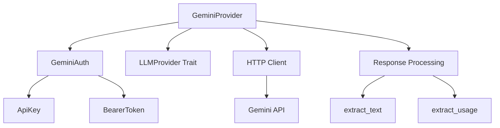
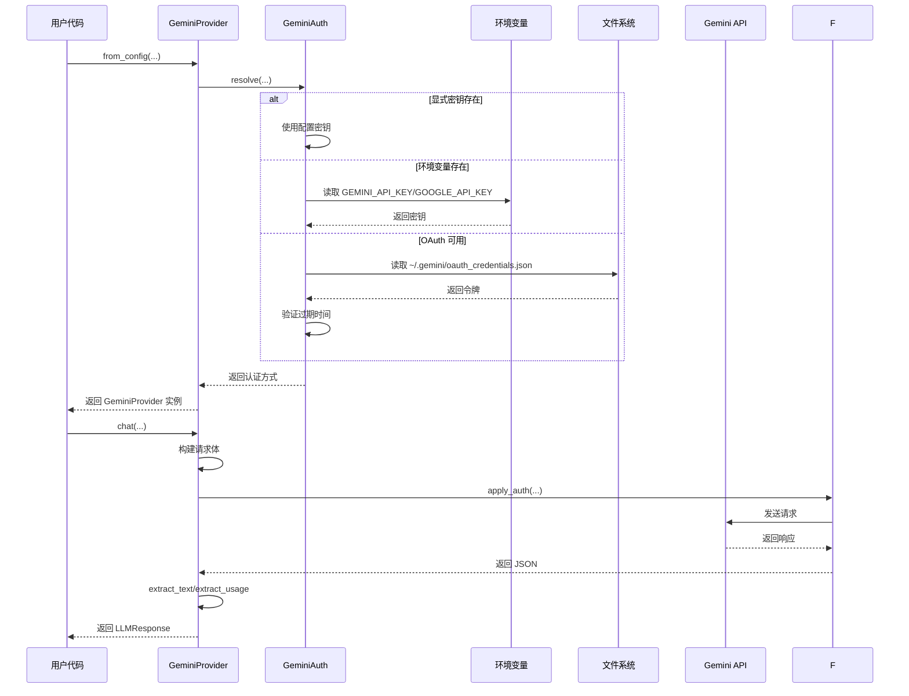

# Gemini 模块文档

## 目录
- [概述](#概述)
- [核心组件](#核心组件)
- [架构设计](#架构设计)
- [使用指南](#使用指南)
- [API 参考](#api-参考)
- [测试说明](#测试说明)
- [注意事项与限制](#注意事项与限制)

## 概述

`gemini` 模块是一个原生的 Google Gemini API 集成模块，提供了完整的 Gemini 语言模型服务接入能力。该模块支持多种认证方式、思考模型响应过滤以及灵活的配置选项，为开发者提供了简洁而强大的 Gemini API 交互接口。

### 主要功能特性

1. **多模式认证**：支持 API 密钥、环境变量和 Gemini CLI OAuth 三种认证方式
2. **思考模型支持**：自动过滤 Gemini 2.5+ 模型的中间思考过程，只返回最终答案
3. **灵活的配置**：支持自定义模型选择、参数配置和系统指令
4. **完整的令牌统计**：提供详细的令牌使用情况统计
5. **错误处理**：完善的错误处理和重试机制

### 设计理念

该模块的设计遵循了以下原则：
- **简洁性**：提供清晰易用的 API 接口
- **可靠性**：内置多种认证方式和错误处理机制
- **可扩展性**：模块化设计便于未来功能扩展
- **兼容性**：保持与 Gemini API 的版本兼容性

## 核心组件

### GeminiAuth

`GeminiAuth` 枚举负责处理 Gemini API 的认证方式，提供了两种主要认证类型：

#### 认证类型

1. **ApiKey**：使用标准 API 密钥作为查询参数传递
2. **BearerToken**：使用 OAuth 持有者令牌作为请求头传递

#### 主要方法

##### `resolve(explicit_key: Option<&str>, env_key: Option<&str>, oauth_token: Option<String>) -> Option<Self>`

按照优先级顺序解析认证凭据：
1. 配置文件中的显式密钥
2. 环境变量中的密钥（`GEMINI_API_KEY` 或 `GOOGLE_API_KEY`）
3. Gemini CLI OAuth 令牌

##### `load_cli_token() -> Option<String>`

从 `~/.gemini/oauth_credentials.json` 读取 Gemini CLI OAuth 访问令牌。该方法会验证令牌的过期时间，如果令牌已过期则返回 `None` 以避免下游出现 401 错误。

支持的令牌字段：
- `access_token`
- `token`
- `oauth_token`

支持的过期时间字段：
- `expiry`
- `expires_at`

### GeminiProvider

`GeminiProvider` 是模块的核心组件，实现了 `LLMProvider` trait，提供与 Gemini API 的完整交互功能。

#### 构造方法

##### `new_with_key(api_key: &str, model: &str) -> Self`

使用 API 密钥创建一个新的 Gemini 提供商实例。

**参数：**
- `api_key`：Gemini API 密钥
- `model`：要使用的模型名称

**返回值：** 配置好的 `GeminiProvider` 实例

##### `new_with_token(bearer_token: &str, model: &str) -> Self`

使用 OAuth 持有者令牌创建一个新的 Gemini 提供商实例。

**参数：**
- `bearer_token`：OAuth 访问令牌
- `model`：要使用的模型名称

**返回值：** 配置好的 `GeminiProvider` 实例

##### `from_config(api_key: Option<&str>, model: &str, prefer_oauth: bool) -> Option<Self>`

从配置中创建 Gemini 提供商实例，自动解析认证凭据。

**参数：**
- `api_key`：可选的 API 密钥
- `model`：要使用的模型名称
- `prefer_oauth`：是否优先使用 OAuth 认证

**返回值：** 配置好的 `GeminiProvider` 实例，如果没有可用的凭据则返回 `None`

#### 核心方法

##### `chat(messages: Vec<Message>, _tools: Vec<ToolDefinition>, model: Option<&str>, options: ChatOptions) -> Result<LLMResponse>`

发送聊天请求到 Gemini API 并获取响应。

**参数：**
- `messages`：对话消息列表
- `_tools`：工具定义列表（当前未实现）
- `model`：可选的模型覆盖
- `options`：聊天选项配置

**返回值：** 包含响应内容和使用统计的 `LLMResponse`

**错误处理：**
- 网络错误：返回 `ZeptoError::Provider`
- API 错误：解析并返回有用的错误消息
- 响应解析错误：返回 `ZeptoError::Provider`

##### `extract_text(response: &Value) -> Option<String>`

从 Gemini API 响应中提取最终答案文本。该方法会自动过滤掉标记为 `thought: true` 的思考部分，只返回最终的非思考文本。如果没有非思考部分，则回退到返回思考文本。

**参数：**
- `response`：Gemini API 的 JSON 响应

**返回值：** 提取的文本内容，如果无法提取则返回 `None`

##### `extract_usage(response: &Value) -> Option<Usage>`

从 Gemini 响应中解析令牌使用情况。

**参数：**
- `response`：Gemini API 的 JSON 响应

**返回值：** 包含提示令牌、完成令牌和总令牌数的 `Usage` 对象，如果无法解析则返回 `None`

##### `build_messages_body(messages: &[Message], options: &ChatOptions) -> Value`

从消息列表构建完整的 `generateContent` 请求体。该方法会：
1. 分离系统提示和对话消息
2. 转换角色名称（`assistant` → `model`）
3. 应用生成配置选项

**参数：**
- `messages`：消息列表
- `options`：聊天选项

**返回值：** 构建好的请求体 JSON 值

## 架构设计

### 模块架构图



### 认证流程



### 数据流程

1. **输入处理**：接收 `Message` 列表，分离系统提示和对话消息
2. **请求构建**：转换消息格式，应用配置选项
3. **认证应用**：根据认证方式添加相应的认证信息
4. **API 调用**：发送 HTTP POST 请求到 Gemini API
5. **响应处理**：解析 JSON 响应，提取文本和使用统计
6. **结果返回**：返回标准化的 `LLMResponse` 对象

## 使用指南

### 基本使用

#### 1. 使用 API 密钥创建提供商

```rust
use zeptoclaw::providers::gemini::GeminiProvider;

// 创建使用 API 密钥的提供商
let provider = GeminiProvider::new_with_key("your-api-key", "gemini-2.0-flash");
```

#### 2. 使用 OAuth 令牌创建提供商

```rust
use zeptoclaw::providers::gemini::GeminiProvider;

// 创建使用 OAuth 令牌的提供商
let provider = GeminiProvider::new_with_token("your-bearer-token", "gemini-2.5-pro");
```

#### 3. 从配置创建提供商（推荐）

```rust
use zeptoclaw::providers::gemini::GeminiProvider;

// 自动解析认证方式
let provider = GeminiProvider::from_config(
    Some("config-api-key"),  // 可选的配置密钥
    "gemini-2.0-flash",      // 默认模型
    false                     // 不优先使用 OAuth
);

if let Some(p) = provider {
    // 使用提供商
}
```

#### 4. 发送聊天请求

```rust
use zeptoclaw::providers::gemini::GeminiProvider;
use zeptoclaw::session::{Message, Role};
use zeptoclaw::providers::ChatOptions;

let provider = GeminiProvider::new_with_key("api-key", "gemini-2.0-flash");

// 准备消息
let messages = vec![
    Message::system("You are a helpful assistant."),
    Message::user("Hello, how are you?")
];

// 配置选项
let options = ChatOptions {
    temperature: Some(0.7),
    max_tokens: Some(1000),
    top_p: Some(0.9),
    ..Default::default()
};

// 发送请求
#[tokio::main]
async fn main() {
    let response = provider.chat(
        messages,
        vec![],  // 工具定义（当前未使用）
        None,    // 使用默认模型
        options
    ).await;

    match response {
        Ok(llm_response) => {
            println!("Response: {}", llm_response.content);
            if let Some(usage) = llm_response.usage {
                println!("Tokens: prompt={}, completion={}, total={}", 
                    usage.prompt_tokens, 
                    usage.completion_tokens, 
                    usage.total_tokens
                );
            }
        }
        Err(e) => eprintln!("Error: {}", e),
    }
}
```

### 高级配置

#### 使用思考模型

Gemini 2.5+ 模型支持思考模式，提供商自动处理思考部分的过滤：

```rust
let provider = GeminiProvider::new_with_key("api-key", "gemini-2.5-pro");
// 发送请求后，响应会自动过滤掉思考部分，只返回最终答案
```

#### 自定义生成参数

```rust
let options = ChatOptions {
    temperature: Some(0.3),      // 较低的温度 = 更确定性的输出
    max_tokens: Some(2048),      // 最大输出令牌数
    top_p: Some(0.8),            // 核采样参数
    ..Default::default()
};
```

#### 使用环境变量认证

设置环境变量后，可以不提供显式密钥：

```bash
export GEMINI_API_KEY="your-api-key"
# 或者
export GOOGLE_API_KEY="your-api-key"
```

然后在代码中：

```rust
let provider = GeminiProvider::from_config(
    None,           // 不使用配置密钥
    "gemini-2.0-flash",
    false
);
```

#### 使用 Gemini CLI OAuth

首先使用 Gemini CLI 进行认证：

```bash
gemini auth login
```

然后在代码中优先使用 OAuth：

```rust
let provider = GeminiProvider::from_config(
    None,
    "gemini-2.0-flash",
    true    // 优先使用 OAuth
);
```

## API 参考

### 常量

| 常量名 | 值 | 描述 |
|--------|-----|------|
| `GEMINI_API_BASE` | `"https://generativelanguage.googleapis.com/v1beta"` | Gemini REST API 基础 URL |
| `GEMINI_CLI_CREDS_PATH` | `".gemini/oauth_credentials.json"` | Gemini CLI OAuth 凭证文件路径（相对于 `$HOME`） |
| `DEFAULT_GEMINI_MODEL` | `"gemini-2.0-flash"` | 默认使用的 Gemini 模型 |

### GeminiAuth 枚举

#### 变体

| 变体 | 描述 |
|------|------|
| `ApiKey(String)` | 使用 API 密钥认证 |
| `BearerToken(String)` | 使用 OAuth 持有者令牌认证 |

#### 方法

| 方法 | 描述 |
|------|------|
| `resolve(explicit_key, env_key, oauth_token)` | 按优先级解析认证凭据 |
| `load_cli_token()` | 从文件加载 Gemini CLI OAuth 令牌 |
| `token_from_json_if_valid(json)` | 从 JSON 解析并验证令牌（测试用） |

### GeminiProvider 结构体

#### 构造函数

| 函数 | 描述 |
|------|------|
| `new_with_key(api_key, model)` | 使用 API 密钥创建提供商 |
| `new_with_token(bearer_token, model)` | 使用 OAuth 令牌创建提供商 |
| `from_config(api_key, model, prefer_oauth)` | 从配置创建提供商 |
| `default_gemini_model()` | 返回默认模型名称 |

#### 实例方法

| 方法 | 描述 |
|------|------|
| `chat(messages, tools, model, options)` | 发送聊天请求 |
| `default_model()` | 返回配置的默认模型 |
| `name()` | 返回提供商名称 `"gemini-native"` |

#### 辅助方法

| 方法 | 描述 |
|------|------|
| `build_request_body_from_parts(role, text, system)` | 从简单部分构建请求体 |
| `build_messages_body(messages, options)` | 从消息列表构建完整请求体 |
| `extract_text(response)` | 从响应中提取文本 |
| `extract_usage(response)` | 从响应中提取使用统计 |
| `api_url(model)` | 构建 API URL |
| `apply_auth(request)` | 应用认证到请求 |

## 测试说明

该模块包含全面的单元测试，覆盖以下功能：

### 认证相关测试

- 认证解析优先级测试
- 环境变量回退测试
- OAuth 令牌使用测试
- 令牌过期验证测试
- 无凭据情况处理测试

### 响应处理测试

- 思考模型响应过滤测试
- 纯思考文本回退测试
- 正常响应提取测试
- 多部分文本合并测试
- 空响应处理测试

### 请求构建测试

- 请求体格式验证
- 角色映射测试
- 系统指令包含测试
- API URL 格式测试
- 消息过滤测试

### 使用统计测试

- 令牌计数解析测试
- 缺失使用数据处理测试

### 运行测试

```bash
# 运行所有测试
cargo test --package zeptoclaw --providers::gemini

# 运行特定测试
cargo test --package zeptoclaw --providers::gemini::tests::test_auth_resolution_prefers_explicit_key
```

## 注意事项与限制

### 认证相关

1. **OAuth 令牌过期**：OAuth 令牌有过期时间，过期后需要重新运行 `gemini auth login`
2. **环境变量优先级**：`GEMINI_API_KEY` 优先于 `GOOGLE_API_KEY`
3. **密钥安全**：不要在代码中硬编码 API 密钥，使用环境变量或配置文件

### API 相关

1. **工具调用**：当前版本的 `chat` 方法接收 `_tools` 参数但未实现工具调用功能
2. **模型版本**：确保使用有效的 Gemini 模型名称，推荐使用 `gemini-2.0-flash` 或 `gemini-2.5-pro`
3. **请求超时**：默认超时时间为 120 秒，对于长请求可能需要调整

### 响应处理

1. **思考模型**：只有 Gemini 2.5+ 模型支持思考标签，旧版本模型不会过滤任何内容
2. **文本提取**：如果响应中没有非思考部分，会回退到返回思考文本，避免返回空内容
3. **使用统计**：不是所有 API 响应都包含使用统计数据，代码中需要处理 `None` 情况

### 错误处理

1. **网络错误**：网络问题会导致 `ZeptoError::Provider`，建议实现重试逻辑
2. **API 错误**：API 返回的错误会被解析并包含在错误消息中
3. **响应解析**：无效的 JSON 响应会导致解析错误

### 性能考虑

1. **连接复用**：`GeminiProvider` 内部使用共享的 HTTP 客户端，建议复用实例而不是频繁创建
2. **并发请求**：提供商实例是线程安全的，可以用于并发请求
3. **令牌使用**：监控令牌使用情况以避免意外的高费用

## 相关模块

- [provider_core](provider_core.md) - 提供商核心类型和 trait 定义
- [provider_implementations](provider_implementations.md) - 其他提供商实现
- [agent_core](agent_core.md) - 代理核心功能，使用提供商进行对话

## 示例代码

完整的示例代码可以在项目的 `examples` 目录中找到，包括：
- 基本聊天示例
- 思考模型使用示例
- 认证方式配置示例
- 错误处理示例
