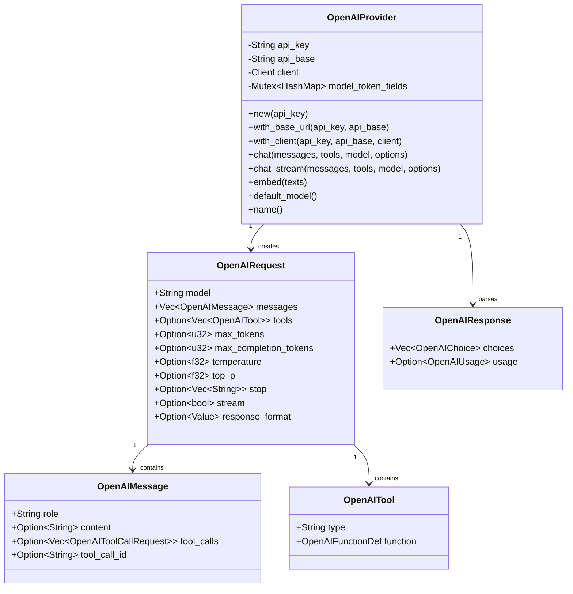

# OpenAI Provider Module Documentation

## 1. Module Overview

The OpenAI Provider module implements the `LLMProvider` trait for OpenAI's Chat Completions API, providing a robust and flexible interface for interacting with OpenAI's language models. This module handles message format conversion, tool calling, response parsing, and streaming, while also supporting OpenAI-compatible APIs through custom base URLs.

Key features include:
- Full support for OpenAI's chat completions API with tool calling
- Streaming support for real-time responses
- Intelligent handling of token limit parameters for different model families
- Compatibility with OpenAI-compatible APIs (Azure, local models, etc.)
- Embeddings generation support
- Automatic retry mechanism for token field compatibility issues

This module is part of the larger provider system and integrates seamlessly with the agent core, tooling framework, and other components through standardized interfaces.

## 2. Architecture and Component Relationships

The OpenAI Provider module is structured around several core components that work together to provide a complete interface to OpenAI's API:



The module's architecture follows a clear separation of concerns:

1. **OpenAIProvider**: The main entry point that implements the `LLMProvider` trait, orchestrating requests and responses.
2. **Request Types**: Data structures (`OpenAIRequest`, `OpenAIMessage`, `OpenAITool`) that model the OpenAI API request format.
3. **Response Types**: Data structures (`OpenAIResponse`, `OpenAIStreamChunk`) that model the OpenAI API response format.
4. **Conversion Functions**: Utilities to convert between internal types and OpenAI-specific formats.
5. **Streaming Support**: Components to handle streaming responses from the API.

The module interacts with other parts of the system through the `LLMProvider` trait, making it interchangeable with other provider implementations like Claude or Gemini.

## 3. Core Components

### 3.1 OpenAIProvider

The `OpenAIProvider` struct is the central component of this module, implementing the `LLMProvider` trait to provide access to OpenAI's models.

#### Key Fields:
- `api_key`: The API key for authentication with OpenAI
- `api_base`: The base URL for the API (can be customized for compatible services)
- `client`: An HTTP client for making requests
- `model_token_fields`: A thread-safe map tracking which token limit field to use for each model

#### Methods:

1. **Constructors**:
   - `new(api_key: &str)`: Creates a new provider with the default OpenAI API endpoint
   - `with_base_url(api_key: &str, api_base: &str)`: Creates a provider with a custom base URL
   - `with_client(api_key: &str, api_base: &str, client: Client)`: Creates a provider with a custom HTTP client

2. **Core Functionality**:
   - `chat()`: Sends a chat completion request and returns the response
   - `chat_stream()`: Initiates a streaming chat completion request
   - `embed()`: Generates embeddings for input texts
   - `default_model()`: Returns the default model (gpt-5.1 unless overridden)
   - `name()`: Returns "openai" as the provider name

#### Example Usage:

```rust
use zeptoclaw::providers::openai::OpenAIProvider;
use zeptoclaw::providers::{LLMProvider, ChatOptions};
use zeptoclaw::session::Message;

#[tokio::main]
async fn main() {
    // Create a provider
    let provider = OpenAIProvider::new("your-api-key");
    
    // Or with a custom base URL for compatible APIs
    let local_provider = OpenAIProvider::with_base_url(
        "local-key", 
        "http://localhost:11434/v1"
    );
    
    // Prepare messages
    let messages = vec![
        Message::system("You are a helpful assistant."),
        Message::user("Hello!"),
    ];
    
    // Make a request
    let response = provider
        .chat(messages, vec![], None, ChatOptions::default())
        .await
        .unwrap();
    
    println!("Response: {}", response.content);
}
```

### 3.2 Request and Response Types

#### OpenAIRequest
Represents a complete request to the OpenAI API, including model selection, messages, tools, and various generation options.

#### OpenAIMessage
Represents a single message in the conversation, with support for different roles (system, user, assistant, tool) and tool calls.

#### OpenAITool
Defines a tool that can be called by the model, following OpenAI's function calling format.

#### OpenAIResponse
Represents the complete response from the OpenAI API, including generated content and token usage statistics.

#### OpenAIStreamChunk and Related Types
Handle streaming responses, allowing incremental processing of content and tool calls as they're generated.

### 3.3 Token Field Management

The module includes intelligent handling of token limit parameters, which is necessary because different OpenAI model families use different parameter names:

```rust
enum MaxTokenField {
    MaxTokens,
    MaxCompletionTokens,
}

fn static_token_field_for_model(model: &str) -> MaxTokenField {
    let m = model.to_lowercase();
    
    // o-series reasoning models use max_completion_tokens
    if m.starts_with("o1") || m.starts_with("o2") || m.starts_with("o3") || m.starts_with("o4") {
        return MaxTokenField::MaxCompletionTokens;
    }
    
    // gpt-5 series (excluding potential multimodal variants)
    if m.starts_with("gpt-5") && !m.starts_with("gpt-5o") {
        return MaxTokenField::MaxCompletionTokens;
    }
    
    MaxTokenField::MaxTokens
}
```

The provider automatically:
1. Selects the appropriate token field based on the model name
2. Remembers the correct field for models it's seen before
3. Retries with the alternative field if it encounters an unsupported parameter error

## 4. Usage Examples

### 4.1 Basic Chat Completion

```rust
use zeptoclaw::providers::openai::OpenAIProvider;
use zeptoclaw::providers::{LLMProvider, ChatOptions};
use zeptoclaw::session::Message;

async fn basic_chat() {
    let provider = OpenAIProvider::new("your-api-key");
    
    let messages = vec![
        Message::system("You are a helpful assistant."),
        Message::user("What is Rust?"),
    ];
    
    let response = provider
        .chat(messages, vec![], None, ChatOptions::default())
        .await
        .unwrap();
    
    println!("Response: {}", response.content);
}
```

### 4.2 Chat with Tools

```rust
use zeptoclaw::providers::openai::OpenAIProvider;
use zeptoclaw::providers::{LLMProvider, ChatOptions, ToolDefinition};
use zeptoclaw::session::Message;
use serde_json::json;

async fn chat_with_tools() {
    let provider = OpenAIProvider::new("your-api-key");
    
    // Define a tool
    let tools = vec![ToolDefinition::new(
        "get_weather",
        "Get the current weather in a location",
        json!({
            "type": "object",
            "properties": {
                "location": {
                    "type": "string",
                    "description": "The city and state, e.g. San Francisco, CA"
                }
            },
            "required": ["location"]
        }),
    )];
    
    let messages = vec![
        Message::user("What's the weather like in New York?"),
    ];
    
    let response = provider
        .chat(messages, tools, None, ChatOptions::default())
        .await
        .unwrap();
    
    if response.has_tool_calls() {
        for tool_call in &response.tool_calls {
            println!("Tool call: {} with args {}", tool_call.name, tool_call.arguments);
        }
    } else {
        println!("Response: {}", response.content);
    }
}
```

### 4.3 Streaming Responses

```rust
use zeptoclaw::providers::openai::OpenAIProvider;
use zeptoclaw::providers::{LLMProvider, ChatOptions, StreamEvent};
use zeptoclaw::session::Message;

async fn streaming_chat() {
    let provider = OpenAIProvider::new("your-api-key");
    
    let messages = vec![
        Message::user("Tell me a story about a robot learning to paint."),
    ];
    
    let mut rx = provider
        .chat_stream(messages, vec![], None, ChatOptions::default())
        .await
        .unwrap();
    
    while let Some(event) = rx.recv().await {
        match event {
            StreamEvent::Delta(text) => print!("{}", text),
            StreamEvent::ToolCalls(tool_calls) => {
                println!("\nTool calls: {:?}", tool_calls);
            }
            StreamEvent::Done { content, usage } => {
                println!("\n\nDone! Full content: {}", content);
                if let Some(usage) = usage {
                    println!("Tokens used: {}", usage.total_tokens);
                }
            }
            StreamEvent::Error(e) => {
                eprintln!("\nError: {}", e);
            }
        }
    }
}
```

### 4.4 Generating Embeddings

```rust
use zeptoclaw::providers::openai::OpenAIProvider;
use zeptoclaw::providers::LLMProvider;

async fn generate_embeddings() {
    let provider = OpenAIProvider::new("your-api-key");
    
    let texts = vec![
        "Hello, world!".to_string(),
        "The quick brown fox jumps over the lazy dog.".to_string(),
    ];
    
    let embeddings = provider.embed(&texts).await.unwrap();
    
    for (i, embedding) in embeddings.iter().enumerate() {
        println!("Embedding {}: {} dimensions", i, embedding.len());
        // Print first 3 values as a sample
        println!("First 3 values: {:?}", &embedding[0..3]);
    }
}
```

## 5. Configuration and Integration

The OpenAI provider can be configured through several mechanisms:

### 5.1 Environment Variables

- `ZEPTOCLAW_OPENAI_DEFAULT_MODEL`: Overrides the default model (set at compile time)

### 5.2 Programmatic Configuration

```rust
// Basic configuration
let provider = OpenAIProvider::new("api-key");

// Custom base URL for compatible APIs
let custom_provider = OpenAIProvider::with_base_url(
    "api-key",
    "https://custom-api.example.com/v1"
);

// Advanced configuration with custom client
use reqwest::Client;
use std::time::Duration;

let client = Client::builder()
    .timeout(Duration::from_secs(60))
    .pool_idle_timeout(Duration::from_secs(90))
    .build()
    .unwrap();

let advanced_provider = OpenAIProvider::with_client(
    "api-key",
    "https://api.openai.com/v1",
    client
);
```

### 5.3 Integration with Other Modules

The OpenAI provider integrates with the broader system through the `LLMProvider` trait. For more information on how providers are used in the larger context, see:
- [provider_core](provider_core.md) - For the provider trait definitions and core types
- [agent_core](agent_core.md) - For how providers are used in the agent loop
- [configuration](configuration.md) - For configuration options

## 6. Edge Cases and Error Handling

### 6.1 Token Field Compatibility

The provider includes automatic handling for models that require `max_completion_tokens` instead of `max_tokens`. If a request fails with an unsupported parameter error, the provider will automatically retry with the alternative parameter.

### 6.2 Error Handling

The module converts OpenAI API errors into appropriate `ZeptoError` types. Common errors include:
- Authentication errors (invalid API key)
- Rate limiting errors
- Model not found errors
- Invalid request errors

### 6.3 Streaming Edge Cases

When using streaming:
- The stream will automatically handle partial JSON fragments
- Tool calls are assembled incrementally and only sent when complete
- Network errors during streaming will be sent as `StreamEvent::Error`

### 6.4 Custom Base URL Considerations

When using a custom base URL for OpenAI-compatible APIs:
- The provider will automatically trim trailing slashes from the URL
- Not all compatible APIs support all features (e.g., some may not support tool calling or streaming)
- Error handling may vary between different implementations

## 7. Testing

The module includes comprehensive tests covering:
- Provider creation and configuration
- Message and tool conversion
- Response parsing
- Token field selection logic
- Streaming response handling
- Embedding response parsing
- Custom base URL handling

To run the tests:
```bash
cargo test --package zeptoclaw --providers::openai
```

## 8. Performance Considerations

- The provider maintains an internal cache of token field preferences to avoid repeated retries
- The HTTP client uses connection pooling for efficiency
- Streaming responses are processed incrementally to minimize memory usage
- For high-throughput scenarios, consider using a custom HTTP client with appropriate pooling settings

## 9. Future Enhancements

Potential future enhancements include:
- Support for additional OpenAI API features (image generation, fine-tuning, etc.)
- Enhanced caching mechanisms for embeddings
- More sophisticated retry logic with exponential backoff
- Support for more OpenAI-compatible APIs through additional configuration options
