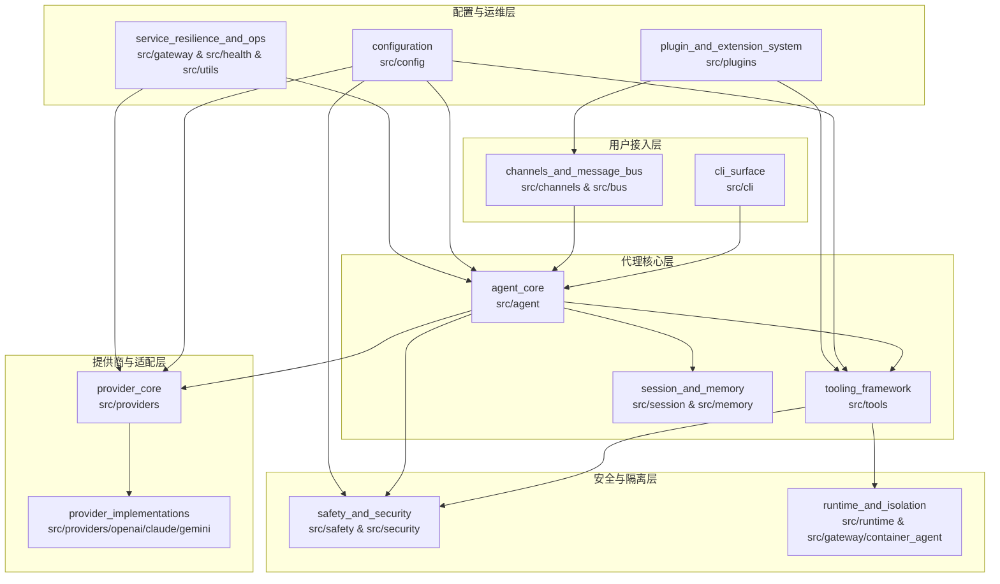
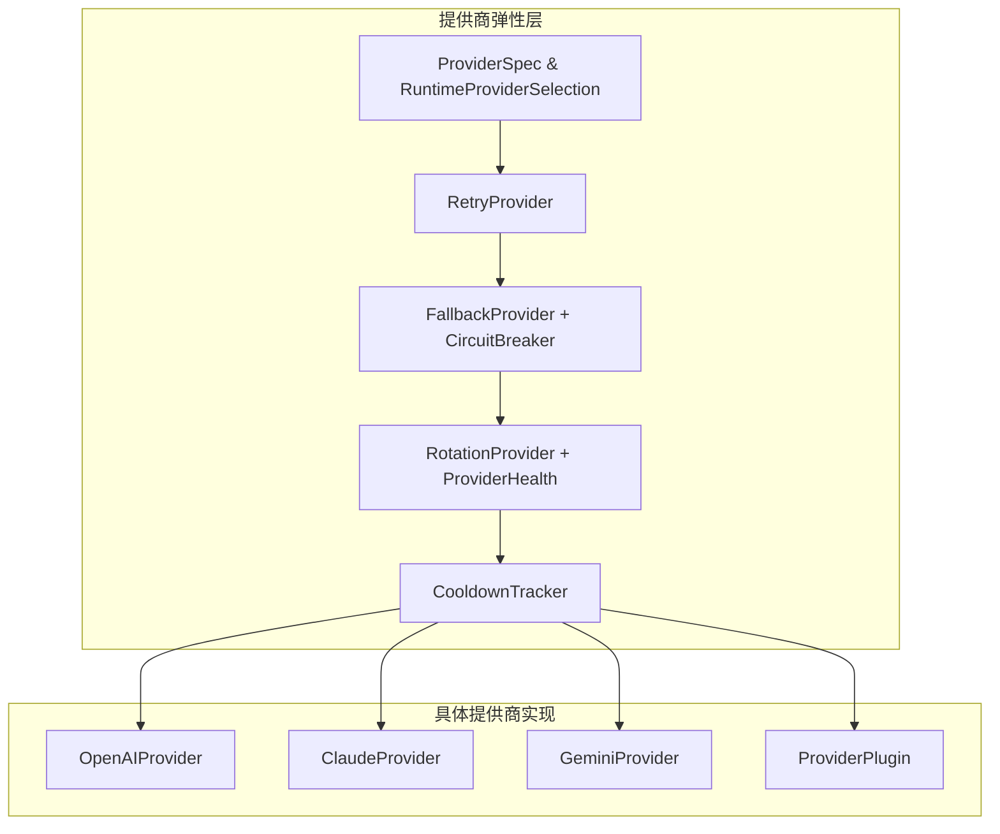

# zeptoclaw 仓库综合概述

## 1. 仓库目的

`zeptoclaw` 是一个生产级的多代理 AI 系统框架，专注于提供安全、可观测、可扩展的代理编排能力。它的核心目标是为开发者构建企业级代理应用提供完整的基础设施：

- **代理编排**：提供完整的代理运行时、上下文管理和工具执行循环
- **多提供商抽象**：统一的 LLM 提供商接口，支持重试、回退、熔断、负载均衡等企业级特性
- **安全第一**：内置工具审批、路径隔离、运行时沙箱、秘密检测等多层安全机制
- **可观测性**：内置健康检查、指标收集、成本追踪、SLO 监控等运维能力
- **可扩展性**：提供插件系统、自定义工具、自定义提供商等扩展点
- **多渠道接入**：支持 Webhook、Telegram、Slack、Discord 等多种消息渠道

---

## 2. 端到端架构可视化

### 2.1 整体系统架构



### 2.2 代理运行时主循环

```mermaid
sequenceDiagram
    participant User as 用户/渠道
    participant Agent as ZeptoAgent
    participant Loop as AgentLoop
    participant Scratchpad as SwarmScratchpad
    participant Context as RuntimeContext
    participant Provider as ModelProvider
    participant Tools as ToolRegistry
    participant Safety as SafetyLayer

    User->>Agent: 发送请求
    Agent->>Context: 构建运行时上下文
    Agent->>Loop: 启动代理循环
    loop 代理循环
        Loop->>Scratchpad: 读取当前状态
        Loop->>Context: 获取 TokenBudget
        Loop->>Provider: 发送 LLM 请求
        Provider->>Safety: 内容安全检查
        Safety-->>Provider: 安全结果
        Provider-->>Loop: LLMResponse (含 LLMToolCall)
        alt 包含工具调用
            Loop->>Tools: 解析并选择工具
            Tools->>Safety: 工具调用安全检查
            Tools->>Scratchpad: 写入 ToolFeedback
            Loop->>Scratchpad: 更新状态
        else 无工具调用/结束
            Loop->>Agent: 返回最终结果
        end
    end
    Agent-->>User: 返回响应
```

### 2.3 提供商弹性层架构



---

## 3. 核心模块文档索引

### 3.1 agent_core - 代理核心模块
| 组件路径 | 说明 |
|---------|------|
| `src.agent.facade.ZeptoAgent` | 代理的主要对外接口 |
| `src.agent.facade.ZeptoAgentBuilder` | 代理的构建器，用于流式配置代理 |
| `src.agent.loop.AgentLoop` | 代理的主运行循环，负责协调 LLM 调用与工具执行 |
| `src.agent.loop.ToolFeedback` | 工具执行结果的反馈结构 |
| `src.agent.scratchpad.SwarmScratchpad` | 代理运行时的状态暂存区 |
| `src.agent.context.RuntimeContext` | 代理的运行时上下文，包含预算、配置等信息 |
| `src.agent.context.ContextBuilder` | 运行时上下文的构建器 |
| `src.agent.budget.TokenBudget` | Token 预算管理，用于控制代理的 Token 消耗 |
| `src.agent.context_monitor.ContextMonitor` | 上下文监控器，用于跟踪上下文使用情况 |

### 3.2 provider_core 与 provider_implementations - 提供商模块
| 组件路径 | 说明 |
|---------|------|
| **核心类型** | |
| `src.providers.types.ToolDefinition` | 工具定义的统一结构 |
| `src.providers.types.LLMResponse` | LLM 响应的统一结构 |
| `src.providers.types.LLMToolCall` | LLM 工具调用的统一结构 |
| `src.providers.types.Usage` | Token 使用量结构 |
| `src.providers.types.ChatOptions` | 聊天选项配置 |
| **弹性与注册** | |
| `src.providers.registry.ProviderSpec` | 提供商规格定义 |
| `src.providers.registry.RuntimeProviderSelection` | 运行时提供商选择器 |
| `src.providers.retry.RetryProvider` | 重试装饰器提供商 |
| `src.providers.fallback.FallbackProvider` | 回退装饰器提供商 |
| `src.providers.fallback.CircuitBreaker` | 熔断器实现 |
| `src.providers.rotation.RotationProvider` | 负载均衡/轮转装饰器提供商 |
| `src.providers.rotation.ProviderHealth` | 提供商健康状态 |
| `src.providers.cooldown.CooldownTracker` | 冷却时间追踪器 |
| **具体实现** | |
| `src.providers.openai.OpenAIProvider` | OpenAI 提供商实现 |
| `src.providers.claude.ClaudeProvider` | Claude 提供商实现 |
| `src.providers.gemini.GeminiProvider` | Gemini 提供商实现 |
| `src.providers.plugin.ProviderPlugin` | 插件化提供商接口 |

### 3.3 tooling_framework - 工具框架模块
| 组件路径 | 说明 |
|---------|------|
| **核心** | |
| `src.tools.registry.ToolRegistry` | 工具注册中心 |
| `src.tools.types.ToolContext` | 工具执行上下文 |
| `src.tools.types.ToolOutput` | 工具输出结构 |
| **内置工具** | |
| `src.tools.mod.EchoTool` | 回显工具 |
| `src.tools.custom.CustomTool` | 自定义工具基类 |
| `src.tools.delegate.DelegateTool` | 委托工具 |
| `src.tools.composed.ComposedTool` | 组合工具 |
| **安全与审批** | |
| `src.tools.approval.ApprovalGate` | 审批门控 |
| `src.tools.approval.ApprovalConfig` | 审批配置 |
| **实用工具** | |
| `src.tools.filesystem.*` | 文件系统工具（读/写/编辑/列目录） |
| `src.tools.shell.ShellTool` | Shell 执行工具 |
| `src.tools.http_request.HttpRequestTool` | HTTP 请求工具 |
| `src.tools.web.WebFetchTool` / `WebSearchTool` | Web 抓取/搜索工具 |
| `src.tools.mcp.client.McpClient` | MCP (Model Context Protocol) 客户端 |
| **插件化** | |
| `src.tools.plugin.PluginTool` | 插件工具 |
| `src.tools.binary_plugin.BinaryPluginTool` | 二进制插件工具 |

### 3.4 configuration - 配置模块
| 组件路径 | 说明 |
|---------|------|
| `src.config.types.ProjectConfig` | 项目级配置 |
| `src.config.types.RuntimeConfig` | 运行时配置 |
| `src.config.types.AgentConfig` / `AgentDefaults` | 代理配置与默认值 |
| `src.config.types.ProvidersConfig` / `ProviderConfig` | 提供商配置 |
| `src.config.types.ToolsConfig` / `MemoryConfig` / `LoggingConfig` | 工具、内存、日志等配置 |
| `src.config.types.RetryConfig` / `RotationConfig` / `FallbackConfig` | 弹性配置 |
| `src.config.validate.Diagnostic` | 配置诊断工具 |
| `src.config.templates.AgentTemplate` / `TemplateRegistry` | 代理模板与模板注册 |

### 3.5 session_and_memory - 会话与记忆模块
| 组件路径 | 说明 |
|---------|------|
| **会话** | |
| `src.session.mod.SessionManager` | 会话管理器 |
| `src.session.history.ConversationHistory` | 会话历史 |
| `src.session.types.Message` / `ToolCall` | 消息与工具调用类型 |
| **记忆** | |
| `src.memory.longterm.LongTermMemory` | 长期记忆 |
| `src.memory.builtin_searcher.BuiltinSearcher` | 内置搜索器 |
| `src.memory.bm25_searcher.Bm25Searcher` | BM25 搜索器 |
| `src.memory.embedding_searcher.EmbeddingSearcher` | 向量嵌入搜索器 |
| `src.memory.hygiene.HygieneConfig` / `HygieneReport` | 记忆卫生配置与报告 |

### 3.6 channels_and_message_bus - 渠道与消息总线模块
| 组件路径 | 说明 |
|---------|------|
| **消息总线** | |
| `src.bus.mod.MessageBus` | 消息总线核心 |
| `src.bus.message.InboundMessage` / `OutboundMessage` | 入站/出站消息 |
| **渠道管理** | |
| `src.channels.manager.ChannelManager` | 渠道管理器 |
| **具体渠道** | |
| `src.channels.webhook.WebhookChannel` | Webhook 渠道 |
| `src.channels.telegram.TelegramChannel` | Telegram 渠道 |
| `src.channels.slack.SlackChannel` | Slack 渠道 |
| `src.channels.discord.DiscordChannel` | Discord 渠道 |

### 3.7 runtime_and_isolation - 运行时与隔离模块
| 组件路径 | 说明 |
|---------|------|
| `src.runtime.native.NativeRuntime` | 原生运行时（无隔离） |
| `src.runtime.docker.DockerRuntime` | Docker 容器运行时 |
| `src.runtime.firejail.FirejailRuntime` | Firejail 沙箱运行时 |
| `src.runtime.bubblewrap.BubblewrapRuntime` | Bubblewrap 沙箱运行时 |
| `src.runtime.landlock.LandlockRuntime` | Landlock 安全模块运行时 |
| `src.gateway.container_agent.ContainerAgentProxy` | 容器代理代理 |

### 3.8 safety_and_security - 安全与安保模块
| 组件路径 | 说明 |
|---------|------|
| **内容安全** | |
| `src.safety.mod.SafetyLayer` | 安全层核心 |
| `src.safety.policy.PolicyEngine` | 策略引擎 |
| `src.safety.validator.ContentValidator` | 内容验证器 |
| `src.safety.leak_detector.LeakDetector` | 秘密泄漏检测器 |
| **路径与权限** | |
| `src.security.path.SafePath` | 安全路径封装 |
| `src.security.shell.ShellSecurityConfig` | Shell 安全配置 |
| `src.security.mount.MountAllowlist` | 挂载白名单 |
| `src.security.agent_mode.AgentModeConfig` | 代理模式配置 |
| **加密** | |
| `src.security.encryption.SecretEncryption` | 秘密加密 |

### 3.9 service_resilience_and_ops - 服务弹性与运维模块
| 组件路径 | 说明 |
|---------|------|
| **网关** | |
| `src.gateway.rate_limit.GatewayRateLimiter` | 网关限流器 |
| `src.gateway.idempotency.IdempotencyStore` | 幂等性存储 |
| `src.gateway.startup_guard.StartupGuard` | 启动防护 |
| **健康与指标** | |
| `src.health.HealthCheck` / `HealthRegistry` | 健康检查 |
| `src.utils.metrics.MetricsCollector` | 指标收集器 |
| `src.utils.cost.CostTracker` | 成本追踪器 |
| `src.utils.slo.SessionSLO` | 会话 SLO 监控 |

### 3.10 plugin_and_extension_system - 插件与扩展系统模块
| 组件路径 | 说明 |
|---------|------|
| `src.plugins.types.Plugin` | 插件基类 |
| `src.plugins.types.PluginManifest` | 插件清单 |
| `src.plugins.registry.PluginRegistry` | 插件注册中心 |
| `src.plugins.watcher.PluginWatcher` | 插件监听器 |

### 3.11 cli_surface - 命令行界面模块
| 组件路径 | 说明 |
|---------|------|
| `src.cli.mod.Cli` | 命令行主入口 |
| `src.cli.daemon.DaemonState` | 守护进程状态 |
| `src.cli.doctor.DiagItem` | 诊断项 |