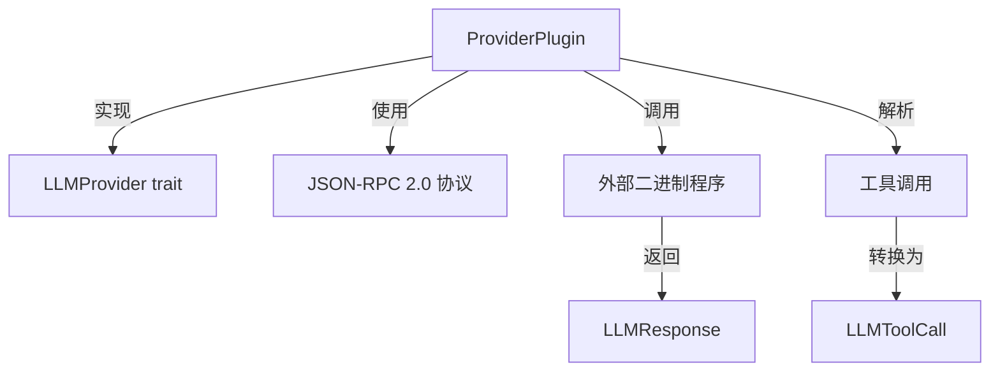
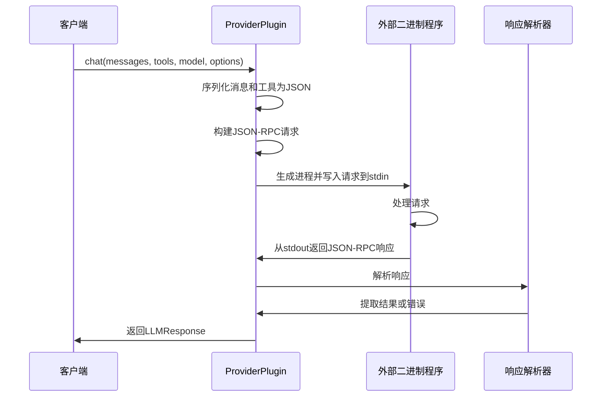

# Plugin 模块文档

## 概述

Plugin 模块提供了一个灵活的提供商插件适配器，允许 ZeptoClaw 通过 JSON-RPC 2.0 协议与独立的外部二进制程序进行通信。这种设计使得系统可以轻松集成自定义的语言模型提供商，而无需修改核心代码。

### 核心功能

- 实现了 `LLMProvider` trait，使其可以无缝集成到现有的提供商系统中
- 通过标准输入/输出流与外部二进制程序进行 JSON-RPC 2.0 通信
- 支持完整的聊天功能，包括消息传递、工具调用和使用统计
- 提供超时控制和错误处理机制
- 支持自定义命令参数和超时配置

## 架构设计

### 组件关系图



### 数据流程图



## 核心组件详解

### ProviderPlugin

`ProviderPlugin` 是本模块的核心组件，它实现了 `LLMProvider` trait，允许通过外部二进制程序提供语言模型功能。

#### 结构定义

```rust
pub struct ProviderPlugin {
    name: String,
    command: String,
    args: Vec<String>,
    timeout: Duration,
}
```

#### 主要方法

##### new

创建一个新的 ProviderPlugin 实例。

**参数：**
- `name`: 提供商名称，用于配置和日志记录
- `command`: 二进制程序的路径
- `args`: 传递给二进制程序的额外参数

**返回值：**
- 新的 ProviderPlugin 实例

##### with_timeout

覆盖默认的 120 秒超时设置。

**参数：**
- `secs`: 超时时间（秒）

**返回值：**
- 修改后的 ProviderPlugin 实例（支持链式调用）

##### chat (LLMProvider trait 实现)

执行聊天请求的核心方法。

**参数：**
- `messages`: 聊天消息列表
- `tools`: 可用工具定义列表
- `model`: 可选的模型名称
- `options`: 聊天选项配置

**返回值：**
- `Result<LLMResponse>`: 包含聊天响应或错误的结果

**工作流程：**
1. 将消息和工具序列化为通用 JSON 格式
2. 构建 JSON-RPC 2.0 请求
3. 生成外部二进制进程
4. 将请求写入进程的标准输入
5. 等待进程输出并处理超时
6. 解析进程输出的 JSON-RPC 响应
7. 将响应转换为 LLMResponse 格式

##### default_model (LLMProvider trait 实现)

返回默认模型名称。

**返回值：**
- 固定字符串 "plugin-default"

##### name (LLMProvider trait 实现)

返回提供商名称。

**返回值：**
- 提供商的名称字符串

### JSON-RPC 2.0 通信协议

#### 请求格式

每次 `chat()` 调用都会向外部二进制程序发送一个 JSON-RPC 2.0 请求：

```json
{
  "jsonrpc": "2.0",
  "id": 1,
  "method": "chat",
  "params": {
    "messages": [...],
    "tools": [...],
    "model": "...",
    "options": {
      "max_tokens": 100,
      "temperature": 0.7,
      "top_p": 1.0
    }
  }
}
```

#### 响应格式

外部二进制程序应返回一个 JSON-RPC 2.0 响应：

**成功响应：**
```json
{
  "jsonrpc": "2.0",
  "id": 1,
  "result": {
    "content": "响应内容",
    "tool_calls": [],
    "usage": {
      "input_tokens": 10,
      "output_tokens": 5
    }
  }
}
```

**错误响应：**
```json
{
  "jsonrpc": "2.0",
  "id": 1,
  "error": {
    "code": -32000,
    "message": "错误描述"
  }
}
```

### 工具调用解析

`parse_tool_calls` 函数负责将 JSON 格式的工具调用转换为 `LLMToolCall` 对象。

**处理逻辑：**
- 接受一个 JSON 值作为输入
- 如果输入不是数组，返回空向量
- 遍历数组中的每个条目，尝试将其反序列化为 `WireToolCall`
- 对于有效的工具调用：
  - 如果缺少 ID，使用默认值 "call_0"
  - 必须包含名称，否则跳过该条目
  - 处理参数：如果是字符串则直接使用，否则转换为 JSON 字符串
- 跳过无效的条目，不会导致整个解析失败

## 配置示例

### 基本配置

在 ZeptoClaw 配置文件中，可以如下配置 ProviderPlugin：

```json
{
  "providers": {
    "plugins": [
      {
        "name": "myprovider",
        "command": "/usr/local/bin/my-llm-provider",
        "args": ["--mode", "chat"]
      }
    ]
  }
}
```

### 多插件配置

可以配置多个插件提供商：

```json
{
  "providers": {
    "plugins": [
      {
        "name": "local-llm",
        "command": "/opt/llm/local-model",
        "args": []
      },
      {
        "name": "custom-provider",
        "command": "/usr/bin/custom-llm",
        "args": ["--config", "/etc/custom-llm.conf"]
      }
    ]
  }
}
```

## 使用示例

### 基本使用

```rust
use zeptoclaw::providers::plugin::ProviderPlugin;
use zeptoclaw::providers::types::ChatOptions;
use zeptoclaw::session::Message;

// 创建插件实例
let plugin = ProviderPlugin::new(
    "my-provider",
    "/path/to/provider/binary",
    vec!["--arg1".to_string(), "--arg2".to_string()]
);

// 设置超时（可选）
let plugin = plugin.with_timeout(60); // 60秒超时

// 使用插件进行聊天
#[tokio::main]
async fn main() {
    let messages = vec![Message::user("Hello, how are you?")];
    let options = ChatOptions::default();
    
    match plugin.chat(messages, vec![], None, options).await {
        Ok(response) => {
            println!("Response: {}", response.content);
            if response.has_tool_calls() {
                println!("Tool calls: {:?}", response.tool_calls);
            }
        }
        Err(e) => eprintln!("Error: {}", e),
    }
}
```

### 带工具调用的使用

```rust
use zeptoclaw::providers::plugin::ProviderPlugin;
use zeptoclaw::providers::types::{ChatOptions, ToolDefinition};
use zeptoclaw::session::Message;
use serde_json::json;

#[tokio::main]
async fn main() {
    let plugin = ProviderPlugin::new("tool-provider", "/path/to/tool-provider", vec![]);
    
    // 定义工具
    let tools = vec![ToolDefinition {
        name: "web_search".to_string(),
        description: Some("Search the web for information".to_string()),
        parameters: json!({
            "type": "object",
            "properties": {
                "query": {
                    "type": "string",
                    "description": "The search query"
                }
            },
            "required": ["query"]
        }),
    }];
    
    let messages = vec![Message::user("Search for information about Rust programming language")];
    let options = ChatOptions::default();
    
    let response = plugin.chat(messages, tools, None, options).await.unwrap();
    
    if response.has_tool_calls() {
        for tool_call in &response.tool_calls {
            println!("Tool call: {} with args {}", tool_call.name, tool_call.arguments);
        }
    }
}
```

## 创建外部提供商二进制程序

### 基本要求

创建一个兼容的外部提供商二进制程序需要满足以下要求：

1. 从标准输入读取单行 JSON-RPC 2.0 请求
2. 处理请求并生成响应
3. 将单行 JSON-RPC 2.0 响应写入标准输出
4. 程序退出时返回适当的退出码（0 表示成功）

### Python 示例

```python
#!/usr/bin/env python3
import sys
import json

def main():
    # 读取请求
    input_line = sys.stdin.readline().strip()
    request = json.loads(input_line)
    
    # 提取参数
    messages = request['params']['messages']
    tools = request['params']['tools']
    model = request['params'].get('model')
    options = request['params']['options']
    
    # 这里是你的提供商逻辑
    # 例如，调用本地模型、API等
    
    # 构建响应
    response = {
        "jsonrpc": "2.0",
        "id": request['id'],
        "result": {
            "content": "这是来自插件提供商的响应",
            "tool_calls": [],
            "usage": {
                "input_tokens": 10,
                "output_tokens": 20
            }
        }
    }
    
    # 写入响应
    print(json.dumps(response))
    sys.stdout.flush()

if __name__ == "__main__":
    main()
```

### Node.js 示例

```javascript
#!/usr/bin/env node
const readline = require('readline');

const rl = readline.createInterface({
  input: process.stdin,
  output: process.stdout,
  terminal: false
});

rl.on('line', (line) => {
  try {
    const request = JSON.parse(line);
    
    // 处理请求
    const messages = request.params.messages;
    const tools = request.params.tools;
    const model = request.params.model;
    const options = request.params.options;
    
    // 提供商逻辑
    const response = {
      jsonrpc: "2.0",
      id: request.id,
      result: {
        content: "Node.js 插件提供商的响应",
        tool_calls: [],
        usage: {
          input_tokens: 15,
          output_tokens: 25
        }
      }
    };
    
    console.log(JSON.stringify(response));
  } catch (error) {
    const errorResponse = {
      jsonrpc: "2.0",
      id: null,
      error: {
        code: -32603,
        message: "Internal error: " + error.message
      }
    };
    console.log(JSON.stringify(errorResponse));
  }
  
  process.exit(0);
});
```

### Shell 脚本示例

```bash
#!/bin/bash

# 读取输入
read input

# 简单的响应
echo '{"jsonrpc":"2.0","id":1,"result":{"content":"Hello from shell script plugin!","tool_calls":[]}}'
```

## 错误处理

ProviderPlugin 实现了全面的错误处理机制，可能出现的错误情况包括：

1. **序列化错误**：无法将消息或工具序列化为 JSON
   - 错误信息："Failed to serialize message/tool definition for plugin 'name'"

2. **进程生成错误**：无法启动外部二进制程序
   - 错误信息："Failed to spawn provider plugin 'name' (path): error"

3. **输入写入错误**：无法向进程的标准输入写入数据
   - 错误信息："Failed to write to provider plugin 'name' stdin: error"

4. **超时错误**：进程在指定时间内未完成
   - 错误信息："Provider plugin 'name' timed out after Xs"

5. **进程执行错误**：进程返回非零退出码
   - 错误信息："Provider plugin 'name' exited with code X: detail"

6. **无输出错误**：进程未产生任何输出
   - 错误信息："Provider plugin 'name' produced no output"

7. **JSON 解析错误**：无法解析进程输出为有效的 JSON-RPC
   - 错误信息："Provider plugin 'name' returned invalid JSON-RPC: error"

8. **JSON-RPC 错误**：进程返回了 JSON-RPC 错误响应
   - 错误信息："Provider plugin 'name' error (code X): message"

9. **无结果错误**：响应既不包含结果也不包含错误
   - 错误信息："Provider plugin 'name' returned neither result nor error"

## 边缘情况与注意事项

1. **超时设置**：
   - 默认超时为 120 秒，对于复杂模型可能不够
   - 使用 `with_timeout` 方法根据需要调整
   - 超时后进程会被自动终止（通过 Tokio 的 Child Drop 实现发送 SIGKILL）

2. **输出处理**：
   - 系统会使用 stdout 的最后一个非空行作为响应
   - 这允许插件在处理过程中输出调试信息，只要最后一行是有效的 JSON-RPC 响应

3. **工具调用解析**：
   - 工具调用解析是容错的，无效的条目会被跳过而不会导致整个请求失败
   - 如果工具调用的 arguments 字段是字符串，会直接使用；否则会转换为 JSON 字符串
   - 缺少名称的工具调用会被跳过

4. **JSON-RPC ID**：
   - 当前实现中，请求的 ID 固定为 1
   - 响应中的 ID 会被忽略

5. **消息和工具序列化**：
   - 消息和工具被序列化为通用 JSON 格式，使得线路格式与提供商无关
   - 序列化失败会被传播，不会生成部分有效的请求

6. **选项传递**：
   - 目前仅传递 max_tokens、temperature 和 top_p 选项
   - output_format（JSON 模式）和 stop sequences 尚未实现传递

7. **并发安全性**：
   - 每个 `chat()` 调用都会生成一个新的进程实例，因此是并发安全的
   - 但是，要注意外部二进制程序可能存在的资源限制

8. **流支持**：
   - ProviderPlugin 没有直接实现流式聊天功能
   - 但通过 `LLMProvider` trait 的默认实现，`chat_stream` 方法会回退到使用 `chat` 方法

## 测试

模块包含全面的单元测试和集成测试，覆盖了以下场景：

- 基本功能测试（名称和默认模型）
- 请求序列化测试
- 工具调用解析测试（包括各种边缘情况）
- 响应反序列化测试（成功和错误情况）
- 进程执行测试（仅限 Unix 系统）：
  - 成功的聊天交互
  - 带工具调用的聊天
  - 错误响应处理
  - 进程生成失败
  - 超时处理
  - 流回退功能

要运行测试，可以使用：

```bash
cargo test --package zeptoclaw --providers::plugin
```

## 与其他模块的关系

- **provider_core**：ProviderPlugin 实现了该模块定义的 `LLMProvider` trait，并使用了其中的类型定义
- **agent_core**：可以通过 ZeptoAgent 或 ZeptoAgentBuilder 使用 ProviderPlugin 作为语言模型提供商
- **configuration**：可以通过 ProvidersConfig 配置 ProviderPlugin 实例
- **session_and_memory**：使用 Message 类型作为输入，并生成可存储在 ConversationHistory 中的响应

## 扩展与开发

如果您想扩展 ProviderPlugin 的功能，可以考虑以下方向：

1. **添加更多选项支持**：实现 output_format 和 stop sequences 的传递
2. **支持流式响应**：实现真正的流式聊天功能，而不仅仅是回退到非流式方法
3. **增强错误处理**：添加更详细的错误分类和恢复策略
4. **性能优化**：考虑使用进程池或保持进程活动以减少启动开销
5. **安全增强**：添加更多的输入验证和沙箱机制

## 总结

ProviderPlugin 模块提供了一种强大而灵活的方式来扩展 ZeptoClaw 的语言模型提供商生态系统。通过简单的 JSON-RPC 2.0 协议，几乎任何编程语言编写的外部程序都可以作为语言模型提供商集成到系统中。这种设计使系统具有极大的扩展性，同时保持了核心代码的简洁性和稳定性。
