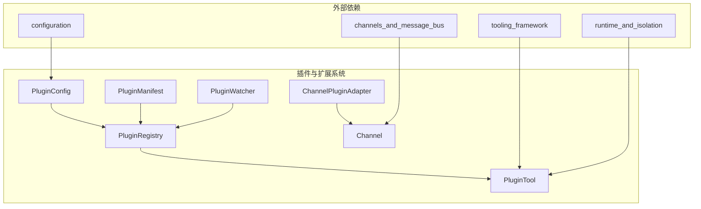

# 插件与扩展系统

## 1. 简介

插件与扩展系统是 ZeptoClaw 框架的核心模块，提供了灵活的机制来扩展代理的功能。该系统允许通过外部插件添加自定义工具、通道和功能，而无需修改核心代码。通过标准化的插件接口和配置，开发者可以轻松地扩展代理的能力范围。

该系统主要解决以下问题：
- **功能扩展性**：允许在不修改核心代码的情况下添加新功能
- **模块化设计**：将功能封装为独立插件，便于管理和维护
- **安全执行**：提供隔离的执行环境，确保插件的安全性
- **动态加载**：支持运行时发现和加载新插件

插件系统支持两种主要的插件类型：工具插件（用于添加新的工具功能）和通道插件（用于扩展通信渠道）。每种类型都有明确的接口和执行模型。

## 2. 系统架构

插件与扩展系统采用分层架构，由类型定义、注册表、监视器和适配器组成。系统通过标准化的插件清单（manifest）进行插件声明，使用注册表进行统一管理，并提供实时监控能力。



### 2.1 核心组件

插件系统的核心组件包括：

1. **类型定义层**（`src/plugins/types`）：定义了插件系统的所有数据结构，包括`PluginManifest`（插件清单）、`PluginConfig`（插件配置）、`PluginToolDef`（工具定义）和`BinaryPluginConfig`（二进制插件配置）等。这些类型确保了插件的标准化描述和配置。

2. **注册表层**（`src/plugins/registry`）：由`PluginRegistry`负责管理已加载的插件，维护插件名称到插件实例的映射，以及工具名称到插件的反向映射。注册表确保工具名称的全局唯一性，并提供高效的双向查找能力。

3. **监控层**（`src/plugins/watcher`）：`PluginWatcher`通过文件系统元数据轮询来检测插件目录的变化，能够发现新插件或已修改的插件，而无需依赖实时文件系统监控。

4. **通道插件适配器**（`src/channels/plugin`）：提供了`ChannelPluginAdapter`，实现了`Channel` trait，通过外部二进制进程和JSON-RPC 2.0协议进行通信，支持长期运行的通道插件。

### 2.2 插件执行模式

系统支持两种插件执行模式：

1. **命令模式**（Command Mode）：每个工具调用执行一个壳命令，使用参数插值模板，适合简单的工具集成。

2. **二进制模式**（Binary Mode）：通过独立的可执行文件实现，使用JSON-RPC 2.0协议通过标准输入输出进行通信，适合复杂的工具实现。

两种模式都通过`PluginManifest`中的`execution`字段进行声明，二进制模式还需要额外的`BinaryPluginConfig`配置。

## 3. 核心功能模块

### 3.1 插件类型与配置

插件类型系统提供了完整的数据结构来描述和配置插件。`PluginManifest`是插件的核心描述文件，每个插件目录必须包含一个`plugin.json`文件，声明插件的身份、版本、描述和提供的工具列表。

`PluginConfig`则控制系统级别的插件行为，包括是否启用插件系统、插件扫描目录、允许和阻止的插件列表等。这种分离设计使得插件的声明和使用可以独立管理。

详细信息请参考 [plugin_types.md](plugin_types.md)。

### 3.2 插件注册表

`PluginRegistry`是插件系统的中央管理组件，负责维护已加载插件的索引。它提供了插件注册、查找和工具映射功能，确保工具名称在所有插件中的唯一性。

注册表维护两个关键映射：
- 插件名称到插件实例的映射
- 工具名称到提供该工具的插件名称的映射

这种设计允许高效的双向查找：既可以从插件获取它提供的所有工具，也可以从工具名称追溯到提供它的插件。

详细信息请参考 [plugin_registry.md](plugin_registry.md)。

### 3.3 插件监控

`PluginWatcher`提供了插件目录变更检测功能，通过定期扫描文件系统元数据来发现新插件或已修改的插件。这种方法避免了对实时文件系统监控的依赖，减少了系统依赖并提高了兼容性。

监控器会跟踪每个插件清单文件的修改时间，在每次扫描时比较已知状态和当前状态，从而确定哪些插件需要重新加载。此外，还提供了`check_binary_health`函数用于检查二进制插件的健康状态。

详细信息请参考 [plugin_watcher.md](plugin_watcher.md)。

### 3.4 通道插件适配器

`ChannelPluginAdapter`扩展了插件系统的能力范围，使其能够处理通信通道。与工具插件不同，通道插件是长期运行的进程，在通道的整个生命周期内保持活跃。

适配器通过JSON-RPC 2.0协议与外部二进制进程通信，实现了完整的`Channel` trait，包括启动、停止、发送消息等功能。通道插件有自己的清单格式和发现机制。

详细信息请参考 [channel_plugin_adapter.md](channel_plugin_adapter.md)。

## 4. 与其他模块的关系

插件与扩展系统与框架中的多个其他模块紧密协作：

- **工具框架**（[tooling_framework.md](tooling_framework.md)）：插件系统提供的工具通过工具框架注册和执行，`PluginTool`作为一种特殊的工具类型集成到工具注册表中。

- **通道与消息总线**（[channels_and_message_bus.md](channels_and_message_bus.md)）：通道插件适配器实现了`Channel` trait，可以无缝集成到通道管理系统中。

- **配置系统**（[configuration.md](configuration.md)）：`PluginConfig`作为整体配置的一部分，由配置系统管理和提供。

- **运行时与隔离**（[runtime_and_isolation.md](runtime_and_isolation.md)）：插件执行可能依赖运行时隔离模块来提供安全的执行环境，特别是对于二进制插件。

## 5. 使用指南

### 5.1 创建工具插件

创建一个工具插件需要以下步骤：

1. 创建插件目录，推荐放在`~/.zeptoclaw/plugins/`下
2. 在目录中创建`plugin.json`清单文件
3. 实现工具逻辑（可以是命令模板或二进制程序）
4. 配置ZeptoClaw启用插件系统并包含插件目录

一个简单的命令模式插件清单示例：

```json
{
  "name": "example-tools",
  "version": "1.0.0",
  "description": "示例工具插件",
  "author": "Your Name",
  "tools": [
    {
      "name": "greet",
      "description": "向用户问好",
      "parameters": {
        "type": "object",
        "properties": {
          "name": { "type": "string", "description": "要问候的名字" }
        },
        "required": ["name"]
      },
      "command": "echo Hello, {{name}}!",
      "timeout_secs": 10
    }
  ]
}
```

### 5.2 配置插件系统

在主配置文件中配置插件系统：

```json
{
  "plugins": {
    "enabled": true,
    "plugin_dirs": [
      "~/.zeptoclaw/plugins",
      "/path/to/custom/plugins"
    ],
    "allowed_plugins": ["example-tools", "git-tools"],
    "blocked_plugins": ["dangerous-plugin"]
  }
}
```

### 5.3 创建通道插件

通道插件的创建类似于工具插件，但使用不同的清单格式和执行模型：

1. 创建通道插件目录，推荐放在`~/.zeptoclaw/channels/`下
2. 创建`manifest.json`清单文件
3. 实现长期运行的二进制程序，使用JSON-RPC 2.0协议
4. 实现必要的RPC方法，如"send"

通道插件清单示例：

```json
{
  "name": "my-custom-channel",
  "version": "0.1.0",
  "description": "我的自定义通道",
  "binary": "my-channel-binary",
  "env": {
    "API_KEY": "your-api-key"
  },
  "timeout_secs": 30
}
```

## 6. 安全考虑

使用插件系统时需要注意以下安全事项：

1. **插件来源**：只从受信任的来源获取插件，审查插件代码或二进制文件
2. **权限控制**：使用`allowed_plugins`和`blocked_plugins`严格控制可执行的插件
3. **命令安全**：命令模式插件应避免使用危险的壳操作符，考虑使用运行时隔离
4. **二进制验证**：对于二进制插件，可以使用SHA-256哈希验证完整性
5. **环境隔离**：插件应在适当隔离的环境中运行，限制其对系统资源的访问

## 7. 总结

插件与扩展系统为ZeptoClaw提供了强大的扩展能力，使得框架可以灵活适应各种使用场景。通过标准化的插件接口、安全的执行模型和完善的管理机制，开发者可以轻松构建和共享功能扩展，同时保持系统的稳定性和安全性。

该系统的模块化设计确保了各组件可以独立演进，而清晰的接口定义则保证了插件的向后兼容性。无论是简单的命令行工具集成还是复杂的通信通道扩展，插件系统都提供了合适的抽象和工具。
