# plugin_types 模块文档

## 概述

`plugin_types` 模块定义了 ZeptoClaw 插件系统中使用的所有核心类型，包括用于解析 `plugin.json` 文件的清单结构、插件配置以及运行时插件表示。该模块是整个插件系统的基础，为插件的加载、管理和执行提供了必要的数据结构和类型定义。

本模块的主要设计目的是提供一个灵活且安全的插件系统，支持两种主要的插件执行模式：命令式插件和二进制插件。命令式插件通过执行 shell 命令模板来实现功能，而二进制插件则通过 JSON-RPC 2.0 协议在 stdin/stdout 上进行通信，提供了更强大的功能和更高的安全性。

## 核心组件详解

### PluginManifest

`PluginManifest` 是从插件的 `plugin.json` 文件加载的清单结构，每个插件目录都必须包含一个符合此结构的 `plugin.json` 文件。该清单声明了插件的身份信息和它提供的工具。

#### 主要字段

- **name**: 插件名称，必须唯一，只能包含字母数字字符和连字符，长度在 1 到 64 个字符之间。
- **version**: 语义化版本字符串（例如 "1.0.0"）。
- **description**: 插件功能的人类可读描述。
- **author**: 可选的作者名称或标识符。
- **tools**: 此插件提供的工具定义列表。
- **execution**: 执行模式，"command"（默认）或 "binary"（JSON-RPC stdin/stdout）。
- **binary**: 二进制插件配置，当 execution 为 "binary" 时必需。

#### 关键方法

- **is_binary()**: 返回布尔值，表示此插件是否使用二进制执行模式。

#### 示例

```json
{
  "name": "git-tools",
  "version": "1.0.0",
  "description": "Git integration tools",
  "author": "ZeptoClaw",
  "tools": [
    {
      "name": "git_status",
      "description": "Get the git status of the workspace",
      "parameters": {
        "type": "object",
        "properties": {
          "path": { "type": "string", "description": "Repository path" }
        },
        "required": ["path"]
      },
      "command": "git -C {{path}} status --porcelain",
      "timeout_secs": 10
    }
  ]
}
```

### BinaryPluginConfig

`BinaryPluginConfig` 是二进制插件执行的配置结构。二进制插件是独立的可执行文件，通过 JSON-RPC 2.0 协议在 stdin/stdout 上进行通信，按需为每个工具调用生成。

#### 主要字段

- **path**: 二进制文件在插件目录中的相对路径。
- **protocol**: 协议，目前仅支持 "jsonrpc"。
- **timeout_secs**: 可选的超时覆盖（秒），默认为 30。
- **sha256**: 可选的二进制完整性验证的 SHA-256 十六进制摘要，设置后会在执行前检查二进制文件的哈希值。

### PluginToolDef

`PluginToolDef` 是插件清单中的工具定义结构。每个工具包装一个 shell 命令模板，当 LLM 调用该工具时会执行此模板。参数插值使用命令字符串中的 `{{param_name}}` 语法。

#### 主要字段

- **name**: 向代理注册的工具名称，只能包含字母数字字符和下划线。
- **description**: 发送给 LLM 的工具描述，帮助它理解何时以及如何使用该工具。
- **parameters**: 描述工具参数的 JSON Schema。
- **command**: Shell 命令模板，使用 `{{param_name}}` 进行参数插值，不得包含危险的 shell 操作符（&&、||、;、|、反引号），对于二进制插件为空。
- **working_dir**: 可选的命令执行工作目录。
- **timeout_secs**: 可选的超时时间（秒），如果未指定，默认为 30。
- **env**: 可选的命令执行时设置的环境变量。

#### 关键方法

- **effective_timeout()**: 返回有效的超时时间（秒），默认值为 30。

### Plugin

`Plugin` 是加载后的插件结构，包含其清单、文件系统路径和启用状态。

#### 主要字段

- **manifest**: 解析后的插件清单。
- **path**: 加载插件的目录路径。
- **enabled**: 此插件当前是否启用。

#### 关键方法

- **new(manifest, path)**: 从清单和路径创建新插件，默认启用。
- **name()**: 从清单中获取插件名称。
- **tool_count()**: 获取此插件定义的工具数量。

### PluginConfig

`PluginConfig` 是插件系统配置，通常存储在主 config.json 中。它控制插件系统是否活跃、扫描哪些目录以查找插件，以及允许或阻止哪些插件。

#### 主要字段

- **enabled**: 插件系统是否启用，默认为 false。
- **plugin_dirs**: 扫描插件子目录的目录，默认为 `["~/.zeptoclaw/plugins"]`。
- **allowed_plugins**: 插件名称的允许列表，如果为空，则允许所有发现的插件。
- **blocked_plugins**: 插件名称的阻止列表，如果为空，则不阻止任何插件。阻止列表优先于允许列表。

#### 关键方法

- **default()**: 返回默认配置。
- **is_plugin_permitted(name)**: 检查插件名称是否被允许/阻止列表允许。插件被允许的条件是：它不在阻止列表中，并且允许列表为空（允许所有插件）或插件在允许列表中。

## 架构与关系

```mermaid
classDiagram
    class PluginManifest {
        +String name
        +String version
        +String description
        +Option~String~ author
        +Vec~PluginToolDef~ tools
        +String execution
        +Option~BinaryPluginConfig~ binary
        +is_binary() bool
    }
    
    class BinaryPluginConfig {
        +String path
        +String protocol
        +Option~u64~ timeout_secs
        +Option~String~ sha256
    }
    
    class PluginToolDef {
        +String name
        +String description
        +Value parameters
        +String command
        +Option~String~ working_dir
        +Option~u64~ timeout_secs
        +Option~HashMap~String, String~~ env
        +effective_timeout() u64
    }
    
    class Plugin {
        +PluginManifest manifest
        +PathBuf path
        +bool enabled
        +new(manifest, path) Plugin
        +name() &str
        +tool_count() usize
    }
    
    class PluginConfig {
        +bool enabled
        +Vec~String~ plugin_dirs
        +Vec~String~ allowed_plugins
        +Vec~String~ blocked_plugins
        +default() PluginConfig
        +is_plugin_permitted(name) bool
    }
    
    PluginManifest "1" *-- "0..1" BinaryPluginConfig
    PluginManifest "1" *-- "0..*" PluginToolDef
    Plugin "1" *-- "1" PluginManifest
```



这个类图展示了 `plugin_types` 模块中各个核心组件之间的关系：

- `PluginManifest` 包含多个 `PluginToolDef`（工具定义）和可选的 `BinaryPluginConfig`（二进制插件配置）。
- `Plugin` 包含一个 `PluginManifest`，以及插件的路径和启用状态。
- `PluginConfig` 是独立的配置结构，用于控制整个插件系统的行为。

## 使用指南

### 定义插件清单

要创建一个插件，首先需要在插件目录中创建一个 `plugin.json` 文件，该文件必须符合 `PluginManifest` 结构。以下是一个简单的命令式插件示例：

```json
{
  "name": "example-plugin",
  "version": "1.0.0",
  "description": "An example plugin",
  "author": "Your Name",
  "tools": [
    {
      "name": "hello_world",
      "description": "Prints hello world with a name",
      "parameters": {
        "type": "object",
        "properties": {
          "name": { "type": "string", "description": "Name to greet" }
        },
        "required": ["name"]
      },
      "command": "echo Hello, {{name}}!",
      "timeout_secs": 5
    }
  ]
}
```

### 二进制插件的使用

对于更复杂的插件，可以使用二进制执行模式。以下是一个二进制插件的清单示例：

```json
{
  "name": "binary-plugin",
  "version": "1.0.0",
  "description": "A binary plugin example",
  "execution": "binary",
  "binary": {
    "path": "bin/my-binary-plugin",
    "protocol": "jsonrpc",
    "timeout_secs": 60,
    "sha256": "a1b2c3d4e5f6..."
  },
  "tools": [
    {
      "name": "complex_operation",
      "description": "Performs a complex operation",
      "parameters": {
        "type": "object",
        "properties": {
          "input": { "type": "string", "description": "Input data" }
        },
        "required": ["input"]
      }
    }
  ]
}
```

### 配置插件系统

在主配置文件中配置插件系统，示例如下：

```json
{
  "plugins": {
    "enabled": true,
    "plugin_dirs": [
      "~/.zeptoclaw/plugins",
      "/path/to/custom/plugins"
    ],
    "allowed_plugins": ["git-tools", "example-plugin"],
    "blocked_plugins": ["untrusted-plugin"]
  }
}
```

## 注意事项与限制

1. **安全考虑**：
   - 命令式插件的命令模板不得包含危险的 shell 操作符（&&、||、;、|、反引号），以防止命令注入攻击。
   - 对于二进制插件，可以使用 SHA-256 哈希值验证二进制文件的完整性，确保插件未被篡改。

2. **插件命名**：
   - 插件名称必须唯一，只能包含字母数字字符和连字符，长度在 1 到 64 个字符之间。
   - 工具名称只能包含字母数字字符和下划线。

3. **执行模式**：
   - 命令式插件适合简单的任务，通过执行 shell 命令实现功能。
   - 二进制插件适合复杂的任务，提供了更强大的功能和更高的安全性，但需要实现 JSON-RPC 2.0 协议。

4. **超时设置**：
   - 工具执行有默认 30 秒的超时限制，可以在工具定义或二进制插件配置中覆盖此值。

5. **插件加载**：
   - 插件系统默认是禁用的，需要在配置中显式启用。
   - 插件的允许列表和阻止列表可以控制哪些插件可以被加载，阻止列表优先于允许列表。

## 相关模块

- [plugin_registry](plugin_registry.md)：插件注册表，负责插件的加载和管理。
- [plugin_watcher](plugin_watcher.md)：插件监视器，监视插件目录的变化。
- [channel_plugin_adapter](channel_plugin_adapter.md)：通道插件适配器，用于将插件作为通道使用。

通过这些模块的协同工作，ZeptoClaw 提供了一个强大而灵活的插件系统，可以轻松扩展其功能以满足各种需求。
